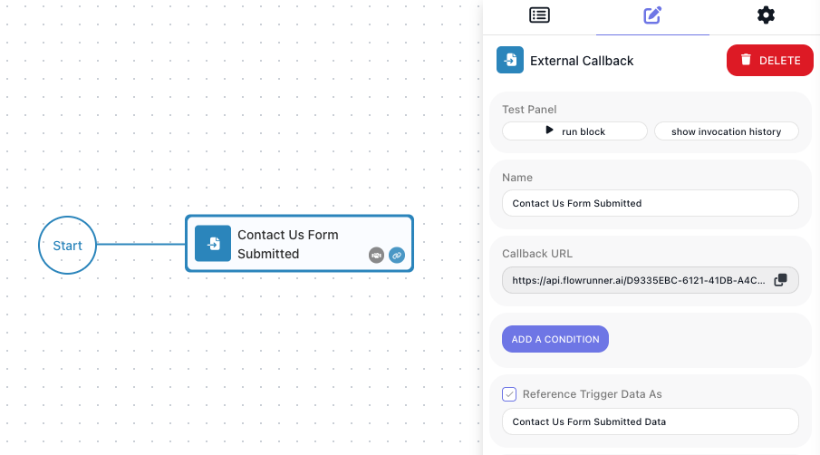
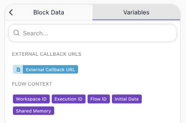

<!-- 2026-08-18 re-drive (throwaway "Callback Probe": Start -> External Callback -> Return Result, LIVE): activate
     on such a flow CREATES a run that waits at the callback (200 + executionId); the Callback URL with
     ?execution=<that id> continued it (200, same id); a second call for the same run -> 400 28100 "Execution with
     ID '…' already exists" (row 28099 replaced by the observed 28100); the URL without ?execution started a new run
     (first-step semantics); the block's Callback URL carries a trigger id that differs from the node id in the editor DOM
     (using the node id -> 28010, whose message also says a PAUSED version answers a mid-flow trigger). The API key
     segment is not enforced on the callback URL either (bogus key -> 200) - reported to Mark, not documented. -->
<!-- Spec-first restructure 2026-08-18. Behaviour on this page was driven in-product on 2026-07-16
     (Documentation Flows, flow "Payment Hand-off"; the full exploration log sits at the top of
     build/flow-control/external-callbacks.md): GET query params / POST JSON body become the block's data;
     execution = <id> | any | all (alias executionId); 200 {"executionId"} single / comma list / null;
     400 codes 28056 / 28010 / 28059 / 28060; a false condition -> 200 and nothing moves. -->
# Activating an External Callback

An [External Callback](../reference/external-callback.md){.fr-block} block gives one point in a flow its own
URL. Calling that URL either starts a new run of the flow, when the block is the first step, or lets a run
that is paused at the block continue. The call accepts `GET` or `POST`, carries whatever data the flow
needs, and answers with the id of the run it started or continued.

## Endpoint

```text
https://api.flowrunner.ai/{workspace-id}/{api-key}/automation/flow/{flow-id}/trigger/{block-id}/activate
```

| Placeholder | Value | Where it comes from |
| --- | --- | --- |
| `{workspace-id}` | The workspace the flow belongs to | **Workspace Settings ▸ General**, Credentials section |
| `{api-key}` | The workspace's API key | Same section, beside the Workspace ID |
| `{flow-id}` | The flow that contains the block | Filled in for you - see below |
| `{block-id}` | This particular External Callback block | Filled in for you - see below |

You never assemble this address yourself. Every External Callback block shows its complete URL, all four
segments filled in, in its **Callback URL** field - see [Get the address](#get-the-address). Every block
has its own URL; they are not interchangeable.

## Calling with POST

The data you send becomes the block's data, read by later steps under the alias set on the block. With
`POST` it goes in the body, sent with `Content-Type: application/json`:

```bash
curl --request POST \
  --url "<Callback URL>" \
  --header "Content-Type: application/json" \
  --data '{
    "event": "payment.succeeded",
    "orderId": "ORD-9001",
    "amount": 4999
  }'
```

The body becomes the block's data, whole. A call with no data at all - the bare address - is valid. On a
`POST`, query parameters are ignored, with one exception: `execution` picks which waiting run to continue
(`executionId` is accepted as an alias). It is required when the block sits after the first step, and
ignored when the block is the first step - see
[When more than one run is waiting](#when-more-than-one-run-is-waiting):

```bash
curl --request POST \
  --url "<Callback URL>?execution=4CE29875-0BD4-4AE4-B75C-60FCC55F4436" \
  --header "Content-Type: application/json" \
  --data '{
    "event": "payment.succeeded",
    "orderId": "ORD-9001",
    "amount": 4999
  }'
```

## Calling with GET

With `GET`, the same data goes in the query string, and no headers are needed:

```bash
curl "<Callback URL>?event=payment.succeeded&orderId=ORD-9001&amount=4999"
```

Every query parameter except `execution` becomes one field of the block's data, under its own name. The
`execution` parameter works exactly as on a POST. Any fetch of the URL is a real call - a chat
link preview or an uptime monitor included - so share a Callback URL as text, never a clickable link.

## Response

An accepted call returns HTTP 200 with the id of the run it started or continued:

```json
{ "executionId": "4CE29875-0BD4-4AE4-B75C-60FCC55F4436" }
```

With `execution=all`, `executionId` lists every run that continued, comma-separated. With `execution=all`
and nothing waiting, the call still succeeds and the id is `null`:

```json
{ "executionId": null }
```

A call can also be accepted and still do nothing. A callback block can carry a condition deciding whether
an incoming call counts; when the condition is false the call returns HTTP 200 and no run starts or
continues. If a call appears to succeed but the flow does not move, check that condition first.

## Errors
<!-- doclint: no-shot: an error reference, not a screen; each row carries the message FlowRunner returns and the fix -->

A refused call comes back as HTTP 400 with an error `code` and a message:

```json
{
  "code": 28056,
  "message": "Your trigger activation request format can be used only for a flow that starts with a trigger. Consider adding \"execution\" parameter to activate a \"middle of the flow\" trigger."
}
```

**The call did not identify a waiting run**

| Code | What FlowRunner tells you | What to do |
| --- | --- | --- |
| `28056` | The request format can be used only for a flow that starts with a trigger; consider adding the `execution` parameter to activate a middle-of-the-flow trigger | You called a callback that sits later in a flow. Add `execution` |
| `28059` | Pending trigger was not found. Ensure that passed execution ID is valid and flow execution is waiting on this trigger | The id is wrong, or that run is not sitting at this block |
| `28060` | Pending trigger was not found. Ensure that flow execution is waiting on this trigger | You used `execution=any` and nothing was waiting |
| `28100` | Execution with that ID already exists | This run has already been let through this callback. A run passes a given block once; a later callback in the same flow is a separate wait with its own activation |

**The flow or the block cannot be reached**

| Code | What FlowRunner tells you | What to do |
| --- | --- | --- |
| `28010` | Trigger with that flow element ID is not found in that flow; ensure the flow and trigger names are correct and that the flow has a live version (or a paused one, when the trigger sits mid-flow) | Re-copy the Callback URL - the block's Callback URL field carries the trigger's own id, which is not the id shown elsewhere for the block - and start the version so it is LIVE |
| `28011` | Trigger with that name is not found in that flow; same advice | As above |
| `28042` | The flow version is not enabled, so its trigger cannot be executed | Set the version LIVE |
| `28093` | Available only when the flow is in the LIVE state | Start the version you are calling so it is LIVE - see [Running Flows](../run/running-flows.md#ready-then-live) |

**The run is no longer there**

| Code | What FlowRunner tells you | What to do |
| --- | --- | --- |
| `28068` | Execution context with that id not found | The id is wrong, or the run finished and was cleared |
| `28136` | That execution is already terminated | The run ended before your call arrived |

**The caller is not allowed**

| Code | What FlowRunner tells you | What to do |
| --- | --- | --- |
| `28025` | Unable to execute the callback. User is missing required security role(s) | Call with a user token carrying the required role |
| `28061` | The user token is invalid | Obtain a fresh token |

**The request itself, or too many calls**

| Code | What it means |
| --- | --- |
| `9000` | No workspace with that id - re-copy the Callback URL |
| `999` / `997` / `995` / `998` | A rate limit (per second / minute / day / in-flight) - back off and retry |
| `28083` / `28087` / `28132` / `28086` | A plan limit (actions, concurrent runs, executions, active flows) - wait for capacity or raise the plan (see [Billing](../manage/billing.md)) |

## When to use it

An external callback is useful in two scenarios:

1. Your flow may need to start in response to an external event - a payment provider announcing a charge,
   a form posting a submission, your own application saying the work it was given is finished.
2. Your flow may need to wait for something outside it to finish before it resumes - a user approves a
   transaction, confirms email copy, and so on.

The External Callback block is the way to enable these types of behavior. Place it at the beginning of your
flow or in the middle, depending on the use case. This page is about making the call. Building the flow
around it is covered in [Waiting on an External System](../build/flow-control/external-callbacks.md).

!!! note "This is the callback block, not every trigger"
    Other triggers in FlowRunner come from the services they belong to, and are activated by those services
    in their own way. This page applies to the External Callback block, which is FlowRunner's own.

## Get the address

Select the External Callback block. Its ((Callback URL)) field holds the whole address, with a copy button
beside it. Copy it and give it to whichever system needs to activate the trigger in the flow.



For real traffic, a version of the flow has to be LIVE. Call the address when no version is LIVE and
you get error `28010` - not because your request was malformed, but because there is nothing live to
receive it. Starting a version is covered in [Running Flows](../run/running-flows.md#ready-then-live).

While you are building, two things make the URL answer without the flow being LIVE:

- **((Learning Mode))** captures one sample request and records its shape, so the fields become pickable in
  later steps.
- **((Run Block))** on the callback starts a debug execution that waits for your call.

## Starting a run, or continuing one

Both scenarios make the same call. What differs is what the call finds.

**If the callback is the first step**, there is no run yet. Your call creates one, and it begins with the
data you sent.

**If the callback sits further along**, the run was already under way - started by whatever starts that
flow - and it has arrived at the block and stopped, waiting for you. Your call lets it carry on, with the
data you sent now available to the steps that follow.

Only the second case asks more of you: a waiting run has to be identified.

## When more than one run is waiting

Picture an order-processing flow. It runs every few minutes, and each run reaches a callback and waits for
its own payment to clear. By mid-morning three runs are sitting at that same block, each waiting for a
different order.

Now a payment clears and the provider calls your address. Which of those three should continue?

The address cannot answer that on its own - it names the flow and the block, not the run. So the call says
which one, using the `execution` query parameter:

```text
POST  <Callback URL>?execution={execution-id}
```

Which value you use depends on whether the waiting runs are worth telling apart:

| Value | Continues | Use it when |
| --- | --- | --- |
| `execution={execution-id}` | that one run | The runs are distinct - each waits for its own order, its own customer, its own document |
| `execution=any` | one waiting run, FlowRunner's choice | The runs are interchangeable and it does not matter which continues |
| `execution=all` | every run waiting at this block | One event releases all of them at once |

## Where the execution id comes from

A run's id exists only once the run is under way, so it cannot be written into anything in advance. It
reaches the caller one of three ways.

**The flow hands out its own address.** This works however the run began - a schedule, an API call, another
flow. Every run knows its own ((Execution ID)) in the Expression Editor under **Flow Context**, so the step
that calls the outside system composes the return address from the Callback URL and that id, and sends it.
Whatever comes back points at this run.



**The caller started the run and was told.** A system that started the run through the
[Call Flow (Non-Blocking)](call-flow-nonblocking.md) API received `executionId` in the response, and can quote it back.

**Nobody can carry a per-run address.** A webhook configured once in a vendor's dashboard posts to one
fixed URL and cannot append anything. Use `execution=any` on it.

[Waiting on an External System](../build/flow-control/external-callbacks.md) works all three through with
diagrams.

## Related

- [Call Flow (Non-Blocking)](call-flow-nonblocking.md) - starting a run over the API, and the executionId it returns
- [External Callback](../reference/external-callback.md){.fr-block} - the block itself, its Callback URL,
  conditions, and Learning Mode
- [Waiting on an External System](../build/flow-control/external-callbacks.md) - building the flow that
  pauses and continues
- [Workspace Settings](../manage/workspace-settings.md) - the credentials every call carries
