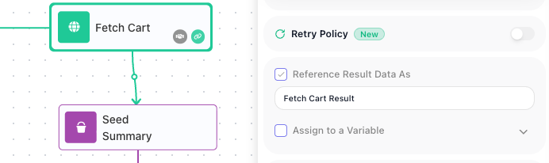

<!-- Verified in-product 2026-08-25 (Documentation Flows workspace, curl against api.flowrunner.ai;
     full log in .cache/api-spec/verification-2026-08-25-execution-api.md). Jira lineage: FR-3243
     shipped in 1.0.13 (2026-08-10), FR-3342 moved the path under flow/{flowId} in v1.0.14
     (2026-08-18). This page previously said the feature was NOT RELEASED - it has been since
     2026-08-10. THE WRITTEN SPEC IN FR-3238 DOES NOT MATCH THE SHIPPED PRODUCT and this page follows
     the product: `result` is the stored block-result ENVELOPE (data / errorCode / httpCode / success),
     not the bare value the spec's sample implied - the block's own output sits under result.data.
     Driven aliases: Fetch Cart Result (HTTP Request, full dummyjson cart under data), Order ID
     Provided? Result and Priciest so far? Result (Conditions, data null + success true), Handle Error
     Result (data = the caught {code, source, message}), External Callback Data (data = the JSON posted
     to the callback; the result is REWRITTEN on resume - executedAt moved 23:50:28 -> 23:50:49).
     LOOPS: Priciest so far? Result inside Cart Summary's Scan Products List Iterator, run 038909A2,
     6 iterations - no occurrence param returned occurrence 6 of 6 (the LATEST), occurrence=1 returned
     the first with its own executedAt. MID-RUN reads work (Fetch Cart Result readable at t~0.2s while
     RUNNING). RETURN RESULT BLOCKS HAVE NO ALIAS - verified in the Order Lookup editor: the Condition
     has a Reference Result Data As field, neither Return Result block has that field at all, and
     ?alias=Order Found -> 28159. GET only: POST -> 405 RFC-7807 problem+json; omitting alias -> 400
     problem+json "Required parameter 'alias' is not present.". 28161 vs 28159 GOTCHA driven twice
     (Cart Summary "Totally Made Up" -> 28161 while RUNNING, 28159 once COMPLETED; Payment Hand-off
     Test "Record Sale Result" -> 28161 while PENDING, 28159 after). 28162 driven with occurrence 0
     and 5 against occurrenceCount 1. NOT DRIVEN, so NOT CLAIMED: the spec's ambiguousBlock 409 +
     candidate list (no flow in the workspace has two blocks sharing an alias; manufacturing one means
     editing a flow) - restore the row when driven. KNOWN, REPORTED TO MARK, NOT DOCUMENTED: the API
     key segment is not enforced here either - a garbage key returns block results, so this URL
     DISCLOSES stored run data. PRODUCT STATE: Error Catch Demo and Payment Hand-off Test were each
     started LIVE for the drive and stopped back to Ready; no flow was edited. -->
# Retrieving Block Results

If you hold a run's `executionId`, this endpoint reads back what one block inside that run produced -
not the flow's final answer, but the stored result of a single step. Name the run and the block's
result alias, and one `GET` request returns it. Use it to pull an intermediate value out of a run, to
watch a long run's progress block by block while it is still going, or to read a value from inside a
loop that the **FlowRunner™** flow itself can no longer see. To ask how the run itself is doing, use
[Checking a Run's Status](execution-status.md). The examples on this page use a flow named
Cart Summary: it fetches a shopping cart and walks its products in a
[List Iterator](../reference/list-iterator.md){.fr-block}.

## Endpoint (`GET`)
<!-- doclint: no-shot: the URL contract, not a screen; the Reference Result Data As field it depends on is pictured under Finding the alias -->

```text
https://api.flowrunner.ai/
            {workspace-id}/
            {api-key}/
            automation/flow/
            {flow-id}/
            execution/
            {execution-id}/
            block/result?alias={alias}&occurrence={n}
```

| Placeholder | Value | Where it comes from |
| --- | --- | --- |
| `{workspace-id}` | The workspace the flow belongs to | **Workspace Settings ▸ General ▸ Credentials** - see [Workspace Settings](../manage/workspace-settings.md#name-and-credentials) |
| `{api-key}` | The workspace's API key | Same place |
| `{flow-id}` | The flow's id, case-sensitive | The browser's address bar while the flow is open in FlowRunner - the segment after `/flow/` |
| `{execution-id}` | The run you are reading from | The `executionId` that [Call Flow (Non-Blocking)](call-flow-nonblocking.md#response) returned when it started the run |
| `{alias}` | The block's result alias, URL-encoded. Required | The block's **Reference Result Data As** field - see [Finding the alias](#finding-the-alias) |
| `{n}` | Which run of the block to return, counting from 1. Optional - the default is the last one | Only meaningful for a block inside a loop - see [Blocks that ran more than once](#blocks-that-ran-more-than-once) |

**Encode the alias.** Aliases routinely contain spaces and punctuation - FlowRunner's own default is
the block's name followed by `Result`, which gives you values like `Priciest so far? Result`. Leaving
`alias` off entirely is refused with HTTP `400`.

**Only `GET`.** `POST`, `PUT`, and `DELETE` are refused with HTTP `405`. The flow does not have to be
LIVE: this reads run history, so it keeps answering for runs of a flow you have since stopped.

**The URL is a credential.** It embeds your workspace's id and API key and it returns your runs'
stored data, so keep it server-side. The key belongs to the whole workspace, not to this flow.

## Finding the alias

The lookup key is the block's ((Reference Result Data As)) value, not the name on the canvas. Select
a block in the flow editor and the field is in its settings; FlowRunner fills it in for you as the
block's name plus `Result`, and whatever it says there is what this endpoint expects. It is the same
identifier the Expression Editor binds a block's result to, so if a later block in the flow can read
the value, this endpoint can return it.



Before you build a client on an alias:

- **A default alias follows the block's name.** Leave ((Reference Result Data As)) switched off and the
  block still publishes its result, under its name plus `Result` - but rename the block and that alias
  changes with it, which breaks a client calling the old one. Tick the box and type the alias you want
  and it stays put through renames; do that for any block a client fetches. See
  [the Flow Editor](../build/flow-editor.md).
- **An alias can be switched off.** It is a checkbox, and builders are advised to clear it on blocks
  whose result nothing later reads - see
  [Passing Data Between Blocks](../build/data-and-variables/passing-data.md).
- **[Return Result](../reference/return-result.md){.fr-block} blocks have no alias at all** - the
  field is absent from that block, so the one thing this endpoint cannot hand back is the flow's own
  answer. That is what [Call Flow (Blocking)](call-flow-blocking.md) is for.

## Making the call
<!-- doclint: no-shot: a request and its JSON response, not a screen; the alias field it depends on is pictured above -->
<!-- FR-3441 (release 1.1.1.0), re-driven 2026-09-17 on dev-api.flowrunner.ai, Documentation Flows, throwaway
     flow "Release Probe 1.1.1" (HTTP Request -> Condition -> two Return Results), run C9CA47EA:
     ?alias=HTTP Request Result -> 200, result = the cart object directly (no data/success/errorCode wrapper);
     ?alias=Condition Result -> 200, "result": null; ?alias=Nope -> 404/28159; unknown/malformed execution id
     and a real id under the wrong flow -> 404/28068 (unchanged). The FAILED-block envelope is from the
     ticket's own drive (Bad Call -> invalid.invalid, errorCode 28082, httpCode null), not re-driven here.
     PROD re-driven 2026-09-17 04:47 UTC on api.flowrunner.ai (Mark signed the browser in): Cart Summary
     819B4600 activated (run FEAD9180), ?alias=Fetch Cart Result -> 200 with the cart object directly under
     result; the 2026-08-25 run 038909A2 used in the samples now answers 404/28068 (removed), so the sample
     ids on the page are historical. -->

Copy, then replace the workspace id, the API key, the flow id, and the execution id with your own -
the ids below are from a run of our Cart Summary flow. The alias is URL-encoded, and `curl`'s
`--data-urlencode` saves you doing that by hand:

```bash
curl -G "https://api.flowrunner.ai/{workspace-id}/{api-key}/automation/flow/819B4600-FCB4-424A-B05E-1E6976C255AE/execution/038909A2-CA70-45D3-A3D9-294ABE77CCC8/block/result" \
     --data-urlencode "alias=Fetch Cart Result"
```

The answer names the block, says when it ran, and carries what it produced:

```json
{
  "executionId": "038909A2-CA70-45D3-A3D9-294ABE77CCC8",
  "alias": "Fetch Cart Result",
  "executedAt": "2026-08-25T23:47:31.842Z",
  "occurrence": 1,
  "occurrenceCount": 1,
  "result": { "id": 28, "products": [ { "id": 182, "title": "Green Crystal Earring", "price": 29.99 } ] }
}
```

**`result` is the block's value, exactly as the flow saw it.** A block that produces no value of its own
- a [Condition](../reference/condition.md){.fr-block}, for example - answers with `"result": null`. That
is a normal result, not a failed block.

**A block that failed answers with an envelope instead.** When the block itself threw - a request that
could not be made, a rejected credential - `result` carries the failure rather than a value:

```json
"result": {
  "data": { "code": 28082, "message": "The URL address 'https://invalid.invalid/x' is incorrect or does not exist." },
  "errorCode": 28082,
  "httpCode": null,
  "success": false
}
```

The call itself is still `200`, because the run and the block both exist - the `28xxx` codes and the
non-`200` statuses below are reserved for lookups that fail. Read `success` and `errorCode`; `httpCode`
is `null` when no HTTP exchange happened, as for a DNS failure. A block guarded by a
[Handle Error](../reference/handle-error.md){.fr-block} still counts as failed and answers this way; the
Handle Error block itself succeeded, so its own `result` is the caught error as a plain value.

## Blocks that ran more than once
<!-- doclint: no-shot: the occurrence contract, shown as request and response; the loop itself is pictured on the List Iterator page -->

A block inside a [List Iterator](../reference/list-iterator.md){.fr-block} or a
[Repeat](../reference/repeat.md){.fr-block} executes once per pass, and the run stores every pass.
`occurrenceCount` tells you how many there were and `occurrence` tells you which pass you are looking
at, counting from 1. Leave the parameter off and you get **the latest pass**.

This is where the endpoint does something the flow cannot. A result produced inside a loop is scoped to
its pass: each pass overwrites it, and nothing produced inside the loop is readable once it ends, which
is why builders lift values out with a variable declared outside the loop (see
[Passing Data Between Blocks](../build/data-and-variables/passing-data.md)). This endpoint reads the
stored run instead of the flow's live data, so every pass is still there:

```json
{ "alias": "Priciest so far? Result", "executedAt": "2026-08-25T23:47:34.453Z",
  "occurrence": 6, "occurrenceCount": 6, "result": null }
```

Add `&occurrence=1` for the first pass, `2` for the second, and so on. Passes count from 1, so
`occurrence=0` is refused rather than meaning the first one. Asking for a pass that does not exist is
refused with `28162`, and the refusal tells you the real count:

```bash
curl -G "https://api.flowrunner.ai/{workspace-id}/{api-key}/automation/flow/819B4600-FCB4-424A-B05E-1E6976C255AE/execution/038909A2-CA70-45D3-A3D9-294ABE77CCC8/block/result" \
     --data-urlencode "alias=Priciest so far? Result" --data-urlencode "occurrence=7"
```

```json
{
  "code": 28162,
  "details": {
    "occurrenceCount": 6
  },
  "message": "Occurrence 7 is out of range: the block was executed 6 time(s)."
}
```

## Reading a result while the run is going

A block's result is readable the moment that block finishes - the run does not have to be over. That
is what makes this usable for progress: poll the alias of a block partway through a long flow and you
learn how far the run has got, and what it found, without waiting for the end.

Until the block runs, the same call is refused with `28161`, and the refusal carries the run's
current status so one request tells you both things:

```json
{
  "code": 28161,
  "details": { "status": "RUNNING" },
  "message": "Block with result alias 'Priciest so far? Result' has not been executed."
}
```

!!! warning "`28161` does not confirm your alias"

    While a run is still `RUNNING` or `PENDING`, an alias that does not exist anywhere in the flow is
    also answered with `28161`, not with the unknown-alias error. Only once the run reaches
    `COMPLETED` or `TERMINATED` does a bogus alias start answering `28159` - driven on both a `COMPLETED` and a `TERMINATED` run. So a client that polls
    from the moment it starts a run cannot use `28161` to check its spelling - verify the alias
    against a finished run first.

A block on a branch the run never took behaves the same way: it stays `28161` while the run is open,
and once the run is over that block never executed at all.

## Errors
<!-- doclint: no-shot: an error reference, not a screen; each row names the condition and the fix -->

A refusal comes back as HTTP 404 or 409 with a JSON `code`, `message`, and `details`. A missing
`alias` or a wrong method is refused at the HTTP level with a problem report instead.

| Code | What it means | What to do |
| --- | --- | --- |
| `28068` | No such run under that flow | Check both ids. This is also the answer when the execution id is real but belongs to a different flow |
| `28159` | The finished run's flow version has no block with that alias | Check the spelling against the block's **Reference Result Data As** field. A [Return Result](../reference/return-result.md){.fr-block} block answers this too - it has no alias |
| `28161` | The block has not executed yet. `details.status` carries the run's current status | Poll again if the run is still open. Read the warning above before treating it as a bad alias |
| `28162` | The `occurrence` you asked for is out of range. `details.occurrenceCount` carries the real count | Ask for a pass between 1 and `occurrenceCount` |
| `9000` | No workspace with that id | Re-copy the Workspace ID from **Workspace Settings ▸ General ▸ Credentials** |
| HTTP 400 | `alias` was left off | It is required. The body is a problem report with `title` and `detail`, not a FlowRunner `code` |
| HTTP 405 | `POST`, `PUT`, and `DELETE` are refused | Use `GET` |

## Related

- [Checking a Run's Status](execution-status.md) - whether the run is still going, and how it ended
- [Call Flow (Non-Blocking)](call-flow-nonblocking.md) - starting the run, and the `executionId` this call needs
- [Call Flow (Blocking)](call-flow-blocking.md) - getting the flow's own answer, which no alias returns
- [Inspecting a Run](../run/inspecting-a-run.md) - the same stored input and output on screen
- [Passing Data Between Blocks](../build/data-and-variables/passing-data.md) - where result aliases come from and how flows read them
