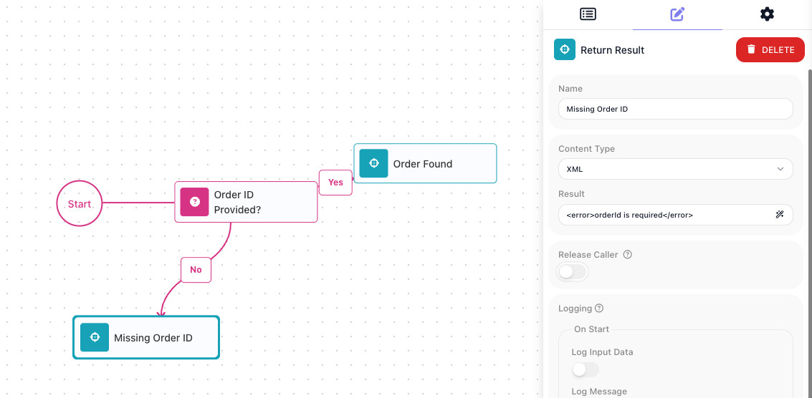
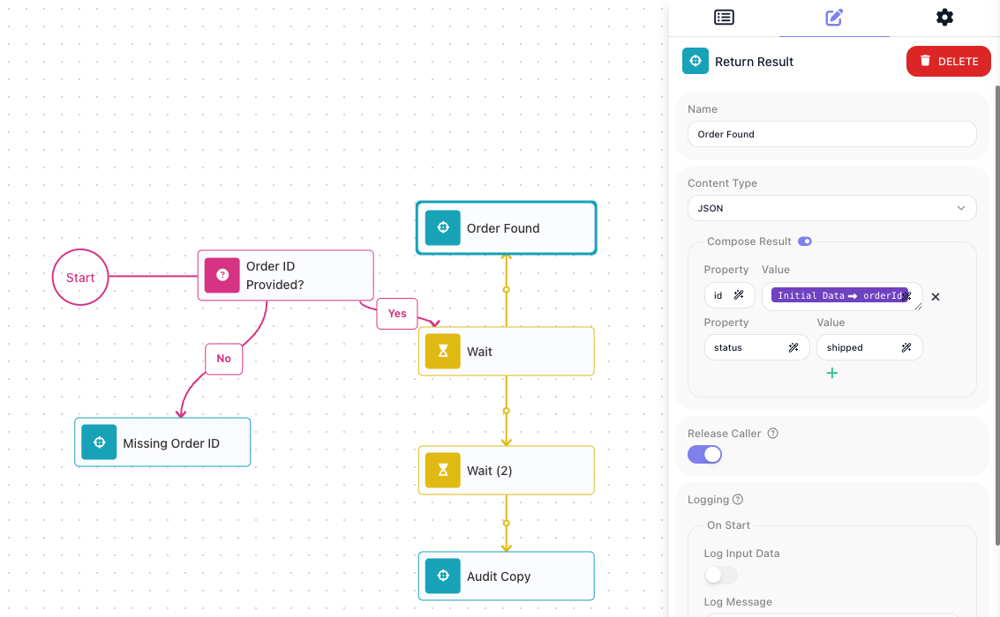
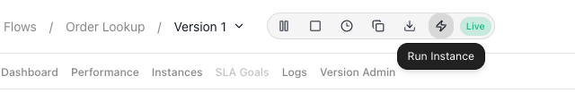
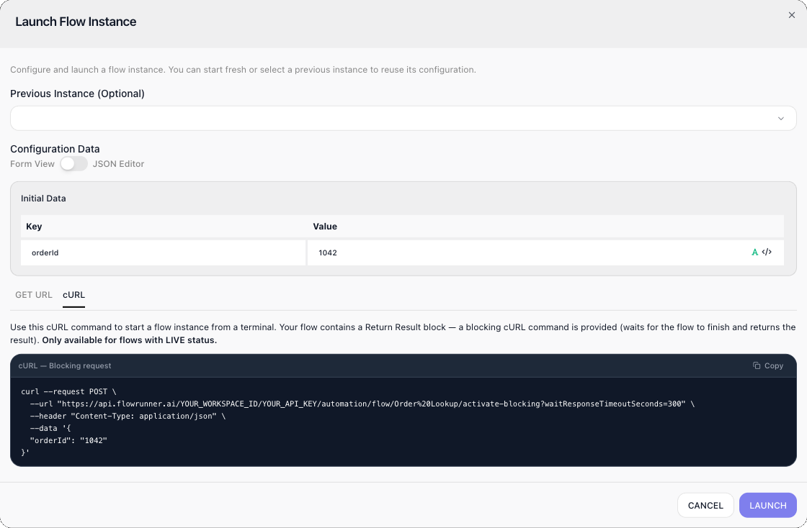
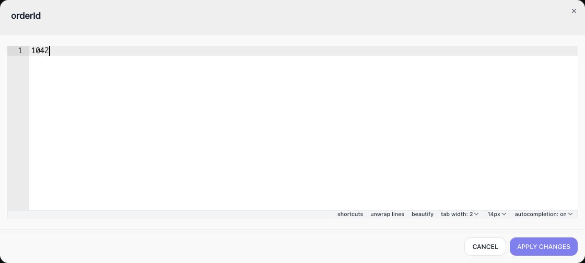

<!-- doclint: allow-unlinked: Call Flow -->
<!-- On this page "Call Flow" names the HTTP API, not the block of the same name.
     The block is linked explicitly under Related. -->
<!-- Split from api/call-flow.md 2026-08-24 at Mark's direction: one page per call (blocking here,
     non-blocking on call-flow-nonblocking.md), full copy-ready URLs (no base+path assembly), and a
     self-contained section per method (Calling with GET / Calling with POST).
     Verified in-product 2026-08-18 (Documentation Flows workspace, curl against api.flowrunner.ai; full log in
     .cache/api-spec/verification-2026-08-18.md; example flow "Order Lookup" 07E7DA91, kept LIVE):
     activate-blocking took the flow NAME only (id -> 28047), matching the URL the Launch Flow Instance
     dialog writes [SUPERSEDED by FR-3408 - see the 2026-08-31 re-drive at the end of this block]; a run that reaches ONE Return Result (of two, on Condition branches) -> the composed
     object as the body; none reached, or two reached in one run (parallel branches) -> the envelope
     {executionId,status,result,results[{blockName,contentType,data}],apiCallerReleased};
     Release Caller on -> the caller gets that block's value the moment it is reached while the run goes on
     (driven at ~4 s wall clock against a 3 s Wait; with it off the caller waited ~9 s and got the envelope);
     failing run -> 200 + envelope status TERMINATED + terminationError (Retry Demo, HTTP Request vs a 503);
     waitResponseTimeoutSeconds default 5, max 300 (28064), expiry -> 400/28118 and the run still completes,
     a 28118 body carries no executionId; POST body + query params merge into Initial Data, same key in both
     -> 400/28064; GET query values arrive as strings, POST JSON keeps types; POST body without
     Content-Type: application/json -> HTTP 415 (charset=utf-8 fine, text/plain refused); POST with no body
     -> 200; PUT -> HTTP 405; every refusal body carries details:{}; the flow name is case-sensitive
     (order%20lookup -> 28047 [code now 28053, FR-3408]); renaming the flow -> old-name URL 28047 [now 28053],
     new name 200; a paused version ("On hold") -> 28047 [now 28053]; error 9000 = unknown workspace id; Content Type dropdown = JSON | XML | Plain Text
     (read open, in the log); XML -> application/xml, Plain Text -> text/plain, and in BOTH the body arrives
     as a JSON-quoted string of the Result value - the reported quirk (KNOWN below; STATEMENT OF RECORD: the page ships
     option (b) - it states the quoting outright, in the bullets and the paragraph below them. Mark's (a)/(b)
     ruling is still open; choosing (a) means deleting those clauses again);
     Compose Result off under JSON returns the single Result value as a JSON string; the envelope's
     result/results ORDER IS NOT DETERMINISTIC (the block reached 5 s later was listed first in one run and
     second in another) - documented as read by blockName; Release Caller on a block a run never reaches
     (the No branch) answers as if the toggle were off (driven: {} -> Missing Order ID's value).
     Dialog: the LIVE toolbar's last icon is "Run Instance" (tooltip; row = Pause | Stop | Schedule | Clone |
     Export | Run Instance); the dialog writes the blocking URL by NAME with waitResponseTimeoutSeconds=300
     for a Return Result flow; its cURL form = POST with a JSON body; the per-value "A" icon (tooltip "Use
     data as string if selected (green)") is on by default -> body "1042", off -> 1042; the per-value code
     icon (tooltip "JSON Editor") opens an editor for that one value (APPLY CHANGES); the form-level JSON
     Editor toggle shows {"initialData":{...},...} and leaves the cURL body unchanged; LAUNCH starts a run
     (instance appeared at once); Previous Instance lists runs as "<time> (ExecutionID: ...)" and refills the
     form; the credentials tooltips read "Show API key" / "Regenerate key" / "Copy to Clipboard"; the
     credentials PATH was navigated in-product (round 4: /app/Documentation Flows/settings/general, breadcrumb
     "Workspace Settings / General", Credentials card holding Workspace ID + API Key - shot
     now on manage/workspace-settings.md (workspace-settings-credentials.png)). 2026-08-24: HEAD is answered like GET and STARTS A RUN
     (200; instance D389B25E appeared); DELETE -> HTTP 405. The dialog embeds the workspace's REAL
     credentials (captured live, replaced in the DOM with YOUR_WORKSPACE_ID / YOUR_API_KEY before the shot).
     Error row 28045 was driven 2026-07-08 (flow-scheduling-concept.md). Rows 28093 / 28107 / 28127 / 28039 /
     28061 (carried over from the version Mark reviewed on 2026-08-06, undriven) were DROPPED - restore when
     driven. The no-Return-Result dialog branch (non-blocking URL by id) is driven on call-flow-nonblocking.md's log
     (Order Poller, pictured there); the Ready toolbar carries the Run Instance icon (tooltip row read
     2026-08-18: Start flow | Schedule | Clone | Export | Run Instance) and the dialog on a non-LIVE flow
     says "Only available for flows with LIVE status" (2026-06 branching log). DECISION recorded: the single
     GET-consequence sentence in One-Return-Result ("the same call with GET returns \"1042\"") is kept
     deliberately - a scoped response consequence at the worked example, not the request-rule interleaving
     the 0d ban targets. 2026-08-24 drives: 2002 NOT reproducible (workspace "abc"/"x"/truncated GUID all -> 9000) - row dropped,
     restore when driven; A REACHED RETURN RESULT WINS OVER A LATER FAILURE (Order Lookup temporarily given a
     parallel "Bad Fetch" HTTP Request to https://invalid.invalid/x after Order Found, Release Caller OFF:
     caller got 200 {"id":1042,"status":"shipped"} at ~2.2s while the run list shows those runs TERMINATED)
     - the TERMINATED envelope appears only when NO Return Result was reached first; the "Start flow" tooltip
     re-read on the Ready toolbar; the no-form case is pictured (Order Poller's Launch dialog on the
     non-blocking page shows no Initial Data form); the every-state toolbar claim was SCOPED OUT (On hold
     toolbar not driven); 28083 reworded to billing.md's verified term 'execution allowance' (catalog
     lineage says 'action allowance' - flagged with the rate-limit confirm item). 2026-08-24 drive: POST
     body [1,2,3] and "x" (valid JSON, not an object) -> 200 on activate-blocking (Missing Order ID's value:
     no orderId arrived) AND on activate (executionId) - not refused, nothing lands in Initial Data by name.
     SUPERSEDED 2026-08-25 by FR-3372 (v1.0.14): a non-object body ALONE is still 200 (driven), but a
     non-object body SENT WITH QUERY PARAMS is now 400/28064 "Query parameters cannot be merged into the
     request body because the body is not a JSON object."; same-key-in-both is 28064 with a different
     message ("Query parameters conflict with the request body keys: 'orderId'"). Both driven 2026-08-25.
     AUTHOR EXCEPTION ON RECORD: the segment-per-line Endpoint template is Mark's hand-authored format
     (2026-08-24); the single-line sibling templates await his nod to mirror it (open MARK item) - the
     asymmetry is deliberate until he rules. Instances-tab-lists-runs-with-start-times is pictured on
     running-flows.md (watching-the-runs shots); Release-Caller-on-the-LATER-block and the initialData
     display-only wrapper are both in the 2026-08-18 log (round 2 / dialog rounds); the flipped JSON Editor
     state is now CAPTURED (callflow-launch-json-editor.png, 2026-08-24: Order Lookup dialog, orderId 1042
     typed, toggle flipped, cropped above the URL tabs - no credentials in frame - read back). 2026-08-24 drive: Order
     Poller (LIVE, no Return Result) by name on activate-blocking -> HTTP/2 200, Content-Type
     application/json, {"apiCallerReleased":false,"executionId":"12ECFE06...","result":null,"results":[],
     "status":"COMPLETED"} - the wait-on-a-no-Return-Result-flow promise and the envelope's media type are
     both driven, and every driven envelope (incl. TERMINATED) arrived as application/json. 2026-08-24 drives (gate round 16-17): flow NAMES are unique per workspace (creating a second
     "Order Lookup" is refused in the dialog: "Flow name must be unique. The name 'Order Lookup' is already
     taken by another flow."); Return Result has NO source handle in the editor (target only, unlike Wait)
     - it ends its path, so work continuing past the answer means a parallel branch; the LIVE toolbar reads
     Pause | Stop | Schedule | Clone | Export | Run Instance and the On-hold toolbar reads Resume flow |
     Stop | Schedule | Clone | Export | Run Instance (so Run Instance IS present while paused); a paused
     version answered 28047 and Resume flow put it back LIVE (API re-verified 200 after). The response's
     TIMING contract (sent at run end, not when the answer is composed) rests on the round-2 parallel drive
     (Release Caller off: caller waited ~8s for Audit Copy though Order Found was reached at 3s) plus the
     Order Poller no-Return-Result drive. 2026-08-24 (gate round 18): XML re-drive ATTEMPTED and not completed - the editor edit lands on the
     DRAFT, and the LIVE version is a published snapshot, so a true re-drive would mean republishing the
     live example twice; the draft was restored (Content Type JSON, Compose Result error / "orderId is
     required") and both branches re-verified over the API. The round-18 re-drive was abandoned (the editor edit landed on the
     draft, not the LIVE version) and the draft was restored; the round-19 live re-drive below completed and
     confirms the quoting.
     TERMINATED Instances row CAPTURED (callflow-terminated-instance.png: Retry Demo, instance
     27614B25-48EC-46CB-9928-F2C2D785AF23 - the same id as the envelope sample above - Has Error tick,
     TERMINATED badge; read back), closing the A/B shot decision with option B. Pause semantics driven and
     now documented on running-flows.md (On hold + Resume flow + shot). 2026-08-24 (gate round 19, throwaway "Timeout Probe", created and DELETED; Order Lookup untouched):
     RELEASE CALLER DOES NOT ESCAPE THE TIMEOUT - Release Caller ON behind a 10s Wait, timeout=1 -> 400/28118;
     timeout=30 -> 200 {"note":"released"} at ~10.8s (the round-18 "whatever the timeout" wording was wrong,
     now corrected). A TIMED-OUT RUN'S VALUE IS STILL READABLE in the run detail (instance 10F75294:
     COMPLETED 10s, Return Result Output note: released) - so the caller-side and operator-side facts are now
     stated separately. XML/PLAIN TEXT RE-DRIVEN ON A LIVE FLOW: "<probe>released</probe>" (quoted bytes,
     application/xml) and "probe released" (quoted, text/plain) - the JSON-quoting quirk PERSISTS, so the page
     now states it; Mark's ruling (a)/(b) still open but the prose no longer contradicts the evidence. An
     empty XML Result returns the bytes `null`. COMPOSE RESULT OFF with an object value returns a JSON-escaped
     STRING. 415/405 bodies are RFC-7807 problem+json (title/detail, NO code/message) - the discriminator was
     corrected. waitResponseTimeoutSeconds in a POST body is IGNORED (query string only). A retry starts a
     second run (two instances). NOT DRIVEN (fan-out unwireable via automation): Release Caller on two Return
     Results; a Return Result reached twice; the envelope's media type for an XML flow - the prose is scoped
     to what is known. 2026-08-24 (gate round 20, throwaway "Envelope Probe", deleted): FAN-OUT IS WIREABLE (the earlier
     "unwireable via automation" note was WRONG - the drag needs a target well down-right of the source), so
     the two claims that rested on it are now DRIVEN: (1) the envelope is ALWAYS application/json even when
     every Return Result is XML - each entry keeps its own contentType with the markup as a string under data
     (run 0229CD5E); (2) with Release Caller ON for BOTH Return Results the first block reached answers, and
     on branches that start together the winner is NOT deterministic (three calls: alpha, alpha, beta).
     blockName uniqueness remains UNDRIVEN (a List Iterator has no drop-in container in this build and a
     Return Result is terminal) - the prose no longer claims it. 2026-08-24 (gate round 21): the API key segment is STILL not enforced (garbage key -> 200 and the
     composed answer), so the regenerate-on-exposure REMEDY was REMOVED from the credentials paragraph - it
     cannot remediate a leaked URL, and shipping it would give false assurance (escalated to Mark; the
     regeneration itself was NOT tested because it is workspace-wide and destructive). The dialog's generated
     cURL was pasted verbatim: `{"orderId": "1042"}` -> {"id":"1042",...} and `{"orderId": 1042}` ->
     {"id":1042,...}, so the string-vs-number payoff is driven directly. On an ON HOLD version the Launch
     dialog STILL writes the blocking URL (its text says "Only available for flows with LIVE status" but the
     URL box and Copy button are present) - the page now warns that such a URL answers 28047 until the
     version is resumed. blockName defaults to the block type: the round-20 probe's two unrenamed blocks
     reported "Return Result" and "Return Result (2)" in the envelope. 2026-08-24 (gate round 22): APPLY CHANGES in the per-value editor DRIVEN - typing 2077 and applying
     updated the Value cell, the GET URL query string (orderId=2077) AND the cURL body ("orderId": "2077"),
     so the round-3 note "GET URL unaffected" was wrong and is retracted. blockName does NOT collide: the
     product auto-suffixes a second unnamed Return Result to "Return Result (2)" (round-20 probe), so the
     page now teaches the real hazard - renaming a block a client already reads. The value-editor shot was
     RECAPTURED holding 1042 (the previous one put an object into orderId, a shape the running example
     cannot consume). 2026-08-24 (gate round 23): the removed key-regeneration remedy had SURVIVED in two more places -
     the Related bullet on both API pages and manage/workspace-settings.md, which instructed it outright.
     All three swept; Workspace Settings now describes the refresh icon truthfully (it issues a new key;
     URLs built on the old one have to be rebuilt) without promising it kills a leaked URL. The security
     paragraph here now names this endpoint's own exposure: a leaked URL also RETURNS the composed answer,
     not just spend. 2026-08-24 (gate round 24, throwaway "Stop Probe", deleted): a run STOPPED BY HAND from the Instances
     tab answers a waiting blocking caller with 200 + status TERMINATED + terminationError carrying ONLY
     {"message":"Instance was stopped by user"} - no blockName, no errorCode (instance B00711FD). So
     COMPLETED/TERMINATED are the two states this call reports (that follow-up is closed), and the
     terminationError row - which had promised three fields - is corrected. The Compose-Result-OFF panel is
     still unpictured on purpose: the cached capture (.cache/api-spec/compose-off-panel.png) shows a JSON
     block whose single Result holds leftover XML markup, a scenario that does not exist, and capturing a
     clean one means toggling the LIVE example's Return Result, which risks its compose rows; the label
     fact it proves (the toggle sits beside "Result" when off) is stated in prose instead. 2026-08-24 (gate round 25, throwaway "Quote Probe", deleted): an XML Result CONTAINING QUOTES
     (<order id="1042" note="say \"hi\"">shipped</order>) comes back as "<order id=\"1042\" note=\"say
     \\\"hi\\\"\">shipped</order>" - a JSON STRING LITERAL with internal quotes escaped. The page's earlier
     remedy ("strip the quotes") was WRONG for any XML with attributes; it now says parse the body as JSON,
     and says why trimming fails. Rate/plan rows:
     NOT burst-driven (deliberate - tripping limiters spends real executions); the 400-claim is scoped to
     the first table and the carried rows stand on codes alone (open MARK confirm item unchanged). Provenance: the rate/plan-limit rows are carried from the removed
     api/index.md shared table (Mark-reviewed 2026-08-06 lineage), not driven; 8007/8008 dropped (no required
     parameter on this endpoint can produce them). KNOWN, REPORTED TO MARK, NOT DOCUMENTED: the API key segment
     is not checked (any value starts an instance); malformed JSON returns HTTP 500 with a stack trace.
     (The XML / Plain Text JSON-quoting is no longer on this list - since round 19 the page DOCUMENTS it.)

     RE-DRIVEN 2026-08-31 for FR-3408 (Documentation Flows workspace on dev.flowrunner.ai - host
     dev-api.flowrunner.ai; flow "TD Sandbox" C24408A2, published LIVE for the test and returned to Ready;
     full log in the session evidence file). FR-3408 unified the two endpoints, so THREE facts on this page
     changed and are corrected above:
     (1) IDENTIFIER - activate-blocking now accepts the flow ID **or** the flow NAME, over GET and POST.
     All eight combinations (activate | activate-blocking x id | name x GET | POST) returned HTTP 200.
     The NAME-only rule and the "the id belongs to the non-blocking call" sentence are gone.
     (2) ERROR CODE - both endpoints now answer 28053, never 28047. Driven three ways: unknown id, unknown
     name, and a good identifier with the flow stopped. 28047 was not produced by any call. The server's
     message is now "Flow with ID or name 'X' and status 'LIVE' is not found." - it states the unified
     contract itself.
     (3) RENAME - no longer a property of the endpoint: an id URL survives a rename, a name URL does not.
     Also re-confirmed: the name is case-sensitive (td%20sandbox -> 28053) and must be percent-encoded
     (TD+Sandbox -> 28053; a `+` is not decoded to a space in a path segment).
     The Launch Instance dialog writes the ID form of the non-blocking URL
     (https://{host}/{workspaceId}/{apiKey}/automation/flow/{flowId}/activate) - unchanged by FR-3408.

     FR-3427 (SECURITY: the API key segment is not validated) VERIFIED FIXED on dev 2026-09-01. The key is
     now enforced on every route driven: activate, activate-blocking, GET .../execution/{id} and
     GET .../execution/{id}/block/result all answer HTTP 401 {"code":2027,"message":"API key is invalid"}
     to a garbage key - which matches the contract Andriy Konoz gave on the ticket. Check ORDER was driven
     too: with the flow stopped, a garbage key returns 2027 while a good key returns 28053, so the key is
     checked BEFORE the LIVE lookup; a bad workspace id with a garbage key returns 9000, so the workspace
     is checked before the key. Rotation was driven end to end: regenerating the workspace key made the
     just-replaced key answer 2027 immediately.
     CONSEQUENCE FOR THIS PAGE: FR-3427's description states the rotate-on-exposure remedy was REMOVED from
     the Call Flow pages because it could not remediate a leak while the key was unchecked, and asks for the
     doc question to be reopened once the key is enforced. It is enforced, so the remedy is RESTORED above -
     but written as a choice between two moves with different blast radius (regenerate = every URL on that
     key, Stop = this flow only), not as the blanket advice that was removed. The NOT-ENFORCED caveat is
     retired from the memory file as well. Error 2027 is now a row in the error table.
     NOT DRIVEN: the External Callback trigger URL, the third route named on FR-3427 - the sandbox flow used
     here has no callback trigger. Reported as untested rather than assumed. -->
# Call Flow (Blocking)

If a flow has a [Return Result](../reference/return-result.md){.fr-block} block, the blocking Call Flow
endpoint is how your code gets that result: one `GET` or `POST` request starts an instance of the flow and
waits; the value the Return Result block returns arrives as the response body. In one round trip the **FlowRunner™** flow answers like any other API. When you only need the work
started, use [Call Flow (Non-Blocking)](call-flow-nonblocking.md) instead. The examples on this page use a
flow named Order Lookup: it takes an `orderId` and answers with that id and the order's status (for the
example, always `shipped`), or with an error when no `orderId` came.

## Endpoint (`GET` or `POST`)
<!-- doclint: no-shot: the URL contract, not a screen; the Credentials section is pictured on Workspace Settings and the dialog that writes this URL is pictured below -->

```text
https://api.flowrunner.ai/
            {workspace-id}/
            {api-key}/
            automation/flow/
            {flow}/
            activate-blocking?waitResponseTimeoutSeconds={time-in-sec}
```

| Placeholder | Value | Where it comes from |
| --- | --- | --- |
| `{workspace-id}` | The workspace the flow belongs to | **Workspace Settings ▸ General ▸ Credentials** - see [Workspace Settings](../manage/workspace-settings.md#name-and-credentials) |
| `{api-key}` | The workspace's API key | Same place |
| `{flow}` | The flow's **id**, or its **name** URL-encoded (`Order%20Lookup`) - either one works | The id is the segment after `/flow/` in the address bar while the flow is open. The name is in the breadcrumb at the top of the flow and in the flows list in the sidebar - see [Flows](../manage/flows.md). Names are unique within a workspace, so one name always means one flow. Both forms are case-sensitive. An id URL survives a rename; a name URL does not |
| `{time-in-sec}` | How long the call waits for the run to finish, in seconds. Optional - the default is `5` and the maximum is `300` | You pick it - see [How long the call waits](#how-long-the-call-waits) |

What you send with the call becomes the run's Initial Data.

**Flows without a Return Result.** The **Launch Flow Instance** dialog writes the non-blocking URL, not
this one, so build this call by hand: take the [Calling with GET](#calling-with-get) or
[Calling with POST](#calling-with-post) example, put your flow's id or name in place of
`Order%20Lookup`, and drop `orderId=1042` or replace it with what your flow reads. The answer is the
[run envelope](#no-answer-or-more-than-one-the-run-envelope).

**The flow has to be LIVE.** The endpoint answers only while a version of the flow is LIVE - the state a
version enters when you start it (see [Running Flows](../run/running-flows.md#ready-then-live)); otherwise
the call is refused with error `28053`. The address carries no version, so it always runs whichever version
is live now: making a different version live changes what this URL executes, without changing the URL.

**The URL is a credential.** It embeds your workspace's id and API key, so anyone who has it can start runs
of this flow, read whatever the Return Result returns - the order data in this example - and spend your
workspace's execution allowance. Keep it server-side, out of client code and untrusted configs. If one does
get out you have two ways to close it, and they differ in blast radius. Regenerating the workspace's API key
kills every URL built on the old key at once - the leaked one included, which then answers `2027` - but it
also breaks every other call your systems make with that key, so they all have to be rebuilt with the new
one. Taking this version out of LIVE - **Stop** or **Pause** in the flow's toolbar - is the narrower move:
every copy of this flow's URL answers `28053` at once and nothing else is disturbed (see
[Running Flows](../run/running-flows.md#stopping-and-replacing-a-live-flow)). Reach for the key when you do
not know how far the exposure goes, and for Stop when you do. The key belongs to the whole workspace, not to
this flow, which is why it is the blunter of the two: see
[Workspace Settings](../manage/workspace-settings.md#name-and-credentials).

You do not have to assemble the URL by hand - [FlowRunner writes it for you](#let-flowrunner-write-the-call-for-you).

## Calling with GET

Copy, fill in the two credential placeholders, and run - the flow's values travel in the query string.
For your own flow, put its id or name in place of `Order%20Lookup` and its values in place of `orderId=1042`:

```bash
curl "https://api.flowrunner.ai/{workspace-id}/{api-key}/automation/flow/Order%20Lookup/activate-blocking?waitResponseTimeoutSeconds=30&orderId=1042"
```

You do not have to set any headers on a `GET`. Every query parameter except `waitResponseTimeoutSeconds` becomes one value in the
run's Initial Data, under its own name. Encode your values as in any query string - send a space as `%20` - and the flow receives the decoded
value. Query values arrive as text: `orderId=1042` reaches the flow as `"1042"`. When the flow needs real numbers,
booleans, or structured values (objects, lists), call with `POST` instead. Any fetch of this URL starts
a real run - a `HEAD` request included, which is how link previews, prefetchers and uptime monitors
usually touch a URL - so if it ever has to appear in a
document or a chat, paste it as plain text, never as a clickable link.

## Calling with POST

Copy, fill in the two credential placeholders, and run - the flow's values travel in a JSON body. For your
own flow, put its id or name in place of `Order%20Lookup` and its own properties in place of `orderId`:

```bash
curl --request POST \
  --url "https://api.flowrunner.ai/{workspace-id}/{api-key}/automation/flow/Order%20Lookup/activate-blocking?waitResponseTimeoutSeconds=30" \
  --header "Content-Type: application/json" \
  --data '{
    "orderId": 1042
  }'
```

A `POST` body is a JSON object, sent with `Content-Type: application/json` (a `charset` parameter is
fine; any other media type is refused with HTTP 415). Each top-level property becomes one value in the run's
Initial Data, with its JSON type kept: `{"orderId": 1042}` reaches the flow as the number `1042`.

When a `POST` carries both a body and query parameters, FlowRunner merges the query parameters into the
body object. Two rules follow from that, and both are refusals rather than silent surprises: a key sent
both ways is refused with `28064`, and a body that is valid JSON but **not an object** - an array, a bare
string - is refused with `28064` too, because there is no object to merge into. A non-object body on its
own, with no query parameters, is still accepted: the run starts with nothing for Initial Data to pick up
by name. `waitResponseTimeoutSeconds` is read from the query string only: sent as a
body property it does not set the wait: the call falls back to the five-second default, and the property
lands in Initial Data like any other. Put it in the query string. The URL is the
same one a `GET` answers, so any fetch of it - a link preview, a browser prefetch, an uptime monitor - starts
a real run; if it ever has to appear in a document or a chat, paste it as plain text, never as a
clickable link. An empty object,
no body at all, and a body that is valid JSON but not an object (an array, a bare string) are all accepted:
the run starts, with nothing for Initial Data to pick up by name.

## Response
<!-- doclint: no-shot: the h2 body states the response's timing contract, not a screen; the h3s below carry their own scenarios' shots (Return Result panel, XML Content Type, the parallel branch, the TERMINATED Instances row, Release Caller on) or their own no-shot markers (How long the call waits) -->

What comes back depends on how many [Return Result](../reference/return-result.md){.fr-block} blocks the
run reached. The response is sent when the run finishes, not when a Return Result produces its answer: that
block ends the path it sits on, but other branches keep working and the caller waits for all of them. So the
five-second default covers the whole run, not just the time to the answer.

### One Return Result: the body is its value

This is the usual case. It also covers a Return Result on each branch of a
[Condition](../reference/condition.md){.fr-block}, since a run takes one branch. The body is the value that
block composed, in the ((Content Type)) set on the block. Order Lookup checks that an `orderId`
arrived and then ends in one of its two Return Results. Order Found composes `id` from
{{Initial Data->orderId}} - the value the caller sent - and `status` as `shipped`. Missing Order ID answers
when no `orderId` came. The screenshot below shows Order Found selected on the canvas, with its panel: the
((Content Type)), the two ((Compose Result)) rows, and the ((Release Caller)) toggle, off here (see
[Release Caller answers early](#release-caller-answers-early)).


A caller that posts `{"orderId": 1042}` receives:

```json
{
  "id": 1042,
  "status": "shipped"
}
```

The same call with `GET` returns `"id": "1042"`, because query values arrive as text. When a caller posts
`{}`, the run takes the No branch and the caller receives Missing Order ID's value, `{"error": "orderId is required"}`. Both
answers are HTTP 200: a Return Result sets the body and its content type, not the HTTP status, so the caller
reads success or failure from the body.

### The Content Type sets the response format

A caller that expects XML or plain text gets it from the same block: the ((Content Type)) on the Return
Result decides how the value is sent.

- JSON - the composed object, as `application/json`. Switch ((Compose Result)) off and the rows collapse to
  one field, with the toggle now sitting beside the label ((Result)) - that is where you switch it back on.
  The body is then that one value as a JSON string, including when what you put there is itself an object,
  which comes back escaped rather than as an object.
- XML - the block has only the ((Result)) field; the body is that value, as `application/xml`.
- Plain Text - the same, as `text/plain`.

Under XML and Plain Text the value does not arrive raw: the body is a JSON string holding it, quotes
included - `"<error>orderId is required</error>"`. Parse that string as JSON to recover the markup or the
text. Trimming the quotes is not enough, because any quote inside the value is escaped too: an XML result
`<order id="1042">shipped</order>` arrives as `"<order id=\"1042\">shipped</order>"`. This is a known
issue rather than the intended contract, so treat the decode as something you may be able to drop later.

Switching Missing Order ID to XML replaces the ((Compose Result)) toggle and its rows with a single
((Result)) field. The screenshot below shows it holding `<error>orderId is required</error>` - what a caller
on the No branch then receives, quotes and all.



Switched back to JSON, the block composes `error` with the value `orderId is required` - the body shown
earlier, and what the rest of this page assumes.

### No answer, or more than one: the run envelope

When a run composes no answer, or more than one - a run that reaches no Return Result, or one whose
parallel branches each end in one - the caller receives an envelope describing the run instead. To show one,
Order Lookup gets a second branch: after the Yes exit, one branch answers with Order Found
as before while a second, slower branch ends in a Return Result named Audit Copy that composes an `event`
and the same `id`. The two [Wait](../reference/wait.md){.fr-block} blocks only space the branches out: the
first delays the split by three seconds, and Wait (2) adds five more before Audit Copy, so Order Found is
reached at about three seconds and Audit Copy at about eight. The screenshot below shows the arrangement, with Wait (2) selected; the first Wait, not selected here, is
set to three seconds:


A run with `orderId` reached both, and the caller received:

```json
{
  "executionId": "5AE81D70-6BF9-4C22-BD42-96B4E27686D7",
  "status": "COMPLETED",
  "result": {
    "blockName": "Audit Copy",
    "contentType": "application/json",
    "data": {
      "id": 1042,
      "event": "order looked up"
    }
  },
  "results": [
    {
      "blockName": "Audit Copy",
      "contentType": "application/json",
      "data": {
        "id": 1042,
        "event": "order looked up"
      }
    },
    {
      "blockName": "Order Found",
      "contentType": "application/json",
      "data": {
        "id": 1042,
        "status": "shipped"
      }
    }
  ],
  "apiCallerReleased": false
}
```

| Property | Meaning |
| --- | --- |
| `executionId` | The run that was started |
| `status` | The run's final state: `COMPLETED` when it finished, `TERMINATED` when a block failed or someone stopped the run from the Instances tab. This call answers only after the run is over, so these are the two states it reports |
| `result` | One of the results the run produced - the block's name, its content type, and the composed value under `data` - or `null` when it produced none. Which one it holds is not predictable when a run produced more than one (here it holds Audit Copy, the block reached second), so do not build on it - find the entry in `results` whose `blockName` is the block you want. Switching [Release Caller](#release-caller-answers-early) on for any Return Result removes the envelope from that call, so a client written to `results` stops seeing one |
| `results` | Every result the run produced, each in the same shape. The order is not guaranteed - Audit Copy was reached second here yet is listed first - so read the one you want by its `blockName`. That value is the block's **Name** field: a second unnamed Return Result comes out as `Return Result (2)`, so give yours real names - and remember that renaming one later changes what your client has to look for |
| `apiCallerReleased` | Whether the caller was released early by [Release Caller](#release-caller-answers-early). A released caller gets that block's value instead of the envelope, so any envelope you receive says `false` |
| `terminationError` | Present only when `status` is `TERMINATED`. A block failure fills in the failing block's `blockName`, an `errorCode` (that block's own error, not one of the call errors in [Errors](#errors)), and a `message`; a run stopped by hand carries only `message`: `Instance was stopped by user`. Read `message` and treat the other two as optional |

**Your flow has no Return Result.** A run that reaches none gets the same envelope, with `result` `null`
and `results` empty - so this endpoint is how you wait for such a run and learn whether it finished or
failed. Building that call is covered under [Endpoint](#endpoint-get-or-post).

**Telling the envelope from a composed value.** On an HTTP 200, a composed value is whatever the flow's
author put in it - Order Found's has a `status` of its own - so a client that may receive either shape tests
for `executionId`:
it is present on every envelope and absent from a composed value unless you put one there, so do not compose
a property of that name. A composed value carries no run id, so if your client has to tie a call to its
run, find the run on the flow's **Instances** tab by its start time, or start it with the
[non-blocking call](call-flow-nonblocking.md), which returns one.

The envelope itself always arrives as `application/json`, whatever the blocks' ((Content Type)) is - an XML
Return Result inside an envelope keeps its own `contentType` on its entry, with the markup as a string under
`data`. So for an XML or Plain Text flow the response's `Content-Type` header alone separates the two shapes,
while the `executionId` test covers the JSON-against-JSON case. A response that is not HTTP 200 is never a
flow's answer at all: an HTTP 400 carries a `code` and a `message` (see [Errors](#errors)), and a wrong media
type or method is refused with `application/problem+json`, which carries `title` and `detail` instead.

### When a run fails

A run that fails before reaching any Return Result is still HTTP 200; the body is the envelope with `status`
`TERMINATED` and a `terminationError`. Order Lookup has no step that can fail, so this envelope comes from
another flow, Retry Demo, whose only block, an
[HTTP Request](../reference/http-request.md){.fr-block}, was answered with a 503:

```json
{
  "executionId": "27614B25-48EC-46CB-9928-F2C2D785AF23",
  "status": "TERMINATED",
  "result": null,
  "results": [],
  "apiCallerReleased": false,
  "terminationError": {
    "blockName": "HTTP Request",
    "errorCode": 28105,
    "message": "Error occurred while executing 'HTTP Request' block. Block execution failed with an error:\n\n{\n  \"status\" : 503\n}"
  }
}
```

That run appears on Retry Demo's ((Instances)) tab with a filled Has Error mark and a TERMINATED badge -
the same instance id the envelope above carries:


**A result already sent wins.** On Order Lookup without the Audit Copy branch - one Return Result on the
path - a step that fails alongside Order Found does not take the answer away: the caller still receives
`{"id": 1042, "status": "shipped"}` while the run itself terminates. Driven with an HTTP Request to an
address that does not resolve. The envelope above appears only when no Return Result was reached first, and a run whose
caller already has an answer still shows as TERMINATED in the list.

### Release Caller answers early

Answer the caller as soon as the result exists, and let the run finish the work the caller does not wait
on - writing an audit record, notifying a downstream system, sending a confirmation. That is what
((Release Caller)) is for. A Return Result with the toggle on answers a waiting caller the moment the run
reaches it: the body is that block's composed value, and the run carries on with whatever else it has to
do.
In the parallel arrangement above, switching it on for Order Found gave the caller Order Found's value after
the three-second Wait (`{"id": 1042, "status": "shipped"}`, HTTP 200), while the run went on to reach Audit
Copy five seconds later; with it off, the caller waited for the whole run - Audit Copy at about eight
seconds - and received the envelope. What follows from that:

- The caller receives only that block's value, never the envelope - even when the run had already reached
  a different Return Result before the one carrying the toggle.
- Return Results the run reaches after the release never reach that caller.
- A run that never reaches the block (Order Lookup's No branch) answers as if the toggle were off.
- With the toggle on more than one Return Result, whichever block the run reaches first answers the caller,
  and the others change nothing for that call. On branches that start together, which one gets there first
  is not predictable - two calls to the same flow can return different branches' values.

The toggle sits below
((Compose Result)) in the block's panel; here it is switched on for Order Found, with the branch still in
place:



### How long the call waits
<!-- doclint: no-shot: the wait is an HTTP outcome, not a screen; the Instances list with its Start Time column is pictured under When a run fails and covered on Running Flows -->

Set `waitResponseTimeoutSeconds` on every call: the default is 5 seconds and the maximum is 300. Your own
HTTP client's timeout has to be longer than the value you send, or it gives up before the answer arrives. A
run that calls a model, waits, or loops past its answer needs more than the default. Pick a value a little above the run's normal end-to-end time - the flow's
Instances tab shows each run's **Total Time** (see [Running Flows](../run/running-flows.md#watching-the-runs)). A larger one is not free: every waiting call holds a connection open, and a
workspace has a ceiling on how many requests it can have in flight (error `998`, see [Errors](#errors)), so
do not send 300 everywhere. The dialog writes 300, the maximum, so a copied URL waits as long as this
endpoint allows while you are testing; the examples here send 30.

**When the wait expires.** If the run is still going, the call returns HTTP 400 with error `28118`. What
that means for you:

- The run is not cancelled; it finishes on its own.
- No `executionId` comes back. Find the run on the flow's **Instances** tab by its start time (see
  [Running Flows](../run/running-flows.md#watching-the-runs)); if you will need the id, start the run with
  the [non-blocking call](call-flow-nonblocking.md) instead.
- The answer never reaches your code. If the run composes a Return Result value after the wait expires, no
  call returns it to you. You can still see it: open the run from the flow's Instances tab and read the
  Return Result block's **Output** (see [Inspecting a Run](../run/inspecting-a-run.md)).
- When the answer is known well before the run ends, switch [Release Caller](#release-caller-answers-early)
  on for that Return Result: the call returns the moment the run reaches the block, instead of waiting for
  the rest of the run. The timeout still applies - it has to be long enough to cover the work up to that
  block.
- Do not retry a timed-out call: the run is already going, and a retry starts a second run with the same
  data. Turn off any automatic retry-on-timeout in your HTTP client.

**Runs longer than the maximum wait.** The Release Caller remedy above covers a run that keeps working
after its answer. If even the answer takes longer than 300 seconds, or the run pauses at an
[External Callback](../reference/external-callback.md){.fr-block}, start the run with the
[non-blocking call](call-flow-nonblocking.md) and let the flow deliver its answer itself.

## Errors
<!-- doclint: no-shot: an error reference, not a screen; each row names the condition and the fix -->

Most errors come back as HTTP 400 with a JSON `code`, a `message`, and a `details` object that is empty on
every refusal in the table below - read the `code`; a wrong media type or
method is refused at the HTTP level (415 / 405) with no code. This is what an identifier with no LIVE
version behind it returns - here Order Lookup while its version was paused; the message echoes what you
sent:

```json
{
  "code": 28053,
  "details": {},
  "message": "Flow with ID or name 'Order Lookup' and status 'LIVE' is not found."
}
```

The id and the name are interchangeable here, and a wrong one of either kind returns this same refusal.

| Code | What it means | What to do |
| --- | --- | --- |
| `28053` | No LIVE flow with that id or name | Check the identifier is spelled and cased exactly as FlowRunner shows it - a name also has to be URL-encoded (`Order%20Lookup`), and a `+` is not read as a space - and that a version is LIVE. A paused version (On hold) answers this too, so put it back with **Resume flow** in the flow's toolbar (see [Running Flows](../run/running-flows.md#stopping-and-replacing-a-live-flow)). Renaming the flow breaks a name URL - the old name answers `28053` - but leaves an id URL working |
| `2027` | The API key is not this workspace's key | Re-copy the API Key from **Workspace Settings ▸ General ▸ Credentials**. Regenerating the key invalidates every URL built on the old one |
| `9000` | No workspace with that id | Re-copy the Workspace ID from **Workspace Settings ▸ General ▸ Credentials** |
| `28064` | Query parameters could not be merged into the body (the same key was sent both ways, or the body is valid JSON but not an object), or `waitResponseTimeoutSeconds` is above 300 | Read the `message` - it names the duplicated key, says the body is not an object, or names the rejected timeout. Send each value once, make the body an object whenever you also send query parameters, and keep the timeout at 300 or below |
| `28118` | The run did not finish within `waitResponseTimeoutSeconds` | The run is still going - do not re-send the call (see [How long the call waits](#how-long-the-call-waits)). For the next call, raise the timeout (up to 300), or use the [non-blocking call](call-flow-nonblocking.md) and let the flow deliver its answer |
| `28045` | The flow can be called only by its schedule | Turn off **Allow only scheduled flow instances** in the **Flow Execution Policy** checkboxes of the **Configure Flow Schedule** popup - see [Flow Scheduling](../reference/flow-scheduling-concept.md#the-flow-execution-policy), which pictures it |
| HTTP 415 | A `POST` body sent without `Content-Type: application/json` | Send that header |
| HTTP 500 | The `POST` body was not valid JSON | Check that the body parses - a trailing comma or an unquoted key is the usual cause - and send it again |
| HTTP 405 | `PUT` and `DELETE` are refused | Use `GET` or `POST`. `HEAD` is not refused - it is answered like `GET` and starts a run |

**Rate and plan limits.** The platform also enforces call-rate and plan limits, answering with one of these
codes:

| Code | What it means |
| --- | --- |
| `999` / `997` / `995` | A request-rate limit was exceeded - back off |
| `998` | Too many requests are in flight at once - back off |
| `28083` | The workspace's monthly execution allowance is exhausted - wait for the month to reset, or raise the plan (see [Billing](../manage/billing.md)) |
| `28087` / `28132` | Too many runs are executing at once / the execution maximum is reached - retry once some finish |
| `28086` | The maximum number of active flows has been exceeded - stop a LIVE flow you no longer need, or raise the plan |

## Let FlowRunner write the call for you

Open the flow and click ((Run Instance)) in the toolbar at the top of the flow - the last icon in the row.
Its own note says the URL is only available for flows with LIVE status, but it writes the URL on a paused
(On hold) version too - and that URL answers `28053` until the version is running again. The same toolbar shows **Start flow** while the version is Ready and
**Resume flow** while it is On hold (see
[Running Flows](../run/running-flows.md#ready-then-live)). The screenshot below shows the toolbar of a LIVE
flow with the tooltip open.



((Run Instance)) opens the ((Launch Flow Instance)) dialog. For a flow that contains a Return Result block it writes this
page's URL, built on the flow's name with `waitResponseTimeoutSeconds=300` already appended - the maximum,
which suits testing; lower it to a little above your flow's normal run time before you ship the call (see
[How long the call waits](#how-long-the-call-waits)) - on two tabs -
((GET URL)) and ((cURL)) - each with a ((Copy)) button. (A flow without a Return Result gets the
[non-blocking URL](call-flow-nonblocking.md#let-flowrunner-write-the-call-for-you) instead.) The same dialog
also starts a run by hand: ((LAUNCH)) starts a run of the flow with the form's values, and
((Previous Instance)) lists earlier runs by start time and execution id and refills the form with that
run's values - both are covered in
[Testing](../run/testing.md#run-an-instance-from-a-block).

When FlowRunner detects Initial Data the flow reads, the dialog shows a form for those values first and
encodes whatever you type into the URL or the request body. The screenshot below shows the dialog for Order
Lookup: the Initial Data form already lists `orderId`, the value `1042` has been typed in, and the ((GET URL)) tab holds the call with the value in its query string. The dialog fills in your workspace's real
credentials (blanked to YOUR_WORKSPACE_ID / YOUR_API_KEY in these screenshots). The URL you copy is
therefore complete and live: fetching it, accidental fetches included, starts a real run.

![The Launch Flow Instance dialog for Order Lookup: a Previous Instance selector, a Configuration Data section with a Form View / JSON Editor toggle, an Initial Data table with the key orderId and the value 1042, and GET URL and cURL tabs. The GET URL tab explains that the flow contains a Return Result block so a blocking request URL is provided, and the box labelled "GET URL - Blocking request" holds the full URL ending in /flow/Order%20Lookup/activate-blocking?waitResponseTimeoutSeconds=300&orderId=1042, with a Copy button and a LAUNCH button below.](../images/api/callflow-launch-dialog.png)

**The cURL tab, and values as strings or numbers.** The ((cURL)) tab writes the same call as a `POST`: the
endpoint, the `Content-Type: application/json` header, and the form's values as the JSON body. These
controls decide what lands in it:

- The green ((A)) icon on each value row (tooltip: Use data as string if selected (green)) is on by default,
  so the body below carries `"1042"` in quotes; switch it off and the body carries the number `1042` (see
  [Calling with POST](#calling-with-post) for why that matters). Leave it on and the dialog's cURL sends the
  same string values a `GET` would, so Order Lookup answers `{"id": "1042"}`; switch it off for any value
  your flow needs as a number, boolean, or object.
- The code icon beside it (tooltip: JSON Editor) opens an editor for that one value - useful when the value
  is itself an object or a list - switch the green ((A)) icon off for that row first, or the object is sent
  as an escaped string. ((APPLY CHANGES)) writes what you typed back into the Value cell, the GET URL and
  the cURL body.
- The ((JSON Editor)) toggle above the form changes nothing in the body: it shows the same values as raw
  JSON under `initialData`, and the cURL body is unchanged - the `initialData` wrapper is the dialog's own
  display format, not the request body. Send the flat object; a body wrapped in `initialData` arrives as a
  single property of that name.

Here is the cURL tab itself, with the green ((A)) icon on - its default - so the body carries `"1042"` in
quotes:



The per-value editor opens on that row's value - here `1042` on line 1, under the `orderId` title:



The same value under the ((JSON Editor)) toggle:


## Related

- [Call Flow (Non-Blocking)](call-flow-nonblocking.md) - starting a run without waiting for it
- [Activating an External Callback](activating-a-trigger.md) - letting a specific waiting run continue
- [Return Result](../reference/return-result.md){.fr-block} - the block's fields: **Content Type**,
  **Compose Result**, **Release Caller**
- [Returning a Result](../build/integrations/returning-a-result.md) - when to answer a caller, and with what
- [Workspace Settings](../manage/workspace-settings.md#name-and-credentials) - where the Workspace ID and API Key live
- [Call Flow](../reference/call-flow.md){.fr-block} - the block that does the same job from inside another
  flow
