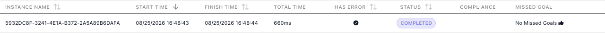

<!-- Verified in-product 2026-08-25 (Documentation Flows workspace, curl against api.flowrunner.ai;
     full log in .cache/api-spec/verification-2026-08-25-execution-api.md). Jira lineage: FR-3242
     shipped in v1.0.12 (2026-07-28), FR-3342 moved the path under flow/{flowId} in v1.0.14
     (2026-08-18). THE WRITTEN SPEC IN FR-3238 DOES NOT MATCH THE SHIPPED PRODUCT and this page
     follows the product: statuses are UPPERCASE and are RUNNING / PENDING / COMPLETED / TERMINATED
     (the spec said lowercase running/suspended/completed/failed); completion is NORMAL / ERROR;
     handled-error objects carry a details object the spec omits; no suspendedOn key exists on a
     PENDING run. Driven: RUNNING (Cart Summary EBBF7095, polled at 0.5s), PENDING (Payment Hand-off
     Test AFC5EEAC waiting at an External Callback, then resumed to COMPLETED), COMPLETED clean
     (Order Lookup DC991247), COMPLETED + hasErrors (Error Catch Demo 5932DC8F - AI Agent 401 caught
     by Handle Error), TERMINATED (Unhandled Failure Demo 3B037F58 code 28063; Retry Demo 8280BAE8
     code 28105). completion/durationMs/finishedAt are null until terminal (driven on both
     non-terminal polls). GET only: POST/PUT/DELETE -> 405 RFC-7807 problem+json (title/detail, NO
     code/message); HEAD -> 200 empty and starts nothing. 28068 covers unknown id, malformed id AND a
     real execution id under the wrong flow id. A run stays readable after its flow leaves LIVE
     (Error Catch Demo stopped back to Ready, run still answered 200). NOT DRIVEN, so NOT CLAIMED:
     handledErrorsTruncated:true and the spec's "most recent 20" cap (needs 21+ handled errors in one
     run); the retention horizon. KNOWN, REPORTED TO MARK, NOT DOCUMENTED: the API key segment is not
     enforced here either - a garbage key returns the full status payload, so this URL DISCLOSES run
     data, not just spend. PRODUCT STATE: Error Catch Demo and Payment Hand-off Test were each started
     LIVE for the drive and stopped back to Ready (both verified refusing 28053 afterwards); no flow
     was edited. -->
# Checking a Run's Status

If your code started a run of a **FlowRunner™** flow with
[Call Flow (Non-Blocking)](call-flow-nonblocking.md), it holds an `executionId` and nothing else. This
endpoint is how it finds out what became of that run: one `GET` request answers whether the run is
still going, whether it finished, how long it took, and whether anything failed along the way. It
works for any run whose id you hold, however the run started. To read what an individual block
produced, use [Retrieving Block Results](block-results.md). The examples on this page use a flow named
Order Lookup, started with an `orderId`.

## Endpoint (`GET`)
<!-- doclint: no-shot: the URL contract, not a screen; the Credentials section is pictured on Workspace Settings -->

```text
https://api.flowrunner.ai/
            {workspace-id}/
            {api-key}/
            automation/flow/
            {flow-id}/
            execution/
            {execution-id}
```

| Placeholder | Value | Where it comes from |
| --- | --- | --- |
| `{workspace-id}` | The workspace the flow belongs to | **Workspace Settings ▸ General ▸ Credentials** - see [Workspace Settings](../manage/workspace-settings.md#name-and-credentials) |
| `{api-key}` | The workspace's API key | Same place |
| `{flow-id}` | The flow's id, case-sensitive | The browser's address bar while the flow is open in FlowRunner - the segment after `/flow/`. Renaming the flow does not change this URL |
| `{execution-id}` | The run you are asking about | The `executionId` that [Call Flow (Non-Blocking)](call-flow-nonblocking.md#response) returned when it started the run. Every block can also read it under Flow Context |

Both ids are required, and they have to belong together: a real execution id under a different flow's
id is refused with `28068`, the same answer as an id that does not exist at all.

**Only `GET`.** `POST`, `PUT`, and `DELETE` are refused with HTTP `405`. `HEAD` is answered like
`GET` with an empty body - unlike the Call Flow endpoints, nothing here starts a run.

**The flow does not have to be LIVE.** This endpoint reads run history, so it keeps answering for
runs of a flow you have since stopped or replaced. It answers for as long as run history keeps the
run - see [Inspecting a Run](../run/inspecting-a-run.md).

**The URL is a credential.** It embeds your workspace's id and API key, and it returns what your runs
did, so keep it server-side, out of client code and untrusted configs. The key belongs to the whole
workspace, not to this flow: see
[Workspace Settings](../manage/workspace-settings.md#name-and-credentials).

## Making the call
<!-- doclint: no-shot: a request and its JSON response, not a screen; the run behind it is pictured under The four statuses -->

Copy, fill in the two credential placeholders, and run - put your flow's id in place of the flow id
and the run's id in place of the execution id:

```bash
curl "https://api.flowrunner.ai/{workspace-id}/{api-key}/automation/flow/07E7DA91-CE96-4621-846C-747A26446263/execution/DC991247-7616-4EDD-9C6B-A25EF9BC5097"
```

The answer is a single JSON object, `application/json`, describing that one run:

```json
{
  "executionId": "DC991247-7616-4EDD-9C6B-A25EF9BC5097",
  "flowName": "Order Lookup",
  "flowVersion": 1,
  "status": "COMPLETED",
  "startedAt": "2026-08-25T23:42:41.199Z",
  "finishedAt": "2026-08-25T23:42:41.712Z",
  "durationMs": 513,
  "completion": "NORMAL",
  "hasErrors": false,
  "handledErrorCount": 0,
  "handledErrors": [],
  "handledErrorsTruncated": false,
  "error": null
}
```

`flowName` and `flowVersion` identify what actually ran: the Call Flow URL carries no version segment,
so a run executes whichever version was LIVE when it started.

Notice what is not here: the flow's own answer. This call reports how a run went, never what it
returned - and neither does [Retrieving Block Results](block-results.md), because a
[Return Result](../reference/return-result.md){.fr-block} block has no result alias to fetch. When you
need the value the flow produced, [Call Flow (Blocking)](call-flow-blocking.md) waits for it and
returns it as the response body.

## The four statuses

`status` is the field to branch on. Two of its values mean the run is still open, two mean it is over:

| `status` | What it means |
| --- | --- |
| `RUNNING` | The run is working through its blocks. |
| `PENDING` | The run has paused and is waiting to be continued from outside - at an [External Callback](../reference/external-callback.md){.fr-block}, for example. It stays here until something calls the callback address; see [Activating an External Callback](activating-a-trigger.md). Waiting that the run does on its own, such as a retry backing off, stays `RUNNING`. |
| `COMPLETED` | Over. The run reached the end of its path. |
| `TERMINATED` | Over. A failure no [Handle Error](../reference/handle-error.md){.fr-block} caught stopped the run where it broke, or somebody stopped the run by hand from the flow's Instances tab. |



That run is the one whose JSON appears below: it reports `COMPLETED` and `hasErrors` at the same time,
and the Instances tab shows the same pair.

While the run is still open - `RUNNING` or `PENDING` - `completion`, `finishedAt`, and `durationMs`
are all `null`, because none of them are known yet. They fill in together the moment the run reaches
a terminal status, and `completion` reads `NORMAL` for a run that got to the end and `ERROR` for one
that did not.

## Reading `hasErrors`
<!-- doclint: no-shot: a response-field contract, shown as JSON; the recovery paths behind it are pictured on Handling Errors -->

`hasErrors` is not the same question as `status`, and mistaking one for the other is the easy way to
get this wrong. A failure a [Handle Error](../reference/handle-error.md){.fr-block} block catches
sends the run down a recovery path and the run carries on to a normal finish - so a run can be
`COMPLETED` and still report errors. Only an uncaught failure ends the run. The two fields together
give you three outcomes:

| `status` | `hasErrors` | What happened |
| --- | --- | --- |
| `COMPLETED` | `false` | Clean run. Nothing failed. |
| `COMPLETED` | `true` | The run finished normally, but at least one block failed and was caught. `handledErrors` lists what was caught. |
| `TERMINATED` | `true` | A failure nobody caught stopped the run. `error` carries it. |

So do not retry a run because `hasErrors` is `true` - that flag on a `COMPLETED` run is recovery
working as designed. Branch on `status` to decide whether to retry, and read `hasErrors` to decide
whether to tell somebody.

**A caught failure.** `handledErrorCount` is how many were caught and `handledErrors` carries them.
Each one names the block that failed in `source`, carries FlowRunner's numeric `code`,
and repeats the underlying failure in `message`:

```json
{
  "status": "COMPLETED",
  "completion": "NORMAL",
  "hasErrors": true,
  "handledErrorCount": 1,
  "handledErrors": [
    {
      "source": "AI Agent",
      "code": 28063,
      "message": "401 {\"type\":\"error\",\"error\":{\"type\":\"authentication_error\"...",
      "details": { "body": { "code": 28063, "message": "401 ..." } }
    }
  ],
  "handledErrorsTruncated": false,
  "error": null
}
```

`handledErrorsTruncated` tells you whether that list is the whole story. It read `false` on every run
behind this page, each of which caught at most one failure; treat `true` as a signal that
`handledErrors` is a partial list and that `handledErrorCount` is the number to trust. The complete
record of a run is on its Instances tab either way - see
[Inspecting a Run](../run/inspecting-a-run.md).

**An uncaught failure.** The run is `TERMINATED`, `completion` is `ERROR`, and the single `error`
object carries the same three fields - the block that broke, the code, and the message:

```json
{
  "status": "TERMINATED",
  "completion": "ERROR",
  "hasErrors": true,
  "error": {
    "source": "HTTP Request",
    "code": 28105,
    "message": "Error occurred while executing 'HTTP Request' block. Block execution failed with an error:\n\n{\n  \"status\" : 503\n}"
  }
}
```

A run that recovered from one failure before hitting a fatal one reports both: `error` for the
failure that stopped it, and `handledErrors` for whatever was caught earlier.

## Polling a run to completion

The usual shape is to start the run, then ask this endpoint until `status` is no longer `RUNNING` or
`PENDING`:

```bash
FLOW=07E7DA91-CE96-4621-846C-747A26446263
EXEC=$(curl -s "https://api.flowrunner.ai/{workspace-id}/{api-key}/automation/flow/$FLOW/activate?orderId=1042" \
       | sed 's/.*"executionId":"\([^"]*\)".*/\1/')

while :; do
  STATUS=$(curl -s "https://api.flowrunner.ai/{workspace-id}/{api-key}/automation/flow/$FLOW/execution/$EXEC" \
           | sed 's/.*"status":"\([^"]*\)".*/\1/')
  case "$STATUS" in RUNNING|PENDING) sleep 2;; *) echo "$STATUS"; break;; esac
done
```

A run sitting at `PENDING` is not stuck: it is waiting for something outside FlowRunner to continue
it. A flow that can pause may sit there for a long time, so put a limit on how long your loop keeps
asking. When your code needs the flow's answer in the same request and the run
is short, [Call Flow (Blocking)](call-flow-blocking.md) waits for you instead of you polling.

## Errors

A refusal comes back as HTTP 400 or 404 with a JSON `code`, `message`, and `details`. A wrong method
is refused at the HTTP level with no code.

```json
{
  "code": 28068,
  "details": {},
  "message": "Execution context with id '4CE29875-0BD4-4AE4-B75C-60FCC55F4436' not found."
}
```

| Code | HTTP | What it means | What to do |
| --- | --- | --- | --- |
| `28068` | 404 | No such run under that flow | Check both ids. This is also the answer when the execution id is real but belongs to a different flow, and when the run has aged out of run history |
| `9000` | 400 | No workspace with that id | Re-copy the Workspace ID from **Workspace Settings ▸ General ▸ Credentials** |
| - | 405 | `POST`, `PUT`, and `DELETE` are refused | Use `GET`. The body is a problem report with `title` and `detail`, not a FlowRunner `code` |

## Related

- [Call Flow (Non-Blocking)](call-flow-nonblocking.md) - starting the run, and the `executionId` this call needs
- [Call Flow (Blocking)](call-flow-blocking.md) - waiting for the flow's answer instead of polling for it
- [Retrieving Block Results](block-results.md) - reading what an individual block of the run produced
- [Activating an External Callback](activating-a-trigger.md) - continuing a run that is sitting at `PENDING`
- [Inspecting a Run](../run/inspecting-a-run.md) - the same facts on screen, block by block
- [Handling Errors](../build/flow-control/error-handling.md) - the recovery paths behind the `hasErrors` distinction
