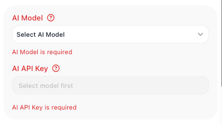
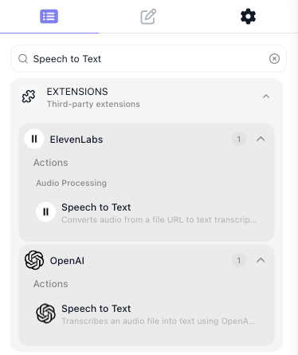

# AI in Flows

<!-- Product exploration log (2026-08-06, Documentation Flows workspace; scenario flows: Order Intake,
Refund Check, Ticket Router, Draft Reply - all kept in the workspace; ZZ AI Scratch deleted).
- API keys: sidebar Connections > API Keys; AI Providers / Custom tabs; per-provider ADD KEY; a saved
  key is a "setup" (dialog: Label + API Key). No setups existed; Mark added Anthropic "Demo Key".
- Model-first ordering verified on all four surfaces: the AI API Key field is disabled with
  placeholder "Select model first" until a model is picked, then offers saved setups.
- Model list grouped by provider: Anthropic, Open AI, Google Gemini AI, Mistral AI, Deep Seek,
  Cohere, Groq, Kimi (each model with a one-line description).
- AI Transform (Transform Data > Operation > Logic): fields Data / Instructions / AI Model / AI API
  Key; picking the operation auto-renames the block "AI Transform Operation". LIVE RUN: extracted
  10473 from the Dana Whitfield email. Success.
- AI QUESTION (Condition): last operation for ALL SEVEN data types (STRING, INT, DOUBLE,
  BOOLEAN/CHECKBOX, DATETIME, JSON OBJECT, JSON ARRAY - each list read in-product). Selecting it
  adds Yes/No Question (expression field); AI Model + AI API Key appear once per block, shared by
  all parts. Tooltips: AI Model "Choose the specific AI model grouped by provider (e.g., GPT-4,
  Claude, Gemini)"; AI API Key "Enter your API key for authentication with the selected AI provider".
  RUNTIME BUG FIXED (2026-08-07): the earlier "requires 6 arguments... received 5" failure is
  gone. Both exits driven live in Refund Check: espresso-refund message -> Yes (Refund Question
  succeeded, Flag For Refund Team ran, Mark As Routine skipped; Block Results Output
  {"conditionResult": true}); K200-fit question -> No (Mark As Routine ran). Shot recaptured
  showing the successful Yes run.
- AI Router: panel AI Model, AI API Key, AI Decision Request (prompt) with helper text
  ('...recommended to start the prompt with the word "Determine..."'), Decision Data rows, Expected
  Decisions (+ adds rows with an x; Everything Else has NO x and silently reverts typed edits -
  non-removable, non-renamable, verified). Each named decision = its own connector; exactly one
  branch ran. LIVE RUN: billing complaint chose Billing; stored result is an OBJECT
  {"decision": "Billing"} under the alias (reference example shows a bare string - follow-up filed).
  Renaming the block auto-renames the alias.
- AI Agent: palette AI group holds exactly AI Agent + AI Router (verified). Panel adds a Files
  section (URL + MIME Type) not yet on the reference - follow-up. Manage Capabilities groups in this
  workspace (no MCP server registered): Extensions 2549, Flows 28, Knowledge 4, Shared Memory 3,
  Utils 4 - no MCP group appears without a registered server. Flow tool 'Call "Order Check" flow'
  attached (Flows 1/32). LIVE RUN: user prompt bound to Initial Data->message resolved; agent
  attempted the flow tool and replied; reply under Result Property: output.
- Extensions: palette search shows Speech to Text from ElevenLabs AND OpenAI; Generate Image
  (OpenAI); Moderate Content (OpenAI) - Moderate/STT are extension actions, not native blocks.
- Extension-action auth VERIFIED (OpenAI Speech to Text dropped + inspected + removed): header
  "OpenAI - Shared Extension" with a Configure button for the provider connection; params are
  plain fields (File URL, Model [string], Language, Prompt, Temperature) - NOT the model/key
  pattern. Hence the key section scopes its claim to blocks/operations and names the
  Configure exception.
- Draft Reply flow extended with consumer: "Send Reply" (HTTP Request, POST
  https://helpdesk.example-shop.com/api/replies) wired after the agent; Body = bound pill
  Draft Reply Result->output. The EE's "Select property" dialog listed the test run's real
  properties - output with the recorded reply text - property picked from it (pixel evidence
  the reply lives under output). Both blocks valid; shot recaptured with all three nodes.
- Manage-Capabilities chip case: button textContent is "Manage Capabilities", displayed uppercase
  via CSS text-transform - title-case chip kept, consistent with the approved AI Agent reference.
- Marketplace link verified live (WebFetch): resolves, heading "AI & LLMs", 150 integrations /
  2169 actions listed (Anthropic Claude, OpenAI, Google Gemini, Mistral, Groq, ...).
- AI QUESTION originally shipped pending a runtime bug per Mark's explicit decision (2026-08-06,
  "Write it as designed + you file the bug"); the fix landed and both exits were verified live
  2026-08-07 - no open caveat remains.
- AI Assistants palette category exists but is going away per Mark - deliberately not mentioned. -->

A flow can already move data, branch on a value, and work through a list. Real work also brings
steps no fixed rule can decide: what is this customer actually asking for, is this message a refund
request, what should the reply say. In FlowRunner™, AI makes those judgment calls as a step of the
flow. An AI step reads what earlier blocks hand it and produces a result the next block uses, like
any other block. You choose how much of the job the model gets: a single value to reshape, a
known task done by a ready-made action, one yes/no question, a routing decision, or the whole job
handed to an agent.

## Every AI step needs a model and your key

The AI blocks and operations on this page run on a model you choose, through your own provider
account. An AI API key is the credential your provider account (OpenAI, Anthropic, Google, and
others) gives you.
Save it once: under **Connections** in the workspace sidebar, open **API Keys** and add the key to
its provider. A saved key is called a setup. See [API Keys](../platform/api-keys.md) for the
walkthrough.

On the AI blocks and operations below the order is fixed: pick the model first. Until a model is
chosen, the key field is disabled and reads "Select model first", as on this not-yet-configured
step; once you pick the model, the field offers your saved setups.

Ready-made extension actions are the exception: each carries its provider connection on the
action itself, set up through its ((Configure)) button.

## Reshape a value by describing the change

Sometimes the judgment call is small: pull one fact out of messy text, tag a message by tone, boil
a long thread down to one line. Inside a
[Transform Data](../reference/transform-data.md){.fr-block} block, the AI Transform operation does
this in place. You hand it a value in ((Data)), describe the change in ((Instructions)) in plain
language, and pick the model and key.

The flow below reads a customer email. An Extract Order Number block
([Transform Data](../reference/transform-data.md){.fr-block}) runs the AI Transform operation
with the instruction "Extract the order number. Return only the number itself.", and a
Look Up Order block ([HTTP Request](../reference/http-request.md){.fr-block}) calls the order API
with the number it produced: its URL is built in the Expression Editor and ends in the
{{Extract Order Number Result}} pill. In the test run the block returned 10473.

Fields and options live in the AI Transform section of the
[Transform Data](../reference/transform-data.md){.fr-block} reference.

!!! note "When the change is exact, code is cheaper"
    If the change can be specified precisely, a
    [Custom Cloud Code](../reference/custom-cloud-code.md){.fr-block} block does it
    deterministically - a few lines of your own code, no model call to pay for, and the same
    result every run.

## Drop in a ready-made AI action

Not every AI job needs a prompt you write. When the job is a known task - transcribe a voicemail,
generate an image, moderate an upload - the Extensions library ships a ready-made action for it,
and you drop it in like any block. Search the block palette for the task; AI actions from
providers such as OpenAI and ElevenLabs appear under **Extensions**.

Searching the palette for Speech to Text, for example, turns up ready-made transcription actions
from two providers.

The [AI & LLMs category of the Marketplace](https://flowrunner.ai/integrations/category/ai-llms)
lists the full catalog, and [Custom & Marketplace Actions](integrations/custom-actions.md) covers
the other ways to add a capability no built-in block provides.

## Ask a yes/no question no rule can answer

Some yes/no tests are judgment calls: is this message asking for a refund? For those, the
((Operation)) list of every data type in a [Condition](../reference/condition.md){.fr-block} ends
with AI QUESTION. You write the question in plain language in ((Yes/No Question)) and pick a
model and key. The answer drives the same Yes and No exits as any comparison;
[Yes/No Branching](flow-control/branching.md) covers building on them.

In the flow below, a Refund Question block
([Condition](../reference/condition.md){.fr-block}) checks the customer message the run
received as Initial Data. The question is "Is the customer asking for a refund?" - Yes leads to a
Flag For Refund Team block, No to a Mark As Routine block.

![The Refund Check flow after a test run on a refund request: the Refund Question block (Condition) and the Flag For Refund Team block on its Yes exit carry success checkmarks, while Mark As Routine on the No exit is marked skipped. The configuration panel shows Value to Check bound to the Initial Data message, Value Data Type STRING, Operation AI QUESTION, the question "Is the customer asking for a refund?", Claude Haiku 4.5, and the Demo Key setup. The Test Monitor's Block Results tab shows the block's Success output, conditionResult true.](../images/build/ai-question-refund-check.png)

The [Condition](../reference/condition.md){.fr-block} reference covers the operation's fields.

## Send the run down the branch an AI picks

When a message can go more than two ways, the
[AI Router](../reference/ai-router.md){.fr-block} block branches on meaning. It lives in the
palette's **AI** group, together with the [AI Agent](../reference/ai-agent.md){.fr-block}. You
name a branch for each outcome in
((Expected Decisions)), say what to judge in ((AI Decision Request)), and pass the material to
judge as named ((Decision Data)) inputs. Each named branch is its own connector on the block, and
the model picks exactly one per run. A branch named Everything Else is always present and cannot
be removed - wire it, so a run that fits no named branch has somewhere to go.

The Ticket Router flow below routes a support message by topic. The Route By Topic block
([AI Router](../reference/ai-router.md){.fr-block}) names Billing, Shipping, and Technical
branches; in the test run the model judged
"I was charged twice for order 10473, please fix my invoice." and chose Billing.

The router also stores the decision it made: a later block reads {{Route By Topic Result->decision}}
in the Expression Editor to act on or record the chosen label.

[Routing on a Value](flow-control/routing.md) shows when a fixed-value router does the job
instead; the [AI Router](../reference/ai-router.md){.fr-block} reference covers the fields.

## Hand the whole job to an agent

The steps above make one model call and hand back one answer. When the step has to decide what
to do on its own - fetch knowledge, take an action, carry a conversation - reach for the
[AI Agent](../reference/ai-agent.md){.fr-block} block.

<!-- doclint: allow-unlinked: Knowledge Bases -->
<!-- (concept mention with glossary tooltip + concept-guide route below, not the KB action blocks) -->
You give the agent its instructions in ((System Prompt)) and ((User Prompt)), and you grant it
capabilities with ((Manage Capabilities)):

- built-in extension actions
- your own flows
- Knowledge Bases
- the flow's Shared Memory
- a small set of utilities

With an MCP server registered in the workspace, its tools join the list. The agent decides which
of its capabilities to use, and when.

When the agent should remember earlier runs, FlowRunner keeps the conversation record for you:
turn on the ((Messages History)) toggle on the block. See
[Agent Memory](../reference/flow-memory-concept.md).

The Draft Reply flow below gives an agent the customer message from Initial Data and one flow
tool: it can run the workspace's Order Check flow when it needs the order's status before
answering. A Send Reply block ([HTTP Request](../reference/http-request.md){.fr-block}) posts the
finished reply to the helpdesk.

The reply arrives under the result's `output` property: the Send Reply block reads
{{Draft Reply Result->output}} in its ((Body)), picked in the Expression Editor from the
properties the test run recorded.

## Related

- [Quick Start: An AI Agent](../learn/quickstart-agent.md) - build and test your first agent step
  by step
- [AI Agent](../reference/ai-agent.md){.fr-block} - every field, the capability groups, and
  reading the reply
- [Agent Memory](../reference/flow-memory-concept.md) - what an agent remembers between runs
- [Flows as Agent Tools](../reference/flows-as-agent-tools-concept.md) - your flows as the agent's
  tools, including waiting on a human
- [Knowledge Bases](../reference/knowledge-bases-concept.md) - answers drawn from your own
  documents
- [MCP Servers](../platform/mcp-servers.md) - an outside service's tools, for flows and agents
