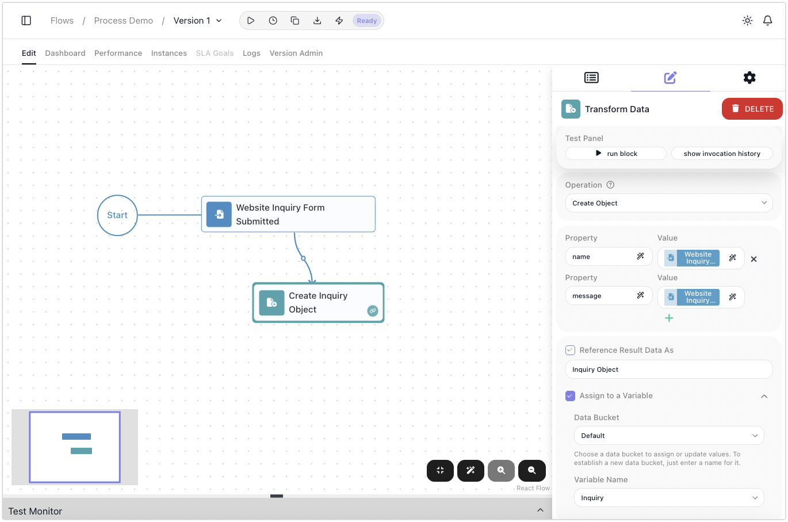

# Holding Values in Variables

A block's result is already readable by every step after it, so often you do not need to store anything -
you point at it. A **variable** earns its place when that is not enough: when a value has to be
built up over several steps, survive a loop, or be read under one name whichever path the run took. This
page is about when to reach for one and the shapes that keep coming up. For what a variable is, and how to
write, read, and clear one, see [Variables & Data Buckets](../../learn/concepts/variables.md).

## When you need a variable
<!-- doclint: no-shot: a decision list, not a screen; the loop blocks are named only as where the need arises and each is pictured on its own page -->

Reach for one when any of these is true:

- **The value changes as the run goes.** A running total, a count, a list you keep adding to. A block
  result is written once; a variable is meant to be updated.
- **The value has to escape a loop.** A result produced inside a
  [List Iterator](../../reference/list-iterator.md){.fr-block} or
  [Repeat](../../reference/repeat.md){.fr-block} belongs to that pass and is gone after it. A variable
  declared outside the loop is the one thing that carries across passes and survives the loop. See
  [Passing Data Between Blocks](passing-data.md).
- **Different branches have to hand the same thing forward.** When a run can take one of several paths and
  the step after the merge needs one value, have each branch set the same variable. The later step reads
  one name instead of guessing which branch ran.
- **The value is assembled in pieces.** A message built across several steps, or a payload put together
  before a call.

If none of those apply, skip the variable and read the block's result directly. It is one less thing to
keep in your head.

## Building a value up as the run goes

<!-- doclint: no-shot: the two accumulation idioms are shown step by step, with shots, on Working Through a List and the List Iterator reference -->

Accumulating always has the same shape: set the variable **before** the loop, update it on each pass, and
read it after. What differs is the block that does the updating, and picking the wrong one is the usual
mistake.

**A running total or count.** Seed the variable before the loop - `Cart Total` set to `0` - and inside,
a [Set Variables](../../reference/set-variables.md){.fr-block} block sets it to itself plus this pass's
amount. One catch worth knowing before it bites: the `+` has to be the Expression Editor's plus operator
picked from its Operators list. A typed `+` joins the two values as text instead of adding them.

**A growing list.** This one is not a Set Variables job. Seed the variable before the loop with the
built-in ((Empty List)) value:

Then inside the loop, a [Transform Data](../../reference/transform-data.md){.fr-block} block running the
((Add To List)) operation appends the entry and writes the result straight back to that same variable:

Both patterns are walked through end to end in
[Working Through a List](../flow-control/collections.md).

## The other shapes you will use

- **Set a flag, check it later.** When something early in the run decides how a much later step behaves,
  store the decision rather than working it out twice. A `Needs Review` flag set during validation can be
  tested near the end, long after the data that produced it has been left behind.
- **Give one name to a value from many paths.** Each branch writes `Ticket - Owner` with its own answer,
  and the step after the merge reads `Ticket - Owner` without caring which branch set it.
- **Lift a result out with Assign to a Variable.** Most blocks can write their result into a variable at
  the same time as publishing it, from the ((Assign to a Variable)) setting in the block's own
  configuration panel. It is the tidiest way to get a value out of a loop or a subflow, with no separate
  Set Variables step.

## Remember it lasts only for the run

Variables are wiped when the run ends, which is what keeps runs independent. It is also the limit: a
variable cannot carry anything to the next run. When a value has to survive, see
[Sharing Data Across Runs & Flows](across-runs.md).

## Related

- [Variables & Data Buckets](../../learn/concepts/variables.md) - what a variable is, naming, Data Buckets,
  and writing, reading, updating, and clearing one
- [Working Through a List](../flow-control/collections.md) - the accumulation patterns in full, with shots
- [Set Variables](../../reference/set-variables.md){.fr-block} - the block's full configuration
- [Sharing Data Across Runs & Flows](across-runs.md) - state that has to outlive the run
