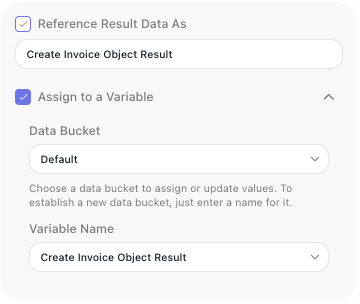

# Passing Data Between Blocks

This is the most common thing you do when building a flow: a step ran, it produced something, and a step
further down needs it. A lookup returned a customer and the email step needs their address; a calculation
produced a total and a condition has to test it.

The mechanics are quick to learn and are covered in [Expression Editor](../../learn/concepts/expressions.md):
open the editor on the field that needs a value, find the earlier block's result, drill to the field you
want, and apply it. This page is about the parts that trip people up once they start building - what is
actually readable from where, and how to keep a flow legible as it grows.

## Decide what a block leaves behind

Every action block has two settings that decide whether its result is available afterwards, and what it is
called. Both are switches you control.

**((Reference Result Data As))** publishes the result under an **alias** - the name you look for when a
later step needs it. It is on by default, and the alias defaults to the block's name with "Result" on the
end, so a step named `Get Order` publishes `Get Order Result` and a later field reads
{{Get Order Result->orderId}}.

That default is the reason naming blocks pays off immediately. A field read as
{{Look Up Customer Result->email}} explains itself; one read as {{Untitled Block 3 Result->email}} does
not. Change the alias in that field whenever a clearer name helps.

**((Assign to a Variable))** stores the result in a Data Bucket variable as well. It is off by default.
Reach for it when the value has to outlive the block - to survive a loop, or to be read under a name of
your own choosing. See [Holding Values in Variables](holding-values.md).

### Turn the alias off when nothing needs it

Because the alias is a switch, you can clear it. Do that for blocks whose result no later step reads - a
notification that was sent, a record that was written and never referred to again.

The gain is not performance, it is legibility. Every published alias joins the list of values later steps
can pick from, so that list grows as the flow does. Switching off the ones nothing reads keeps it to
values worth picking.

## What a later step can and cannot read
<!-- doclint: no-shot: scoping rules, not a screen; the loop blocks are named only as where the rule bites, and each is pictured on its own page -->

Most of the time everything upstream is available: a block can read the result of any
block that ran before it, not only the one wired directly into it. The wires decide what runs next, not
who may read what.

Three cases break that expectation, and they are worth knowing before they surprise you:

- **Inside a loop, a result belongs to the current pass.** A block's result inside a
  [List Iterator](../../reference/list-iterator.md){.fr-block} or
  [Repeat](../../reference/repeat.md){.fr-block} is scoped to that pass - each pass overwrites it, a later
  pass cannot read an earlier pass's result, and nothing produced inside the loop is readable after it
  ends. To carry a value between passes or out of the loop, put it in a variable declared outside the
  loop. See [Holding Values in Variables](holding-values.md).
- **A branch that did not run produced nothing.** If a step reads a result from a path the run never took,
  there is nothing to resolve. Read values that every path produces, or set one variable on each branch so
  the step after the merge has a single name to read.
- **A result's fields may not be listed yet.** Blocks that only learn their result's shape by running -
  an [HTTP Request](../../reference/http-request.md){.fr-block}, an
  [AI Agent](../../reference/ai-agent.md){.fr-block} - show nothing to pick until they have run once. Run
  the block in [Test Mode](../../run/testing.md) and the fields appear.

## Related

- [Expression Editor](../../learn/concepts/expressions.md) - the dialog itself: picking references, drilling
  into fields, combining values, and the Live Preview
- [Blocks](../../learn/concepts/blocks.md) - what a result is and how a block publishes one
- [Holding Values in Variables](holding-values.md) - when a value needs a name of its own that outlives the
  block
- [Reshaping Data](reshaping-data.md) - when the value you need has to be derived rather than read
