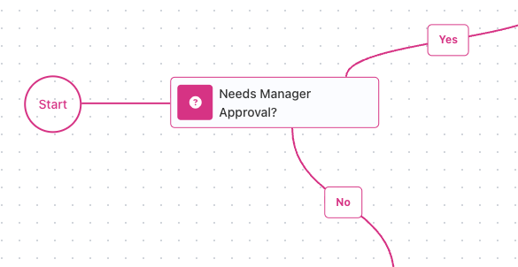
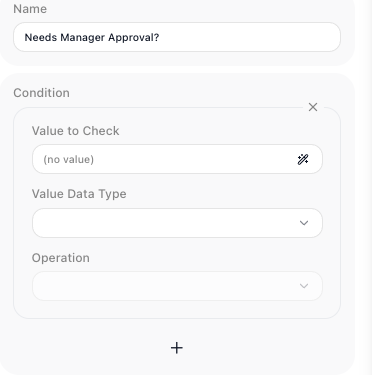
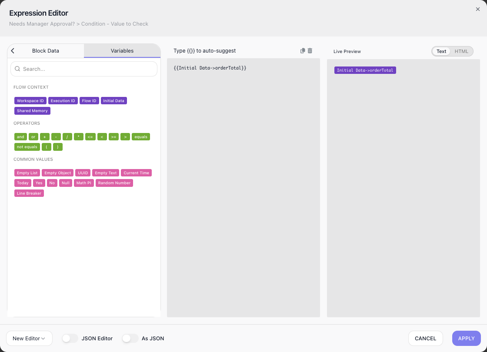
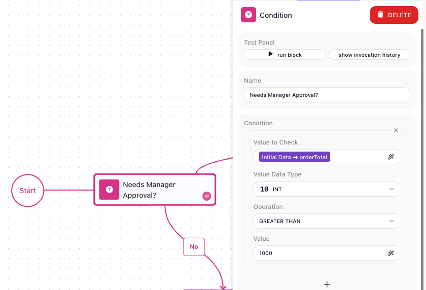
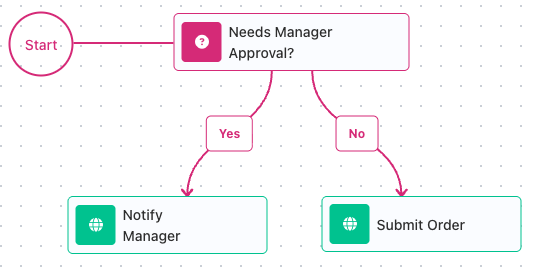
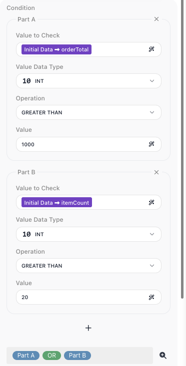
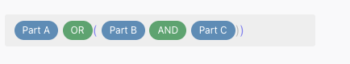
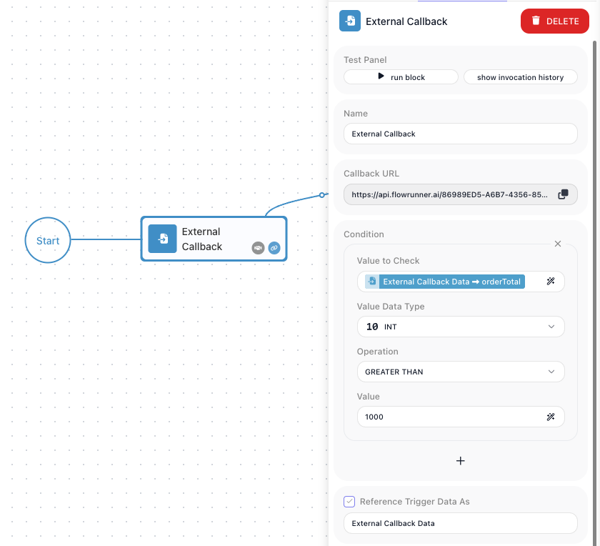

# Yes/No Branching

<!-- product-exploration log (2026-07-10, Documentation Flows workspace, flows "Order Approval" 289E710C + "Order Intake" 7DE04FDB + scratch A4F020C4)
- Condition verified in palette UTILS. Placed on the empty canvas's drop zone -> auto-connects to Start. Unconfigured block shows an error badge until the part is complete.
- Config panel driven: Value to Check (expression field) / Value Data Type (dropdown) / Operation (dropdown) / Value (appears for comparison ops). Reference Result Data As is an opt-in checkbox (alias tracks the block name).
- Value Data Type list enumerated: STRING, INT, DOUBLE, BOOLEAN / CHECKBOX, DATETIME, JSON OBJECT, JSON ARRAY. Legacy IMAGE type is GONE.
- INT operations enumerated: EQUALS, DOES NOT EQUAL, GREATER THAN, LESS THAN, GREATER OR EQUAL, LESS OR EQUAL, AI QUESTION. BOOLEAN ops: IS NULL, IS NOT NULL, IS TRUE, IS NOT TRUE, IS FALSE, IS NOT FALSE, AI QUESTION. AI QUESTION exists per type (fields: Yes/No Question, AI Model, AI API Key) - it moved from legacy's IMAGE-only home.
- Expression editor driven: pills insert on a double mouse press; Initial Data inserts with the property arrow ready; property typed inside the token. Live Preview renders the reference as a pill (not a run value), before and after runs.
- Type-mismatch hint verified (hover tooltip): "The selected data type does not match the detected type. Detected type: INT" - fires when the selected type disagrees with the type detected in observed run data.
- Yes/No exits: separate source handles (Yes right, No left); edges get Yes/No label chips. Unwired exit VALIDATES (flow Ready); run-proven: condition false with No unwired -> instance COMPLETED 197ms, no error, run ends at the exit (scratch flow).
- RUNS (real instances via the flow's activate URL, typed JSON):
  - single check (orderTotal INT GREATER THAN 1000): {1480} -> Yes path, Notify Manager executed; {240} -> No path, Process Order executed. Condition emits {"conditionResult": true|false}; inspector shows resolved per-part inputs.
  - two parts A OR B (B = firstOrder IS TRUE): {1480,f} -> Yes via A; {240,t} -> Yes via B; {240,f} -> No.
  - three parts A OR (B AND C) (C = express IS TRUE): {1480,f,f} -> Yes; {240,t,t} -> Yes; {240,f,t} -> No.
  - WRONG grouping (A OR B) AND C run-proven: {1480,f,f} -> No path (the $1,480 order skipped the manager).
- Multi-part UI driven: "+" adds parts; Part A/B/C headings appear at 2+ parts; the AND/OR between parts toggles when pressed; magnifier opens the expanded editor; parenthesis marks before/after parts place brackets when pressed; pressing a placed bracket removes it; unmatched bracket shows "Condition is not valid".
- Trigger filter driven (External Callback, "Order Intake"): "Add a Condition" button adds the identical card; filter built on External Callback Data->orderTotal INT GREATER THAN 1000; LIVE behavior: POST 240-order to the Callback URL -> {"executionId":null} (did not fire); 1480-order -> real executionId.
- LIVE version cannot be edited (toast verified); edits require stopping the version first.

MARK REVIEW ROUND 2026-07-10 (corrections applied):
- (Mark 1) A freshly dropped block shows NO exits until selected/connected -> prose warns the reader.
- (Mark 2) Config panel (Value to Check field + expression icon) now SHOWN at first reference (branching-fields.png), before the editor shot.
- (Mark 3) No-path block changed Set Variables -> HTTP Request "Submit Order" (Set Variables cannot "process an order").
- (Mark 4) "connector" collides with a glossary/snippet term -> reworded to "the AND/OR between the parts".
- (Mark 5) The BOOLEAN type-mismatch warning was a CONTAMINATED-FLOW artifact, NOT a product bug. Mark's clean flow shows none. My earlier "bug" claim was wrong (retracted). To keep the exemplar shot clean and warning-free, the multi-part example now uses all-INT fields: Part B = itemCount INT GREATER THAN 20 (no warning), Part C = discountPercent INT GREATER THAN 15. Rebuilt on fresh flow "Order Approval Clean" (ADDC6191); both parts warning-free (verified).
- (Mark 6) The "adding a part resets connectors to AND" is a BUG Mark is fixing -> removed from the page and this log; prose assumes connectors persist.
- Recaptured this round on the clean flow: branching-fields, branching-paths (Notify Manager + Submit Order, both HTTP), branching-parts-or (orderTotal + itemCount, no warnings). Brackets shot reused (generic Part labels, field-agnostic).
- Default grouping (AND before OR) remains run-proven from the earlier session; it is field-independent.
-->

Most flows reach a point where one case needs different handling from another. In an
order flow, an order over $1,000 needs a manager's approval; the rest can process
automatically. The [Condition](../../reference/condition.md){.fr-block} block is the
flow's decision point: it asks a question about your data, and the run continues down
its Yes path or its No path.

## Add the flow's decision point

The order flow needs a place where the over-$1,000 rule gets asked. That place is a
[Condition](../../reference/condition.md){.fr-block} block: drag it from the palette's
**Utils** group onto the canvas. A block you just dropped shows no exits yet; hover over
it and its two exits appear, one labeled Yes and one labeled No, ready for you to
connect. Each exit starts a path of its own.

## Pick the value to check

The question is about the order's total, so the check needs to point at that value.
Select the block to open its settings: the ((Value to Check)) field is where the
question begins, with an expression icon at its right edge.

Click that icon to open the [Expression Editor](../../learn/concepts/expressions.md).
The order arrives as the run's Initial Data, so open the ((Variables)) tab of the
editor's palette and double-click Initial Data: the reference lands in the expression
with an arrow ready for a field name. Type `orderTotal` after the arrow and apply.

## Set the data type and operation

The total is a number, and the check must compare it as one. A check has three
settings, and one more that appears when the operation needs it:

- ((Value to Check)) - the value the question is about.
- ((Value Data Type)) - the value's type. The type decides which operations the check
  offers: `STRING` offers `CONTAINS`, `INT` offers `GREATER THAN`, and so on.
- ((Operation)) - the comparison to run.
- ((Value)) - the value to compare against, for operations that take one.

For the order rule: `INT`, `GREATER THAN`, and `1000` in ((Value)). A total with cents
would use `DOUBLE` instead. FlowRunner also compares the type you selected against the
type it detects in the data from your runs, and shows a small warning next to
((Value Data Type)) when the two disagree. Most data types also offer an `AI QUESTION`
operation, which lets an AI model decide the branch. The
[Condition](../../reference/condition.md){.fr-block} reference lists every type's
operations.

## Wire the Yes and No paths

Order A-1042, at $1,480, needs the manager. Order A-1044, at $240, should go straight
through. Connect each exit to the step that handles its case. Here both are
[HTTP Request](../../reference/http-request.md){.fr-block} blocks: Yes leads to
`Notify Manager`, which posts to the approvals service, and No leads to `Submit Order`,
which hands the order to the fulfillment system. A run takes exactly one of the two
paths. You can also leave an exit unconnected - a run that reaches it ends there.

## Combine checks into one question

The manager also wants to see every large order, whatever its total. Click the ((+))
under the check to add a second part: the order's `itemCount` field, `INT`,
`GREATER THAN`, `20`. With two or more parts, the panel labels them `Part A` and
`Part B`, and a strip at the bottom shows the combined question. Parts join with `AND`;
click the `AND` between them to switch it to `OR`. The question now reads `Part A` `OR`
`Part B`, and order A-1043 - a $240 order of 25 items - reaches the manager too. A
question with more than two answers is a different job: route on a value with
[Value Router](../../reference/value-router.md){.fr-block} instead, covered in
[Routing on a Value](routing.md).

## Set evaluation order with parentheses

The manager narrows the rule: large orders only when they are also discounted. Add a
third part for the order's `discountPercent` field, `INT`, `GREATER THAN`, `15`, and
set the strip to `Part A` `OR` `Part B` `AND` `Part C`.

That strip needs grouping. Left ungrouped, FlowRunner evaluates every `AND` before any
`OR`, so `Part A` `OR` `Part B` `AND` `Part C` runs as
`Part A` `OR` (`Part B` `AND` `Part C`), and order A-1042 reaches the manager on its
total alone. Group it the other way,
(`Part A` `OR` `Part B`) `AND` `Part C`, and the same $1,480 order skips the manager:
no discount turns the whole question false. Parentheses set which reading runs. To
place them, click the magnifier next to the strip to open the parts in a larger editor,
then click the parenthesis marks around the parts you want grouped. Clicking a placed
bracket removes it, and the editor flags the question until every bracket is matched.

## Make a trigger fire only when a check passes

The same rule can also filter a trigger. A trigger with a condition fires only when
the check passes; otherwise it stays silent and no run starts. In a flow that receives
orders through an [External Callback](../../reference/external-callback.md){.fr-block}
trigger, click ((Add a Condition)) on the trigger and build the same card - with one
difference. A trigger's payload is its own data, not Initial Data, so the check points
at the trigger's reference, which lives on the ((Block Data)) tab of the editor:
`External Callback Data`, the `orderTotal` field, `INT`, `GREATER THAN`, `1000`. An
order under $1,000 now never starts a run.

