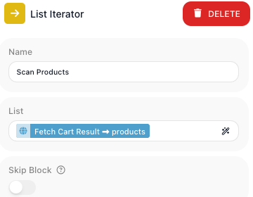
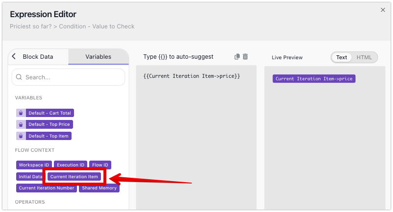
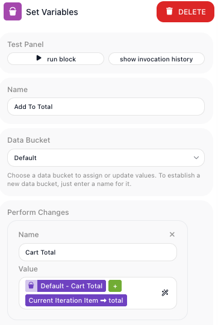
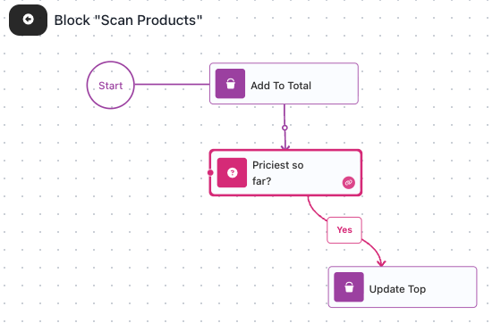
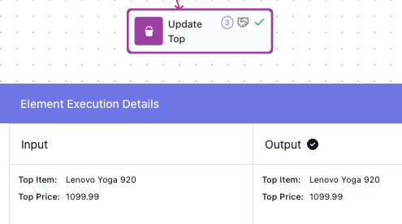
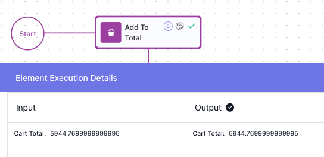

# Working Through a List

<!-- product-exploration log (2026-07-13, Documentation Flows workspace, flow "Cart Summary" 819B4600, built clean this session; run-proven via the activate URL, instance E2935CA8)
- List Iterator lives in palette UTILS. Config is only Name + List (required) + Skip Block + Notes. Dropped into an empty loop auto-wires to the loop's Start and is marked its first block.
- DATA SOURCE: an HTTP Request "Fetch Cart" GETs https://dummyjson.com/carts/28 -> Success. Its result alias is "Fetch Cart Result"; the products array is reached as {{Fetch Cart Result->products}} (the output IS the cart object at the root - products is a top-level key, NOT wrapped under body/data). Verified via the Block Data tree.
- LIST bound: Scan Products, List field = {{Fetch Cart Result->products}} (renders as the chip "Fetch Cart Result -> products").
- CURRENT ITERATION ITEM: inside a List Iterator, Expression Editor > Variables tab > FLOW CONTEXT offers BOTH "Current Iteration Item" AND "Current Iteration Number" (plus the flow's variables). Current Iteration Item is the WHOLE element; its fields bind (->price, ->title, ->total all resolved). -> reference follow-up: list-iterator.yaml should note Current Iteration Number is offered too, and repeating.md's removed "(and List Iterator)" claim is actually TRUE.
- STEP-IN: hovering a loop reveals Expand; banner "Block 'Scan Products'"; RETURN top-left exits; a just-expanded loop opens EMPTY.
- ACCUMULATE (the running total): Set Variables "Add To Total": Cart Total = {{Cart Total}}{{+}}{{Current Iteration Item->total}}. CRITICAL GOTCHA: a LITERAL "+" between two references is STRING CONCATENATION (Cart Total became "0 + 149.95 + 29.98 + ..."); the editor's PLUS OPERATOR token {{+}} (renders as a GREEN chip) does numeric ADDITION. Fixed by replacing the literal + with the {{+}} operator.
- MOST EXPENSIVE: Condition "Priciest so far?" = Current Iteration Item->price (DOUBLE) GREATER THAN Top Price; Yes -> Set Variables "Update Top" (Top Price = Current Iteration Item->price, Top Item = Current Iteration Item->title); No -> pass ends. The Condition's numeric comparison is correct (Update Top fired exactly on the 3 rising maxima).
- SEED (before the loop): Set Variables "Seed Summary" -> Cart Total 0, Top Price 0, Top Item empty.
- RUN-PROVEN (instance E2935CA8, COMPLETED): 6 products; Add To Total 6x, Priciest so far? 6x, Update Top 3x (29.99 -> 39.99 -> 1099.99). Final: Cart Total RAW = 5944.7699999999995 (floating-point tail from summing decimals; page shows this true value + rounding note); Top Item = "Lenovo Yoga 920", Top Price = 1099.99.
- ITERATION-SCOPING driven on THIS flow: a Set Variables AFTER the loop offered the PRE-loop "Fetch Cart Result" but NOT the inner Condition's "Priciest so far? Result" (inner results do not survive), while all three Data Bucket variables DID survive; Flow Context offered no Current Iteration Item/Number outside the loop. Scratch block deleted; saved flow matches the run-proof.
- BREAK inside a List Iterator ends the walk (V-real in break.yaml) - covered CONCEPTUALLY here (Mark: when/why only, no example, no in-flow Break shot).
- CHIP CONVENTION (Mark, 2026-07-13): Expression-Editor pills are CHIPPED [Current Iteration Item, List], not backticked. Data Bucket variables stay bold pending Mark's word.
- REWRITES 1-3 (Mark reviews, 2026-07-13): (1) redone concept-first (List Iterator handles ANY array from anywhere; cart is illustration). (2) named the block for step-in, fixed the Expand+Return round-trip, SHOWED Current Iteration Item (new shot), re-shot accumulate with context, informative titles. (3) RESTRUCTURED around the general mechanic Mark named - a loop RUNS THE SAME STEPS ON EVERY ELEMENT, and what those steps do is open (most walks just handle each element on its own, nothing to build up). §2 "Run the same steps on every element" is now the heart; totalling/finding are DEMOTED to §3 "Carry a result out of the loop" as two examples of one concept (per-pass results vanish; use a variable), not the spine.
- 6 shots: collections-list (List = the fetched products array), listiterator-expand (Scan Products hovered, Expand tooltip+icon - added at §2 step-in), collections-item (Current Iteration Item under Flow Context, reaching a product's price), collections-accumulate (Add To Total config panel - Cart Total = Cart Total {{+}} Current Iteration Item->total), collections-body (the loop body), collections-payoff (final Top Item Lenovo Yoga 920). Pixels read against the prose.
- CART JSON (§1): the raw GET https://dummyjson.com/carts/28 response was re-fetched to author the §1 code block. Object root has id/products/total(5944.77)/discountedTotal/userId/totalProducts(6)/totalQuantity(23); each product also carries discountPercentage/discountedTotal/thumbnail (TRIMMED in the block, signalled in prose). ACCURACY: the API itself returns the Black & Brown Slipper's total as 99.94999999999999 (a float tail in the raw data) - shown EXACT, not rounded, per the no-false-stored-value rule; it also foreshadows the §3 Cart Total float note.
- REWRITE 4 (Mark's 5-point round, 2026-07-14): (1) added the cart JSON block before the §1 image; (2) cut the "most walks handle each element on its own" filler; (3) "To work on an element... handed to them fresh" -> "To access the current element... you pick it" (de-folksy); (4) §3 opener rewritten to teach iteration-reset scoping accurately (each pass = clean slate; a step's value does not survive to the next pass; only a Data Bucket variable carries across passes and out); (5) "A running total is the plainest version" generalized to the seed->update->read pattern (total/list/count/find are instances). Open Q surfaced to Mark: is calling a List Iterator a "loop" acceptable (page uses it throughout)?
-->

Flows are full of collections. A database query comes back as rows, an uploaded file parses into
records, an AI step or an [HTTP Request](../../reference/http-request.md){.fr-block} returns a list,
and sometimes you assemble one yourself earlier in the run. Whenever you are holding an array like
that and need to run the same steps on every entry in it, a
[List Iterator](../../reference/list-iterator.md){.fr-block} is the block for the job: you point it
at the array, build the steps to run on a single entry, and it runs them for every entry in turn.

## Point the loop at an array

A [List Iterator](../../reference/list-iterator.md){.fr-block} takes one input, its ((List)): an
expression that resolves to an array. Where the array comes from does not matter to the loop - a
previous block's result, a field of the run's Initial Data, or a value you built along the way all
work the same. If the array turns out empty, the inner steps do not run at all.

To keep the rest of this page concrete, one flow runs alongside it. That flow has fetched a shopping
cart from a store's API with an [HTTP Request](../../reference/http-request.md){.fr-block}. The cart
comes back as an object with its line items in a `products` array (a few per-item fields are trimmed
here for readability):

```json
{
  "id": 28,
  "products": [
    { "id": 182, "title": "Green Crystal Earring", "price": 29.99, "quantity": 5, "total": 149.95 },
    { "id": 64, "title": "Knife", "price": 14.99, "quantity": 2, "total": 29.98 },
    { "id": 46, "title": "Plant Pot", "price": 14.99, "quantity": 3, "total": 44.97 },
    { "id": 185, "title": "Black & Brown Slipper", "price": 19.99, "quantity": 5, "total": 99.94999999999999 },
    { "id": 175, "title": "White Faux Leather Backpack", "price": 39.99, "quantity": 3, "total": 119.97 },
    { "id": 81, "title": "Lenovo Yoga 920", "price": 1099.99, "quantity": 5, "total": 5499.95 }
  ],
  "total": 5944.77,
  "totalProducts": 6,
  "totalQuantity": 23
}
```

The List Iterator's ((List)) points at that `products` array.



## Run the same steps on every element

Step into the [List Iterator](../../reference/list-iterator.md){.fr-block} block to build what runs
on each element: hover it and choose ((Expand)). 


The loop opens empty; you build its body the way you
build the rest of the flow, and ((Return)) at the top-left takes you back out when you are done.

Whatever you build there runs once for every element of the list. You might hand each element to
another service, check it against a rule, reshape it, or read the one part of it you need.

To access the current element, your steps use ((Current Iteration Item)). You pick it in the
[Expression Editor](../../learn/concepts/expressions.md), in the ((Variables)) tab under
**Flow Context**, alongside the flow's own variables. It holds the whole entry, whatever its shape - a
number, a piece of text, or an object - so when the entry is an object you reach into it for the parts
you need: here each entry is a product, and ((Current Iteration Item)) gives you its `price`, `title`,
`total`, and the rest.



## Carry a result out of the loop

Sometimes one pass is not the end of it: you want a single answer once the whole list has been walked.
Each pass runs with a clean slate - a value a step produces on one pass is not there on the next, and
it is gone for good when the loop ends. The one thing that carries across passes, and survives the loop,
is a Data Bucket variable. So whenever you need a result out of the walk, the shape is the same: set a
variable before the loop, update it on each pass, and read it after. What you build up in that variable
is whatever the job calls for - a running total, a growing list, a count, or a single entry you have
picked out.

Take a running total. Before the loop, a
[Set Variables](../../reference/set-variables.md){.fr-block} sets **Cart Total** to `0`; inside, a
[Set Variables](../../reference/set-variables.md){.fr-block} adds each entry's amount to it -
**Cart Total** plus ((Current Iteration Item))'s `total`, written back every pass. (One catch: the `+`
has to be the editor's green plus operator, picked from its Operators list, not a typed `+`, which
joins the two values as text instead of adding them.)



Picking one entry out follows the same shape. To find the most expensive product, hold the best price
so far in a variable and test each entry against it: a [Condition](../../reference/condition.md){.fr-block} checks
whether ((Current Iteration Item))'s `price` is `GREATER THAN` **Top Price**, and on its **Yes** path a
[Set Variables](../../reference/set-variables.md){.fr-block} records the new best, setting **Top Price**
and **Top Item** to this entry's price and title. Each pass keeps the highest, so by the end
**Top Item** names the priciest product.



Run the flow over the cart's products and both variables come out filled: **Top Item** holds
`Lenovo Yoga 920` at `1099.99`.



**Cart Total** holds the summed line totals - `5944.7699999999995`
(adding amounts that carry decimals leaves a small floating-point tail, which you would round to
`5944.77` before showing it to anyone).



## Stop before you reach the end

<!-- doclint: no-shot: conceptual "when to reach for Break" - no UI walkthrough, covered on the Break reference -->

You do not always need to walk the whole collection. When a pass finds what you came for, or hits a
case that makes the rest pointless, a [Break](../../reference/break.md){.fr-block} inside the loop ends
it at once and the flow carries on after the loop, leaving the remaining entries untouched. Reach for
it to:

- stop at the first entry that matches what you are searching for;
- give up when an entry disqualifies the rest;
- stop once you have collected enough.

You usually put a Break on a [Condition](../../reference/condition.md){.fr-block}'s exit path, so it
fires only when your test passes. It behaves the same in a List Iterator as in a
[Repeat](../../reference/repeat.md){.fr-block} - the [Break](../../reference/break.md){.fr-block}
reference has the details.

A List Iterator is the tool when you already hold the collection and want to touch every entry. When
there is no collection to walk and the loop should run until a condition turns false, reach for a
[Repeat](../../reference/repeat.md){.fr-block} instead, covered in
[Repeating Steps](repeating.md).
