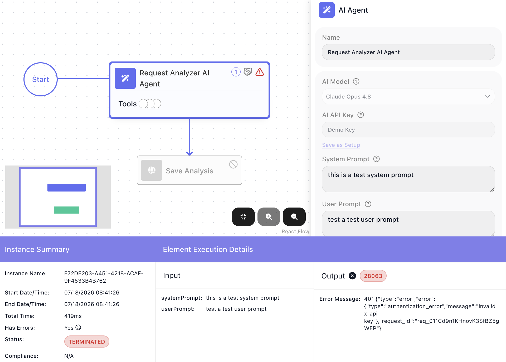
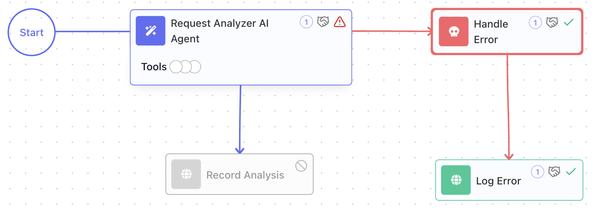
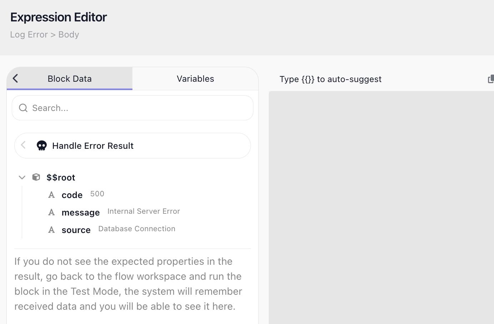
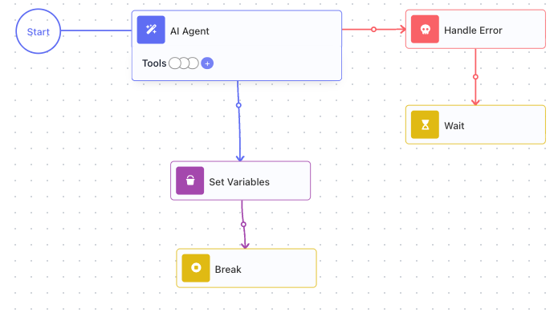

# Handling Errors

<!-- product-exploration log (2026-07-17, Documentation Flows workspace)
SOURCES: reference/error-handling-concept.md + handle-error.yaml + snippets/errorhandling.md + in-product runs.
DEFAULT: a flow stops the moment a block fails; nothing after it runs. VERIFIED (§1): "Unhandled Failure
Demo" (AI Agent, no handler, flow 1D2156E7) -> instance 32CBA2DD TERMINATED, Has Errors: Yes.
CATCH: a Handle Error is wired via the guarded block's metaInfo.onFailElemId -> the handler id; the block
keeps its own nextElementIds as the success path. VERIFIED (§2): "Error Catch Demo" (flow 567E06CD, AI
Agent -onFail-> Handle Error -> Set Variables) -> instance 84DABAE0 COMPLETED (562ms). The failure diverted
down the recovery path; the run did NOT terminate. Recovery path = the handler's own successors (does not
rejoin the original success path).
ERROR OBJECT: message + source ALWAYS; code SOMETIMES. VERIFIED (§3): the caught AI Agent error =
{ code: 28063, source: "AI Agent", message: "401 ... authentication_error ..." }. code is a FlowRunner
numeric code (28063), NOT an HTTP status; a cloud-code throw carries none (owner-verified 2026-06-23).
Read a field by PICKING Handle Error Result (not typed) -> {{Handle Error Result->message}}.
Note: with Claude the message is a raw provider JSON blob; with OpenAI it reads "401 Incorrect API key
provided: DEMO KEY..." (could switch the demo agent to OpenAI for a cleaner message shot).
RETRY (§4): there IS a built-in per-block RETRY POLICY (new; on dev.flowrunner.ai, walked through by Mark
2026-07-17 on an HTTP Request block). VERIFIED on dev: Retry Policy toggle -> "Retry on status codes"
(accepts specific codes e.g. 429 + ranges 4XX/5XX), "Retry on network errors" (connection refused, DNS,
TLS, timeouts), "Max attempts" (includes the initial; 3 = 1 original + 2 retries), "Backoff strategy" =
Fixed (same delay) OR "Exponential with jitter" (delay grows by a Multiplier, jitter picks a random wait
in the upper half; fields: Initial delay + Multiplier). Warning shown: retrying non-idempotent requests
(POST) may cause duplicate side effects. Shot: errorhandling-retrypolicy (HTTP Request Retry Policy).
MANUAL RETRY (the advanced alternative, still valid): "Retry Logic" (flow BC1713EE): Set Variables (result
var OUTSIDE the loop) -> Repeat (Max Iteration Count 5) { AI Agent -onFail-> Handle Error -> Wait; success
-> Set Variables -> Break } -> cloud-code reads the var. Break ends the REPEAT on success. Shot:
errorhandling-retry. RESOLVED 2026-08-14: the built-in Retry Policy shipped to prod in release 1.0.13
(2026-08-10, FR-2958); prod UI re-verified in Documentation Flows ("Retry Demo" flow) - fields match the
dev walkthrough (incl. Multiplier, default 2), a 503 run retried 3 attempts with 2s fixed waits, and the
run-history Element Execution Details gained a "Retry attempts" tab with per-attempt cards.
PALETTE: Handle Error is in UTILS. SHOTS: errorhandling-terminated (§1), -catch (§2), -read (§3), -retry (§4).
TODO before final: re-pan §2 (labels clipped); consider OpenAI for a cleaner §3 message; add a §4 run/Logs
shot (retry passes + Waits, then exhaust); a shot of the Set Variables PICKING Handle Error Result.
-->

A step that fails leaves a flow with one of two outcomes:

- **Unhandled** - the run stops there, and nothing after it runs.
- **Handled** - the failure sends the run down a recovery path you build, and the run carries on.

This page is about designing for the second outcome - catching a failure (an AI model that comes back too
busy, a service that is briefly down) and recovering from it, by logging what went wrong, falling back to
a default, alerting someone, or waiting and trying the step again. The
[Error Handling](../../reference/error-handling-concept.md) concept guide covers the model behind it.

## A flow stops at the first failure

By default, the moment a block fails the run ends - nothing after it runs. A step that only moves data
around rarely fails, but a step that calls an outside service can fail for reasons that have nothing to
do with your flow, and then the whole run gives up on the first hiccup.

Handling errors is how you keep the run going instead - by catching the failure before it stops the run.

## Catch the failure and keep going

To catch a block's failure, wire a [Handle Error](../../reference/handle-error.md){.fr-block} - from the
((Utils)) palette group - to the block you want to guard. The connection runs from the guarded block to
the Handle Error and becomes that block's failure path. The block keeps its normal success path too, so
it leads two ways: onward when it succeeds, to the Handle Error when it fails.

On a failure the run diverts down the Handle Error's own steps - the recovery path you build after it -
instead of ending. The steps after the Handle Error are where you recover: log the error, set a fallback
value, send an alert, or retry.

The run then carries on down the recovery path and finishes normally; a failure caught this way is a
handled failure, and the instance completes instead of terminating.

## Read what went wrong

A caught error carries a **message** and a **source**, both always present:

- **message** - a description of what went wrong, as the failing service reported it.
- **source** - the name of the block that failed. Because one Handle Error can guard several blocks at
  once, source tells you which one broke.

You read a field by opening the [Expression Editor](../../learn/concepts/expressions.md) in a step after
the Handle Error, finding `Handle Error Result` (the handler's result alias), and picking the field you
want - which inserts a reference like {{Handle Error Result->message}}. A recovery step can then use it: put
the message in a log, or in the body of an alert.

An error may also carry a **code** - a numeric identifier - but not every failure has one, and it is a
FlowRunner code, not an HTTP status. Because of that, build recovery on message and source, which
are always there; see [Things to watch for](#things-to-watch-for).

## Retry after a back-off

<!-- doclint: no-shot: the built-in Retry Policy is shown on the HTTP Request reference; the manual loop below carries this section's shot -->

Catching a failure runs your recovery once - it is not the same as trying the step again. Retry suits a
**transient** failure: a service that comes back too busy, then recovers. A permanent failure (a bad key,
invalid input) fails the same way every time, so a retry only burns through the attempts.

The [HTTP Request](../../reference/http-request.md){.fr-block} block has a built-in retry of its own: turn
on its [Retry Policy](../../reference/http-request.md#retrying-a-failed-call) and it reattempts the call
for you - on the error codes or network failures you pick, a set number of times, with a back-off between
tries.

One caution: retrying a request that is not idempotent - a POST that creates a record or charges a card -
can repeat that side effect, so retry those only when a repeat is safe.

### Retry with your own logic

The built-in policy retries one block on a service error. When you need more - retrying a longer stretch
of the flow, or deciding from the error itself whether to try again - build the retry by hand, wrapped
around the step. A [Repeat](../../reference/repeat.md){.fr-block} can hand a value outward only through a
variable created outside it, so a [Set Variables](../../reference/set-variables.md){.fr-block} before the
loop creates the result variable, empty. Then the loop does four things:

1. **Loop the step.** The Repeat wraps the step; its Maximum Iteration Count caps how many attempts it gets.
2. **Back off on failure.** The step's Handle Error path leads to a [Wait](../../reference/wait.md){.fr-block}.
   The pass ends after the pause, so the loop comes around and tries again after a delay instead of
   hammering a service that is already struggling.
3. **Capture and break on success.** The success path writes the result into that variable, then a
   [Break](../../reference/break.md){.fr-block} ends the loop - once you have an answer there is no reason
   to keep trying.
4. **Read the result after the loop.** The variable now holds the answer, or is still empty if every
   attempt failed, so the next step can tell whether it got one.

## Things to watch for

<!-- doclint: no-shot: gotchas list, no single on-screen scenario -->

- **An unhandled failure ends the run.** Guard the steps that can fail - a call to an outside service
  most of all, since that is where failures you cannot control come from.
- **`code` is a FlowRunner numeric code, not an HTTP status, and not every failure has one.** A failed
  service call reports a FlowRunner code, not a 404 or 500; a
  [Custom Cloud Code](../../reference/custom-cloud-code.md){.fr-block} block that throws carries no code at
  all. Branch on `code` only when it is present; rely on message and source, which always are.
- **Retry helps a transient failure, not a permanent one.** Retrying a bad key or invalid input just
  exhausts every attempt - the failure will not fix itself.
