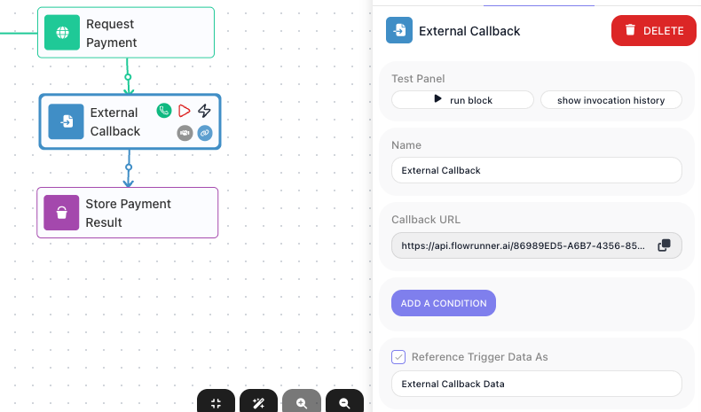
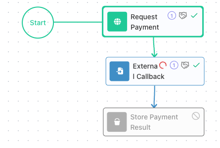
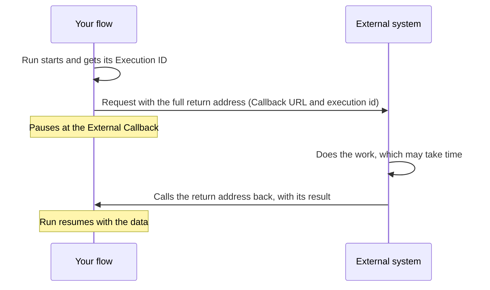
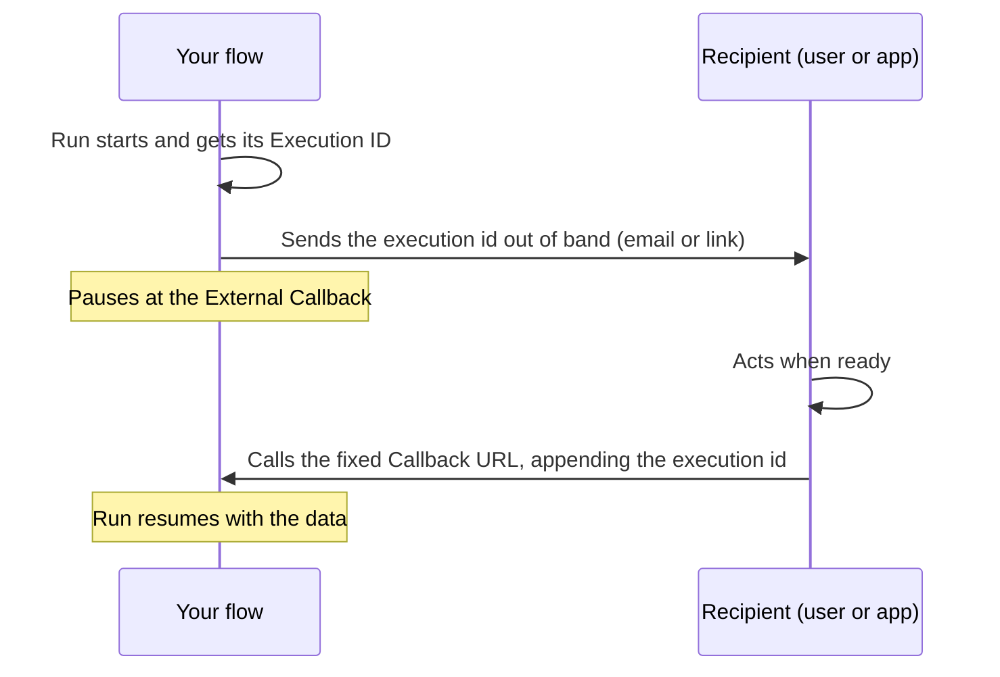
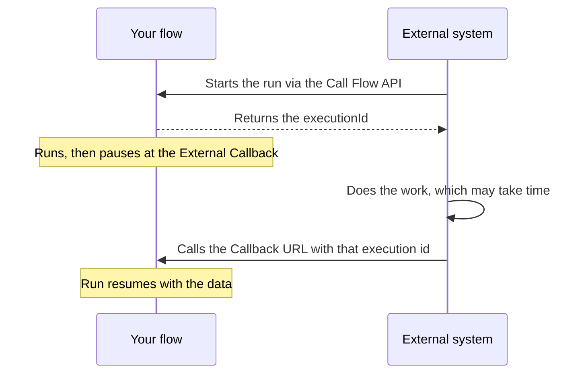
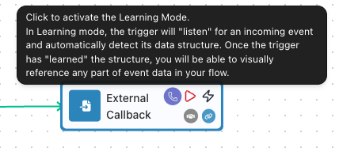
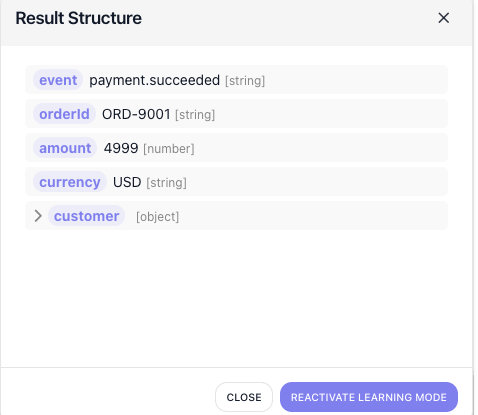
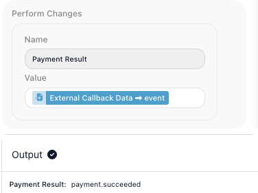
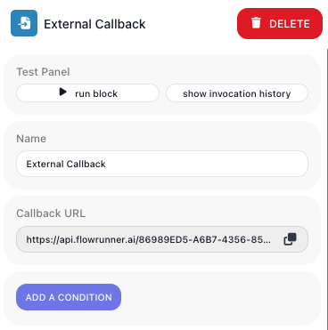
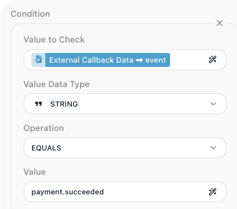

# Waiting on an External System

<!-- product-exploration log (2026-07-16, Documentation Flows workspace; flow "Payment Hand-off" A9FFD57D)
SOURCES read first: `external-callback-trigger.md` (git show HEAD:docs/reference/external-callback-trigger.html)
+ `external-callback.md` (V-real) + the in-product verifications below.

ENDPOINT: POST|GET .../automation/flow/{FLOW-ID}/trigger/{TRIGGER-ID}/activate. You COPY the complete
Callback URL from the block's properties - do not assemble it from ids. Start-of-flow trigger = new
instance per call; mid-flow trigger = resume a paused instance.

WAIT LIMIT (Mark, 2026-07-16): a paused run is NOT unlimited - it waits up to the workspace plan's max:
30 days on Growth plans, 1 year on all other plans. (Corrected the earlier "no end time" claim.)

LIVE (per reference + 28010): the trigger responds only while the flow is LIVE - for BOTH start and
mid-flow use (a stopped flow -> 28010). Not a mid-flow-only rule.

METHOD (VERIFIED): GET -> query params become the trigger data (C97487D6: ?event=payment.succeeded
landed as External Callback Data->event). POST -> JSON body = trigger data; query params ignored except
`execution`.

EXECUTION PARAM (VERIFIED; name `execution` OR `executionId`): <id> resumes that run; `any` resumes ONE
waiting run (FlowRunner picks which - woke 36B09CF9, the older, while 068C5A05 kept waiting); `all`
resumes EVERY waiting run (comma-separated ids: 904EFDDC + 6BEDE8DE). Single/any -> {"executionId":"<id>"};
all -> comma list; all with nothing waiting -> {"executionId":null} (200, NOT error).
ERRORS (400 JSON): 28056 mid-flow no execution; 28010 not LIVE; 28059 bad/absent id; 28060 any-nothing-waiting.

EXECUTION ID IS A RUNTIME VALUE (Mark, 2026-07-16): the id is assigned when the run starts and is unique
per run - it does NOT exist at build time, so a caller cannot "type" it. The flow references it (Flow
Context) and each run resolves the reference to its own id. The earlier "insert as a pill, not typed
text" line was wrong-headed (an artifact of my automation) and is removed.

INTEGRATION AXIS (Mark): dynamic-URL vs fixed-webhook. (a) system accepts a per-request callback address
-> the flow composes CallbackURL?execution=<Execution ID ref> and sends it. (b) system posts to ONE fixed
webhook URL configured once -> can't take a per-run address; the id reaches it another way (email/link)
and it appends ?execution=<id>, or the fixed URL carries ?execution=any. (c) caller started the run via
the Call Flow API and got executionId in the response.

CONDITIONS (VERIFIED): ADD A CONDITION -> Value to Check (expression) / Value Data Type / Operation /
Value. Built event EQUALS payment.succeeded; event=refund call -> {"executionId":null}, run STAYED
paused; payment.succeeded -> resumed. False condition accepted (200) but does not activate. (Removed after.)

LEARNING MODE (VERIFIED 2026-07-16): purple callback icon on the hover toolbar turns it on; after a
sample is learned the icon turns GREEN; clicking it opens a "Result Structure" popup listing
every field with value + type (event/orderId/amount/currency/customer) + a "REACTIVATE LEARNING MODE"
button. Convenience, not a gate - you can reference a field whose name you know without learning
(reference: "reference fields by name instead of guessing").
REFERENCING METHOD (Mark, 2026-07-16 - I kept teaching this WRONG): the ONLY way to reference a field,
object, or list element is by PICKING it - find the data node (e.g. External Callback Data), navigate to
what you need, and DOUBLE-CLICK or DRAG it in. You do NOT type the {{X->field}} text - that is the
inserted result, never the input method. (Same root as the executionId "pill" error.)
CONDITION EXAMPLE (Mark): "event EQUALS payment.succeeded" is ONE illustration, not universal - gate on
whatever field of the reader's OWN payload distinguishes the calls they want.

SHOTS: config (panel + Callback URL), paused (run paused mid-flow), url-reference (predecessor picks the
callback URL + Execution ID), learningmode, learned, resumed (composite: Value=External Callback
Data->event + output payment.succeeded), addcondition (the ADD A CONDITION button), condition (the built
condition). SCOPE (Mark): omit Execution Permissions/security and the user-token header.
-->

An [External Callback](../../reference/external-callback.md){.fr-block} trigger placed in the middle of
a flow pauses the run until an outside system makes an HTTP request to a URL. Reach for it to hand work
to something that takes its own time - a payment to clear, a document to finish processing, a person to
approve a request - and resume the moment that system reports back, with its data in hand.

## The callback endpoint

Drop an External Callback from the ((Triggers)) palette group into a flow, and FlowRunner generates one
activation endpoint for that trigger. To get its address, open the block: the ((Callback URL)) field
holds the complete URL, with a copy button. You hand that value to the outside system as-is - you never
assemble it from ids.



The address ends in the trigger's activation path:

```
POST|GET  .../automation/flow/{FLOW-ID}/trigger/{TRIGGER-ID}/activate
```

`{FLOW-ID}` and `{TRIGGER-ID}` identify this flow and this trigger. Where the trigger sits in the flow
decides what a call does:

- **At the start of a flow** - each call starts a new instance, and the call's data becomes that
  instance's trigger data.
- **In the middle of a flow** - the run pauses when it reaches the trigger, and a call resumes a paused
  instance. That is the case this page covers.

At a mid-flow trigger the run pauses and stays an active instance - status **PENDING** on the flow's
Instances tab, the steps after the trigger not yet run - until a call arrives. The wait is not unlimited: a run holds at the callback for up
to the workspace plan's maximum, 30 days on Growth plans and one year on the others.



## Sending data to the trigger

A caller activates the trigger with an HTTP GET or POST, and whatever it sends becomes the trigger-data
object that later steps read. The method decides where that data goes: a GET carries it as query
parameters, and a POST carries it as a JSON body (a POST's query string is ignored except for
`execution`, below). Both calls below start a new run of a flow whose first block is the trigger:

`POST` - the JSON body becomes the trigger data:

```bash
curl -X POST '<Callback URL>' \
  -H 'Content-Type: application/json' \
  -d '{"event":"payment.succeeded","orderId":"ORD-9001","amount":4999}'
```

`GET` - each query parameter becomes a field of the trigger data:


```bash
curl '<Callback URL>?event=payment.succeeded&orderId=ORD-9001&amount=4999'
```

The payload then lands under the trigger's alias for later steps - see
[Reading the callback data](#reading-the-callback-data).

## Resuming the right run: the `execution` parameter

The endpoint names the flow and trigger, not one run - and more than one run can sit paused at the same
trigger at once (a timer might start an order-processing run every few minutes, each waiting for its own
payment). A resume call must say which run to wake, with the `execution` query parameter on the URL
(`executionId` works as an alias):

```
POST  <Callback URL>?execution={execution-id}
```

| execution Param Value | Resumes | Response (HTTP 200) |
| --- | --- | --- |
| `execution={execution-id}` | the one run with that id | `{"executionId":"{id}"}` |
| `execution=any` | one waiting run - FlowRunner picks which; use when the waiting runs are interchangeable | `{"executionId":"{id}"}` |
| `execution=all` | every run waiting at this trigger - one event wakes them all | `{"executionId":"{id1}, {id2}"}` |

Errors come back as HTTP 400 with a JSON `code`:

| Situation | `code` |
| --- | --- |
| Mid-flow trigger called with no `execution` | `28056` |
| Flow is not LIVE | `28010` |
| `execution={id}` - no run with that id is waiting | `28059` |
| `execution=any` - nothing is waiting | `28060` |

`execution=all` with nothing waiting is not an error: it returns `{"executionId":null}` and resumes
nothing. A resume call carries data the same way a start call does:

```bash
curl -X POST '<Callback URL>?execution=838ECE57-3E17-42F5-9721-4B1611522D7C' \
  -H 'Content-Type: application/json' \
  -d '{"event":"payment.succeeded"}'
```

## Getting the execution id to the caller

To resume one specific run, the caller has to send that run's execution id - and the id is assigned at
runtime, unique to each run, so it does not exist until the run starts. The flow itself hands it out
during the run, before it reaches the callback. There are three ways to do that, depending on what the
outside system can accept.

### The system accepts a callback address per request

When the flow itself calls the system - the Request Payment step - and that call can include a
return address, the flow sends a ready-made one. In that step, open the
[Expression Editor](../../learn/concepts/expressions.md) and build the address from two picked
references: the ((Callback URL)) (the **External Callback URL** entry, under **External Callback URLs**)
and this run's ((Execution ID)) (under **Flow Context**), joined by `?execution=`. The result reads
`<Callback URL>?execution=<Execution ID>`, and each run resolves those references to its own values, so
the system gets an address that points back at this exact run.




### The system posts to one fixed URL

A webhook you configure once in the system's dashboard cannot take a per-run address. The run has to
deliver its execution id another way - for example an email or web page the flow generates with the id
in a link, `https://yourapp.example/confirm?executionId=<id>` - and whatever handles that link appends
`?execution=<id>` to the fixed URL. When the waiting runs are interchangeable, the fixed URL can instead
carry `?execution=any`.



### The caller started the run through the Call Flow API

A system that started the run through the [Call Flow](../../reference/call-flow.md){.fr-block} API
received `{"executionId":"..."}` in the response, and reuses that id to call the trigger.



## Capturing the payload shape: Learning Mode

A trigger computes no result of its own - the data it exposes is whatever the caller sent. ((Learning
Mode)) records the shape of that payload so its fields appear in the Expression Editor, ready to pick,
instead of you having to know their names. It is off by default; turn it on with the purple callback
icon on the block's hover toolbar, then send one sample request to the ((Callback URL)). It listens while
you build - the flow need not be LIVE.



Send the sample the same way the real caller will - for example:

```bash
curl -X POST '<Callback URL>' \
  -H 'Content-Type: application/json' \
  -d '{"event":"payment.succeeded","orderId":"ORD-9001","amount":4999,
       "currency":"USD","customer":{"email":"dana@example.com"}}'
```

Once a sample arrives, the trigger records its structure - nested objects included - and the callback
icon turns from purple to green. Click the green icon to see what it captured: the ((Result Structure))
popup lists every field with its value and type, and those fields are now available to reference in later
steps.



## Reading the callback data

The payload is exposed under the alias set in ((Reference Trigger Data As)) - `External Callback Data` by
default. You never type a field path. To reference a field, open the
[Expression Editor](../../learn/concepts/expressions.md) in the step that needs it, find
`External Callback Data` in the data tree, drill down to the field, and double-click or drag it in;
FlowRunner inserts the reference for you. The inserted reference reads like {{External Callback Data->event}}
for a top-level field or {{External Callback Data->customer.email}} for a nested one - but you build it by
picking, not by typing that text.

In the running example, the [Set Variables](../../reference/set-variables.md){.fr-block} step after the
trigger picks {{External Callback Data->event}} - the payment outcome the provider sent - and stores it,
here `payment.succeeded`, a value the flow could not know until the callback arrived:



## Filtering which calls activate: conditions

One endpoint often receives events you do not want to act on - a payment provider posts
`payment.succeeded` to the same URL as its refunds and disputes. ((ADD A CONDITION)) gates the trigger:
when a call arrives, the trigger evaluates the condition first and only activates - starts or resumes the
run - if it is true. A false condition is accepted (HTTP 200) but does nothing, so a paused mid-flow run
stays paused for the next matching call.



Gate on whatever field of the incoming payload tells the calls apart - a status, a type, an event name,
whatever your caller actually sends. A condition compares a ((Value to Check)) - a field you pick from
the callback data in the Expression Editor - against a ((Value)) you enter, using an ((Operation)) for
its ((Value Data Type)). In this example the webhook carries an `event` field, so checking
{{External Callback Data->event}} **EQUALS** `payment.succeeded` lets a completed-payment call through while
a call whose `event` is `refund` arrives but leaves the run paused. Your own condition points at your own
payload's field and value.



## Things to watch for

- **The flow must be LIVE for the trigger to respond to real traffic** - whether it starts a run or resumes
  one. A call to a stopped flow returns `28010`. Two build-time exceptions let you test before publishing:
  Learning Mode, above, listens for one sample request, and running the block on its own starts a debug
  execution that waits for your call.
- **A mid-flow resume always needs `execution`.** Without it the call returns `28056`; the endpoint
  cannot tell which paused run to wake.
