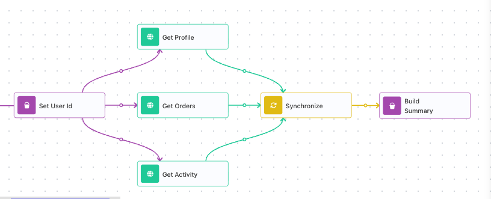
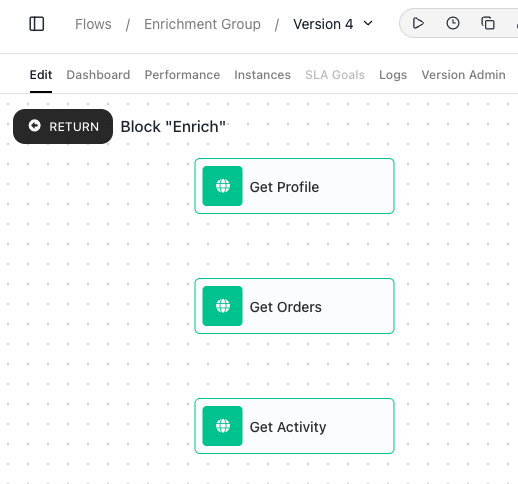
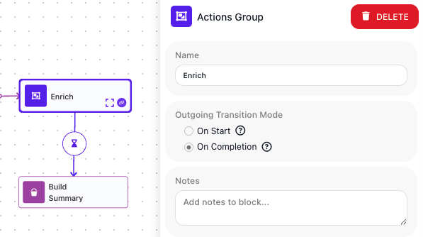
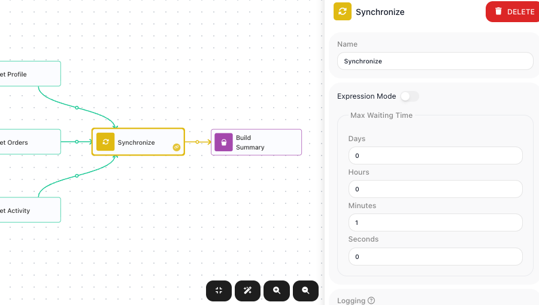
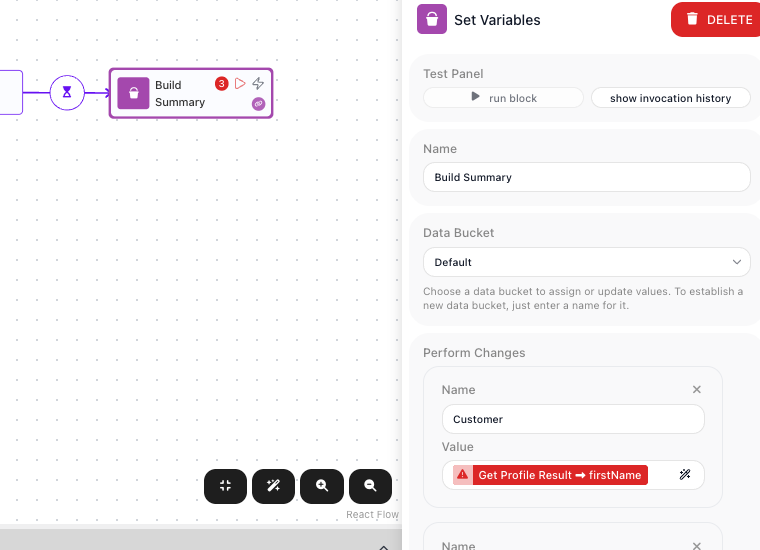

# Running Steps in Parallel

<!-- product-exploration log (2026-07-14, Documentation Flows workspace; built via authored-JSON import, all claims run-proven via the activate URL)
- CANVAS FAN-OUT: a block's nextElementIds is an ARRAY; more than one entry = parallel branches. Flow "Parallel Enrichment" (280C5482): Set User Id -> fans to Get Profile / Get Orders / Get Activity (3 HTTP branches, dummyjson users|carts|posts with ?delay=1000|4000|2000) -> all converge on Synchronize -> Build Summary. PROVEN concurrent: instance 5FD4EC77 COMPLETED in 4s (= slowest branch, delay 4s), NOT the 7s sum. Serial would be >=7s.
- SYNCHRONIZE: waits for every incoming branch, then releases ONE downstream path. Max Waiting Time (Days/Hours/Minutes/Seconds, or Expression Mode seconds). Build Summary ran after all 3 and read all 3. Element type SYNCHRONIZE, UTILS palette.
- ACTIONS GROUP (flow "Enrichment Group" 1B52CCED): container runs inner actions in parallel. Outgoing Transition Mode = On Start | On Completion. ON_COMPLETION PROVEN parallel: instance D8C21967 = 4s (slowest), not 7s. GROUPS palette. (Structure gotcha ruled out per branching.md: my first authored group set metaInfo.firstElementId -> ran serial 7s; the real UI structure has NO group firstElementId -> parallel. The 7s was my artifact.)
- ON START vs ON COMPLETION: On Completion makes inner results readable downstream (valid, read Emma/1/2). ON START makes them INACCESSIBLE - re-importing the same flow with ON_START turns Build Summary red: each reference to an inner result flags "Referenced block is not accessible from this block." So On Start = fire-and-forget; you cannot read the actions' results after it.
- READING RESULTS: no combined result from a group or Synchronize; each parallel step's result read by its own alias. Build Summary: Customer = Get Profile Result->firstName ("Emma"), Order Count = Get Orders Result->total (1), Post Count = Get Activity Result->total (2).
- PITFALL race (flow "Race Test" 1D814D7A): two branches (A finishes ~1s, B ~3s) both write Data Bucket var "Winner". All 3 runs: Final Winner = "Branch B" (the LATER writer). Both writes land, no error/merge; last-completing writer wins; unpredictable in general.
- PITFALL timeout: V-real in synchronize.yaml (verified 2026-06-14, assertion timeout-proceeds: successor runs at timeout, slow branch dropped, its result unavailable downstream). My re-test (maxWait 2s, 4s branch) did not surface an instance in analytics - relying on the V-real reference for this one claim.
- 6 shots, pixel-checked: parallel-fanout, parallel-actionsgroup-inside, parallel-actionsgroup-mode, parallel-synchronize, parallel-read-result, parallel-onstart-error.
- MARK REVIEW (2026-07-14) verifications: CONNECTIONS are made with a LINK ICON on each block (purple chain-link at the corner on hover), not a "dot". MODE ICON: the Actions Group's outgoing connection carries an HOURGLASS icon whose fill reflects the mode (On Completion bottom-filled = waited; On Start top-filled = released at start). NO-SYNCHRONIZE: a step wired after N parallel branches runs N TIMES (once per incoming branch) - verified via "Join Test" (static downstream, exec-count badge = 3); Synchronize collapses the arrivals into one run. In the enrichment flow (downstream READS results), the early runs fire before other branches finish -> "No Sync Test" instance TERMINATED with an error. Expression Mode on Max Waiting Time = DYNAMIC cap from flow data at run time (in seconds), not just a static seconds entry.
-->
<!-- reference follow-up (parked): actions-group.yaml should document the outgoing-line hourglass mode icon + that On Start makes inner results inaccessible downstream; synchronize.yaml could note that omitting it makes a downstream step run once per incoming branch. -->

Some of a flow's work does not have to happen one step at a time. Enriching a new signup might mean
fetching their profile, their orders, and their recent activity from three different services, and
none of those calls needs the others. Run one after another, the three calls take as long as all
three combined. Run at the same time, they take only as long as the slowest. FlowRunner™ lets
independent steps run side by side, and holds the flow for that work when a later step needs it done.

## Branches that run at the same time

Independent steps do not have to take turns. In FlowRunner a block can lead to more than one next
step, and when it does, each of those steps starts as soon as the predecessor block finishes. Each path out is a branch, and a branch can be a single block or a whole chain of
them.

The flow below enriches a new signup. From a first step that sets the user's id, it fans out into
three branches, each an [HTTP Request](../../reference/http-request.md){.fr-block} to a different
service: one fetches the profile, one the orders, one the recent activity. You fan out by drawing a
connection to each branch: every block has a link icon you drag to the next step, and a block can
have as many outgoing connections as you draw.

All three requests leave at once and run in parallel. In a test run where the calls take 1, 2, and 4
seconds, all three finish about 4 seconds after they start - the slowest - not the 7 they would take
one after another. The flow carries on past them only once every branch is done, and that is the
[Synchronize](../../reference/synchronize.md){.fr-block} block's job, covered below.

## Bundle parallel actions in an Actions Group

When the parallel steps are independent actions, an
[Actions Group](../../reference/actions-group.md){.fr-block} keeps them together in one container.
Drop two or more actions inside it, and when the flow reaches the group they all start at the same
time. The actions sit side by side with no connections between them, because none of them waits for
another.

Select the group on the canvas to open its settings in the panel on the right. One of them,
((Outgoing Transition Mode)), decides when the rest of the flow may move on:

- ((On Start)) releases the flow the moment the actions have been launched. The flow carries on
  without waiting for them to finish.
- ((On Completion)) holds the flow until every action inside the group has finished.

The choice also shows on the canvas: the hourglass icon on the group's outgoing connection reflects
the mode you picked.

Under ((On Completion)) the group takes about as long as its slowest action. Bundling the same three
calls in a group set to ((On Completion)) held the flow for about 4 seconds, the time of the slowest
call. Choose ((On Completion)) when a later step needs the actions' results; choose ((On Start)) when
you only want to launch the actions and let the flow move on.

## Wait for every branch with Synchronize

An Actions Group waits for its own actions (with the `On Completion` mode selected). Separate branches drawn on the canvas do not: each runs
to its own end on its own. When you have fanned out into branches and a later step needs them all
finished first, a [Synchronize](../../reference/synchronize.md){.fr-block} block is the meeting point.
Wire every branch into it. It holds the flow until the last branch arrives, then lets the flow
continue once - so the step after it runs a single time, with every branch's work done.

!!! warning "Without a Synchronize, the next step runs once per branch"
    Wire the three branches straight into Build Summary instead, and Build Summary runs three times -
    once as each branch arrives - not a single time with all three results ready. Synchronize is what
    collapses those three arrivals into one run, after every branch has finished.

Synchronize's ((Max Waiting Time)) caps how long it will wait. Fill in days, hours, minutes, and seconds for a
fixed cap, or turn on ((Expression Mode)) to compute the cap from flow data at run time (as a number
of seconds), so a flow can wait longer or shorter depending on what it is handling. If the time runs
out before every branch has arrived, Synchronize stops waiting and the flow continues without the
branches that are still running.

## Reading what parallel steps produce

Each parallel step's result is available through itsown block, and you read it the same way you read any
block's result: by its alias. Neither a Synchronize block nor an Actions Group hands back a single combined result, so read each parallel step's own result.

## Things to watch for

- **Read a parallel result only after the flow has waited for it.** Under ((On Start)), or from a
  branch that has not passed through a Synchronize, the result is not ready. The editor flags a
  reference to it as invalid - it shows "Referenced block is not accessible from this block" - and the
  flow will not run until you remove it. Use ((On Completion)) or a Synchronize to hold the flow until
  the result is ready.
- **A timed-out branch is dropped.** If Synchronize's ((Max Waiting Time)) runs out before a branch arrives, the flow continues without it and its result is not available downstream. Set the cap above the slowest
  branch you expect on a normal run.
- **Two branches writing the same variable collide.** Parallel branches share the flow's Data Bucket
  variables. If two branches write the same one, both writes land and the value left standing is the
  one written last. Which branch finishes last is not guaranteed, so the result is unpredictable.
  Have each branch write its own variable instead.

The editor catches that first case as you build. Switch the Actions Group to ((On Start)) and the summary
step's reference to a result it can no longer reach turns red:

When parallel work must finish before a later step, wait for it: set an Actions Group to
((On Completion)), or converge separate branches with a Synchronize. The
[Synchronize](../../reference/synchronize.md){.fr-block} and
[Actions Group](../../reference/actions-group.md){.fr-block} references carry the field-level details.
