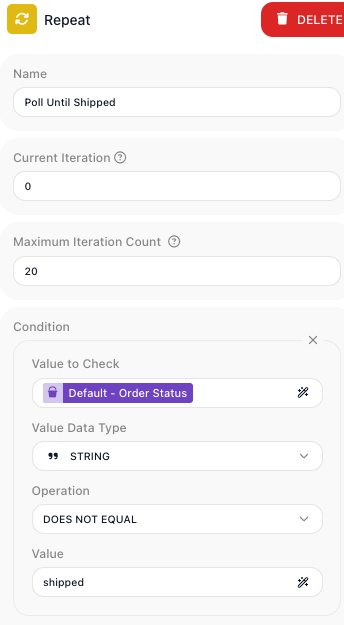
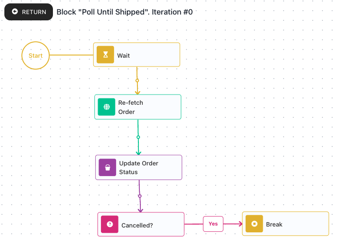
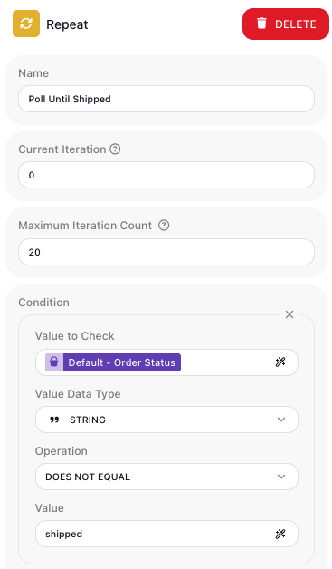
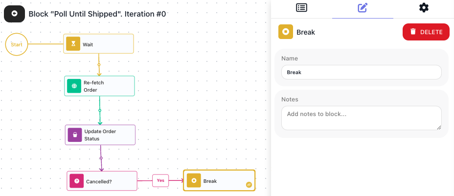
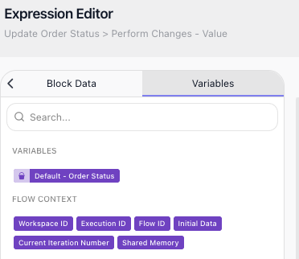

# Repeating Steps

<!-- product-exploration log (2026-07-11, Documentation Flows workspace, flow "Order Poller" 228C17CD, built clean this session; run-proven via the activate URL)
- Repeat verified in palette UTILS. Dropped -> auto-wires to the previous block; unconfigured shows an error badge until the condition is set.
- Repeat config panel driven: Name / Current Iteration (a starting-value field, default 0 - NOT documented on the page to avoid colliding with the Current Iteration Number pill) / Maximum Iteration Count (default 10000) / Condition (identical Value to Check + Value Data Type + Operation + Value fields as the Condition block). Condition help tooltip is authoritative: Maximum Iteration Count = "Set the maximum iteration limit to interrupt the Repeat While loop. Useful for preventing endless loops if the logic does not exit as expected." (so Repeat IS a while-loop; failsafe verified via product tooltip + config default). Current Iteration field help is still the "TODO: Create a help text here" placeholder (known unwritten-help item).
- STRING operations enumerated: EQUALS, DOES NOT EQUAL, CONTAINS, DOES NOT CONTAIN, STARTS WITH, DOES NOT START WITH, ENDS WITH, DOES NOT END WITH, IS EMPTY, IS NOT EMPTY, IS NULL, IS NOT NULL, AI QUESTION. Exact operator label is DOES NOT EQUAL (not "not equals").
- Step-in gesture: hovering a loop reveals an Expand icon (bottom-right of the node); a banner reads Block "Poll Until Shipped" (edit adds ". Iteration #0" -> the counter is 0-based). RETURN (top-left) exits. A just-expanded loop opens EMPTY (only a Start + drop placeholder) - §0j warn.
- Break verified in UTILS (offered inside the loop). Config = ONLY Name + Notes (no result alias). Sits on a Condition's Yes/then path. Ends the nearest enclosing loop.
- NESTING: a Repeat dropped INSIDE the loop body was accepted (no rejection) -> Repeat-in-Repeat supported. Deleted the test block. The specific runtime behavior "an inner Break leaves the outer loop running" was NOT driven on this page (only nesting-accepted + single-loop Break exit were run); the page therefore does not assert it and defers nested-Break behavior to the Break reference, where it is V-real (break.yaml: "ends only the inner loop and the outer loop keeps going").
- SCOPE (Expression Editor, driven on real blocks):
  - Inner block (Update Order Status): Variables tab -> VARIABLES: Default - Order Status (top-level variable readable inside); FLOW CONTEXT includes Current Iteration Number. Block Data tab -> Re-fetch Order Result (a predecessor's result readable inside).
  - Seed block (OUTSIDE any loop): FLOW CONTEXT has NO Current Iteration Number -> the pill is loop-scoped (offered only to blocks inside Repeat / List Iterator).
  - Post-loop block (After Poll): sees Default - Order Status (variable survives) but NOT Re-fetch Order Result / any loop-body result, and no Current Iteration Number -> loop-body results do NOT survive outside; a top-level Variable is the way out.
- CURRENT ITERATION NUMBER pill: exact label confirmed (yaml's "Current Iteration" is STALE -> parked reference fix). Lives in Expression Editor > Variables tab, FLOW CONTEXT group.
- RUNS (real instances via activate URL; inspected in the instance viewer):
  - Normal exit (body writes Order Status = "shipped"): instance COMPLETED 2s, no error. Top-level counts Seed 1 / Poll Until Shipped 1 / After Poll 1 (flow CONTINUES after the loop). Body counts each 1, Break 0. Repeat's Element Execution Details: Input Value to Check "shipped" DOES NOT EQUAL "shipped" -> false -> exit; Output = Empty Object (Repeat hands back NO useful result, matches yaml).
  - Break early-exit (body writes Order Status = "cancelled", Cancelled? EQUALS cancelled -> Yes -> Break): instance COMPLETED 1s, no error. Body counts each 1 INCLUDING Break 1; After Poll ran (flow resumes after Break). Repeat condition only saw "processing" at entry -> loop exited via Break, not the block condition. Restored the body to "shipped" for the clean saved flow.
- Failsafe overrun NOT run as a dedicated instance; relied on the authoritative in-product tooltip + verified default 10000 / set 20.
- 5 shots captured fresh: repeating-config (Condition + Max Iteration Count 20), repeating-body (the loop body Start -> Wait -> Re-fetch Order -> Update Order Status -> Cancelled? -> Break; §2 prose signposts the Cancelled?/Break preview and matches the Wait-first order), repeating-failsafe (the Maximum Iteration Count field on the Repeat block with its help tooltip open - shows block identity + the authoritative "interrupt the Repeat While loop" text; recaptured after the gate flagged the earlier bare crop), repeating-break (Break on the Yes path + its Name/Notes panel), repeating-current-iteration (the Current Iteration Number pill in an inner block's Expression Editor). Pixels read against the prose.
- DELIBERATE OMISSION: the Repeat's own "Current Iteration" config field (a starting-value field, default 0) is left undocumented to avoid colliding with the Current Iteration Number pill; both shots (repeating-config, repeating-failsafe) put the field on screen. Accepted.

MARK REVIEW ROUND 2026-07-13 (corrections applied):
- (Mark 1) Loop-exit precision: the condition is evaluated BEFORE each iteration; a false result means that pass never runs and the Repeat is done (not "the loop stops mid-flight"). Reworded §1.
- (Mark 2) "the status" -> "Order Status" (the actual variable). ADDED an admonition: the checked value can change from ANYWHERE in the instance, not only inside Repeat - a parallel branch could change Order Status independently. (Product-owner authoritative.)
- (Mark 3) The Cancelled? Condition's No path is unconnected; made explicit that a Condition branch left unconnected ends the pass there, then the loop re-checks at the top. (Reader can't infer this from the shot alone.)
- (Mark 4) §5 title "What a step inside the loop can read" -> "Accessing flow data inside the loop".
- (Mark 5) "set outside the loop" -> "declared outside the loop".
- (Mark 6) §6 title "Pass a result out with a top-level variable" -> "Returning data from the loop".
- (Mark 7) CORRECTED an inaccuracy: block results are scoped to a single ITERATION, not "the loop". A later pass cannot see an earlier pass's block result; only values written to a top-level variable carry from one pass to the next and out of the loop. Reworded §6. -> Reference follow-up: repeat.yaml / list-iterator.yaml should teach iteration-scoping this way.
-->

A flow often needs to keep doing something until it is done - checking an order until it
ships, retrying a call until it goes through, collecting results until there are enough.
The [Repeat](../../reference/repeat.md){.fr-block} block runs a set of steps over and over
and stops the moment a condition you set turns false. When you already have a list and want
to touch every entry, that is [Working Through a List](collections.md), not Repeat.

## Loop while a condition stays true

A poll only needs to run until the order ships, so the loop needs a test that tells it to
keep going. Drop a [Repeat](../../reference/repeat.md){.fr-block} block from the palette's
**Utils** group, name it `Poll Until Shipped`, and give it a test built from the same
((Value to Check)), ((Value Data Type)), and ((Operation)) fields a
[Condition](../../reference/condition.md){.fr-block} block uses. Here the loop watches a Data
Bucket variable named **Order Status**: `STRING`, `DOES NOT EQUAL`, `shipped`.

The block re-checks this test before every pass. While it is true, the loop runs the steps
once more; when it comes back false, that pass never starts - the Repeat is done and the flow
moves on. Because the same steps run each pass, a step inside the loop has to change what the
test reads - **Order Status** - or the test stays true and the loop never ends on its own.

!!! note
    A step inside the loop is the usual way that value changes, but not the only one. The test
    reads a variable any part of the instance can write, so if another branch of the flow is
    running in parallel and changes **Order Status**, that is what the next check sees.

## Build the steps that run each pass

The loop is only worth running for the work it repeats, so step inside and build that work.
Hover the [Repeat](../../reference/repeat.md){.fr-block} block and choose ((Expand)) to step
into it; a banner names the block you are inside, and ((Return)) at the top-left brings you
back out. The loop opens empty - you build its body the way you build the main flow.

This poll's body runs three steps each pass: a [Wait](../../reference/wait.md){.fr-block}
pauses so the service has time to make progress, an
[HTTP Request](../../reference/http-request.md){.fr-block} re-fetches the order, and a
[Set Variables](../../reference/set-variables.md){.fr-block} writes the fresh status into
**Order Status** - the step that lets the loop's test eventually turn false. The `Cancelled?`
check and `Break` further down the shot are an early exit, built in the next section.

## Cap runaway loops with a failsafe

A test that never turns false would loop forever, so every Repeat carries a hard limit.
((Maximum Iteration Count)) stops the loop after that many passes even when the test is still
true. It defaults to `10000`; set it to a sensible number for the job while you build - the
poll uses `20`, so a service that never ships the order stops after twenty checks instead of
running on.

## Leave the loop early with Break

The loop's ((Condition)) ends the poll on its normal finish - the order ships. Sometimes you
want out the instant something else happens: a cancelled order should stop polling right away,
not wait for a `shipped` that will never come. Inside the loop, after the re-fetch, a
[Condition](../../reference/condition.md){.fr-block} block checks whether **Order Status** is
`cancelled`; on its **Yes** path sits a [Break](../../reference/break.md){.fr-block}. Reaching
the Break ends the loop at once, and the flow carries on from the step after the loop.

A Break has almost nothing to configure - a ((Name)) and ((Notes)) - because its whole job is
to end the loop it sits in; it hands back no result. The `Cancelled?` check has nothing wired
to its No path, and that is deliberate: a Condition branch left unconnected ends the pass there,
so an order that has not been cancelled finishes the pass and the loop re-checks its condition
at the top. FlowRunner also lets you nest one Repeat within another; the
[Break](../../reference/break.md){.fr-block} reference covers how a Break behaves inside nested
loops.

## Accessing flow data inside the loop

The steps inside the loop need real data to work on. A block inside the loop can read any
variable declared at the top level of the flow and the result of a block that ran before the
loop. That is how **Order Status**, declared outside the loop, is there for the steps inside to
read and rewrite each pass.

## Returning data from the loop

A block's result inside the loop belongs to that one pass. The next pass cannot see it, and
neither can the flow after the loop; the Repeat itself hands back no result you can read
downstream either. Only what a step writes to a top-level variable carries from one pass to the
next and on past the loop. That is why the poll keeps its status in **Order Status**: each pass
reads the value the pass before it wrote, and after the loop the flow reads that same variable,
now holding `shipped`.

## Read which pass you are on with Current Iteration Number

Sometimes a step needs to know which pass it is on - to number a log line, or to act
differently on the first pass than on later ones. Inside a Repeat, the
[Expression Editor](../../learn/concepts/expressions.md) offers a ((Current Iteration Number))
value in the ((Variables)) tab, under **Flow Context**; pick it like any other reference. It
counts the passes, starting at `0` on the first one. It appears only for blocks inside a loop -
a block out in the main flow has no iteration to report.

Repeat is the tool when the number of passes depends on what happens at run time - when you do
not have a list to walk, but a "keep going until."
