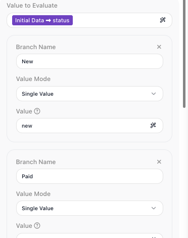
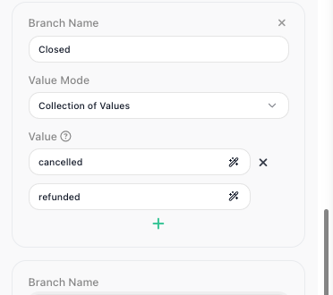
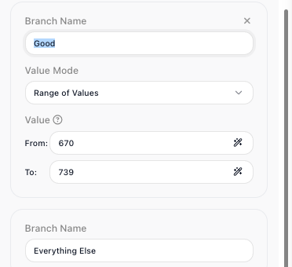
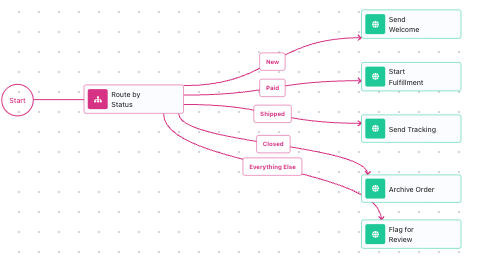

# Routing on a Value

<!-- product-exploration log (2026-07-10, Documentation Flows workspace; flows "Order Router" BF2B546C + "Route by Credit Score" 694282BC, both built clean this session; shots captured from them)
- Value Router lives in palette UTILS. Fresh dropped: shows only the block + error badge, NO named connectors (like the Condition's exits) until branches are added. Verified.
- Config panel: Name / Value to Evaluate (expression, required) / a built-in "Everything Else" branch (name only) / "Add Branch" button / Reference Result Data As (CHECKED by default -> alias "Value Router Result"). Note "At least one successor block must be assigned" until a branch is wired.
- A new branch = Branch Name + Value Mode (dropdown) + value(s). Each branch name renders as its own OUTPUT CONNECTOR on the node (New/Paid/Shipped/Closed/Everything Else radiate from the block). Everything Else is the built-in LAST catch-all, cannot be removed.
- VALUE MODES verified (5, NOT the 3 the yaml lists - yaml is STALE, fix reference separately): Single Value (one exact), Single List (value must be a list), Collection of Values (list of values, matches any; entered as multiple value fields + "+"), Range of Values (From:/To: numeric band), Quick Range (single value field). Page teaches the 3 Mark named (Single Value deep, Collection of Values + Range of Values shown) and routes Single List / Quick Range to the reference.
- RANGE inclusivity: product's own Value help tooltip (verbatim): "In this mode you will specify a range of values. If the 'Value to Evaluate' is in the specified range (both 'From' and 'To' are included into the range), the flow will follow the branch." -> both bounds inclusive, authoritative source.
- ROUTING behavior RUN-PROVEN (real API instances on Order Router, LIVE): status "paid" -> Paid connector -> Start Fulfillment executed; status "backordered" (no match) -> Everything Else -> Flag for Review; status "cancelled" -> Closed (Collection match on cancelled|refunded) -> Archive Order. Block checks branches top-to-bottom, first match wins.
- Value Router stores its result ("Value Router Result" = the value it routed on) by default, but routing is the point; page won't lean on the alias.
- FOLLOW-UP: value-router.yaml (reference) lists only 3 modes; update to 5 (Single Value, Single List, Collection of Values, Range of Values, Quick Range) + regenerate.
- 4 shots captured fresh: routing-branch (Value to Evaluate=status + a Single Value branch), routing-collection (Collection of Values: cancelled/refunded), routing-range (Range of Values on credit score, From 670 To 739), routing-paths (the wired canvas: Route by Status -> 5 named connectors -> handling blocks). Pixels read against prose.
-->

A flow often needs to send each case down its own path - a new order gets a welcome, a
paid order goes to fulfillment, a shipped order gets its tracking. The
[Value Router](../../reference/value-router.md){.fr-block} reads one value and sends the
run out the path that matches it. (A simple two-way check is
[Yes/No Branching](branching.md); a path that turns on judgment about free text is an
[AI Router](../ai-in-flows.md).)

## Give each path a branch and a match rule

Every path hangs off one decision, so the router needs the value that decides it. Drop a
[Value Router](../../reference/value-router.md){.fr-block} from the palette's **Utils**
group and set ((Value to Evaluate)) to the order's `status`: open the
[Expression Editor](../../learn/concepts/expressions.md), pick Initial Data from the
((Variables)) tab, and walk into the `status` field. A router you just dropped shows no
named connectors yet; they appear as you add branches.

Now add a path for each status. Click ((Add Branch)) and fill three things:

- ((Branch Name)) - the label for this path; it becomes a named output connector on the
  block. Build one for each status: `New`, `Paid`, `Shipped`.
- ((Value Mode)) - how the branch matches. ((Single Value)) matches one exact value.
- **Value** - what it matches: `new`, `paid`, `shipped`.

The block checks the branches from top to bottom and leaves by the first one that
matches, so branch order matters - if two branches could match the same value, the
higher one wins. There is always a built-in ((Everything Else)) branch at the end that
catches any value none of your branches claimed; it can't be removed or moved above your
branches.

## Match several values with a Collection

Some statuses share one path. To send more than one value down the same branch, set its
((Value Mode)) to ((Collection of Values)) and list the values: a `Closed` branch that
matches `cancelled` or `refunded` takes either terminal status down the same path. The
((Value Mode)) dropdown has two more modes, ((Single List)) and ((Quick Range)) - see
the [Value Router](../../reference/value-router.md){.fr-block} reference.

## Match a numeric band with a Range

Sometimes the value that decides is a number, not a label. A separate flow routes credit
applications on their score: a [Value Router](../../reference/value-router.md){.fr-block}
evaluates `creditScore`, and a branch in ((Range of Values)) mode matches a band with a
((From:)) and a ((To:)) bound - a `Good` branch from `670` to `739`. Both bounds count as
a match, so a score of exactly `739` still takes the `Good` path.

## Build a path off each connector

The router has decided; now each path does its work. Each branch name is an output
connector on the block, so wire each one to its step - `Paid` to a
[Call Flow](../../reference/call-flow.md){.fr-block} that starts fulfillment, `Shipped`
to an [HTTP Request](../../reference/http-request.md){.fr-block} that sends tracking, and
so on. Always build something onto ((Everything Else)) so an unexpected status has
somewhere to go instead of stopping the flow. The connector the run leaves by is the
decision - a paid order takes the `Paid` path and nothing else.

## Value Router, Condition, or AI Router?

<!-- doclint: no-shot: decision table comparing three blocks, not a walkthrough of one block's UI -->

Three blocks send a flow different ways, and the value you are routing on tells you which
to reach for:

| Block | Reach for it when | Example |
| --- | --- | --- |
| [Condition](../../reference/condition.md){.fr-block} | one yes/no check picks between two paths | "did the payment succeed?" |
| [Value Router](../../reference/value-router.md){.fr-block} | one known value picks among several exact paths | "route by order status" |
| [AI Router](../../reference/ai-router.md){.fr-block} | the path turns on judgment about free text | "route by what the message is asking for" |
