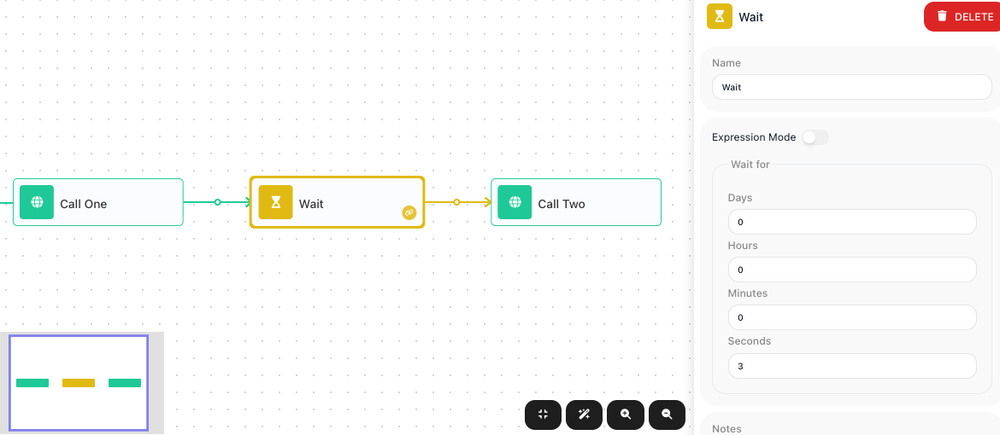
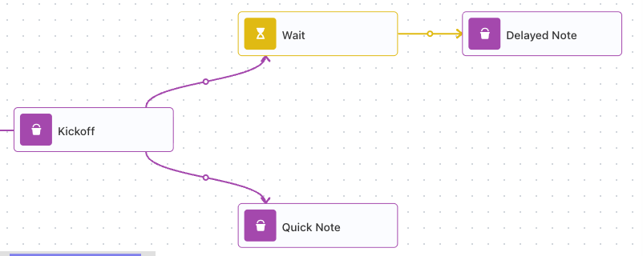
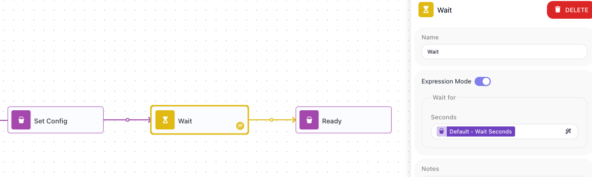

# Adding a Delay

<!-- product-exploration log (2026-07-15, Documentation Flows workspace; flows built via authored-JSON import, run-proven via the activate URL)
- WAIT block: Utils palette. Config = Expression Mode (off/on) + Wait for. OFF: Days/Hours/Minutes/Seconds fields (stored as total seconds; delay expression = NUMBER seconds). ON: a single Seconds field that takes an EXPRESSION (dynamic, resolves to a number of seconds). Verified in-product.
- DELAY PROVEN ("Paced Calls" 4077259E): Call One (HTTP) -> Wait 3s -> Call Two (HTTP). Instance 9FA331E3 total = 3s (two near-instant HTTP calls alone would be ~0-1s; the Wait added the 3s before Call Two).
- HOLDS ONLY ITS BRANCH PROVEN ("Delay One Path" 3FECA0F9): Kickoff -> fans to [Wait 5s -> Delayed Note] and [Quick Note]. Instance C1BCA01B logs: Quick Note completed 09:54:2.380 (immediately after Kickoff at 2.254); Wait held 2.292 -> 7.634 (~5s); Delayed Note ran 7.660. So the Quick branch was NOT delayed by the Wait on the other branch. Total 5s = the waiting branch (like the Parallel page's concurrency).
- EXPRESSION MODE UNIT verified = SECONDS (300 = five minutes). The expression is worked out at run time from flow data.
- backoff-retry (Wait on a retry path) DEMOTED to a pointer per Mark - lives fully on Handling Errors (avoids forward-referencing Handle Error here).
- 3 shots, pixel-checked: wait-config (Call One -> Wait 3s -> Call Two + duration panel), wait-branch (fan-out, Wait on one branch), wait-expression-mode (Expression Mode = single Seconds expression field).
-->

Not every step should fire the instant the one before it finishes. You might want to give a service
a moment to recover before calling it again, space out a burst of calls so you stay under a
provider's rate limit, or hold before a follow-up. A [Wait](../../reference/wait.md){.fr-block} block
does exactly that: the flow reaches it, pauses for as long as you set, and then carries on.

## Pause for a set time

To hold a step for a set stretch, reach for a [Wait](../../reference/wait.md){.fr-block} from the
palette's ((Utils)) group. With ((Expression Mode)) off, you fill in how long to pause across four
fields - ((Days)), ((Hours)), ((Minutes)), and ((Seconds)) - and the branch holds for that total
before moving on. In the flow below, a Wait of three seconds sits between two calls:

When the flow reaches the Wait, it holds for three seconds, and only then runs Call Two. In a test
run the two calls - each near-instant on its own - took three seconds end to end, the length of the
Wait.

## A Wait holds only its own branch

A Wait pauses the branch it sits on, not the whole flow. Any other branch running at the same time
keeps going. In the flow below, one branch waits five seconds before its step, while a second branch
runs straight away:

A test run bears that out: Quick Note finished the instant the flow reached it, while the Wait held
its own branch for the full five seconds before Delayed Note ran. The run took five seconds overall -
the length of the waiting branch - because the flow does not finish until every branch is done.

## Set the wait from flow data

A fixed duration is not always what you want. Turn on ((Expression Mode)) and the four fields collapse
into a single ((Seconds)) field that takes an expression, worked out at run time from the flow's own
data. The expression must resolve to a number of seconds - `300` for five minutes. In the flow below,
an earlier step put the pause length in a **Wait Seconds** variable, and the Wait's ((Seconds)) reads
it:

Because the length comes from the run's data, the same flow can pause for different lengths on
different runs - however long the value it reads works out to.

## When to reach for a Wait

A Wait is the single block for "not yet." The common reasons:

- **Pace work so it does not run too fast.** Put a Wait between repeated calls to space them out and
  stay under a service's rate limit - the cap on how often it will accept calls before it starts
  rejecting them.
- **Hold before a follow-up.** Give something time to settle before the next step acts on it.
- **Back off before a retry.** When a call fails and you want to try it again, a Wait pauses first,
  so you are not hammering a service that is already struggling. Retrying a failed step is part of
  [Handling Errors](error-handling.md).

A waiting run is still an active instance: it has not finished until the pause ends, so a long wait -
hours or days - keeps that run open for the whole time.
