# The Flow Editor

<!-- product-exploration log (2026-07-24 / 2026-07-27, PRODUCTION app.flowrunner.ai, Documentation Flows workspace)
SOURCES READ FIRST: legacy floweditor.md / workingwithblocks.md / blocknaming.md (notes in
.cache/flow-editor-sources.md) + the sibling pages that own adjacent content (running-flows.md owns the
toolbar/version status, testing.md owns the Test Monitor and links BACK here, blocks.md owns aliases,
expressions.md owns the Expression Editor, parallel.md owns the link-icon wording). Full verification
notes: .cache/flow-editor-verification.md.
WORKED EXAMPLE: flow "Order Check" (BE9F178E), built by hand live: Get Order (HTTP Request) -> Check
Total (Condition) -> Yes -> Flag Large Order (Set Variables). Every shot comes from it.
VERIFIED: empty flow shows Start + a dashed "Drop a block from right panel here" target, and dropping
there auto-wires to Start; dropping on open canvas leaves the block UNCONNECTED; palette Search works;
link icon (React Flow handle) on hover drags a connection; hovering a connection shows an X to remove it;
DELETE on a block raises a "Delete block confirmation" dialog; an incomplete block shows a red numeric
badge whose tooltip lists its problems, and the version-status badge lists every problem grouped by block
("URL is required", "Block should be connected with it's parent" [product's typo], "One of the Yes or No
connection must be connected"); filling the last field flips Not Ready -> Ready instantly; the wand icon
opens the Expression Editor and double-click inserts a field; "run block" issued the real request and
returned Success into the Test Monitor, after which the block's result fields became pickable; a LIVE
version opens read-only (first tab reads View, the palette is absent).
STALE LEGACY - deliberately NOT documented: there is no Test Mode toggle and no Auto Save toggle in the
current product (matches definitions.md). NOT REPRODUCED: legacy's "editing a previously LIVE version
deletes its analytics data" confirmation - took the flow live, ran an instance, stopped, edited: no
warning appeared. Left off the page rather than asserted.
VERIFIED 2026-07-24 (round 2, closing the gate's verify-in-product gaps):
- RENAMING: renamed Get Order -> Fetch Order; the auto-derived alias became "Fetch Order Result" AND the
  downstream Check Total reference re-pointed itself. Version stayed Ready. Renamed back.
- AUTOSAVE: renamed a block, navigated to another flow and back with NO save action - the change was
  still there. There is no save control anywhere in the editor.
- READY GATES GOING LIVE: with the URL cleared (Not Ready), the Start flow button is DISABLED
  (button.disabled = true, cursor-not-allowed, opacity-60) and clicking does nothing.
VERIFIED 2026-07-27 (round 3 - three claims I had WRITTEN WITHOUT OBSERVING; driven on throwaway CLONES
of Order Check, all since deleted, leaving the flow at Version 1 / Ready as the shots show):
- LINK ICON COLOUR: the chain icon takes the BLOCK's colour, not a fixed green (green on the HTTP
  Request, gold on a List Iterator). The page said "the green chain icon" - wrong, and wrong on its own
  core gesture since the example's Condition is pink. Colour is now off the page entirely (Mark: it does
  not matter to the reader); the control is named by its own tooltip instead.
- DELETING A BLOCK - OBSERVED, not inferred. Deleted the middle block on a clone: before = 3 nodes /
  2 edges / Ready; after = 2 nodes / 0 EDGES / Not Ready. BOTH edges went, so the downstream block was
  left parentless and badged 1 ("Flag Large Order - Block should be connected with it's parent"). The
  UPSTREAM block was NOT flagged - it is still held by Start.
- NO UNDO: Cmd+Z and Ctrl+Z after a real deletion restored nothing; Cmd+Z after a move did not revert it;
  Cmd+Z with a name field focused does character-level text undo IN THAT FIELD ONLY; and no affordance
  exists - block and canvas have NO context menu, and nothing in the DOM carries undo/redo in its title,
  aria-label or class.
VERIFIED 2026-07-27 (round 4, from Mark's review):
- BLOCK ICON ROW, all four tooltips hovered: play = "Run in test mode"; lightning = "Run instance from
  this element"; chain handle = "Drag to connect with another block"; the grey lower-left icon =
  "Open SLA configuratior" [product's typo]. Toolbar cluster (5): "Fix errors before starting the flow"
  (Start flow, disabled while Not Ready), Schedule, Clone, Export, "Run Instance is not available for
  flows with errors".
- MULTI-SELECT: Shift + drag draws a rectangle; every block inside it gains .selected, blocks outside do
  not. Dragging one selected block moved BOTH by an identical delta (-108, +54) while the unselected one
  stayed put. Delete or Backspace then raises "Delete blocks confirmation" - 'Do you want to delete
  "Flag Large Order, Check Total" blocks?'. For ONE selected block, Delete and Backspace both raise the
  singular "Delete block confirmation", same as the panel's DELETE.
- REFERENCE RESULT DATA AS (Mark's correction - my "renaming also renames the alias" was unqualified):
  it is a CHECKBOX, off by default, with a greyed field beneath showing the auto-derived "<Block Name>
  Result". Ticked it, typed a custom alias "Big Order Check", then RENAMED the block Check Total ->
  Total Gate: the canvas and Name field both changed and the alias STAYED "Big Order Check". So the alias
  follows the block name only while it is auto-derived; a custom one is never overwritten.
- The in-product decoration for a picked reference is a pill carrying the source block's icon
  ("Get Order Result -> total"), which is what this documentation's own expression token mirrors.
STILL UNVERIFIED (kept off the page): changing which block runs first; the palette Marketplace icon
(no Marketplace affordance found beside Search - legacy claim appears stale). The lightning icon is named
by its tooltip only - its run behaviour belongs to Testing / Running Flows and was not driven here.
KNOWN EXCEPTION: the container section's shot (listiterator-expand.png) is from the Cart Summary flow,
not Order Check - the palette drag became unreliable mid-session so a container could not be added to the
worked example. The shot is an accurate picture of the Expand control; the continuity gap is logged.
-->

A process you can describe out loud - fetch the order, check the total, flag anything over $100 - becomes
something FlowRunner runs, and the editor is where you build it. You place each step on the canvas, draw
the path between them, fill in what each one needs, and try a step right there to see what it produces
before the version ever goes live.

## The editor's working areas

The editor is four areas, and the rest of this page works through them in the order you use them.

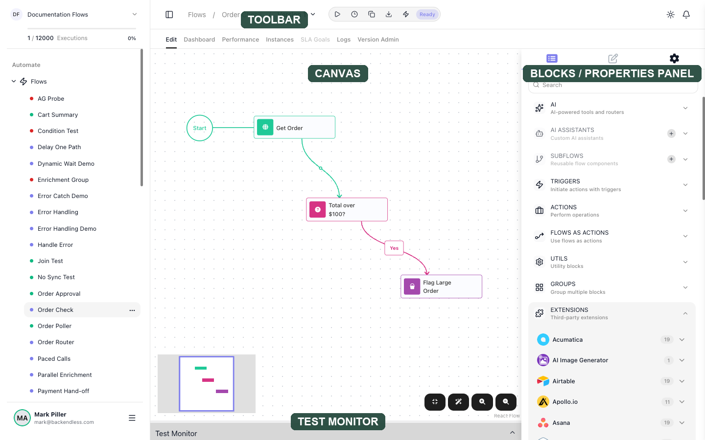

- The **canvas** is the large dotted area in the middle. It is the flow itself: what you arrange there is
  what runs.
- The **right panel** is where you choose blocks and configure them. Three icons at its top switch
  between the block palette, the settings of whichever block you have selected, and the flow's own
  settings.
- The **toolbar** along the top carries the version's status and the controls that act on it.
- The **Test Monitor** across the bottom stays collapsed until you run something, and then shows what the
  run took in and gave back.

## Place a block, and choose which one runs first

Blocks come from the palette, the first of the right panel's three tabs. It groups them by what they do,
and its ((Search)) box finds one by name when you already know what you want.
[Blocks](../learn/concepts/blocks.md) covers what lives in each group.

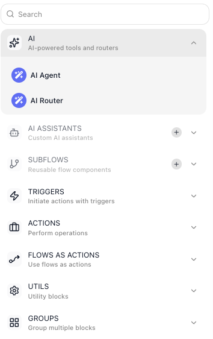

A new flow shows a `Start` marker joined to a dashed target that reads **Drop a block from right panel
here**. Drag a block onto that target and it is placed and wired to `Start` in one move - that block is
now the first thing the flow does.

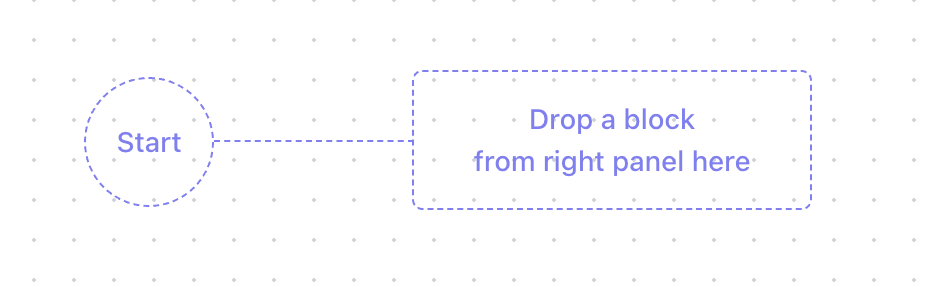

A flow can start with any kind of block. A trigger is one option - it waits for something to happen
outside - but an action works too, when the run is started by a schedule or an API call.

Dropping a block anywhere else on the canvas places it without connecting it, which is what you want when
you are about to wire it in yourself.

Selecting a block switches the right panel from the palette to that block's settings. To get the palette
back and add the next block, click the **list icon** - the leftmost of the three icons at the top of the
panel. That is the single most common thing to get stuck on.

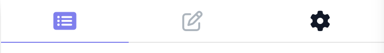

## The icons on a block

Hover any block on the canvas and a small row of icons appears on it, the same on every block:

- The **play** icon runs this block on its own so you can see what it produces - its tooltip reads
  **Run in test mode**.
- The **lightning** icon starts a run of the whole flow beginning at this block - **Run instance from this
  element**.
- The **chain** icon is the one you drag from to connect this block to the next - **Drag to connect with
  another block**.
- The **grey icon** at the lower left opens this block's [SLA settings](../platform/sla-goals.md).

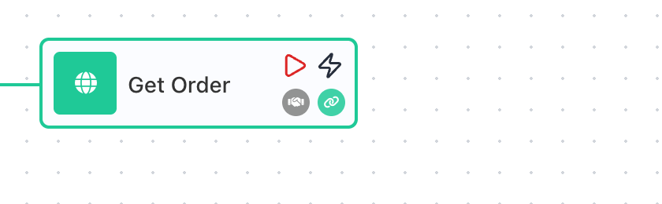

Running a single block and running a whole flow are covered in [Testing](../run/testing.md); connecting is
next.

## Connect blocks into a path

A connection sets the order the flow runs in: a run enters a block, the block finishes, and the run
travels along the connection to the next block. A connection decides where execution goes next - it does
not decide who uses the data. A block's result is available to every step that comes after it, and you
choose which of those steps actually read it when you fill in their fields. A block can have as many
outgoing connections as you draw - one continues a straight line of steps, and two or more start branches
that run at the same time, covered in [Running Steps in Parallel](flow-control/parallel.md).

You draw a connection by dragging from a block's chain icon - in the hover row covered above - onto the
block that comes next.

Some blocks have more than one outgoing branch, and each branch leaves the block as its own connection:

- A [Condition](../reference/condition.md){.fr-block} has two, **Yes** and **No**, one for each answer to
  the question you set.
- A [Value Router](../reference/value-router.md){.fr-block} and an
  [AI Router](../reference/ai-router.md){.fr-block} have one for every branch you name.

The canvas labels each of them, so you can read which path a run will take without opening anything.

To remove a connection, hover it: an **×** appears at its midpoint, and clicking it disconnects the two
blocks without touching either one.

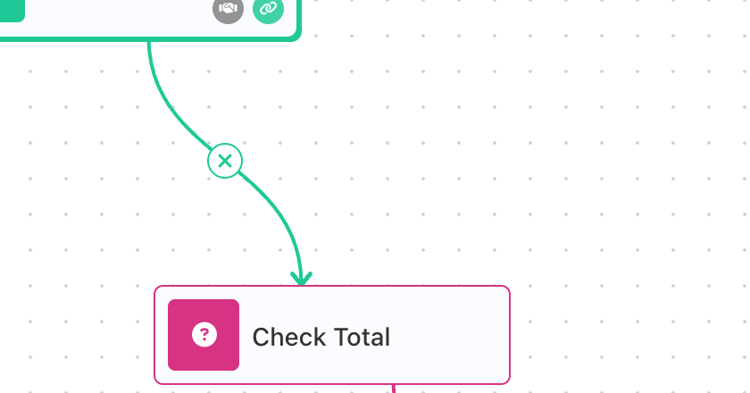

## Delete a block, or several at once

Select a block and use ((DELETE)) at the top of its settings, or press ++delete++ or ++backspace++ with
it selected. The editor names the block and asks you to confirm, because nothing undoes it.

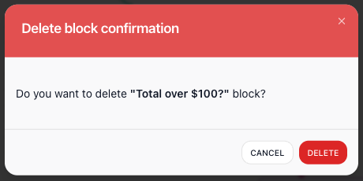

The connections go with the block. Delete one from the middle of a path and both the connection into it
and the connection out of it disappear, which leaves the block that followed it with nothing feeding it:
it picks up a red badge saying it is not connected to its parent, and the version drops from Ready to
**Not Ready** until you wire it back.

To work on a section of the flow at once, hold ++shift++ and drag a rectangle across the canvas. Every
block inside it is selected. Drag any one of them and the whole selection moves together, keeping its
shape; delete with the selection active and one confirmation names all of them.

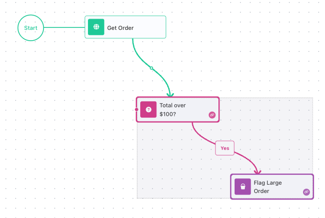

## Name your blocks and lay out the flow

Blocks arrive named after their type. Rename one in the **Name** field at the top of its settings, and
drag blocks around the canvas so the path reads in the order it runs. Give a block a name that says what
it does; for a [Condition](../reference/condition.md){.fr-block}, whose exits are **Yes** and **No**,
phrase the name as a question those two exits answer - a Condition named **Total over $100?** tells you at
a glance what its Yes and No mean.

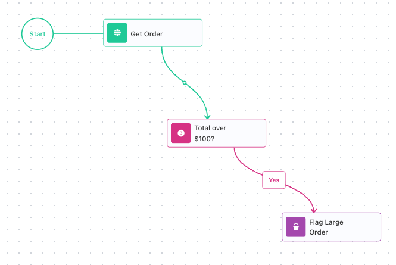

A block's name is also how later steps reach its result. By default a block's result is available under an
alias that is its name followed by `Result`, so a Condition named **Total over $100?** hands its result to
later steps as **Total over $100? Result**. Rename the block and that alias follows, and steps that
already read it re-point themselves, so nothing breaks and you can rename at any time.

When you want an alias that stays fixed, tick ((Reference Result Data As)) in the block's settings and
type the name you want. From then on it is yours: renaming the block leaves it alone.

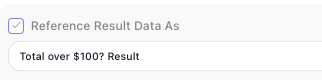

## Type a value, or pick one from earlier data

Selecting a block opens its settings. A field that can hold either kind of value carries a wand icon at
its right edge: type into the field for a fixed value, or click the wand icon to pick a reference to data
an earlier block produced. Picking, drilling into a result and combining values are covered in
[the Expression Editor](../learn/concepts/expressions.md).

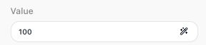

!!! note "How references appear in this documentation"

    In the product, a value picked from the Expression Editor sits in the field as a pill carrying the
    icon of the block it came from. Throughout this documentation those references wear a matching pill -
    {{Get Order Result->total}} - so you can always tell a reference to earlier data from a value that
    was typed in.

In the example below, the Total over $100? step compares two things. Its **Value to Check** holds a picked
reference, {{Get Order Result->total}} - the total from the step before it - while **Value** holds a
typed `100`.

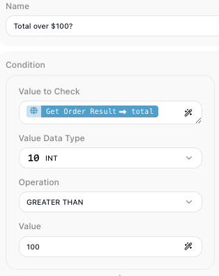

Most action blocks describe their result up front. A block from a Shared Extension or the Marketplace
ships with a sample of what it returns, so its fields are there to pick before the block has ever run. A
few blocks cannot know their shape in advance: an [HTTP Request](../reference/http-request.md){.fr-block}
does not know a response until it has received one, so nothing from it appears in the picker until you run
it once ([Testing](../run/testing.md) covers running a single block). After that first run the editor
remembers what came back, and its result opens up there like any other.

## Get the version to Ready

A block that is missing something carries a red badge on the canvas, and the number on it is how many
problems it has. Hover the badge and the editor names them.

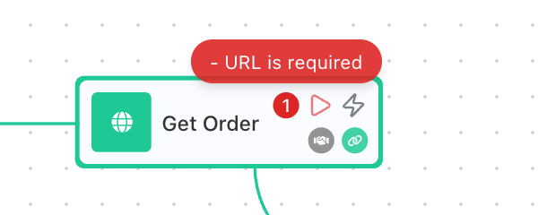

The version's status, at the right of the toolbar, says the same thing for the whole flow. While anything
is unfinished it reads **Not Ready**, and hovering it lists every problem grouped by the block it belongs
to - a required field left empty, or a block that is not connected to the path.

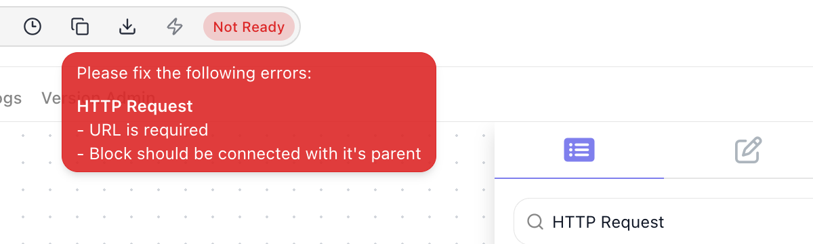

Fix the last one and the status flips to **Ready** immediately. Until it does, the ((Start flow)) control
at the left of the toolbar stays disabled - a version cannot go live with anything outstanding.

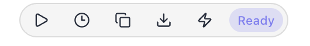

## Work inside a container block

Some blocks hold other blocks: a loop holds the steps it repeats, a group holds the steps that run
together. On the canvas they look like any other block, because their contents are not shown there - you
open them to see inside.

Hover one and ((Expand)) appears on it. Clicking it replaces the whole canvas with that block's own
contents, and a bar across the top names the block you are inside so you know where you are; leaving that
bar takes you back out to the flow around it.

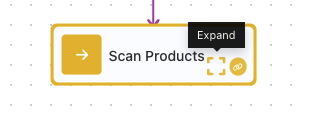

A newly added container opens **empty**: the canvas you are looking at belongs to the block, not to your
flow, so there is nothing in it yet. Anything you place while you are inside belongs to that container -
it runs once per pass of the loop, or as part of the group, not as a step of the outer flow. Building
inside one works exactly as it does outside - the same palette, the same connections, the same status.
[Repeating Steps](flow-control/repeating.md) and [Working Through a List](flow-control/collections.md)
cover what the loops themselves do.

## Test a block without going live

You do not have to put a version live to find out whether a step works. Two controls run a single block,
and they do the same thing:

- ((run block)) in the ((Test Panel)) at the top of the block's settings.
- the play icon in the block's own row of icons on the canvas, whose tooltip reads **Run in test mode**.

Either way the Test Monitor opens across the bottom and shows what the block took in and gave back. The
run is real - an action block genuinely performs its action - so [Testing](../run/testing.md) is worth
reading before you try one that reaches outside the flow.

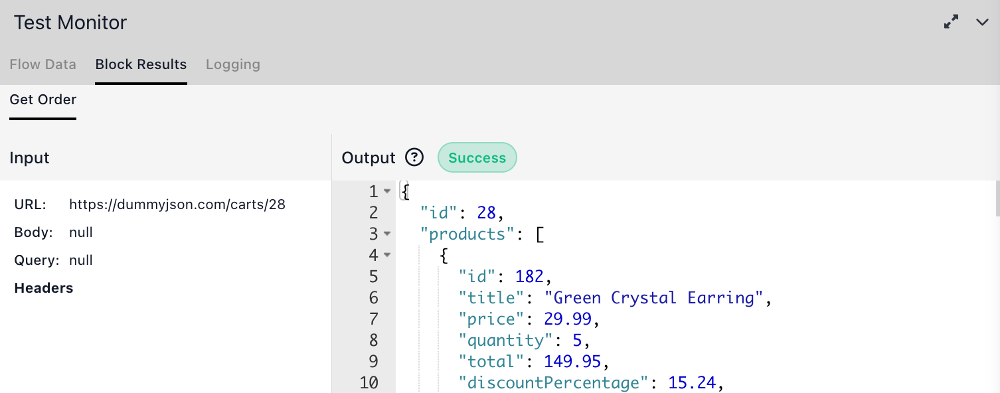

The lightning icon next to it is not a single-block test: it reads **Run instance from this element** and
starts a run of the flow itself. [Testing](../run/testing.md) covers the Test Monitor's tabs, giving a
flow its test data, and running a whole flow instead of one block.

## Change a flow that is already live

You always work on an editable draft. A version that is LIVE opens read-only: its first tab reads View
instead of Edit, and the palette is not there at all, so there is nothing to drag in.

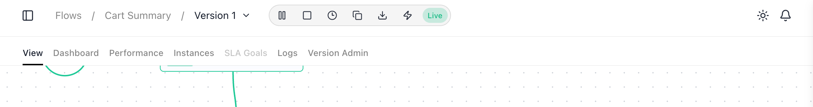

To change what it does, clone the live version, edit and test the copy, then start the copy: it takes
over as the live version and the old one steps aside, so the automation never stops running. Stopping the
live version also hands back an editable draft, but nothing runs while it is stopped.
[Running Flows](../run/running-flows.md) covers both.

## Things to watch for

- **There is no Save button, and no undo.** Every change is kept the moment you make it - nothing to save,
  and nothing to take back. The editor has no undo or redo control, and Cmd+Z does nothing to the flow: a
  block you moved stays where you dropped it, and a block you deleted stays deleted (inside a text field
  Cmd+Z still undoes your typing, but only there). Treat a delete as final.
- **A block you dropped and never wired looks finished but is not.** It sits there looking like any other
  block while holding the whole version at Not Ready; the status tooltip is what tells you.
- **A Condition takes one exit per run, not both.** Wiring Yes and No sends the run down one of them - it
  is a fork, not a fan-out. Two plain connections from one block are the fan-out
  ([Running Steps in Parallel](flow-control/parallel.md)).
