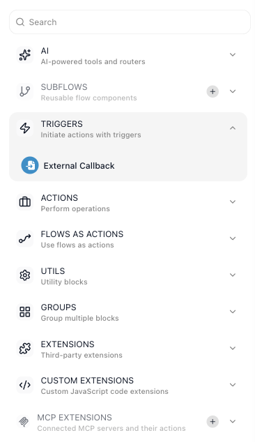
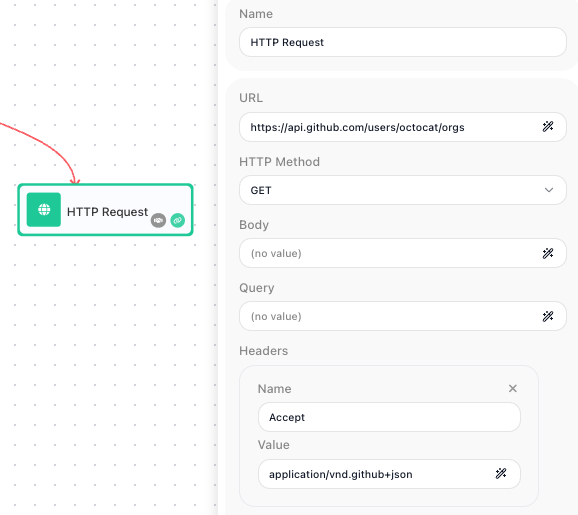

# Calling an External Service

Most flows have to reach something outside FlowRunner - look up a customer in your CRM, charge a card,
post a message to a channel, pull records from an internal API. There are two ways to do it, and picking
the right one saves a lot of work.

## Look for a dedicated block first

Many services already have a block of their own. Type the service name into the ((Search)) box at the top
of the block palette in the Flow Editor: a match means the work is done for you. A large library of
**Extensions** ships with FlowRunner - Airtable, Stripe, Slack, and many more - with nothing to install,
and a connected [MCP server](../../platform/mcp-servers.md) adds its tools as blocks the same way.

A dedicated block already knows the service's address and handles its authentication, so you fill in only
the parts that are about your request. Build the call by hand when the search comes back empty.

## Call anything else with HTTP Request

An [HTTP Request](../../reference/http-request.md){.fr-block} block reaches any service with a web API. You
are describing a call rather than writing networking code, and four fields describe it: the ((URL)) it goes
to, the ((HTTP Method)) that says what you mean to do there, the ((Body)) it carries, and the ((Headers))
that travel with it.

The address can be built from an expression, so a run can call
`/customers/{{Get Order Result->customerId}}` rather than a fixed URL.

Headers carry information about the request rather than the data it sends - the content type, what you will
accept back, and the credentials. The block has no separate credentials field, so an API key, a Bearer
token, or Basic credentials go in a ((Header)) as a ((Name)) and ((Value)) pair. When a call comes back
rejected, that is the first thing to check.

This is the reason to prefer a dedicated block or an MCP server where one exists: both use a connection you
authorize once, so no secret lives in the flow itself. See
[OAuth Connections](../../platform/oauth-connections.md).

## Read the response

The block's result is the response body, published under the block's alias - so name the block for what it
fetches and a later field reads {{Look Up Customer Result->email}}. The fields will not be listed until
the block has actually run once; see
[Passing Data Between Blocks](../data-and-variables/passing-data.md).

One thing to know before you write your success check: the result is the body alone, with no status code
or response headers wrapped around it. You cannot test the numeric status to tell success from failure.
Check for something the body itself contains - an id on a created record, or the error field the service
returns.

## When a call fails

<!-- doclint: no-shot: when-and-why for each safeguard; the Retry Policy panel is pictured on the HTTP Request reference and the recovery paths on Handling Errors -->

An outside service will eventually be slow, overloaded, or briefly unreachable, and by default a failed
call ends the run. Two settings cover it:

- **Retry the call itself.** Turn on the block's
  [Retry Policy](../../reference/http-request.md#retrying-a-failed-call) and it reattempts before reporting failure -
  you choose which status codes and network errors are worth retrying, how many attempts to make, and how
  long to wait between them. Retry only what is safe to repeat: a GET can be retried freely, while a POST
  that charges a card repeats that charge on every attempt.
- **Catch the failure that remains.** When the call has genuinely failed, a
  [Handle Error](../../reference/handle-error.md){.fr-block} block gives the run somewhere to go instead of
  stopping - fall back to a default, alert someone, or record it and carry on. See
  [Handling Errors](../flow-control/error-handling.md).

If the work on the other end takes minutes or days rather than seconds, do not hold the call open. Have
the service call you back when it is done. See
[Waiting on an External System](../flow-control/external-callbacks.md).

## Related

- [HTTP Request](../../reference/http-request.md){.fr-block} - every field, the retry policy, and a worked
  example
- [MCP Servers](../../platform/mcp-servers.md) - registering a server so its tools become blocks
- [Custom & Marketplace Actions](custom-actions.md) - adding blocks that are not built in
- [Handling Errors](../flow-control/error-handling.md) - recovery paths when a call fails
- [Returning a Result](returning-a-result.md) - the other direction: answering a caller of your flow
