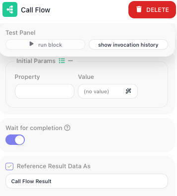

<!-- doclint: allow-unlinked: Wait -->
# Running Another Flow

When the same handful of steps turns up in several places - refresh a token, create a record, send a
notification the same way every time - build that work once and run it as a single step wherever it is
needed. A fix then lands in one place instead of being copied around and forgotten in one of them. It is
also how a flow that has grown hard to read gets shorter.

## Pick the right route

<!-- doclint: no-shot: a choice between three routes; each block's panel is pictured below and on its own reference page -->

- **[SubFlow](../../reference/subflow.md){.fr-block}** - a named mini-flow that lives inside this flow.
  Place it as many times as you like within the flow; every placement runs the one shared definition, so
  editing it updates them all. It belongs to this flow and is not shared with others.
- **[Call Flow](../../reference/call-flow.md){.fr-block}** - runs a separate, standalone flow as its own
  instance. Because that flow exists in its own right, any flow can call it, and it can be tested,
  versioned, and run on its own.
- **Flows as Actions** - your own flows also appear as blocks grouped under Flows as Actions, so you can
  pick one straight from there instead of configuring a Call Flow by hand. Either way, a whole separate
  flow runs as a step.

The rule of thumb: if the steps are only ever used inside this one flow, a SubFlow keeps them inline with
no second flow to manage. The moment another flow needs the same logic, build it as its own flow and call
it.

## Point it at the flow to run

A Call Flow block picks the flow from a dropdown of your workspace flows, and a ((Version)) selector
chooses which version of it to run.

!!! warning "The called flow has to be LIVE"
    Only a published flow can be started. The dropdown lists every flow in your workspace, including
    drafts, but calling one that is not LIVE will not run it. If a call seems to do nothing, check that
    the target flow is published rather than still in draft.

## Pass the values in

Both blocks list the values you hand over under ((Initial Params)). Each entry pairs a ((Property)) - the
name the called flow expects - with a ((Value)), an expression that supplies it from this flow.

Those Property names arrive as the called flow's **Initial Data**, and its steps read them the way any
flow reads the data it started with. A Property named `recipientEmail` is read inside the called flow as
{{Initial Data->recipientEmail}}.

A SubFlow declares the names it expects up front: you list them under ((Input Parameter Names)) when you
create it, and can edit them later from the subflow's entry in the Subflows list.

Give the called flow the values it needs and nothing more. It is a contract, and a short one is easier to
keep working.

## Read what comes back

<!-- doclint: no-shot: how the returned value is read downstream; the Return Result panel is pictured on Returning a Result -->

The called flow decides what it hands back with a
[Return Result](../../reference/return-result.md){.fr-block} block. That value comes back as the result of
the Call Flow or SubFlow block that ran it, so you read it under the calling block's alias. Name that
block `Issue Token` and a later step reads {{Issue Token Result->token}}.

If the called flow has no Return Result, it still runs, but gives you nothing structured to read. See
[Returning a Result](returning-a-result.md).

## Wait, or set it going and move on

A Call Flow block has one more decision: ((Wait for completion)), a toggle in its configuration panel
below the Initial Params rows.

- **On** - this flow pauses until the called flow finishes, then reads its returned value. Use it whenever
  you need the answer before carrying on.
- **Off** - the called flow is started and this flow continues immediately. There is no result to read;
  the block hands back an `executionId` identifying the run it launched. Use it to kick off work you do
  not need to wait for, like a long job you will check on later.

A SubFlow always runs inline as part of this run, so the question does not arise.

## Related

- [SubFlow](../../reference/subflow.md){.fr-block} - creating one, declaring its parameters, and expanding
  it to build the steps inside
- [Call Flow](../../reference/call-flow.md){.fr-block} - every field, including Version and Wait for
  completion
- [Subflows](../../learn/concepts/subflows.md) - the concept, and how a definition relates to its placements
- [Returning a Result](returning-a-result.md) - deciding what the called flow hands back
- [Flows as Agent Tools](../../reference/flows-as-agent-tools-concept.md) - letting an AI agent call your
  flows the same way
