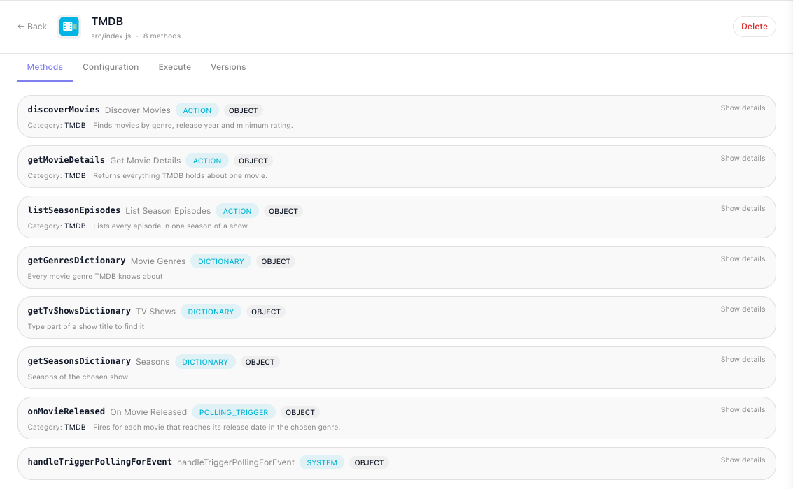
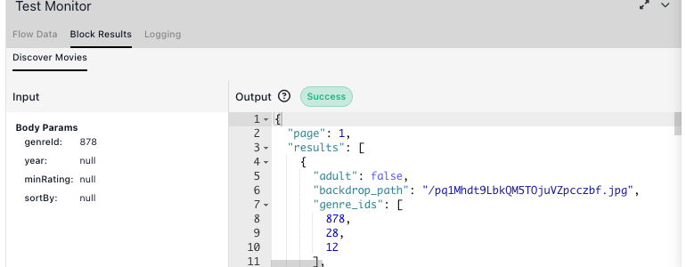

# Actions

An action runs your `execute` handler when the flow reaches it, and hands what the handler returns to the
rest of the flow. Register one with `ext.addAction()` and it appears in the palette under the category you
name.

```js
ext.addAction({
  category   : 'TMDB',
  id         : 'getMovieDetails',
  label      : 'Get Movie Details',
  description: 'Returns everything TMDB holds about one movie.',
  params     : z.object({
    movieId: z.string().label('Movie ID').describe('TMDB numeric id, e.g. 693134'),
  }),
  result : { id: 693134, title: 'Dune: Part Two', runtime: 167, vote_average: 8.133 },
  execute: async ({ params, apiRequest }) => {
    return apiRequest({ url: `/movie/${ params.movieId }` })
  },
})
```

## What you declare

| Property | Type | Required | What it does |
|---|---|---|---|
| `category` | string | yes | The palette group the block sits in. |
| `id` | string | yes | Persisted into every flow that places this block. Frozen once deployed. |
| `label` | string | yes | The name on the block. |
| `description` | string | yes | Shown under the label in the palette and the console. |
| `params` | `z.object` | no | The fields on the block. Leave it out for an action with no input. See [Parameters & Types](parameters-and-types.md). |
| `result` | sample | yes | A sample of what `execute` returns. |
| `execute` | function | yes | Called when the flow reaches the block. What it returns becomes the block's result. |
| `logo` / `appearanceColors` | string / `[string, string]` | no | Override the extension's, for this block only. |
| `oauth2Scopes` | string[] | no | Extra scopes, unioned with those in `ext.setupOauth2()`. See [OAuth2](oauth.md#scopes). |

Every action you register shows up on the extension's ((Methods)) tab with its kind and category:



((Show details)) on an entry lists its parameters, each with its type, whether it is required and its
description, and the sample result you declared. That is how you check what the deployed version actually
publishes.

<!-- 2026-10-06 DRIVEN on prod as a customer, Documentation Flows > TMDB service page > Methods: "Show details" on
     getMovieDetails expands to BODY PARAMETERS (movieId / STRING / required / "TMDB numeric id, e.g. 693134") and
     SAMPLE RESULT (the declared result JSON); the link then reads "Hide details". -->

## What the handler receives

`execute` is called with one object. Take what you need from it by name:

| Key | What it is |
|---|---|
| `params` | The parsed input for this action, typed from its own `params` schema. |
| `context` | Whatever `initContext` returned. |
| `config` | The values the workspace filled in. |
| `apiRequest` | Your shared HTTP helper, with `context` and `logger` already supplied. |
| `helpers` | The bound helpers your extension declared. |
| `logger` | `debug`, `info`, `warn`, `error`. Use it instead of `console.log`. |
| `oauth` | `{ accessToken, token }` when the extension declares `setupOauth2`. See [OAuth2](oauth.md). |
| `files` | The file client, when the extension declares `usesFileStorage`. See [Storing Files](files.md). |
| `filesScope` | The three storage layers as named constants: `filesScope.WORKSPACE`, `.FLOW`, `.EXECUTION`. |

## Input is already validated

The runtime checks the incoming values against `params` **before** `execute` runs. Values are converted to
the declared type, unknown fields are dropped, a blank field is resolved by its modifier, a `.default()` is
filled in, and a violation fails the block with a message that names the field by its label:

```
[flow-extension:tmdb] invalid params for method "discoverMovies" — minRating: «Minimum Rating» must be at most 10
```

That is what the Test Monitor shows for a bad value, and every offending field is listed at once. So do not
re-check required params or ranges by hand. Declare optionality and limits honestly instead, and let the
schema carry them - see [Parameters & Types](parameters-and-types.md#leaving-a-field-blank).

Not every entry point is equally strict, which matters when you write handlers other than an action's:

| Handler | Strictness |
|---|---|
| Action `params` | **Strict.** The flow engine produces these against the published model, so a violation is a real contract break. |
| Dictionary `criteria` | **Strict.** The console only calls a dictionary once the fields it depends on are filled. |
| Sample-result loader | **Waits for the required params.** The console calls it while a block is being edited, but only once every required field has a value, so a loader can assume its input is complete. |
| Polling trigger `params` | **Checked on every poll.** Each poll validates the saved trigger against `params`; a missing required field or a broken rule fails that poll with `invalid triggerData`. Fields you did not declare are kept. Declare filters `.optional()` and guard - see [Triggers](triggers.md#a-half-configured-trigger). |

## Declaring the result

`result` is a literal sample of what `execute` returns. Write the object and nothing else:

```js
result: {
  id          : 693134,
  title       : 'Dune: Part Two',
  release_date: '2024-02-27',
  runtime     : 167,
  vote_average: 8.133,
  genres      : [{ id: 878, name: 'Science Fiction' }, { id: 12, name: 'Adventure' }],
},
```

It is what a flow builder binds against when wiring your block's output into a later step, so **take it from
a real response**. An invented sample drifts from the API and misleads everyone who builds against it.

Do not declare a zod schema and attach a sample to it. A schema here describes the same thing twice, is
never checked against what `execute` actually returns, and only the sample is published anyway. Two cases
justify something else: a shape genuinely reused across several actions, declared once with
`z.object(...).example({...})`; and a shape not known until the flow builder has configured the block, which
takes a loader function `({ params, context, apiRequest }) => sample`.

## Return what the API returned

Extend the provider's response where its shape is unusable, but do not reduce it to the part you happen to
care about - every field you drop is one a flow builder cannot reach, and no number of extra actions gives
it back.

```js
// Throws away the response and answers with a boolean the API never sent
execute: async ({ params, apiRequest }) => {
  return { success: Boolean(await apiRequest({ url: `/movie/${ params.movieId }` })) }
},

// Hands back what the API said
execute: async ({ params, apiRequest }) => {
  return apiRequest({ url: `/movie/${ params.movieId }` })
},
```

The same applies to a list endpoint: return the items **and** the paging fields around them, not a bare
array. Adding a derived field is fine - spread the response and add to it.

Write `execute` with a block body and an explicit `return`. A concise arrow returning an object literal
reads as a shape declaration rather than a call, and it is where responses quietly get reshaped.

## Failing a block

Throw. The block's error exit carries the message, and the flow can handle it like any other block's
failure.

Normalize failures once, in `apiRequest`, rather than in every action - a non-2xx rejects with a
`ResponseError` whose `message` is the raw response body, so an unhandled one surfaces as
`[object Object]`. Keep `status` on the error you rethrow, because a dictionary needs it to tell an
unresolvable value from a rejected credential.

The Test Monitor shows the message, not a code, so make the message itself say what went wrong. A plain
`Error` you throw arrives as its message under a generic execution error; the runtime's own failures carry
a stable code as well: an `FR_EXT_*` code, or `INVALID_DICTIONARY_OUTPUT_SCHEME` for a dictionary that returns
neither a list nor `{ items }` - see [Troubleshooting](troubleshooting.md#error-codes).

## Trying an action without a flow

The ((Execute)) tab on the extension's page - **Custom Extensions** in the workspace navigation, then the
extension - runs a single method with values you type, which is the fastest way to confirm an action works
before building anything around it:


Inside a flow, the Test Panel at the top of a selected block's configuration does the same in place, and
the Test Monitor below the canvas shows the input alongside the result:



## Designing an action

- **One action, one operation.** A block that switches on a mode parameter has a `result` that describes
  none of its outputs.
- **Name the label for the canvas, not for the API** - `Get Movie Details`, not `movieEndpoint`. Ids are
  frozen after the first deploy; labels can change whenever you like.
- **Group with `category`** so related blocks arrive together in the palette.

<!-- 2026-09-29: the `dynamicParams` row ("Fields generated at runtime") was removed with the Parameters & Types
     section until FR-3685 is fixed (the flow editor never generates the fields). Restore both together. -->

## Related

- [Parameters & Types](parameters-and-types.md) - the fields on the block
- [Dictionaries](dictionaries.md) - filling a field from the live API
- [Testing](testing.md) - running an action through the real runtime with HTTP intercepted
- [Service Structure](service-structure.md) - where `apiRequest`, `context` and `helpers` come from

<!-- 2026-10-06 FULL RECHECK of this page against @flowrunner/cli 0.1.4 (latest), every claim run in a scratch project
     (sandbox runServiceMethod / jest / the CLI's own build and pack code; nothing deployed - a prod deploy was refused by
     the session's permission system). Console claims driven on app.flowrunner.ai, Documentation Flows, AS A CUSTOMER
     (staff mode off). Corrections made today are the WRONG items of that pass; NEEDS-PRODUCT items left as they were.
     The Custom Extensions NAV ITEM is hidden for customers (newCustomFlowExtensions = 0); its page opens by URL -
     wording that sends readers "to the workspace navigation" awaits Mark's decision (FOR-MARK item 1).
     Jira from this pass: FR-3710 (closed by Mark 2026-10-06: not an issue), FR-3711 (dedupe evicts integer ids
     wrongly), FR-3631 comments (template Request[method], lenient/scopes claims in ai-docs, cursor type, no jsconfig),
     FR-3310 comment (stale Not Ready on versions saved 09-22). -->
