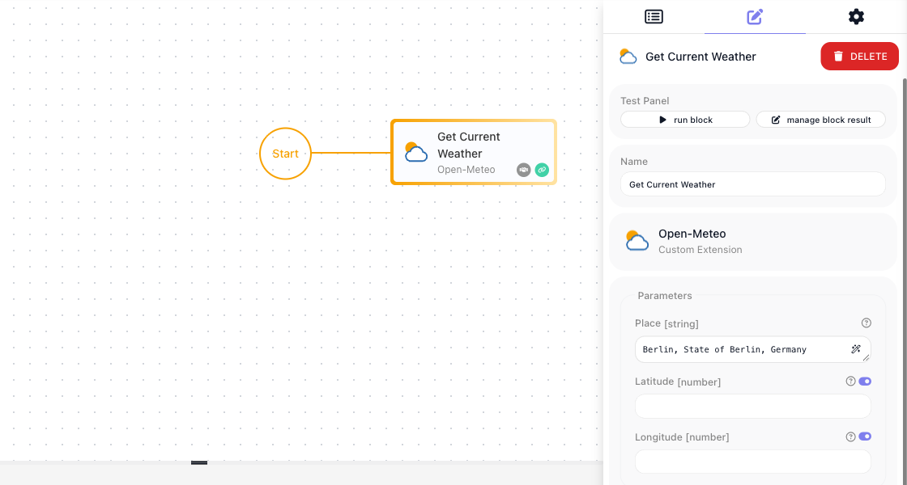
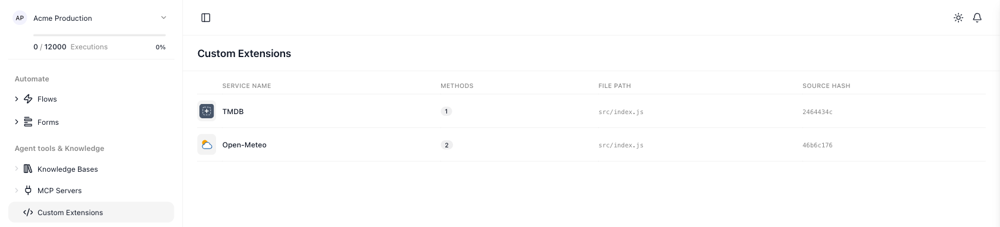
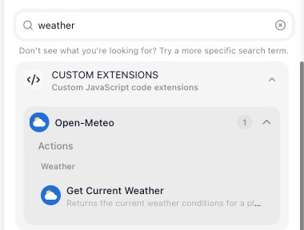

# Quick Start: Your First Extension (with AI)

When you finish this page, a block of your own, Get Current Weather, sits in the block palette of every flow
in your workspace and returns the current weather for a place you pick from a dropdown. You write one
sentence; Claude Code writes the service from a reference that ships with the FlowRunner™ CLI, and the CLI
deploys it. If you would
rather write the code yourself, take [Quick Start: Your First Extension (code)](getting-started.md).

!!! note "What you need"
    - **Node.js and npm.** Node 18.20+, 20.12+ or 22+.
    - **A FlowRunner workspace** you can sign in to.
    - **Claude Code**, installed and signed in. The service in this quick start uses Open-Meteo, which needs
      no API key.

## What you are building

The Get Current Weather block wired after Start, with Berlin picked from its Place dropdown. Run it and
Open-Meteo's current weather comes back in the Test Monitor:



## 1. Create the project

Open a terminal and enter the following command:

```bash
npx flowrunner-cli init -d my-extensions -s prod
cd my-extensions
```

`-s prod` points the project at the FlowRunner cloud. It is an `init` flag, so you pass it only here. The
package is `flowrunner-cli`; the command it installs is `flowrunner`, inside the project, which is why every
later command starts with `npx flowrunner`.

## 2. Connect it to your workspace

Run the following command:

```bash
npx flowrunner login
```

Your browser opens on a page headed **Authorize Cloud Code CLI**. Pick the workspace this project will deploy
to and choose ((Authorize)):


## 3. Install the FlowRunner agents

Run the following command:

```bash
npx flowrunner init-claude
```

```
Agents in .claude/agents:

  + flowrunner-service-code-engineer.md
  + flowrunner-service-test-engineer.md

  Created the FlowRunner instructions block in CLAUDE.md.

Next steps:
  1. open CLAUDE.md and check the FlowRunner block reads the way you want
  2. ask Claude Code to build a service — it will pick up the 2 FlowRunner agents
  3. the authoring reference lives in node_modules/flowrunner-cli/ai-docs/instructions/service-code-format/
```

Two FlowRunner agents for Claude Code land in the project: one writes a service, the other writes its tests.
Both read the authoring reference the CLI installed, so Claude Code knows the service format before you ask
for anything.

## 4. Ask for the service

Open Claude Code in the project and describe the service in one sentence:

> I need a service for the Open-Meteo weather API with a Get Current Weather action that takes either a place
> picked from a dropdown of places looked up by name, or a latitude and longitude.

Approve the file edits and the test run when Claude Code asks. It reads the reference, writes the service and
its tests, runs the tests, and reports back; the run behind this page took a few minutes. Your run will not
match this one line for line: the names, fields and test count come from Claude Code's report, so use the
names it gives you. Its report may say it could not call Open-Meteo while writing; the tests run with HTTP
intercepted, and the block calls the real API once deployed.

## 5. The service and tests it wrote

Claude Code created `services/open-meteo/`:

```
services/open-meteo/
  package.json
  README.md
  public/icon.svg
  src/index.js
  tests/open-meteo.test.js
```

The end of its report, trimmed:

```
**What was created** under `services/open-meteo/`:
- `src/index.js` with the service, one dictionary and one action. No config items, since Open-Meteo needs no API key.
- `README.md`, `package.json`, and a `public/icon.svg`.
- `tests/open-meteo.test.js`, socket-mocked, no real API calls.

**How the action works**
- The "Places" dictionary searches the Open-Meteo geocoding endpoint with the text the user types. Options are
  labelled like "Berlin, Berlin, Germany" and their value carries the coordinates, so the action needs no second lookup.
- "Get Current Weather" takes an optional `place` dropdown plus optional latitude and longitude numbers. A chosen
  place wins over typed coordinates. With neither a place nor both coordinates it fails with a clear message.
```

So the service exposes:

- a **Get Current Weather** action, which takes a place picked from a dropdown or a pair of coordinates
- a **Places** dictionary, the list behind that dropdown
- no configuration items, because Open-Meteo needs no key
- a 42-test suite

Run the tests yourself with the following command:

```bash
npm test
```

```
> my-extensions@0.0.1 test
> jest

Test Suites: 1 passed, 1 total
Tests:       42 passed, 42 total
Snapshots:   0 total
Time:        0.478 s, estimated 1 s
Ran all test suites.
```

Open `services/open-meteo/src/index.js` if you want to read what it did; you can change anything in it and
deploy again.

## 6. Deploy it

Run the following command:

```bash
npx flowrunner deploy
```

```
Deploying custom extensions...

  Connecting to Flowrunner Prod cluster (https://app.flowrunner.ai)
  Workspace "Acme Production" (3F2A9C41-7B10-4E52-9D64-0C81A7F5B2E3)
  Found 1 service under services/.

  Deploying 1 service:
    - new service: open-meteo (Open-Meteo) - [46b6c1764536] - packaged 11.2 KB

  Deployed 1 service to workspace "Acme Production" (3F2A9C41-7B10-4E52-9D64-0C81A7F5B2E3) — you can use it in a flow.
  Open Custom Extensions screen in the Flowrunner Console to configure it: https://app.flowrunner.ai/app/Acme%20Production/custom-extensions
```

The extension is now listed under **Custom Extensions** in the workspace navigation, with two methods: the
action and the dictionary. The TMDB row is the code quick start's extension in the same workspace:



## 7. Add the block to a flow

Open a flow, or create one, and type `weather` into the palette's ((Search)) box. Your action sits under
**Custom Extensions**, in the Open-Meteo group:



Drag it onto the canvas after ((Start)) and click the ((Place)) field. The picker you asked for opens, headed
**Select value for Place**: type `Berlin` into its search box and pick **Berlin, State of Berlin, Germany**.
Behind the list is the Places dictionary Claude Code wrote, calling Open-Meteo's geocoding as you type. Each
entry's value is the place's coordinates; the name is its label. Leave Latitude and Longitude empty:


## 8. Run it in the flow

Choose ((run block)) in the ((Test Panel)). The **Test Monitor** shows what you sent, the place's coordinates,
and the current weather Open-Meteo returned:


That is the extension running in your workspace.

## What to try next
<!-- doclint: no-shot: the Expression Editor's property picker is pictured on the code quick start (result-property-picker.png) -->

- **Read the result from a later block.** In any block after it, open the Expression Editor, choose
  **Get Current Weather Result** under **Block Data**, and pick a property; the result is flat, so
  {{Get Current Weather Result->temperature}} is the temperature. [Actions](actions.md) covers what an action
  can return.
- **Ask for more.** Follow-ups work the same way: "add an action for the seven-day forecast", "add a
  temperature unit parameter". Ask for a trigger where the API supports one - [Triggers](triggers.md).
- **Read what it wrote.** [Service Structure](service-structure.md) explains every part of the module,
  [Parameters & Types](parameters-and-types.md) the fields it chose, [Dictionaries](dictionaries.md) the
  dropdown.
- **Run the tests it wrote** and add your own - [Testing](testing.md).
- **Change it and deploy again.** Every later change is a request to Claude Code, or an edit of your own,
  followed by `npx flowrunner deploy`; an editor that is already open picks the new version up on its own.
  Versions, rollback and what a deploy does - [Deploying & Managing](deploying.md).
- **When something fails** - [Troubleshooting](troubleshooting.md).

## Related

- [The FlowRunner CLI](cli.md) - every command and flag, including `init-claude`
- [Quick Start: Your First Extension (code)](getting-started.md) - the same end state, written by hand

<!-- DRIVE LOG for this page (rewritten 2026-09-22 as the AI quick start; re-driven the same day after the gate).
     Environment: app.flowrunner.ai / Documentation Flows (Mark: docs verify against the released product), Playwright
     at 1680x1050, Mark signed in; flowrunner-cli 0.0.12 fetched by npx; Claude Code 2.1.280.
     STEP 1: `npx flowrunner-cli init -d my-extensions -s prod` run VERBATIM in an empty directory: Server line
     https://app.flowrunner.ai, flowrunner.json {serverUrl prod}, git first commit. (Package flowrunner-cli, bin
     flowrunner; bare `flowrunner` is "command not found" in a project - see cli.md's record.)
     STEP 2: login driven from the code quick start's project (authorize page captured there; the same token +
     workspace fields were copied into this project rather than logging in twice). Shot shared with getting-started.md
     (DOM substitutions listed there).
     STEP 3: `npx flowrunner init-claude` stdout verbatim. Both agent files reference
     ai-docs/instructions/service-code-format/; their descriptions: code engineer = anything touching src/index.js,
     test engineer = suites under services/{id}/tests/ with HTTP mocked at the socket.
     STEP 4: Claude Code run in the project with the request quoted on the page, non-interactively
     (`claude -p "..." --permission-mode acceptEdits --output-format text`); its report says the `npm test`
     wrapper "needed a permission approval the session did not grant" and it ran jest directly - hence the page's
     "approve the file edits and the test run when Claude Code asks". A first run with a looser request ("look up a
     place by name so I can pick it from a dropdown") produced a different service (two actions + dictionary, 54
     tests, labels "Berlin, State of Berlin, Germany") - hence the "your run will not match line for line" sentence.
     STEP 5: files as listed; the report block on the page is the end of the real report, trimmed (the
     "Verification" and "Two things to know" parts cut). `npm test` block = verbatim from this single-service project.
     STEP 6: bare `npx flowrunner deploy` in this single-service project, verbatim except the workspace name/id swap
     (also inside the console URL): new service 46b6c1764536 packaged 11.2 KB. Custom Extensions list: TMDB / 1 /
     2464434c and Open-Meteo / 2 / 46b6c176 (shot custom-extensions-list-ai.png, nav name swapped, 99+ badge hidden
     before capture).
     STEP 7: flow "Weather Check" on prod (kept). Palette search box placeholder "Search"; "weather" -> CUSTOM
     EXTENSIONS > Open-Meteo (1) > Actions > Weather > Get Current Weather (shot palette-ai.png, from the first
     deploy; names unchanged). Block dropped (elementId EXTENSION:::APP:::default:::open-meteo:::getCurrentWeather),
     auto-wired after Start. Place field: click -> "Select value for Place" picker with its own "type to search..."
     box; typing Berlin -> request payload.search "Berlin" -> 10 rows, first "Berlin, State of Berlin, Germany" (the
     agent's sample said "Berlin, Berlin, Germany"; the live geocoder's admin1 is "State of Berlin"). Picked it; the
     field shows the label, the value is "52.52437,13.41053". Shots ai-block-in-flow.png (empty Place, before the
     pick; viewport transform set by script, minimap/controls hidden, the collapsed Test Monitor bar hidden),
     ai-place-picker.png (picker open with Berlin typed).
     STEP 8: Run Block -> Success. Input place "52.52437,13.41053", latitude null, longitude null; Output flat:
     latitude 52.52, longitude 13.419998, timezone Europe/Berlin, elevation 46, time, interval 900, temperature 15,
     apparentTemperature 13.1 ... (shot ai-test-monitor.png, cropped on a complete row). Earlier the same day, with
     Latitude 52 and Longitude empty, the block failed with the agent's own message "«Latitude» and «Longitude»
     must be provided together".
     EDITOR REFRESH after a deploy: driven on the TMDB service (label change + deploy -> open editor's palette
     updated without a reload; placed block keeps its name) - see getting-started.md's log.
     NOT DRIVEN: an interactive Claude Code session (the run was `claude -p`); the "Ask for more" follow-ups; the
     Expression pill evaluated to a value; a second flow's palette for this service (done for TMDB).
     DEFECT: FR-3635 - z.number() params lose decimals at run time (52.52 ran as 52); this page uses the Place picker,
     a string value, so it does not depend on the fix. Retracted the same day: FR-3636 (dictionary picker "broken" -
     I had typed into the field, not the picker's search box). -->
