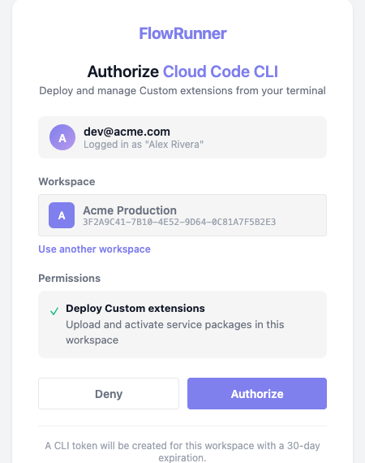

# The FlowRunner CLI

`flowrunner-cli` is the tool you author and deploy custom extensions with. It lives in your project as a
development dependency rather than on your machine, so everyone working on the repository runs the same
version and an upgrade is a commit like any other.

## Installing it

For a new project, one `npx` call is enough. `init` installs the CLI into the project it creates, so it is
the only command you run through `npx`:

```bash
npx flowrunner-cli init -d my-extensions
cd my-extensions
```

For a repository you already have, add the package and set it up in place:

```bash
npm install --save-dev flowrunner-cli
flowrunner init
```

Inside the project, `flowrunner` resolves from `node_modules`, so `flowrunner deploy` and
`npx flowrunner deploy` do the same thing.

## The project on disk

`init` produces this, and every later command reads it:

```
my-extensions/
  package.json             the project's own: the CLI and the test harness
  flowrunner.json          serverUrl, workspaceId, workspaceName - commit this
  .flowrunner/token        the deploy token - gitignored for you
  sandbox/                 the local test harness
  jest.config.js
  services/
    tmdb/                  one extension, and one npm package
      package.json         the service's OWN dependencies
      node_modules/        installed here, and shipped with the deploy
      src/index.js
      public/icon.svg
```

Each service is its own npm package. Run `npm install` inside `services/<id>/`, not at the project root -
only `services/<id>/node_modules` is packed, so a dependency installed at the root resolves on your machine
and then fails with `MODULE_NOT_FOUND` the first time the block runs.

Editing `workspaceId` by hand produces a `403` at deploy time, because the token is issued for one
workspace. Use `flowrunner login` to change it.

## The commands

| Command | What it does |
|---|---|
| `init [template]` | Creates the project and optionally scaffolds a first service |
| `create-service` / `cs [template]` | Scaffolds another service into `services/` |
| `use [target]` | Points the project at a server; with no argument, lists them |
| `login` | Authorizes the CLI in your browser and stores the deploy token |
| `logout` | Revokes the token and deletes it locally |
| `deploy` | Builds, packages and uploads services to the connected workspace |
| `pull` / `sync-services` | Downloads the workspace's services into `services/` so you can edit them |
| `init-claude` | Installs the FlowRunner agents into `.claude/` for Claude Code |

## Creating the project with `init`

`init` writes the project files, installs dependencies, and creates a git repository with a first commit:

```
Project directory:

  /Users/you/my-extensions
  a new directory

  + package.json
  + .gitignore
  + flowrunner.json
  + README.md
  + jest.config.js
  + jest.setup.js
  + sandbox/index.js
  + sandbox/service.js
  + sandbox/nock-mock.js
  + sandbox/files-mock.js

  Server: https://app.flowrunner.ai
```

**It never overwrites.** Run it inside a repository that already exists and it adds only what is missing,
reporting everything it left alone:

```
  already an npm project — its package.json will be kept, with the CLI added as a devDependency
  already has services/
  already tracked by git — no repository will be created and nothing will be committed

    package.json — already there, left alone
    .gitignore — already there, left alone
    flowrunner.json — already there, left alone
```

It is also how a project created before a harness file existed picks one up. It does not refresh a harness
file that is already there, so after upgrading the CLI copy the current `sandbox/` over yours - see
[Testing](testing.md#upgrading-the-harness).

Useful options:

- `-d, --dir <path>` - the project root, created if missing. Defaults to the current directory.
- `-s, --server <target>` - which server to bind to, written into `flowrunner.json`.
- `-y, --yes` - accept the target directory and every template default without asking.
- `--no-install` / `--no-git` / `--no-tests` - skip the `npm install`, the git repository, or the test
  harness.

If `git` cannot commit because `user.name` and `user.email` are unset, `init` warns and leaves the files
staged rather than failing.

## Scaffolding a service with `cs`

`create-service`, or `cs`, adds a service folder. `--list` shows what is available:

```
Available templates:

  demo-todo-list  Demo To-do List (default)
                  A working to-do list service — lists, tasks, completion, plus a generic HTTP Request action.
  blank           Blank
                  A minimal service — one action, ready to build on. Optionally with OAuth2 and file storage wired up.
  qa-test         QA Test Harness
                  Exercises every custom-extension capability so QA can verify a deployment end to end.
```

Pass the answers as flags to skip the prompts:

```bash
flowrunner cs blank --id tmdb --name "TMDB" -y
```

```
  Created services/tmdb/
    src/index.js
    README.md
    public/icon.svg
```

A service id must start with a lowercase letter and contain only lowercase letters, digits and dashes. It
becomes the folder name under `services/` and the id persisted into every flow that places one of the
extension's blocks, which is why it is frozen once deployed. The CLI refuses anything else:

```
  Service id must start with a lowercase letter and contain only lowercase letters, digits and dashes —
  it becomes the folder name and the service id, which is frozen once deployed
```

## Choosing a server with `use`

With no argument, `use` lists the servers and marks the one this project is bound to:

```
Servers:

  prod   https://app.flowrunner.ai   ← current, logged in to Acme Production
  dev    https://dev.flowrunner.ai
  local  http://localhost:3000

  flowrunner use <name>   — switch, detaching the current login
```

`prod` is the FlowRunner cloud; `dev` and `local` are FlowRunner's own clusters. You can also pass a full
URL for a server of your own.

Switching servers clears the stored workspace and the token, because both only mean something on the server
that issued them. Running `use` with the server already selected changes nothing.

## Connecting to a workspace with `login`

`login` starts a callback server on a local port, opens your browser, and waits:

```
  Connecting this project to a Flowrunner workspace on https://app.flowrunner.ai.

  Authorize the CLI in your browser and pick the workspace to deploy to:

    https://app.flowrunner.ai/developer/cli/authorize?callback=http%3A%2F%2Flocalhost%3A56888%2Fcallback&clientType=cloud-code-deploy

  Waiting for authorization...
```

The browser round trip times out after two minutes, and the URL is printed so you can open it by hand if no
browser launches.

On the authorize page you pick the workspace this project will deploy to. ((Authorize)) stays disabled
until one is chosen, and the token it issues expires after 30 days.


The choice is written back to `flowrunner.json`:

```json
{
  "serverUrl": "https://app.flowrunner.ai",
  "workspaceId": "3F2A9C41-7B10-4E52-9D64-0C81A7F5B2E3",
  "workspaceName": "Acme Production"
}
```

Commit that file. The token goes to `.flowrunner/token`, which `init` has already gitignored.

Once a `workspaceId` is recorded, later logins show that workspace already selected, and ((Authorize)) is
enabled straight away. To move the project somewhere else, choose ((Use another workspace)) and the full
list comes back.



`logout` revokes the token on the server and deletes the local copy. It leaves `workspaceId` in place, so
logging in again returns you to the same workspace.

## Deploying

A deploy carries **one service at a time**, so several projects, repositories or people can deploy into the
same workspace and coexist.

With one service in the project, `deploy` sends it. With several it asks which:

```
Which services should be deployed?

❯ All services [tmdb, invoicing]
  tmdb (TMDB) — modified
  invoicing (Invoicing) — new
```

The output says what actually changed:

```
Deploying custom extensions...

  Connecting to Flowrunner Prod cluster (https://app.flowrunner.ai)
  Workspace "Acme Production" (3F2A9C41-7B10-4E52-9D64-0C81A7F5B2E3)
  Found 1 service under services/.

  Deploying 1 service:
    - modified service: tmdb (TMDB) - [1258d5f80c44] - packaged 11.4 KB

  Deployed 1 service to workspace "Acme Production" (3F2A9C41-…) — you can use it in a flow.
```

Every service is compared against the workspace before anything is packaged, and labelled `new`,
`modified` or `same`. A `same` service is byte-for-byte what is already live, so it is skipped rather than
republished. The twelve-character hash is the version id: it covers `services/<id>/` and nothing else,
which is why the same code produces the same version in anybody's checkout.

The definition is built on your machine rather than on the server, so a service whose module throws on load
fails at `deploy` time rather than silently in the workspace afterwards. One that fails to build is skipped
with its reason and the rest still deploy; if nothing builds, the deploy stops and reports every reason.

- `-s, --service <id...>` - deploy named services, repeatable and variadic.
- `--all` - every service, though still only the changed ones are uploaded.
- `--force` - upload even a service the workspace already has byte for byte.

The uploaded archive is capped at **50 MB**, and it carries the service's `node_modules`, so a service with
heavy dependencies can reach it.

**Service ids are unique per workspace.** The id is the folder name under `services/`, and two projects
that both define `tmdb` overwrite each other's versions with no warning, since nothing records which
project a version came from. Agree ids across teams before two repositories deploy into one workspace. The
id is also frozen once deployed: renaming the folder deploys a *different* extension and leaves the old one
live under its old id.

!!! note "A failed `--all` is not rolled back"
    Services deploy one after another and independently. If the third fails, the first two stay deployed.
    Re-running is safe, because an unchanged service produces the same version and is skipped.

## Removing a service

Deleting `services/<id>/` and deploying again does **not** remove the extension. The deploy only touches
what it carries, so the service stays live in the workspace on its last deployed version.

To remove one, open it under **Custom Extensions** in the console and use ((Delete)). It asks to confirm,
and it removes the service **and every version of it** - there is no undo and no rollback afterwards.

!!! warning "Remove the blocks from your flows first"
    Nothing checks which flows use an extension before deleting it, and nothing warns you. Any flow still
    holding one of its blocks is left referring to something that no longer exists. Take the extension's
    blocks out of every flow that uses them **before** you delete it.


## Pulling services back down

`pull` (also `sync-services`) copies the workspace's services into `services/`. It is how a fresh checkout
picks up what is live, including extensions somebody else deployed from a different project:

```bash
flowrunner init && flowrunner login && flowrunner pull --all
cd services/tmdb && npm install
```

Each service arrives whole, its own `package.json` included, but without `node_modules` - the CLI names the
folders that need an `npm install` rather than running one for you.

`pull` takes the same `-s` and `--all` as `deploy`. Its `--force` behaves the opposite way round, on
purpose: a local copy that differs is skipped unless you force it, and a file you added counts as
"differs", so a pull cannot quietly delete your work.

## Running without a terminal

Every command works non-interactively. Prompts appear only on a TTY, and a question that cannot be answered
becomes an error with a stable code rather than hanging. `-y` accepts every default, and `--id`, `--name`
and `--set name=value` answer template prompts directly, which is what a CI job uses.

When a command fails it prints the reason and what to do about it:

| Code | What it means |
|---|---|
| `FR_NOT_LOGGED_IN` | Run `flowrunner login` first - it needs a browser |
| `FR_NO_WORKSPACE` | Run `flowrunner login` to pick one |
| `FR_TOKEN_EXPIRED` | The session expired; log in and deploy again |
| `FR_NOT_A_PROJECT` | Run `flowrunner init` to create one |
| `FR_NO_SERVICES_DIR` | Run `flowrunner cs` to create a service first |
| `FR_NO_SERVICES` | Each service needs a `src/index.js` calling `Flowrunner.createExtension` |
| `FR_PROMPT_REQUIRED` | Pass `--yes`, or supply the value as a flag |

## Working with Claude Code

`init-claude` installs the FlowRunner agents into the project and adds a block to `CLAUDE.md`, so an
assistant working in the project already knows the authoring format:

```
Agents in .claude/agents:

  + flowrunner-service-code-engineer.md
  + flowrunner-service-test-engineer.md

  Created the FlowRunner instructions block in CLAUDE.md.
```

Files under `.claude/agents/` named `flowrunner-*` belong to the CLI and are overwritten on every run, so
`npm install -D flowrunner-cli@latest` followed by `flowrunner init-claude` moves the agents to the version
matching the installed CLI. Your own agents, under your own names, are left alone. The command replaces
only the region between its `<!-- flowrunner-cli:ai:start -->` and `<!-- flowrunner-cli:ai:end -->` markers
and leaves the rest of `CLAUDE.md` byte for byte.

What the agents do with all that, and how to work with them, is [Let AI Build It](ai-assisted.md).

## Related

- [Let AI Build It](ai-assisted.md) - what `init-claude` installs, and the loop it enables
- [Write It Yourself](getting-started.md) - the whole loop, from install to a deployed extension
- [Custom Extensions](index.md) - what an extension is and what it can do
- [Testing](testing.md) - the harness `init` copies into the project
