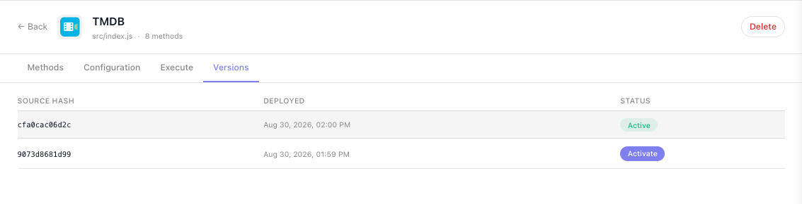
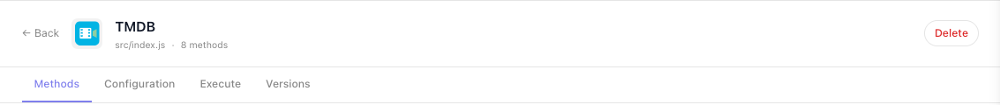

# Deploying & Managing

`npx flowrunner deploy` is one command, but what it leaves behind is a versioned extension in a workspace that
other people's flows depend on. The command and its flags are on [The FlowRunner CLI](cli.md); this page is
what happens around it.

## What a deploy sends

Most of the behaviour below follows from two properties:

**The definition is built on your machine.** The CLI loads your module, models it, and uploads the model
with the package. The server never executes your code to work out what it offers, so a service that throws
on load fails at `deploy` time rather than silently in the workspace afterwards.

**The unit is one service.** A deploy carries the services you named and leaves every other extension on
the version it was already running.

## Configure it before it runs

A deploy uploads the code and nothing else. Every value the service declares in `configItems` - an API key,
a base URL - is empty in the workspace until someone fills it in on the service's ((Configuration)) tab
under **Custom Extensions**. Until a required one is filled in, every block from that service fails with
`invalid config — … is required`, including blocks that never read it. Fill them in
once per workspace, right after the first deploy. Later deploys keep the values, as
[Configuration outlives deploys](#configuration-outlives-deploys) describes.


[Quick Start: Your First Extension (code)](getting-started.md#6-give-the-workspace-your-tmdb-key) walks through filling it in and confirming the
key on the ((EXECUTE)) tab before building a flow around it.

## Versions and the source hash

Every deploy produces a twelve-character hash. It covers every file under `services/<id>/` except
`node_modules/`, and nothing outside the folder, which is what lets it answer two questions at once: which version is this, and is this the same code as what is
already deployed.

That is why deploying twice without an edit reports `same service` and uploads nothing, and why the same
code produces the same version in anybody's checkout. The console shows the first eight characters of it in
the **Source Hash** column of the Custom Extensions list. Deploying code that matches an older version
reports `modified service` with that older hash and uploads it again.

Each service keeps its history on its own ((Versions)) tab, with the active one marked and an ((Activate))
button on every other:



**Rollback is per service and immediate.** Activating an earlier version switches that service over and
leaves every other extension alone. Nothing is uploaded, because the archive is already stored.

## Configuration outlives deploys

Config values live separately from the code, keyed per service, so they survive redeploys and rollbacks:

- **Adding a config item** leaves the existing values alone. The new field is empty until someone fills it
  in, so a required one added mid-life will break runs until they do.
- **Renaming one** is a new field. The old value is not carried across.
- **Rolling back** restores the code only. If someone changed a config value after the version you roll
  back to, the newer value is what the older code reads.

## The caches between a deploy and a run

Three caches sit between a deploy and a running flow:

| Cache | What it holds | When it clears |
|---|---|---|
| Definitions | the model the flow editor draws from | on deploy, activate and delete |
| Pod package | the extracted package, keyed by source hash | never invalidated, only added to |
| Editor bundle | the block list in an open editor | on deploy, refreshed in place |

The pod cache being keyed by hash is why the **first execution after a deploy is slower**: that hash has
never been extracted before. It is also why `--force` exists, for the rare case where the stored archive is
wrong while its hash still matches.

An editor that was already open refreshes its palette after a deploy on its own; a block already placed keeps
the name it was given when it was placed.

## Removing an extension

Deleting `services/<id>/` from your project and deploying again does **not** remove it. The deploy only
touches what it carries, so the service stays live in the workspace on its last deployed version.

Removal is explicit: open the service under **Custom Extensions** and use ((Delete)). It confirms first, and
it removes the service **and every version of it**. There is no undo, and no rollback afterwards.



!!! warning "Remove the blocks from your flows first"
    Nothing checks which flows use an extension when you delete it. The next time someone opens such a flow,
    the editor stops on an **Unrecognized Blocks exist in the Flow** dialog that lists the missing blocks, and
    editing the flow from there deletes the data stored in them. Take the extension's blocks out of every flow
    that uses them **before** you delete it.


<!-- 2026-10-06 DRIVEN on prod (Documentation Flows): fixture service docs-probe deleted from its page (dialog "Delete
     'Docs Probe' and all of its deployed versions? This cannot be undone." - no mention of flows); opening the scratch
     flow that held its On Tick trigger and Colored Action block -> this dialog, plus an "Unrecognized Blocks" badge
     beside Not Ready in the toolbar. The dialog shows Service Name "undefined" for the action (cosmetic). Scratch flow
     deleted afterwards. Rollback DRIVEN the same day: Activate on an older version switched it at once, with no
     confirmation; the saved config survived the rollback. -->

## Several projects, one workspace

A workspace accumulates extensions from any number of separate repositories and checkouts.

The risk is naming. **Service ids are unique per workspace**, and nothing records which project a
version came from, so two projects that both define `tmdb` overwrite each other's versions silently. Agree
ids across teams before two repositories deploy into one workspace.

`npx flowrunner pull` is the other half of this. It downloads the workspace's services into `services/`, so a
fresh checkout can pick up whatever is live, including an extension somebody else deployed. Install the
project's packages first, because `npx flowrunner` runs the copy in `node_modules`:

```bash
npm install && npx flowrunner login && npx flowrunner pull --all
cd services/tmdb && npm install
```

## Deploying from CI

A CI job has no terminal to answer a prompt. In a project with more than one service, a bare `deploy`
cannot ask which one and stops rather than guessing, so name what you want:

```bash
npx flowrunner deploy --all
```

The token lives in `.flowrunner/token`, which is gitignored, so a pipeline writes it to that file from a
secret. The CLI reads it from nowhere else. Only
changed services are uploaded, so running the job on every commit is cheap.

Two things to design for:

- **There is no all-or-nothing rollback.** Services deploy one after another. If the third fails, the first
  two stay deployed. Re-running is safe, because unchanged services produce the same version and are
  skipped.
- **A token expires after 30 days**, and renewing it is a browser round trip, so a pipeline needs someone to
  refresh it every 30 days.

## Separate environments

One project directory is bound to one workspace. For a staging workspace and a production one, use two
checkouts, each with its own `flowrunner.json` and token, and deploy the same code into both.

To move a single project somewhere else, run `npx flowrunner login` and pick a different workspace on the
authorize page - see [The FlowRunner CLI](cli.md#connecting-to-a-workspace-with-login).

## Before you ship a new version

- The unit suite passes, including the failure branches.
- Ids are unchanged - `id` on the extension, on every action, trigger and dictionary, and every key in a
  `params` schema. Changing one breaks the flows already using it.
- Any new config item is either optional or communicated to whoever administers the workspace.
- `result` samples match what the API actually returns now, since flow builders bind against them.
- The service README describes what changed.

## Related

- [The FlowRunner CLI](cli.md) - `deploy`, `pull` and their flags
- [Troubleshooting](troubleshooting.md) - what to do when a deploy or an execution fails
- [Testing](testing.md) - the suite that runs before you deploy

<!-- 2026-09-22 (FR-3627): added "Configure it before it runs" - the configuration step was only on
     getting-started.md. Screenshot reused from that page (configuration-tab-minimal.png, driven 2026-08-31).
     Commands switched to `npx flowrunner` - see the drive record on cli.md. -->

<!-- 2026-10-06 FULL RECHECK of this page against @flowrunner/cli 0.1.4 (latest), every claim run in a scratch project
     (sandbox runServiceMethod / jest / the CLI's own build and pack code; nothing deployed - a prod deploy was refused by
     the session's permission system). Console claims driven on app.flowrunner.ai, Documentation Flows, AS A CUSTOMER
     (staff mode off). Corrections made today are the WRONG items of that pass; NEEDS-PRODUCT items left as they were.
     The Custom Extensions NAV ITEM is hidden for customers (newCustomFlowExtensions = 0); its page opens by URL -
     wording that sends readers "to the workspace navigation" awaits Mark's decision (FOR-MARK item 1).
     Jira from this pass: FR-3710 (closed by Mark 2026-10-06: not an issue), FR-3711 (dedupe evicts integer ids
     wrongly), FR-3631 comments (template Request[method], lenient/scopes claims in ai-docs, cursor type, no jsconfig),
     FR-3310 comment (stale Not Ready on versions saved 09-22). -->
