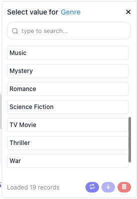

# Dictionaries

A dictionary fills a field with options fetched from the live API, so the flow builder picks
**Science Fiction** instead of knowing that the genre id is `878`.



Register one with `ext.dictionary()`, then bind it to a param with `.dictionary()`:

```js
const getGenresDictionary = ext.dictionary({
  id         : 'getGenresDictionary',
  label      : 'Movie Genres',
  description: 'Every movie genre TMDB knows about',
  result     : { items: [{ label: 'Action', value: '28' }], cursor: null },
  execute    : async ({ search, apiRequest }) => {
    const response = await apiRequest({ url: '/genre/movie/list' })
    const term     = search?.trim().toLowerCase()

    const items = (response.genres ?? [])
      .filter(genre => !term || genre.name.toLowerCase().includes(term))
      .map(genre => ({ label: genre.name, value: String(genre.id) }))

    return { items, cursor: null }
  },
})

const genreIdParam = z.string()
  .label('Genre')
  .dictionary(getGenresDictionary)
```

## What you declare

| Property | Type | What it does |
|---|---|---|
| `id` | string | Persisted with the param that binds to it. Starts with `get`, ends with `Dictionary`. |
| `label` | string | Its human name. Dictionaries are exposed to AI tools, so always set one. |
| `description` | string | Tells the flow builder what to type, which matters when the field is a search. |
| `criteria` | `z.object` | The fields this dictionary depends on. |
| `result` | sample | A sample `{ items, cursor }`. |
| `execute` | function | Returns the options. |

`execute` receives the usual handler bag plus three things of its own: `search`, the text the flow builder
has typed; `cursor`, for paging; and `criteria`, resolved and parsed.

It returns `{ items, cursor }`, where each item is `{ label, value, note? }`. Return a bare array when the
source has no paging. `label` is what the builder sees, `value` is what your handler receives, and `note` is
a second line under the label, for telling similar names apart.

Once something is chosen, the field holds the label, and your handler gets the value behind it:


## Browse or resolve

`execute` gets the text the flow builder typed, which makes two different dictionaries possible. Only the
first needs an endpoint that lists anything.

**Browse** - the API can enumerate. Return the set, filter it by `search`, page with `cursor`. Genres above
are a browse dictionary: TMDB returns all nineteen in one call, so the filtering happens locally.

**Resolve** - the API has no listing endpoint but can look one thing up. Call that lookup with `search` and
return what it finds:

```js
const getTvShowsDictionary = ext.dictionary({
  id         : 'getTvShowsDictionary',
  label      : 'TV Shows',
  description: 'Type part of a show title to find it',
  result     : { items: [{ label: 'Severance (2022)', value: '95396' }], cursor: null },
  execute    : async ({ search, cursor, apiRequest }) => {
    if (!search?.trim()) {
      return { items: [], cursor: null }
    }

    const page     = cursor ? Number(cursor) : 1
    const response = await apiRequest({ url: '/search/tv', query: { query: search.trim(), page } })

    const items = (response.results ?? []).map(show => ({
      label: `${ show.name }${ show.first_air_date ? ` (${ show.first_air_date.slice(0, 4) })` : '' }`,
      value: String(show.id),
      note : show.overview ? truncate(show.overview, 80) : undefined,
    }))

    return { items, cursor: page < (response.total_pages ?? 1) ? String(page + 1) : null }
  },
})

function truncate(text, max) {
  return text.length > max ? `${ text.slice(0, max - 1) }…` : text
}
```

**"The API has no endpoint that lists these" is not a reason to leave a field as free text.** It rules out
browse, not resolve. A resolve dictionary still checks the value before the flow runs, still shows the
builder the name of the thing they picked rather than a bare id, and still offers the field to AI tools as
something resolvable. Reach for plain text only when the API can neither list nor look the value up, and say
so in the service README when that happens.

## Fields that depend on another field

`criteria` declares what a dictionary needs before it can run, and every param bound to it derives its
dependency automatically. A season only means something inside a show:

```js
const getSeasonsDictionary = ext.dictionary({
  id         : 'getSeasonsDictionary',
  label      : 'Seasons',
  description: 'Seasons of the chosen show',
  criteria   : z.object({ tvId: z.string().label('Show') }),
  result     : { items: [{ label: 'Season 1', value: '1', note: '9 episodes' }], cursor: null },
  execute    : async ({ criteria, apiRequest }) => {
    const show = await apiRequest({ url: `/tv/${ criteria.tvId }` })

    return {
      items : (show.seasons ?? []).map(season => ({
        label: season.name,
        value: String(season.season_number),
        note : `${ season.episode_count } episodes`,
      })),
      cursor: null,
    }
  },
})
```

An action using both fields declares nothing extra:

```js
params: z.object({
  tvId        : z.string().label('Show').dictionary(getTvShowsDictionary),
  seasonNumber: z.string().label('Season').dictionary(getSeasonsDictionary),
}),
```

The published model carries the dependency for you:

```json
"seasonNumber": {
  "label": "Season",
  "dictionary": "getSeasonsDictionary",
  "dependsOn": ["tvId"]
}
```

The Season field waits until a show is chosen, and re-resolves when the choice changes.

List exactly what `execute` needs and mark anything genuinely optional as such - a criteria failure is
reported separately so the editor can point at the field that is missing.

## An empty list means "nothing matched", not "something broke"

This one fails quietly. A dictionary that catches everything and returns no items hands the flow builder an
empty dropdown and no way to learn that the API key is wrong.

Split on what the API is telling you:

- **The value does not exist or is not visible** - typically a `400` or `404`. Return
  `{ items: [], cursor: null }`.
- **The request could not be made** - `401`, `403`, `429`, `5xx`, a dropped connection. Let the error
  propagate.

```js
execute: async ({ criteria, apiRequest }) => {
  try {
    const show = await apiRequest({ url: `/tv/${ criteria.tvId }` })

    return { items: seasonsOf(show), cursor: null }
  } catch (error) {
    if (error?.status === 404 || error?.status === 400) {
      return { items: [], cursor: null }        // no such show
    }

    throw error                                 // a bad key is not "no seasons"
  }
},
```

`seasonsOf` is the mapping from the seasons dictionary above, moved into a plain function at the end of the
file:

```js
function seasonsOf(show) {
  return (show.seasons ?? []).map(season => ({
    label: season.name,
    value: String(season.season_number),
    note : `${ season.episode_count } episodes`,
  }))
}
```

This is why `apiRequest` should keep `status` on the error it rethrows: without it, the two cases are
indistinguishable here.

A browse path deserves more suspicion than a resolve path: where the endpoint always returns at least one
row, an empty list has no legitimate reading.

## Naming and placement

- **Name it `get…Dictionary`**, and give the constant holding it the same name, so the declaration and every
  `.dictionary()` read alike.
- **Declare it above the params that use it.** The file is resolved top to bottom.
- **Share one dictionary across actions.** The same `getGenresDictionary` backs an action's field and a
  trigger's filter.
- **Reach for one whenever a field is an id.** A flow builder should not have to go and look a value up by
  hand.

## Related

- [Parameters & Types](parameters-and-types.md) - binding a dictionary to a field with `.dictionary()`
- [Actions](actions.md) - the handler bag a dictionary's `execute` shares
- [Testing](testing.md) - covering the mapping, an unmatched search, and the failure branch

<!-- 2026-10-06 FULL RECHECK of this page against @flowrunner/cli 0.1.4 (latest), every claim run in a scratch project
     (sandbox runServiceMethod / jest / the CLI's own build and pack code; nothing deployed - a prod deploy was refused by
     the session's permission system). Console claims driven on app.flowrunner.ai, Documentation Flows, AS A CUSTOMER
     (staff mode off). Corrections made today are the WRONG items of that pass; NEEDS-PRODUCT items left as they were.
     The Custom Extensions NAV ITEM is hidden for customers (newCustomFlowExtensions = 0); its page opens by URL -
     wording that sends readers "to the workspace navigation" awaits Mark's decision (FOR-MARK item 1).
     Jira from this pass: FR-3710 (closed by Mark 2026-10-06: not an issue), FR-3711 (dedupe evicts integer ids
     wrongly), FR-3631 comments (template Request[method], lenient/scopes claims in ai-docs, cursor type, no jsconfig),
     FR-3310 comment (stale Not Ready on versions saved 09-22). -->
