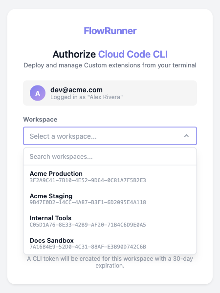
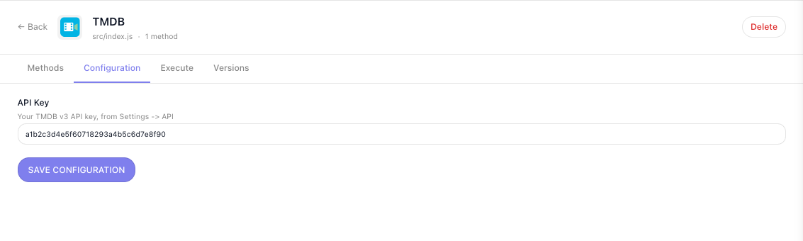
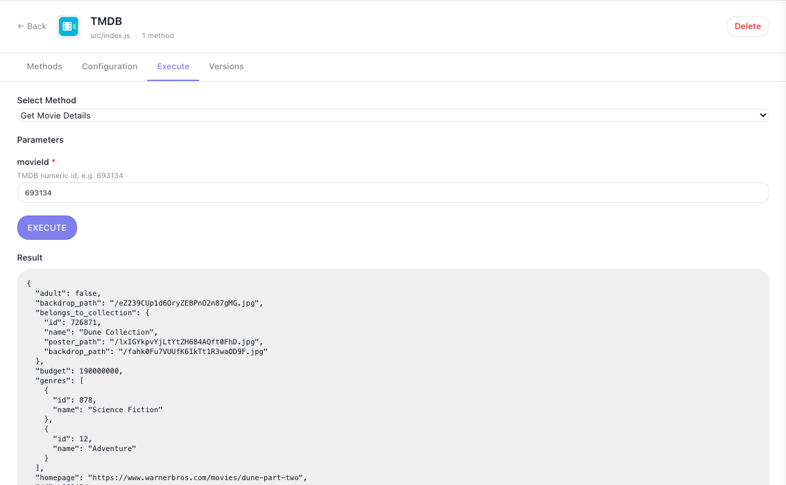
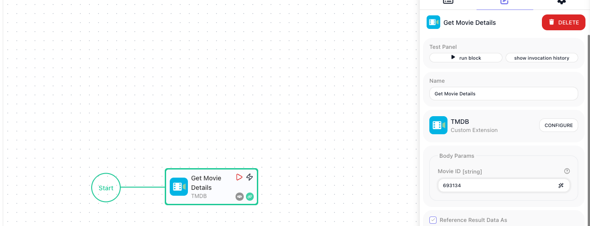
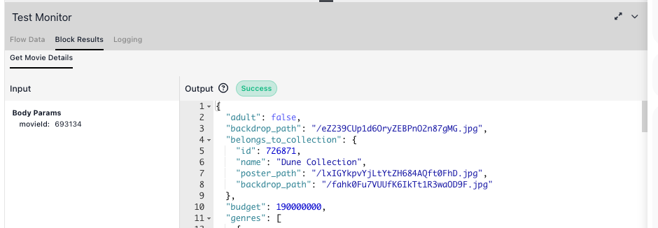

# Write It Yourself

This walkthrough builds a working custom extension end to end, by hand. You will write an action that
fetches a movie from The Movie Database, deploy it to your workspace, fill in its API key, and place it in
a flow. It takes about fifteen minutes, and the TMDB extension you build here is the one every later page
adds to.

Writing the module yourself is one of [two ways to build an extension](index.md#two-ways-to-build-one). If
you would rather describe the service and review what comes back, see
[Let AI Build It](ai-assisted.md) - it produces the same kind of module, in the same project, deployed with
the same command.

## What you need

- **Node.js and npm.** Node 18.20 or newer, which is what the test harness the CLI installs requires.
- **A FlowRunner™ workspace** you can sign in to. The extension is deployed to one workspace, and you need
  access to it.
- **A TMDB API key**, if you want to run the example against the real service. It is free: create an account
  at themoviedb.org, then **Settings ▸ API**, and copy the v3 key.

## Create the project

A custom extension lives in your own repository, not in FlowRunner. Create one with `npx`, which is the only
time you need it - `init` installs the CLI into the project it creates:

```bash
npx flowrunner-cli init -d my-extensions
cd my-extensions
```

It writes the project files, installs dependencies, and makes a git repository with a first commit:

```
Project directory:

  /Users/you/my-extensions
  a new directory

  + package.json
  + .gitignore
  + flowrunner.json
  + README.md
  + jest.config.js
  + jest.setup.js
  + sandbox/index.js
  + sandbox/service.js
  + sandbox/nock-mock.js
  + sandbox/files-mock.js

  Server: https://app.flowrunner.ai
```

`flowrunner.json` records which server the project points at. `sandbox/` is the local test harness, and
`.gitignore` already excludes the deploy token you are about to create.

## Connect the project to your workspace

```bash
flowrunner login
```

The CLI starts a small server on a local port, opens your browser, and waits. On the page that opens, pick
the workspace this project will deploy to and choose ((Authorize)).



The token it issues is good for 30 days and is stored in `.flowrunner/token`, outside git. Your choice of
workspace is written into `flowrunner.json`, which you should commit:

```json
{
  "serverUrl": "https://app.flowrunner.ai",
  "workspaceId": "3F2A9C41-7B10-4E52-9D64-0C81A7F5B2E3",
  "workspaceName": "Acme Production"
}
```

## Scaffold the service

Each extension is a folder under `services/`. Create one from the `blank` template:

```bash
flowrunner cs blank --id tmdb --name "TMDB"
```

```
  Created services/tmdb/
    package.json
    src/index.js
    README.md
    public/icon.svg
```

The id becomes the folder name and the extension's identity, so it is frozen once you deploy: it must start
with a lowercase letter and contain only lowercase letters, digits and dashes.

Note the `package.json` inside the service folder. **Each service is its own npm package**, and only
`services/<id>/node_modules` is uploaded, so any dependency you add is installed there:

```bash
cd services/tmdb && npm install some-package && cd ../..
```

A dependency installed at the project root instead will work on your machine and then fail with
`MODULE_NOT_FOUND` the first time the block runs.

## Write the extension

Open `services/tmdb/src/index.js` and replace it with this:

```js
const z = Flowrunner.z

const API_BASE_URL = 'https://api.themoviedb.org/3'

const ext = Flowrunner.createExtension({
  id         : 'tmdb',
  name       : 'TMDB',
  description: 'Look up movies and TV from The Movie Database.',
  logo       : '/icon.svg',

  configItems: z.object({
    apiKey: z.string().label('API Key').describe('Your TMDB v3 API key, from Settings -> API'),
  }),

  initContext: ({ config }) => ({
    baseUrl: API_BASE_URL,
    apiKey : config.apiKey,
  }),

  apiRequest: async ({ url, query, context }) => {
    return Flowrunner.Request.get(`${ context.baseUrl }${ url }`)
      .query({ ...query, api_key: context.apiKey })
  },
})

ext.addAction({
  category   : 'TMDB',
  id         : 'getMovieDetails',
  label      : 'Get Movie Details',
  description: 'Returns everything TMDB holds about one movie.',
  params     : z.object({
    movieId: z.string().label('Movie ID').describe('TMDB numeric id, e.g. 693134'),
  }),
  result: {
    id          : 693134,
    title       : 'Dune: Part Two',
    tagline     : 'Long live the fighters.',
    release_date: '2024-02-27',
    runtime     : 167,
    vote_average: 8.133,
    genres      : [{ id: 878, name: 'Science Fiction' }, { id: 12, name: 'Adventure' }],
  },
  execute: async ({ params, apiRequest }) => {
    return apiRequest({ url: `/movie/${ params.movieId }` })
  },
})
```

There is no `require` and no `export`. The runtime never reads an export: it loads the file and takes
whatever `createExtension` and `addAction` put on the extension object.

Four things in that file do the work:

- **`configItems`** declares what the workspace fills in. It becomes a form in the console, and the values
  arrive as `config` in your code, so a key is never written into the file.
- **`initContext`** runs once per invocation and returns the `context` every handler sees. Derive base URLs
  and resolved credentials here rather than repeating them.
- **`apiRequest`** is the one place HTTP happens. Auth, error handling and logging live here instead of in
  every action.
- **`addAction`** registers a block. `label` is its name in the editor, `params` become its fields, and
  `result` is the sample a flow builder binds against when wiring the output into a later step.

## Test it before you deploy

`init` installed a harness in `sandbox/` that runs your extension through the real runtime with HTTP
intercepted at the socket, so a test asserts what the pod would have sent and nothing reaches the network.
Suites live beside the service they cover, in `services/<id>/tests/`. Create
`services/tmdb/tests/tmdb.test.js`:

```js
'use strict'

const { createNockMock, runServiceMethod } = require('../../../sandbox')

const BASE = 'https://api.themoviedb.org/3'

describe('TMDB Service', () => {
  const serviceId             = 'tmdb'
  const serviceEntryPointPath = require.resolve('../src/index.js')
  const configs               = { apiKey: 'test-api-key' }

  let httpMock

  beforeAll(() => { httpMock = createNockMock() })
  afterEach(() => { httpMock.reset() })
  afterAll(() => { httpMock.dispose() })

  it('reads one movie by id and sends the key from config', async () => {
    const movie = { id: 693134, title: 'Dune: Part Two', runtime: 167 }

    httpMock.onGet(`${ BASE }/movie/693134`).reply(movie)

    const result = await runServiceMethod({
      serviceId, serviceEntryPointPath, configs,
      methodName: 'getMovieDetails',
      methodData: { movieId: '693134' },
    })

    expect(result).toEqual(movie)
    expect(httpMock.history[0].query).toEqual({ api_key: 'test-api-key' })
  })
})
```

```bash
npm test
```

The second assertion proves the key came from configuration, read off the request as it went out.

## Deploy it

```bash
flowrunner deploy
```

```
Deploying custom extensions...

  Connecting to Flowrunner Prod cluster (https://app.flowrunner.ai)
  Workspace "Acme Production" (3F2A9C41-7B10-4E52-9D64-0C81A7F5B2E3)
  Found 1 service under services/.

  Deploying 1 service:
    - new service: tmdb (TMDB) - [9073d8681d99] - packaged 11.0 KB

  Deployed 1 service to workspace "Acme Production" (3F2A9C41-…) — you can use it in a flow.
```

The twelve-character hash is the version. Deploy again after a change and the line reads `modified service`
with a new hash; deploy without changing anything and it reads `same service` and nothing is uploaded.

Your extension is now listed under **Custom Extensions** in the workspace navigation:


## Fill in the API key

Open the service and go to ((Configuration)). Every field you declared in `configItems` is here, with the
label and description you gave it. Paste your TMDB key and ((Save Configuration)).



This is filled in once per workspace, not per flow.

The ((Execute)) tab beside it runs a single method by hand, which is the quickest way to confirm the key
works before you build anything around it.



## Use it in a flow

Open a flow, or create one, and search the block palette for your action. It sits under
**Local Extensions**, grouped by the `category` you set:


Drag it onto the canvas and fill in its field. The `params` you declared are the fields on the
configuration panel, and the panel names the extension the block came from:



((Run Block)) in the Test Panel runs it there and then. The Test Monitor shows the input you gave it beside
what the API returned:



That result is what later blocks read through the Expression Editor, the same as any built-in block's.

Every later change repeats three steps: `npm test`, `flowrunner deploy`, and a reload of any editor tab
that was already open.

## Related

- [Service Structure](service-structure.md) - `createExtension` in full: config, `initContext`,
  `apiRequest`, helpers
- [Actions](actions.md) - the handler context bag, declaring results, and what to return
- [Parameters & Types](parameters-and-types.md) - every zod type, the widget it produces, and the plugins
- [Dictionaries](dictionaries.md) - turn an id field into a picker filled from the live API
- [Triggers](triggers.md) - extensions that watch a system and hand what they find to a flow
- [Testing](testing.md) - the harness this page used, and what a fuller suite covers
- [Deploying & Managing](deploying.md) - versions, rollback, and sharing a workspace between projects
- [Troubleshooting](troubleshooting.md) - what to do when a deploy or a block fails
- [The FlowRunner CLI](cli.md) - every command and flag
