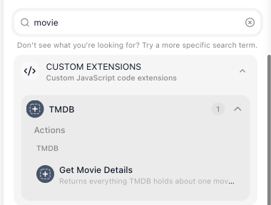
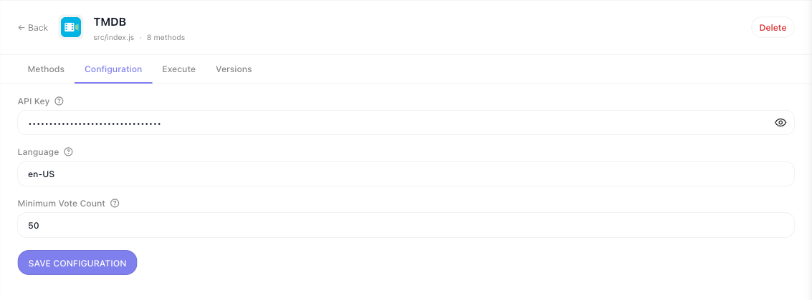
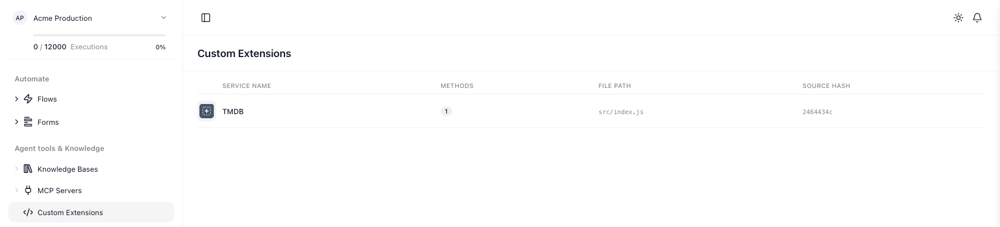

# Custom Extensions

When a flow needs a system FlowRunner™ has no block for - your warehouse database, a model you host
yourself, a scoring algorithm nobody else has - a custom extension turns that system into blocks of your
own, available to every flow in the workspace. It works in both directions: the same extension can watch
that system and hand the flow whatever turns up there, so a run starts, or carries on, the moment something
happens on your side.

<!-- doclint: no-shot: the lede names the palette as the destination; the palette itself is pictured in the section below -->

## Start with a quick start

Both quick starts end the same way: an extension of your own, deployed to your workspace and running as a
block in a flow. Pick the one that matches how you want the code written.

- **[Quick Start: Your First Extension (with AI)](ai-assisted.md)** - install the FlowRunner agents into
  Claude Code, describe the service in one sentence, deploy what it writes.
- **[Quick Start: Your First Extension (code)](getting-started.md)** - paste one JavaScript file, run four
  CLI commands.

The two routes share everything but who writes the module: the same CLI creates the project, the same
reference describes the format, and the same `npx flowrunner deploy` sends the result to the workspace. The
agents the AI route installs come with the CLI and read that same reference; one writes the service and a
second one writes its tests, so the service is checked by something that did not write it.

Every other page in this section is the detail behind those two paths.

## Before you build anything

A missing block is not always a reason to build one. Check the cheaper routes first - the Extensions
library and the Marketplace, an MCP server, or an existing flow used as an action - all of which are
covered under [Custom & Marketplace Actions](../build/integrations/custom-actions.md). Build an extension
when none of those reaches the system you need.

## What an extension can reach

Your code runs in your workspace's own Cloud Code pod, so an action can reach anything that pod can open a
connection to:

- Call a service that has no block yet, with the fields and the response shape your team actually uses.
- Reach a private system inside your own network.
- Send a prompt to a model you host, or one no built-in block covers.
- Run an algorithm that is yours - a pricing rule, a scoring pass, a validation nobody else has.

An extension can hold as many actions and triggers as you want, grouped under a category you name. Once it
is deployed they sit in the block palette under **Custom Extensions**:

## Where the API key lives

Credentials belong to the workspace, not to a flow. Everything declared in `configItems` becomes a form on
the extension's own page, filled in once by whoever administers the workspace. Handlers read those values
from `config`, so a key is never typed into a block and never travels in a flow's data.

## What you deploy stays in your workspace

An extension you deploy is visible only in the workspace you deployed it to. The ones already in the
palette under **Extensions** - Airtable, Acumatica, AWS Bedrock and hundreds more - ship with FlowRunner and
are available everywhere. Yours is not one of those.

Everything deployed to the workspace is listed under **Custom Extensions** in the workspace navigation,
with the number of methods each one publishes and the source hash of the version running.

## The details, by question

Building the module:

- [Service Structure](service-structure.md) - `createExtension` in full: config, `initContext`, `apiRequest`,
  helpers
- [Parameters & Types](parameters-and-types.md) - every field type, the widget it produces, and the plugins
- [Actions](actions.md) - what a handler receives, what it returns, and how a flow reads it
- [Dictionaries](dictionaries.md) - turn an id field into a picker filled from the live API
- [Triggers](triggers.md) - polling and realtime triggers that hand a flow what they find
- [HTTP Requests](http-requests.md) - the request client and its failures
- [Storing Files](files.md) - a file backend for extensions that need one

Shipping it:

- [Testing](testing.md) - the harness that runs your extension with HTTP intercepted
- [Deploying & Managing](deploying.md) - versions, rollback, configuration, and sharing a workspace
- [The FlowRunner CLI](cli.md) - every command and flag
- [Troubleshooting](troubleshooting.md) - symptoms first, with the cause each one usually has

## Related

- [Custom & Marketplace Actions](../build/integrations/custom-actions.md) - the cheaper routes to a missing
  block, worth checking first
- [Blocks](../learn/concepts/blocks.md) - the categories a custom action joins

<!-- 2026-09-22: page reduced to the section map per Mark (two quick starts first; everything else is supporting
     documentation). Removed here, not lost: "Writing your own trigger" and the watermark explanation live on
     triggers.md; the full createExtension listing lives on service-structure.md; the dictionary picker
     (dictionary-resolved-value.png) lives on dictionaries.md; "The part both routes share" is now the quick starts'
     own step lists. palette-tmdb-blocks.png (LOCAL EXTENSIONS, dev, 2026-08-31) replaced by the prod palette shot
     captured today. configuration-tab.png and custom-extensions-list-minimal.png: see the getting-started /
     service-structure drive records. -->
