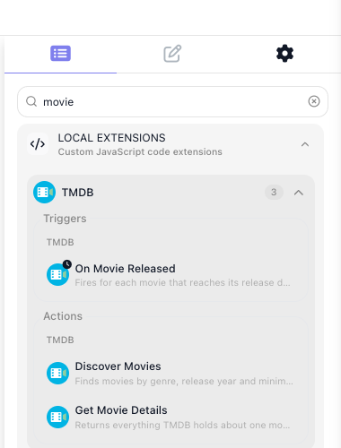
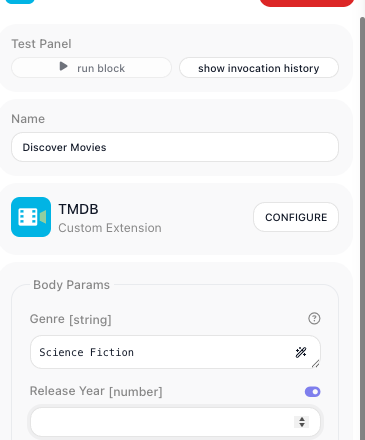

# Custom Extensions

When a flow needs a system FlowRunner™ has no block for - your warehouse database, a model you host
yourself, a scoring algorithm nobody else has - a custom extension turns that system into blocks of your
own, available to every flow in the workspace. It works in both directions: the same extension can watch
that system and hand the flow whatever turns up there, so a run starts, or carries on, the moment something
happens on your side.

You can have one written for you, or write it yourself. Both are covered below.

<!-- doclint: no-shot: the lede names the palette as the destination; the palette itself is pictured in the section below -->

## Before you build anything

A missing block is not always a reason to build one. Check the cheaper routes first - the Extensions
library and the Marketplace, an MCP server, or an existing flow used as an action - all of which are
covered under [Custom & Marketplace Actions](../build/integrations/custom-actions.md). Build an extension
when none of those reaches the system you need.

## Two ways to build one

The end result is the same either way: a JavaScript module that FlowRunner deploys and turns into blocks.
What differs is who writes it.

- **[Let AI build it](ai-assisted.md)** - install the FlowRunner agents into your AI assistant, describe
  the service you want in plain language, and review what comes back. The agents know the authoring format
  and ship with the reference, so you are reviewing a service rather than learning a format first. This is
  the faster route whether or not you write JavaScript.
- **[Write it yourself](getting-started.md)** - build the module by hand, with the format, the types and
  the test harness under your own control. Everything the AI route produces, you can read, change and take
  over at any point.

They are not separate products or separate tracks. The same CLI scaffolds the project, the same reference
describes the format, and the same command deploys the result - so starting on one and finishing on the
other costs nothing.

## What an extension can reach

Your code runs in your workspace's own Cloud Code pod, so an action can reach anything that pod can open a
connection to:

- Call a service that has no block yet, with the fields and the response shape your team actually uses.
- Reach a private system inside your own network.
- Send a prompt to a model you host, or one no built-in block covers.
- Run an algorithm that is yours - a pricing rule, a scoring pass, a validation nobody else has.

An extension can hold as many actions as you want, grouped under a category you name. Once it is deployed
they sit in the block palette under **Local Extensions**.



## Writing your own trigger

An action does its work when the flow reaches it. A trigger waits for something to happen outside
FlowRunner and hands over what arrives. Where the flow builder puts it decides what that means: first in a
flow, it starts an instance for each thing it finds; in the middle, the flow runs up to it and waits there
until the event comes.

You write triggers for the same range of systems your actions reach - a row appearing in your warehouse
database, a job finishing on hardware only your network can see, a queue your team runs. There are two
kinds, and the API decides which you write:

- **Polling**, when you have to ask. You supply the query; FlowRunner runs it on a timer and works out
  which results are new.
- **Realtime**, when the system can call you. You register a webhook once, and deliveries arrive as they
  happen.

Prefer realtime where the API offers webhooks. [Triggers](triggers.md) covers both.

The TMDB extension used throughout this section declares one called **On Movie Released**. It asks TMDB
for films in a chosen genre, newest first, and hands back what it got. Two lines decide the rest:

```js
watermark: { by: 'release_date', sortedDesc: true },
```

FlowRunner keeps the newest `release_date` it has already seen and emits only the films past it, so the
same title is never handed over twice. The first poll after the trigger is configured emits nothing at all
- it records where the feed stands and waits.

You write the query. FlowRunner owns the loop, the stored position and the delivery.

## An extension is one JavaScript module
<!-- doclint: no-shot: this section teaches the declaration; what it produces on screen is pictured in the sections that follow -->
<!-- doclint: allow-unlinked: Condition -->

`createExtension` takes the configuration the workspace fills in; `addAction` and `addPollingTrigger`
register what shows up in the editor. FlowRunner reads that declaration to build the block's palette entry,
its configuration panel and the fields on it.

```js
const z = Flowrunner.z

const ext = Flowrunner.createExtension({
  id         : 'tmdb',
  name       : 'TMDB',
  description: 'Search movies and TV from The Movie Database, and react to new releases.',
  logo       : '/icon.svg',

  configItems: z.object({
    apiKey: z.string().label('API Key').describe('Your TMDB v3 API key, from Settings -> API'),
  }),

  initContext: ({ config }) => ({ baseUrl: 'https://api.themoviedb.org/3', apiKey: config.apiKey }),

  apiRequest : async ({ url, query, context }) => {
    return Flowrunner.Request.get(`${ context.baseUrl }${ url }`)
      .query({ ...query, api_key: context.apiKey })
  },
})

ext.addAction({
  category   : 'TMDB',
  id         : 'getMovieDetails',
  label      : 'Get Movie Details',
  description: 'Returns everything TMDB holds about one movie.',
  params     : z.object({
    movieId: z.string().label('Movie ID').describe('TMDB numeric id, e.g. 693134'),
  }),
  result : { id: 693134, title: 'Dune: Part Two', runtime: 167, vote_average: 8.133 },
  execute: async ({ params, apiRequest }) => {
    return apiRequest({ url: `/movie/${ params.movieId }` })
  },
})

ext.addPollingTrigger({
  category   : 'TMDB',
  id         : 'onMovieReleased',
  label      : 'On Movie Released',
  description: 'Fires for each movie that reaches its release date in the chosen genre.',
  params     : z.object({ genreId: z.string().optional().label('Genre').dictionary(getGenresDictionary) }),
  result     : { id: 693134, title: 'Dune: Part Two', release_date: '2024-02-27' },
  fetch      : async ({ params, helpers }) => {
    const response = await helpers.discover({ genreId: params.genreId, sortBy: 'primary_release_date.desc' })

    return response.results ?? []
  },
  watermark: { by: 'release_date', sortedDesc: true },
})
```

`label` is the name on the block, `describe` becomes the hint under a field, and `result` is the sample a
flow builder binds against when wiring the block's output into a later step.

Every field is required unless it carries `.optional()` or a `.default()`, and every rule on a field is
checked before your handler runs, with a message that names the field.

## Your blocks behave like any other block

A deployed action comes out of the palette under the category you named, its `params` are the fields on
its configuration panel, and its result is read downstream through the Expression Editor the same way any
built-in block's result is.

A param you backed with a dictionary becomes a picker. Opening it runs your dictionary against the live API
and lists what comes back, so the flow builder chooses `Science Fiction` and never has to learn that the
genre id is `878`.



## Where the API key lives

Credentials belong to the workspace, not to a flow. Everything declared in `configItems` becomes a form on
the extension's own page, filled in once by whoever administers the workspace. Handlers read those values
from `config`, so a key is never typed into a block and never travels in a flow's data.


## What you deploy stays in your workspace

An extension you deploy is visible only in the workspace you deployed it to. The ones already in the
palette under **Extensions** - Airtable, Acumatica, AWS Bedrock and hundreds more - ship with FlowRunner and
are available everywhere. Yours is not one of those.

Everything deployed to the workspace is listed under **Custom Extensions** in the workspace navigation,
with the number of methods each one publishes and the source hash of the version running.


## The part both routes share

However the module gets written, the work sits in a project on your own machine and reaches the workspace
the same way:

1. `npx flowrunner-cli init` creates the project, scaffolds a first service and installs the CLI into it.
2. The service module gets written - by an agent, by you, or by both in turn.
3. `npm test` runs the service through the real runtime with HTTP intercepted, so you check what it would
   have sent without anything leaving your machine.
4. `flowrunner login` connects the project to one workspace.
5. `flowrunner deploy` builds the definition, packages the project and uploads it.

Only step 2 differs between the two routes. [Let AI build it](ai-assisted.md) and
[Write it yourself](getting-started.md) each walk the whole loop with a working extension at the end.

## Related

- [Let AI Build It](ai-assisted.md) - install the agents, describe the service, review what comes back
- [Write It Yourself](getting-started.md) - install the CLI, scaffold a service, deploy it
- [The FlowRunner CLI](cli.md) - every command and the flags worth knowing
- [Custom & Marketplace Actions](../build/integrations/custom-actions.md) - the cheaper routes to a missing
  block, worth checking first
- [Blocks](../learn/concepts/blocks.md) - the categories a custom action joins
