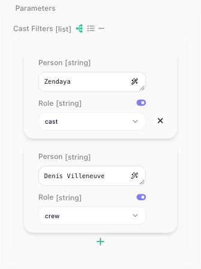

# Parameters & Types

The fields a flow builder fills in on your block - a Movie ID to type, a Release Year that only takes a
number, a Genre picked from a list - and the checking that stops bad input before it reaches your code all
come from one declaration: `params`, a zod object. Pick a type and the editor draws the matching control
under the block's **Parameters** section; chain a plugin and the field gets its label, hint and default.

```js
params: z.object({
  movieId: z.string().label('Movie ID').describe('TMDB numeric id, e.g. 693134'),
  year   : z.number().optional().label('Release Year'),
}),
```

`execute` receives exactly what you declared, parsed and typed:

- values converted to the declared type, so a number arrives as a number
- undeclared fields stripped
- a blank field resolved the way you declared it - see [Leaving a field blank](#leaving-a-field-blank)

**The container is always a `z.object`.** Leave `params` out for an action that takes no input. A bare
shape, a single field, or a `z.object().optional()` stops the service from loading: `npx flowrunner deploy`
skips that service with a `Skipping "<service>"` warning that reads
`` `params` must be a z.object({ … }) — received … `` and deploys the rest, and a test sees
`FR_EXT_INVALID_SCHEMA`. Mark the *fields* optional, never the container.

## What each type renders as

| zod type | The flow builder gets |
|---|---|
| `z.string()` | a single-line field |
| `z.text()` | a multi-line box |
| `z.number()` | a numeric field |
| `z.boolean()` | a toggle |
| `z.date()` | a date picker |
| `z.enum([...])` | a dropdown of the values |
| `z.array(inner)` | a list. Entries that are groups, dropdowns or dictionary fields open as rows with add and remove controls; a list of plain strings or numbers opens as one expression box, and the view toggle beside the label switches it to rows |
| `z.object({...})` | a nested group holding its own fields |

All eight, on one block:


The editor prints the published param type beside each label, which is why `Date` and `Enum` read as
`[string]`: the type is string, the widget is what differs. What a date field actually hands your handler is
under [What a date field hands your handler](#what-a-date-field-hands-your-handler).

The switch beside a label (tooltip: Toggle expression input) turns that control into an expression input
when you switch it off, so a flow builder can bind the value from an earlier block. A `z.string()` field has
no switch because it already is one - which is why the String row above shows a wand and no toggle. Here
Release Year is switched off and Minimum Rating is not:


A list or a group has no switch. The icons beside its label switch it between rows (tooltip: Use list of
inputs) and one expression input for the whole value (tooltip: Use single input).

**Other types.** A few more zod types are accepted, each drawn as the control for the type it publishes:

- `z.union([...])` - the first branch's control. A value is also converted by trying the branches in the
  order you wrote them, and the first that fits wins: given `'false'`, `z.union([z.boolean(), z.string()])`
  hands your handler `false`, but `z.union([z.string(), z.boolean()])` hands it the string `'false'`, which
  is truthy. Put first the type an ambiguous value should become, and a catch-all such as `z.string()` last.
- `z.record(k, v)` - a nested group with no fixed fields, because its keys are open.
- `z.literal(v)` - the control for `v`'s type, accepting only `v`: `z.literal(true)` is a toggle that has to
  be switched on, for an "I confirm" field.
- `z.json()` - a multi-line box, like `z.text()`, whose JSON your handler receives already parsed: `42`
  arrives as a number. Text that does not parse fails with `«<label>» must be valid JSON`. Do not call
  `JSON.parse` on it.
- `z.any()` and `z.unknown()` - a text field; the value reaches your handler unconverted.
- `z.null()` - the same text field, but it accepts only a blank: any typed value, even `null`, fails with
  `«<label>» must be null`.

Modifiers such as `.optional()`, `.default(v)`, `.readonly()` and `.pipe()` publish as the type underneath:
`z.string().pipe(z.coerce.number())` is a text field whose value arrives as a number.

## What the deploy refuses

`z.tuple()`, `z.intersection()` and the `.catch(v)` modifier stop the service from loading, so
`npx flowrunner deploy` skips that service with a message that names the field, and deploys the rest (see
[Troubleshooting](troubleshooting.md#the-deploy-fails)). Use these instead:

- for a tuple, a `z.object()` with named fields, or a `z.array()` when the entries share a type
- for an intersection, one `z.object()` holding all the fields
- for `.catch(v)`, `.default(v)`: it fills in a missing value and still reports a wrong one, where `.catch(v)`
  would swap a wrong value for the fallback without telling anyone

A service already deployed with one of these fails when its action runs, with the same message, until you
fix it and deploy again. While a deploy skips a service, the version deployed before stays live, so check the
deploy output for a `Skipping "<service>"` warning.

<!-- RELEASE v.1.1.2 (FR-3572), DRIVEN 2026-09-25 against flowrunner-cli 0.0.13 in a scratch project (probe services
     loaded through the CLI's own sandbox harness, getServiceDefinition + runServiceMethod):
     - params.tags: z.array(z.string()).catch([]) -> load REFUSED: "[flow-extension:catchprobe] action
       "createContact": `params.tags` uses `.catch(…)`, which a parameter may not: it replaces an invalid value
       with the fallback instead of reporting it, and drops the field out of type coercion. Use `.default(v)` …"
     - params.point: z.tuple([...]) -> REFUSED "… declares z.tuple(), which the runtime cannot publish as a
       parameter … Supported: z.string(), z.number(), z.bigint(), z.boolean(), z.date(), z.enum([…]),
       z.literal(…), z.object({ … }), z.array(…), z.record(…), z.union([…]), z.null(), z.any(), z.unknown() …"
     - published types: z.record(z.string(), z.string()) OBJECT; z.literal(true) BOOLEAN;
       z.union([z.array(z.string()), z.string()]) LIST; z.union([z.string(), z.array(z.string())]) STRING;
       z.union([z.boolean(), z.string()]) BOOLEAN and 'true' -> true; z.union([z.string(), z.boolean()]) STRING
       and 'true' -> 'true'; z.string().pipe(z.coerce.number()) STRING and '42' -> 42.
     - deploy skipping the refused service while the rest deploy: the CLI's existing load-failure behaviour
       (troubleshooting.md "One service is skipped with a reason") plus the developer's FR-3572 answer; no deploy
       run here. z.bigint() / z.any() / z.unknown() are from the 0.0.13 bundled docs (02-zod-types.md), not probed.
     The old paragraph ("z.union(), z.tuple(), z.record() and the rest deploy, but render as a plain text field")
     was true before 0.0.11 and is now wrong.
     GATE FIX PASS, same day (concept-page-review wf_9740fed4, major-rework; verdict file on disk). The first
     rewrite said "anything else stops the service from loading" - WRONG: probed again on 0.0.13:
     z.json() -> published STRING, handler gets the parsed object ('{"a":1}' -> {a:1}); z.any() / z.unknown() /
     z.null() -> STRING, values unconverted; z.bigint() -> NUMBER, '9007199254740993' as text -> exact BigInt but
     the same digits as a JSON number -> ...992 (left off the page); z.literal(true) given 'false' -> «Confirm»
     must be one of: true; z.union([string, boolean]) given 'false' -> the string 'false'; z.union([boolean,
     string]) given 'false' -> false; z.number().default(5): null -> 5, 'abc' -> «Retries» must be a number.
     Controls are inferred from the published type plus the type-to-control mapping param-widgets.png shows;
     no editor was opened for the added types. Deploy-time skip and "previous version stays live / already
     deployed fails at run time" are SOURCE (FR-3572 developer answer, 2026-09-14); the warning text is SOURCE
     (flowrunner-cli 0.0.13 dist/cli.js: `Skipping "${serviceId}" - ${reason}`). -->

## Giving a field its label, hint and default

Chain these onto any field:

| Plugin | Applies to | Effect |
|---|---|---|
| `.label(text)` | any field | The name shown on the block. Without one the key is humanized - `releaseYear` shows as **Release Year**. |
| `.describe(text)` | any field | The help text behind the **?** icon beside the label. |
| `.optional()` / `.nullable()` | any field | Marks the field not required. What a blank arrives as is under [Leaving a field blank](#leaving-a-field-blank). |
| `.default(v)` | any field | The value used when the field is left blank. Takes a value, never a label. |
| `.example(v)` | a `result` written as a zod schema | Publishes `v` as the sample a flow builder binds against. On a param it does not create a sample to bind against. |
| `.dictionary(ref)` | a param | Fills the field from a dictionary, as a picker. See [Dictionaries](dictionaries.md). |
| `.labels({ value: 'Label' })` | `z.enum` | Shows the label in the dropdown, stores and hands your handler the value. |
| `.secret()` | a `z.string()` config field | Masks the input on the configuration form. On a param it does nothing, on purpose: a param's value is saved in the flow and readable over the API, so a credential belongs in config, never in a block field. See [Service Structure](service-structure.md#what-the-workspace-fills-in). |

**Sharing a param across actions.** Declare it once, name it with a `Param` suffix, and put each plugin
call on its own line so a change touches one line:

```js
const genreIdParam = z.string()
  .label('Genre')
  .dictionary(getGenresDictionary)
  .describe('Only include movies in this genre')
```

## Leaving a field blank

Every field is required unless you say otherwise. The editor sends an untouched field as an explicit `null`,
and the modifier on the declaration decides what your handler receives:

| Declared | A blank field arrives as |
|---|---|
| nothing | the block fails with `«Genre» is required` |
| `.optional()` | `undefined` |
| `.nullable()` | `null` |
| `.nullish()` | `null` |
| `.default(v)` | `v` |

So `.optional()` is the ordinary way to mark a field the flow builder may leave alone, and a `.default()` fills
in a field left untouched or cleared. Discover Movies declares one required field and
three the flow builder can skip:

```js
params: z.object({
  genreId  : genreIdParam,                                       // required
  year     : z.number().optional().label('Release Year'),
  minRating: z.number().min(0).max(10).optional().label('Minimum Rating').describe('TMDB score out of 10'),
  sortBy   : z.enum(['popularity.desc', 'primary_release_date.desc', 'vote_average.desc'])
    .default('popularity.desc')
    .label('Sort By'),
}),
```

On the block, the required Genre is flagged until it is filled, the two numbers are empty numeric fields,
and Sort By is an empty dropdown:


With a genre picked and the other three left blank, the run succeeds: the handler reads `params.sortBy` and gets `popularity.desc`. The declared
default is published with the block but not pre-filled into the field, so the flow builder cannot see it;
say what it is in the hint, `.describe('Defaults to Most popular')`.

Do not pair `.nullable()` with `.default()`: the editor's `null` is handed over as `null` and the default
never fires. `.optional().default(v)` behaves as plain `.default(v)`.

One exception is deliberate: on a `z.string()` field an empty string is a **value**, so a required text field
accepts `''`. Add `.min(1)` to a string that must not be empty. The same `''` reaches a format check, so an
optional `z.email()` or `z.url()` that a flow builder cleared is reported as invalid. Where blank must mean
not set on a format field, declare `z.union([z.url(), z.literal('')]).optional()`: the first branch draws
the URL field, and the second lets a cleared field through.

## What is checked before your handler runs

For an action's `params` and a dictionary's `criteria`, everything you declare on a field is enforced before
`execute` runs: `.min()` and `.max()`, `.int()`, `.regex()`, the string formats such as `z.email()` and
`z.url()`, enum membership, and your own message on any of them. A violation fails the block, and the
message names the field by its label:

```
[flow-extension:tmdb] invalid params for method "discoverMovies" — minRating: «Minimum Rating» must be at most 10
```

That line is what the **Test Monitor**'s ((Block Results)) tab shows after ((run block)) in the block's **Test Panel**, and what the block's
error exit carries in a run:

![The Test Monitor's Block Results tab for Discover Movies after a run with Minimum Rating set to 11: the Input shows Body Params beginning genreId 878, year null, minRating, and the Output is marked Error with the line [flow-extension:tmdb] invalid params for method "discoverMovies" - minRating: «Minimum Rating» must be at most 10.](../images/extend/discover-run-invalid.png)

Every offending field is reported in that one line. A failure inside a group or a list names the property,
not the container - `«Person» is required`, `«Genres item 2» is required` - and a message you wrote
yourself, such as `z.string().min(3, 'Too short')`, is shown as written.

Before a run, the editor flags only a required field left empty. Every other rule - a limit, a format, your
own `.refine()` - is checked when the block runs: typing 11 into Minimum Rating shows no warning until then.

## Showing a label, sending a value

An API's own vocabulary is rarely what you want on a block. `.labels()` keeps the two apart: the dropdown
shows the label, the flow stores the value, and `execute` receives the value.

```js
sortBy: z.enum(['popularity.desc', 'primary_release_date.desc', 'vote_average.desc'])
  .labels({
    'popularity.desc'          : 'Most popular',
    'primary_release_date.desc': 'Newest first',
    'vote_average.desc'        : 'Highest rated',
  })
  .default('popularity.desc')
  .label('Sort By'),
```


The flow builder picks **Highest rated**; your handler gets `vote_average.desc`. Because the flow stores the
value, renaming a label later changes nothing that was saved. This holds at every depth - inside a
`z.object()`, inside a `z.array()`, inside a row of a list of groups.

`.labels()` is for a list you know when you write the service. When the options come from the API - genres,
projects, folders - use a [dictionary](dictionaries.md).

!!! warning "`.map()` no longer exists"
    Earlier versions offered `.map({ Label: value })`, which took its argument the other way round. A service
    still calling it fails to load, with a message naming `.labels()`. Move the API values into the `z.enum`
    list and the display names into `.labels()`.

## What a date field hands your handler

Declare `z.coerce.date()` and your handler gets a `Date` whether the value was picked, typed or bound. Plain
`z.date()` hands over what was sent - an ISO string when the value was typed or bound, epoch milliseconds
from the picker - so its inferred `Date` type is wrong at run time. Both are validated as a date: `not-a-date` fails
with `«Released After» must be a date`, and `.min()` / `.max()` bounds are enforced.

```js
releasedAfter: z.coerce.date().optional().label('Released After'),
```

The ISO formats reshape the input to the declared form: `z.iso.date()` given a full datetime hands over the
date part, `z.iso.time()` the time part. They render as plain text fields, with no picker.

## Nested fields and lists

`z.object()` nests fields, and `z.array()` makes a list of them. Staying with TMDB:

```js
params: z.object({
  genres       : z.array(genreIdParam).label('Genres'),
  releaseWindow: z.object({
    from: z.coerce.date().label('From'),
    to  : z.coerce.date().label('To'),
  }).label('Release Window'),
}),
```

Because each `genres` entry is a dictionary field, the list opens as rows: ((+)) adds an entry, and the × beside
an entry removes it. A list of plain strings opens as one expression input until you switch it to rows. The
group shows its own fields, each with a date picker here:


A failure inside either names the entry - `«Genres item 2» is required`, `«From» must be a date`.

A list of groups is the common shape - line items, recipients, filters:

```js
params: z.object({
  castFilters: z.array(z.object({
    personId: z.string().label('Person').dictionary(getPeopleDictionary),
    role    : z.enum(['cast', 'crew']).label('Role'),
  })).label('Cast Filters'),
}),
```

Each entry opens as a card holding the group's fields:



Keep nesting to two levels: give an entry plain fields, never another list. A list inside a list gets a
single box per row, and what is typed there arrives as text, so the block fails with a message such as
`«Keyword Groups item 1» must be an array`.

## Designing fields a flow builder can use

The person configuring your block is not the person who wrote it, and often does not know the API at all.

- **Label anything whose key would read badly.** A humanized key covers `releaseYear`; it does not cover
  `tvId` or `pg`.
- **Back id-like fields with a [dictionary](dictionaries.md).** `Science Fiction` in a dropdown beats knowing
  that the genre id is `878`.
- **Describe the format when there is one.** `.describe('TMDB numeric id, e.g. 693134')` tells the flow
  builder what to type.
- **Declare optionality honestly.** A field marked required that the API treats as optional makes the block
  unusable for the case the API supports.
- **Put limits in the declaration.** `z.number().min(0).max(10)` is checked before the request goes out,
  with a message that names the field; a check inside `execute` is not.
- **Order fields the way they are filled in.** The identifier first, then filters, then anything rarely
  touched.

**On a trigger.** A trigger's params render under **Payload** on the trigger block, as plain fields with no
expression switch, and a group or a list declared there renders as a single text field. Keep trigger params
to the primitive types. See [Triggers](triggers.md).

<!-- SECTION REMOVED 2026-09-29 (Mark: remove until FR-3685 is fixed - the flow editor never generates dynamicParams
     fields). Restore this text once FR-3685 ships and the editor shows the generated fields; re-drive first.

## Fields that depend on a choice

Sometimes the right fields depend on what the flow builder picked first. Searching TMDB for a movie takes a
release year; searching for a TV show takes a first-air year. `dynamicParams` generates those fields from the
choice:

```js
ext.addAction({
  id    : 'discoverTitles',
  label : 'Discover Titles',
  params: z.object({
    mediaType: z.enum(['movie', 'tv']).labels({ movie: 'Movie', tv: 'TV show' }).label('Media Type'),
  }),
  dynamicParams: {
    criteria: z.object({
      mediaType: z.enum(['movie', 'tv']).optional(),
    }),
    resolve : async ({ criteria }) => {
      if (criteria?.mediaType === 'tv') {
        return z.object({ firstAirYear: z.number().optional().label('First Air Year') })
      }
      if (criteria?.mediaType === 'movie') {
        return z.object({ releaseYear: z.number().optional().label('Release Year') })
      }
      return z.object({})   // nothing picked yet
    },
  },
  // ...
})
```

| Property | Type | What it does |
|---|---|---|
| `criteria` | `z.object` | The inputs the generated fields depend on. |
| `resolve` | function | `({ criteria, context, apiRequest }) => z.object({ … })`, merged into `params`. |

The choice itself is an ordinary field in `params`; `criteria` names it again as the field the generated ones
depend on. Until the flow builder has made the choice, `criteria` arrives without it, so return an empty
`z.object({})`.

`resolve` must return a `z.object`. It is the one slot the deploy cannot check, because the schema does not
exist until the resolver runs. A plain object fails when the fields are first resolved:

```
[flow-extension:tmdb] action "discoverTitles": `dynamicParams.resolve()` must return a z.object({ … }) — received a plain object — did you forget to wrap it in z.object({ … })?
```
-->

<!-- RUNTIME PASS 2026-09-29, flowrunner-cli 0.1.0 sandbox harness (the runtime the platform's Cloud Code pod runs;
     server-side casting such as FR-3635 is NOT covered by it). Probe service "pp" in the session scratchpad:
     - published definition: releaseYear -> "Release Year", tvId -> "Tv ID", pg -> "Pg" (humanized); z.email()
       with no .describe() publishes NO description (the "typed field supplies its own" claim was cut);
       .example() on a param publishes nothing; on a zod result, .example({...}) becomes metaInfo.sampleResult;
       z.coerce.date()/z.date() -> DATE_PICKER, z.iso.date()/z.iso.time() -> no uiComponent (plain text);
       .labels() inside a list of groups publishes a DROPDOWN with value/label pairs.
     - blanks: untouched (null) -> optional undefined, nullable null, nullish null, .default(5) 5,
       .nullable().default(5) null (default never fires), .optional().default(5) 5; z.string().default('abc')
       given '' -> 'abc' (so "untouched or cleared" is restored); required z.string() given '' -> ''.
     - checks: z.string().min(3,'Too short') 'ab' -> "code: Too short"; z.url() '' -> "«Website» is invalid -
       expects a URL, e.g. https://example.com"; union([url, literal('')]) '' -> passes; two bad fields ->
       one line, "; "-separated; '2024' -> 2024 and '7.5' -> 7.5 (runtime conversion); .refine -> its message.
     - dates: coerce.date ISO text / epoch ms -> Date; z.date() ISO -> string, epoch -> number; 'not-a-date' ->
       «Released After» must be a date; below .min -> «Not Before 2000» must be at least 2000-01-01T00:00:00.000Z;
       iso.date / iso.time given '2026-09-25T14:30:00Z' -> '2026-09-25' / '14:30:00'.
     - nested: genres [..., null] -> genres.1: «Genres item 2» is required; genres [..., 12] -> '12' (CONVERTED,
       not refused - the old "«Genres item 2» must be a string" example was wrong); releaseWindow.from 'x' ->
       «From» must be a date; castFilters [{role}] -> «Person» is required; role 'director' -> «Role» must be one
       of: cast, crew; role 'crew' (labelled "On the crew") reaches the handler as 'crew'.
     - dynamicParams: publishes system method <action>_DynamicParams (PARAM_SCHEMA_DEFINITION) and
       metaInfo.dynamicParams.dependsOn = ['mediaType']; resolve({}) -> [] ; movie -> releaseYear; tv ->
       firstAirYear; a plain-object return -> the quoted error (probe names dynbad/"a" replaced by the page's
       tmdb/"discoverTitles"); the service still LOADS, so the deploy cannot catch it.
     - .map() -> load error: "`.map({ Label: value })` has been replaced by `.labels({ value: 'Label' })` ..."
     NOT DRIVEN (needs the editor; dev session unavailable 2026-09-29): list rows / view toggle, the editor-side
     dynamic field re-resolve, expression switch, trigger Payload rendering, FR-3635 decimals (server-side). -->

<!-- EDITOR PASS 2026-09-29, dev.flowrunner.ai Documentation Flows (Mark signed the browser in), flow "Params Probe";
     TMDB service redeployed to DEV ONLY with probe actions (discoverByGenres / discoverByCast / searchByKeywords /
     discoverTitles / onTitleProbe) + the CLI's qa-test template as a control. Prod TMDB untouched.
     - Lists: Genres (dictionary entries) opens as rows; "+" tooltip Add new; x beside an entry; the entry opens the
       "Select value for" picker (19 TMDB genres). Label icons: "Use list of inputs" / "Use single input" (and
       "Use predefined structure list" for a list of groups). Keywords (plain strings) opens as ONE expression
       input; the list icon switches it to rows; ran -> ["space","desert"]. Keyword Groups (list in a list) ALSO
       gets rows, one box per row; typing ["dune","spice"] there -> «Keyword Groups item 1» must be an array
       (the old "no row editor" sentence was wrong). Cast Filters opens as cards; ran -> personId 505710 /
       137427, role cast / crew. Release Window group: From/To date pickers with expression switches; picked
       09/01 -> Date(2026-09-01T07:00:00.000Z) (local midnight).
     - Expression switch: tooltip "Toggle expression input"; ON = typed control, OFF = expression input with wand.
       Lists and groups carry the two view icons instead of a switch.
     - Editor-side checks: Minimum Rating 11 shows NO warning in the editor; only "X is required" is flagged.
       Run -> the full line (discover-run-invalid.png recaptured with the sidebar collapsed so it fits).
     - .labels(): dropdown Most popular / Newest first / Highest rated; Highest rated -> Body Params sortBy
       "vote_average.desc" (show full). discover-sortby-labels.png recaptured (genre picked, no error).
     - Trigger Payload: number field, boolean toggle, object and list as single text fields, no switches - the
       "On a trigger" paragraph holds.
     - dynamicParams: the choice field must ALSO be declared in params (criteria alone renders nothing - the
       CLI's qa-test template does the same). With it declared, picking a value generates NO fields, and the
       editor never calls <action>_DynamicParams; the qa-test control ("Params - Generated At Runtime") fails
       the same way. FILED FR-3685. The section keeps the declaration only; the editor-behaviour sentence was cut.
     - FR-3635 decimals not re-checked (Mark: say nothing). -->

## Related

- [Dictionaries](dictionaries.md) - filling a field from the live API
- [Actions](actions.md) - what `execute` receives, and what it should return
- [Service Structure](service-structure.md) - config fields, which are drawn and checked the same way

<!-- REVISED 2026-09-09 for FR-3387 / FR-3425 / FR-3537 / FR-3538 / FR-3543 (flowrunner-cli 0.0.10, runtime
     released 2026-09-07), Documentation Flows on dev.flowrunner.ai, viewport 1700x1050. Gate verdict
     major-rework recorded in docs-review/verdicts/parameters-and-types.md; this is the one consolidated pass.
     DRIVEN 2026-09-09:
     - TMDB rewritten to `.optional()`, `.labels()`, `.default()`, `.secret()`, `z.number().min(0)` config;
       0.0.10 harness (services/tmdb/tests): blanks sent as explicit nulls resolve to absence, the enum default
       fires (sort_by=popularity.desc on the wire), `«Genre» is required` for a blank required field, config
       '200' -> 200. Deployed 9c62d40f5cc6.
     - TD Sandbox editor: Discover Movies placed; panel as first opened = discover-params-panel.png (Genre
       "is required" in red, ? icon beside Minimum Rating = the .describe text, number inputs, Sort By empty,
       purple expression switch on the three non-string fields, none on Genre). Sort By opened =
       discover-sortby-labels.png (Most popular / Newest first / Highest rated). Genre picked, run with
       year/minRating/sortBy sent as null -> Success. minRating 11 -> Error line quoted verbatim =
       discover-run-invalid.png (the Test Monitor truncates it at the panel edge; the alt says so).
       Block deleted; TD Sandbox back to 3 nodes / 2 edges.
     - Configuration tab (service-structure.md shots): masked key + reveal, number input, «Minimum Vote
       Count» must be at least 0 after Save, Save disabled, blank API Key accepted ('' is a value).
     SOURCE-DERIVED (console repo param-schemes/*.md, generated by running the runtime; shipped
     02-zod-types.md and 16-gotchas.md at 0.0.10): the list-row rule and view toggle, unsupported types
     degrading to a text field, array-of-array, FR_EXT_INVALID_SCHEMA, the '' rules and the union escape,
     .nullable().default(), .secret() on params, the nested error wording, dates and z.iso.*, trigger params
     flat / no expression mode, `.map()` throwing on load naming `.labels()`.
     NOT DRIVEN, said so in the handoff: dynamicParams (no probe service); the trigger-params leniency
     claim on actions.md; .example() on a param; a z.union() param deployed to see the degrade; the
     param-widgets.png shot predates this revision (2026-08-31) and was re-read against the table, not
     recaptured - its List row is the single-expression-box state the table now describes. -->

<!-- 2026-10-06 FULL RECHECK of this page against @flowrunner/cli 0.1.4 (latest), every claim run in a scratch project
     (sandbox runServiceMethod / jest / the CLI's own build and pack code; nothing deployed - a prod deploy was refused by
     the session's permission system). Console claims driven on app.flowrunner.ai, Documentation Flows, AS A CUSTOMER
     (staff mode off). Corrections made today are the WRONG items of that pass; NEEDS-PRODUCT items left as they were.
     The Custom Extensions NAV ITEM is hidden for customers (newCustomFlowExtensions = 0); its page opens by URL -
     wording that sends readers "to the workspace navigation" awaits Mark's decision (FOR-MARK item 1).
     Jira from this pass: FR-3710 (closed by Mark 2026-10-06: not an issue), FR-3711 (dedupe evicts integer ids
     wrongly), FR-3631 comments (template Request[method], lenient/scopes claims in ai-docs, cursor type, no jsconfig),
     FR-3310 comment (stale Not Ready on versions saved 09-22). -->

<!-- 2026-10-06: param-widgets.png and discover-params-panel.png RECAPTURED on prod (app.flowrunner.ai, Documentation
     Flows) from the fixture extension "params-demo" (Params Demo; actions All Field Types and Discover Movies with this
     page's exact params) in the flow "Params Demo" - both kept on prod for future recaptures. The panel section now reads
     "Parameters" (it read "Body Params" in the 08-31/09-09 shots); the Test Monitor input still reads "Body Params". -->
