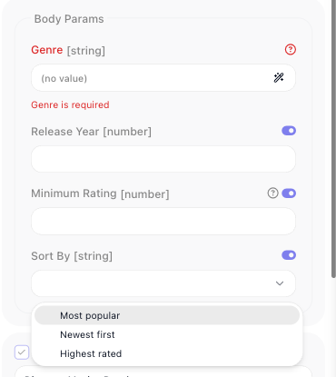

# Parameters & Types

The fields a flow builder fills in on your block - a Movie ID to type, a Release Year that only takes a
number, a Genre picked from a list - and the checking that stops bad input before it reaches your code all
come from one declaration: `params`, a zod object. Pick a type and the editor draws the matching control
under the block's **Body Params** section; chain a plugin and the field gets its label, hint and default.

```js
params: z.object({
  movieId: z.string().label('Movie ID').describe('TMDB numeric id, e.g. 693134'),
  year   : z.number().optional().label('Release Year'),
}),
```

`execute` receives exactly what you declared, parsed and typed:

- values converted to the declared type, so a number arrives as a number
- undeclared fields stripped
- a blank field resolved the way you declared it - see [Leaving a field blank](#leaving-a-field-blank)

**The container is always a `z.object`.** Leave `params` out for an action that takes no input. A bare
shape, a single field, or a `z.object().optional()` fails the deploy with `FR_EXT_INVALID_SCHEMA`; mark the
*fields* optional, never the container.

## What each type renders as

| zod type | The flow builder gets |
|---|---|
| `z.string()` | a single-line field |
| `z.text()` | a multi-line box |
| `z.number()` | a numeric field |
| `z.boolean()` | a toggle |
| `z.date()` | a date picker |
| `z.enum([...])` | a dropdown of the values |
| `z.array(inner)` | a list. Entries that are groups, dropdowns or dictionary fields open as rows with add and remove controls; a list of plain strings or numbers opens as one expression box, and the view toggle beside the label switches it to rows |
| `z.object({...})` | a nested group holding its own fields |

All eight, on one block:


The editor prints the published param type beside each label, which is why `Date` and `Enum` read as
`[string]`: the type is string, the widget is what differs. What a date field actually hands your handler is
under [What a date field hands your handler](#what-a-date-field-hands-your-handler).

The switch beside a label flips that control to an expression input, so a flow builder can bind the value
from an earlier block. A `z.string()` field has no switch because it already is one - which is why the
String row above shows a wand and no toggle.

**Other zod types.** `z.union()`, `z.tuple()`, `z.record()` and the rest deploy, but they render as a plain
text field and are validated at run time, inside an instance. A list inside a list has no row editor and
renders as one input. Keep to the eight above, with the one exception under
[Leaving a field blank](#leaving-a-field-blank).

## Giving a field its label, hint and default

Chain these onto any field:

| Plugin | Applies to | Effect |
|---|---|---|
| `.label(text)` | any field | The name shown on the block. Without one the key is humanized - `releaseYear` shows as **Release Year**. |
| `.describe(text)` | any field | The help text behind the **?** icon beside the label. A typed field supplies one of its own when you write none. |
| `.optional()` / `.nullable()` | any field | Marks the field not required. What a blank arrives as is under [Leaving a field blank](#leaving-a-field-blank). |
| `.default(v)` | any field | The value used when the field is left blank. Takes a value, never a label. |
| `.example(v)` | field or result | Publishes `v` as the sample a flow builder binds against. |
| `.dictionary(ref)` | a param | Fills the field from a dictionary, as a picker. See [Dictionaries](dictionaries.md). |
| `.labels({ value: 'Label' })` | `z.enum` | Shows the label in the dropdown, stores and hands your handler the value. |
| `.secret()` | a `z.string()` config field | Masks the input on the configuration form. On a param it does nothing, on purpose: a param's value is saved in the flow and readable over the API, so a credential belongs in config, never in a block field. See [Service Structure](service-structure.md#what-the-workspace-fills-in). |

**Sharing a param across actions.** Declare it once, name it with a `Param` suffix, and put each plugin
call on its own line so a change touches one line:

```js
const genreIdParam = z.string()
  .label('Genre')
  .dictionary(getGenresDictionary)
  .describe('Only include movies in this genre')
```

## Leaving a field blank

Every field is required unless you say otherwise. The editor sends an untouched field as an explicit `null`,
and the modifier on the declaration decides what your handler receives:

| Declared | A blank field arrives as |
|---|---|
| nothing | the block fails with `«Release Year» is required` |
| `.optional()` | `undefined` |
| `.nullable()` | `null` |
| `.nullish()` | `null` - the editor sends `null` for an untouched field |
| `.default(v)` | `v` |

So `.optional()` is the ordinary way to mark a field the flow builder may leave alone, and a `.default()` is
honoured whether the field was never touched or was cleared. Discover Movies declares one required field and
three the flow builder can skip:

```js
params: z.object({
  genreId  : genreIdParam,                                       // required
  year     : z.number().optional().label('Release Year'),
  minRating: z.number().min(0).max(10).optional().label('Minimum Rating').describe('TMDB score out of 10'),
  sortBy   : z.enum(['popularity.desc', 'primary_release_date.desc', 'vote_average.desc'])
    .default('popularity.desc')
    .label('Sort By'),
}),
```

On the block, the required Genre is flagged until it is filled, the two numbers are empty numeric fields,
and Sort By is an empty dropdown:


Running it like that succeeds: the handler reads `params.sortBy` and gets `popularity.desc`. The declared
default is published with the block but not pre-filled into the field, so the flow builder cannot see it;
say what it is in the hint, `.describe('Defaults to Most popular')`.

Do not pair `.nullable()` with `.default()`: the editor's `null` is handed over as `null` and the default
never fires. `.optional().default(v)` behaves as plain `.default(v)`.

One exception is deliberate: on a `z.string()` field an empty string is a **value**, so a required text field
accepts `''`. Add `.min(1)` to a string that must not be empty. The same `''` reaches a format check, so an
optional `z.email()` or `z.url()` that a flow builder cleared is reported as invalid. Where blank must mean
not set on a format field, declare `z.union([z.url(), z.literal('')]).optional()` - the one place a union
earns its keep.

## What is checked before your handler runs

For an action's `params` and a dictionary's `criteria`, everything you declare on a field is enforced before
`execute` runs: `.min()` and `.max()`, `.int()`, `.regex()`, the string formats such as `z.email()` and
`z.url()`, enum membership, and your own message on any of them. A violation fails the block, and the
message names the field by its label:

```
[flow-extension:tmdb] invalid params for method "discoverMovies" — minRating: «Minimum Rating» must be at most 10
```

That line is what the Test Monitor's ((Block Results)) tab shows after ((Run Block)), and what the block's
error exit carries in a run:

![The Test Monitor's Block Results tab for Discover Movies after a run with Minimum Rating set to 11: Input lists genreId 878, year null, minRating 11 and sortBy null, and Output is marked Error with the line beginning [flow-extension:tmdb] invalid params for method "discoverMovies", then minRating: «Minimum Rating» must be at most 10, cut off at the panel's edge](../images/extend/discover-run-invalid.png)

Every offending field is reported in that one line. A failure inside a group or a list names the property,
not the container - `«Person» is required`, `«Genres item 2» must be a string` - and a message you wrote
yourself, such as `z.string().min(3, 'Too short')`, is shown as written.

Rules written as code - `.refine()`, `.transform()`, `.trim()` - run only at run time, so they are never
reflected in the editor.

## Showing a label, sending a value

An API's own vocabulary is rarely what you want on a block. `.labels()` keeps the two apart: the dropdown
shows the label, the flow stores the value, and `execute` receives the value.

```js
sortBy: z.enum(['popularity.desc', 'primary_release_date.desc', 'vote_average.desc'])
  .labels({
    'popularity.desc'          : 'Most popular',
    'primary_release_date.desc': 'Newest first',
    'vote_average.desc'        : 'Highest rated',
  })
  .default('popularity.desc')
  .label('Sort By'),
```



The flow builder picks **Highest rated**; your handler gets `vote_average.desc`. Because the flow stores the
value, renaming a label later changes nothing that was saved. This holds at every depth - inside a
`z.object()`, inside a `z.array()`, inside a row of a list of groups.

`.labels()` is for a list you know when you write the service. When the options come from the API - genres,
projects, folders - use a [dictionary](dictionaries.md).

!!! warning "`.map()` no longer exists"
    Earlier versions offered `.map({ Label: value })`, which took its argument the other way round. A service
    still calling it fails to load, with a message naming `.labels()`. Move the API values into the `z.enum`
    list and the display names into `.labels()`.

## What a date field hands your handler

Declare `z.coerce.date()` and your handler gets a `Date` whether the value was picked, typed or bound. Plain
`z.date()` hands over what was sent - an ISO string when the value was typed or bound, epoch milliseconds
from the picker - so its inferred type is the one that lies. Both are validated as a date: `not-a-date` fails
with `«Released After» must be a date`, and `.min()` / `.max()` bounds are enforced.

```js
releasedAfter: z.coerce.date().optional().label('Released After'),
```

The ISO formats reshape the input to the declared form: `z.iso.date()` given a full datetime hands over the
date part, `z.iso.time()` the time part. They render as plain text fields, with no picker.

## Nested fields and lists

`z.object()` nests fields, and `z.array()` makes a list of them. Staying with TMDB:

```js
params: z.object({
  genres       : z.array(genreIdParam).label('Genres'),
  releaseWindow: z.object({
    from: z.coerce.date().label('From'),
    to  : z.coerce.date().label('To'),
  }).label('Release Window'),
}),
```

Because each `genres` entry is a dictionary field, the list opens as rows with add and remove controls; a
list of plain strings opens as one expression box, as the table above describes. A failure inside either
names the entry - `«Genres item 2» is required`, `«From» must be a date`.

A list of groups is the common shape - line items, recipients, filters:

```js
params: z.object({
  castFilters: z.array(z.object({
    personId: z.string().label('Person').dictionary(getPeopleDictionary),
    role    : z.enum(['cast', 'crew']).label('Role'),
  })).label('Cast Filters'),
}),
```

Keep nesting to two levels: give an entry plain fields, never another list. A list inside a list has no row
editor and renders as one input.

## Designing fields a flow builder can use

The person configuring your block is not the person who wrote it, and often does not know the API at all.

- **Label anything whose key would read badly.** A humanized key covers `releaseYear`; it does not cover
  `tvId` or `pg`.
- **Back id-like fields with a [dictionary](dictionaries.md).** `Science Fiction` in a dropdown beats knowing
  that the genre id is `878`.
- **Describe the format when there is one.** `.describe('TMDB numeric id, e.g. 693134')` costs a line and
  saves a support question.
- **Declare optionality honestly.** A field marked required that the API treats as optional makes the block
  unusable for the case the API supports.
- **Put limits in the declaration.** `z.number().min(0).max(10)` is checked before the request goes out,
  with a message that names the field; a check inside `execute` is not.
- **Order fields the way they are filled in.** The identifier first, then filters, then anything rarely
  touched.

**On a trigger.** A trigger's params render under **Payload** on the trigger block, as plain fields with no
expression switch, and a group or a list declared there renders as a single text field. Keep trigger params
to the primitive types. See [Triggers](triggers.md).

## Fields that depend on a choice

When the fields themselves are not known until a resource is picked, `dynamicParams` generates them at
runtime:

| Property | Type | What it does |
|---|---|---|
| `criteria` | `z.object` | The inputs the generated fields depend on. |
| `resolve` | function | `({ criteria, context, apiRequest }) => z.object({ … })`, merged into `params`. |

The declared `criteria` become the dependency set: change one of those fields and the generated ones are
resolved again. `resolve` runs while the form is half-filled, so it has to tolerate partial criteria, and it
must return a `z.object` - this is the one slot the deploy cannot check, so a bad return fails when the
console first calls it.

## Related

- [Dictionaries](dictionaries.md) - filling a field from the live API
- [Actions](actions.md) - what `execute` receives, and what it should return
- [Service Structure](service-structure.md) - config fields, which are drawn and checked the same way

<!-- REVISED 2026-09-09 for FR-3387 / FR-3425 / FR-3537 / FR-3538 / FR-3543 (flowrunner-cli 0.0.10, runtime
     released 2026-09-07), Documentation Flows on dev.flowrunner.ai, viewport 1700x1050. Gate verdict
     major-rework recorded in docs-review/verdicts/parameters-and-types.md; this is the one consolidated pass.
     DRIVEN 2026-09-09:
     - TMDB rewritten to `.optional()`, `.labels()`, `.default()`, `.secret()`, `z.number().min(0)` config;
       0.0.10 harness (services/tmdb/tests): blanks sent as explicit nulls resolve to absence, the enum default
       fires (sort_by=popularity.desc on the wire), `«Genre» is required` for a blank required field, config
       '200' -> 200. Deployed 9c62d40f5cc6.
     - TD Sandbox editor: Discover Movies placed; panel as first opened = discover-params-panel.png (Genre
       "is required" in red, ? icon beside Minimum Rating = the .describe text, number inputs, Sort By empty,
       purple expression switch on the three non-string fields, none on Genre). Sort By opened =
       discover-sortby-labels.png (Most popular / Newest first / Highest rated). Genre picked, run with
       year/minRating/sortBy sent as null -> Success. minRating 11 -> Error line quoted verbatim =
       discover-run-invalid.png (the Test Monitor truncates it at the panel edge; the alt says so).
       Block deleted; TD Sandbox back to 3 nodes / 2 edges.
     - Configuration tab (service-structure.md shots): masked key + reveal, number input, «Minimum Vote
       Count» must be at least 0 after Save, Save disabled, blank API Key accepted ('' is a value).
     SOURCE-DERIVED (console repo param-schemes/*.md, generated by running the runtime; shipped
     02-zod-types.md and 16-gotchas.md at 0.0.10): the list-row rule and view toggle, unsupported types
     degrading to a text field, array-of-array, FR_EXT_INVALID_SCHEMA, the '' rules and the union escape,
     .nullable().default(), .secret() on params, the nested error wording, dates and z.iso.*, trigger params
     flat / no expression mode, `.map()` throwing on load naming `.labels()`.
     NOT DRIVEN, said so in the handoff: dynamicParams (no probe service); the trigger-params leniency
     claim on actions.md; .example() on a param; a z.union() param deployed to see the degrade; the
     param-widgets.png shot predates this revision (2026-08-31) and was re-read against the table, not
     recaptured - its List row is the single-expression-box state the table now describes. -->
