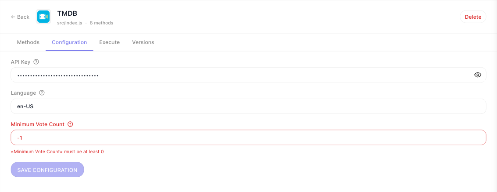

# Service Structure

Every extension is one JavaScript module that calls `Flowrunner.createExtension()` and then registers what
it offers on the object that comes back. This page covers that call: what the workspace configures, where
credentials are resolved, and where HTTP happens.

## The folder

```
services/tmdb/
  package.json         the service's own dependencies
  node_modules/        installed here, and uploaded with the deploy
  src/
    index.js           the module - all logic lives here
  public/
    icon.svg           the logo, and anything else served publicly
  tests/
    tmdb.test.js       the unit suite
  README.md
```

Only `public/` is served, at `…/{serviceId}/file/{path}`. A logo placed anywhere else resolves to a 404 and
the extension renders with no icon, which shows up only after you deploy. `logo` is the path within
`public/`, so `'/icon.svg'` and `'icon.svg'` both mean `public/icon.svg`. An absolute `https://` URL is not
supported.

## `createExtension`

| Property | Type | Required | What it does |
|---|---|---|---|
| `id` | string | yes | Persisted with every flow that uses one of its blocks. Frozen once deployed. |
| `name` | string | yes | Display name. |
| `description` | string | yes | Shown in the console. |
| `logo` | string | yes | Icon path inside `public/`. |
| `appearanceColors` | `[string, string]` | no | `[primary, secondary]` for the block in the editor. |
| `configItems` | `z.object` | no | What the workspace fills in. Leave it out for a service with no settings; a bare object of fields is rejected. |
| `initContext` | function | no | `({ config, oauth }) => context`, once per method call. |
| `apiRequest` | function | no | The shared HTTP helper. |
| `helpers` | function | no | `(ctx) => ({ … })`, reusable service logic. |
| `usesFileStorage` | boolean | no | Provisions the file client. Defaults to false. |

## What you can rename after deploying

Everything you register is keyed by `id`, and that id is persisted into every flow that places the block.
**Changing an id is not a rename.** The next deploy registers a new item under the new id and leaves every
flow that used the old one pointing at something you no longer build.

`name` and `label` are display text and can change whenever you like.

Ids must be unique across every kind: an action and a dictionary cannot share one, and registration fails
with `FR_EXT_DUPLICATE_ITEM_ID` if they do. Some names are claimed for you - an action `foo` with a loader
`result` claims `foo_SampleResultLoader`, and `dynamicParams` claims `foo_DynamicParams`.

Two naming conventions the rest of this section follows: a dictionary id starts with `get` and ends with
`Dictionary`, and a reusable param schema ends with `Param`.

## What the workspace fills in

`configItems` is a zod object, and each field becomes a row on the extension's ((Configuration)) tab, drawn
from its type the same way a block's params are: a `z.number()` is a numeric field, a `z.boolean()` a
toggle, a `z.enum()` a dropdown. The label sits above the row and the description behind its help icon.

```js
configItems: z.object({
  apiKey      : z.string().secret().label('API Key').describe('Your TMDB v3 API key, from Settings -> API'),
  language    : z.string().optional().default('en-US').label('Language')
    .describe('IETF tag used for titles and overviews, e.g. en-US or de-DE'),
  minVoteCount: z.number().min(0).default(50).label('Minimum Vote Count')
    .describe('Discover Movies ignores titles with fewer votes than this'),
}),
```


Values are filled in once per workspace and reach every handler as `config`. Nothing is typed into a block,
and nothing travels in a flow's data.

**Values arrive as the declared type.** A number typed into the form reaches `config` as a number, a blank
field resolves the way a blank param does, and a `.default()` is filled in. There is nothing to convert in
`initContext`.

**Your rules are checked on the form.** Whatever you declare on a field - `.min()`, a format, enum
membership - is enforced when the workspace administrator saves. The offending field is marked, the message
names it, and ((Save Configuration)) stays disabled - hovering it says *Fix all invalid inputs first* - until
it is fixed:



The same rules run again before every method call, so a value that became invalid without anyone reopening
the form - a new `.min()` in a redeploy, say - fails the block with `FR_EXT_INVALID_CONFIG` naming the field.
An empty string is a value on a `z.string()` field, so a required text field accepts it; add `.min(1)` to a
key that must not be blank.

**`.secret()` masks a credential.** On a `z.string()` config field it renders the input masked, with a
reveal icon. It changes nothing about how the value is stored or validated, and it has no effect on a
`z.text()` field or on a block's params.

Two things a config field cannot be:

- **A container.** `z.object()` and `z.array()` have no config control; declare structured input as a param.
- **Dictionary-backed.** `.dictionary()` is ignored on a config field, because nothing has run yet to fetch
  options from. Use `z.enum([...])` for a fixed set of choices.

A `z.date()` config field is a date with no time of day. Declare a string if you need one.

!!! note "Extensions deployed before 0.0.7 keep the old form"
    The form above is drawn from the schema the CLI publishes with the deploy. An extension deployed with
    an older CLI has no published schema, so its ((Configuration)) tab asks for a redeploy, and the
    ((Configure)) dialog in the flow editor falls back to a plain form that checks only whether required
    fields are filled. Redeploy once with the current CLI and both switch over.

## Resolving credentials once

`initContext` runs once per method call, and whatever it returns is the `context` every handler in that
call receives. It is the place to derive base URLs and resolve credentials:

```js
initContext: ({ config }) => ({
  baseUrl     : 'https://api.themoviedb.org/3',
  apiKey      : config.apiKey,
  language    : config.language,
  minVoteCount: config.minVoteCount,   // already a number
}),
```

Derive each value in exactly one place. If `initContext` trims a pasted token into `context` while a
handler reads the untrimmed one from `config`, the two disagree only for the users who pasted trailing
whitespace, and nothing anywhere reports it.

## One place for HTTP

`apiRequest` is where the base URL, authentication, error handling and logging live, so actions stay
declarative. You define its signature; the runtime injects `context` and `logger`:

```js
apiRequest: async ({ url, method = 'get', body, query, context, logger, logTag }) => {
  const fullUrl = `${ context.baseUrl }${ url }`

  logger?.debug(`[${ logTag ?? 'api' }] ${ method.toUpperCase() } ${ fullUrl }`)

  try {
    return await new Flowrunner.Request(fullUrl, method, body)
      .query({ ...query, api_key: context.apiKey, language: context.language })
  } catch (error) {
    // ResponseError.message is the response body, so it is not always a string.
    const failure = new Error(`TMDB ${ error?.status ?? '?' }: ${ describeFailure(error) }`)

    failure.status = error?.status
    throw failure
  }
},
```

Two details that matter:

- **Take the verb as a value.** `new Flowrunner.Request(url, method, body)` is correct when `method` arrives
  as an argument. Do not write `Flowrunner.Request[method.toLowerCase()](url)` - see
  [HTTP Requests](http-requests.md#the-verbs) for why.
- **Keep the status when you rethrow.** A dictionary has to tell "no such record" apart from "bad API key",
  and it cannot if the normalized error drops `status`.

For a service that only ever issues GETs, the static form is shorter and needs no default:

```js
apiRequest: async ({ url, query, context }) => {
  return Flowrunner.Request.get(`${ context.baseUrl }${ url }`)
    .query({ ...query, api_key: context.apiKey })
},
```

The full client - verbs, query rules, headers, bodies, uploads, responses and failures - is on
[HTTP Requests](http-requests.md).

## Sharing logic with helpers

`helpers` builds functions bound to the service's context, exposed as `helpers` in every handler. It earns
its place for behaviour several handlers share and that needs the context bag - paging a list endpoint to
the end, resolving an id through two calls:

```js
helpers: ({ apiRequest }) => ({
  discover: async ({ genreId, year, sortBy }) => {
    return apiRequest({
      url  : '/discover/movie',
      query: { with_genres: genreId, primary_release_year: year, sort_by: sortBy },
    })
  },
}),
```

What does not belong there is anything already in the handler bag. A helper that only renames `apiRequest`
adds a layer to read through and hides the URL each action calls. If the thing you want to share needs no
context at all, make it a plain function at the bottom of the file instead.

## How the file reads

One module, in the order the platform resolves it:

```js
const z = Flowrunner.z                              // 1. the zod handle

const ext = Flowrunner.createExtension({ … })       // 2. config, initContext, apiRequest, helpers

const getGenresDictionary = ext.dictionary({ … })   // 3. dictionaries, before the params that use them

const genreIdParam = z.string()                     // 4. shared param schemas
  .label('Genre')
  .dictionary(getGenresDictionary)

ext.addAction({ … })                                // 5. actions
ext.addPollingTrigger({ … })                        // 6. triggers

function describeFailure(error) { … }               // 7. plain functions, at the end
```

Write those closing helpers as `function` declarations rather than `const` arrows. Declarations hoist, so an
action can use one that appears below it, which is what lets the file open with the extension's shape
instead of a wall of utilities.

## Types follow your declarations

`createExtension` resolves the service's shape once, and every handler is typed from it:

| Declared | Becomes | Typed as |
|---|---|---|
| `configItems` | `config` | `z.infer` of the schema |
| `initContext` | `context` | its return type |
| `helpers` | `helpers` | its return type |
| `apiRequest` | `apiRequest` | your signature, minus the `context` and `logger` the runtime injects |

Services are plain JavaScript, so these arrive as hover text and autocompletion rather than as errors,
unless the project opts into checking JS. A service written in TypeScript gets the same types as real
compile errors.

## Related

- [Parameters & Types](parameters-and-types.md) - declaring the fields on a block, and the rules config fields share with them
- [Actions](actions.md) - `addAction`, the handler context bag, and returning results
- [HTTP Requests](http-requests.md) - the `Flowrunner.Request` client in full
- [Quick Start: Your First Extension (code)](getting-started.md) - the whole loop, from install to a block in a flow
