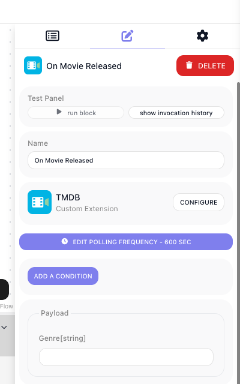

# Triggers

A trigger waits for something to happen outside FlowRunner and hands over what arrives. Where a flow builder
places it decides what that means: first in a flow, it starts an instance for each thing it finds; in the
middle, the flow runs up to it and waits there until the event comes.

You write the part that knows the API. FlowRunner owns the loop, the stored position and the delivery.

There are two kinds, and the API decides which you write:

| | Polling | Realtime |
|---|---|---|
| How events arrive | you ask the API on a timer | the provider calls a URL you registered |
| You write | a query | a subscription, plus how to read the delivery |
| Needs from the API | any endpoint that lists recent things | outgoing webhooks |
| Latency | the polling interval | seconds |

If the API has webhooks, prefer realtime. If it does not, polling is the only option.

## Polling triggers

Register with `ext.addPollingTrigger()`. You supply a `fetch` that returns the most recent items, and
declare **exactly one** mechanism that decides which of them are new:

```js
ext.addPollingTrigger({
  category   : 'TMDB',
  id         : 'onMovieReleased',
  label      : 'On Movie Released',
  description: 'Fires for each movie that reaches its release date in the chosen genre.',
  params     : z.object({
    genreId: z.string().optional().label('Genre').dictionary(getGenresDictionary),
  }),
  result: {
    id          : 693134,
    title       : 'Dune: Part Two',
    release_date: '2024-02-27',
    vote_average: 8.133,
  },
  fetch: async ({ params, helpers }) => {
    if (!params.genreId) {
      return []
    }

    const response = await helpers.discover({
      genreId       : params.genreId,
      sortBy        : 'primary_release_date.desc',
      releasedBefore: today(),
    })

    return response.results ?? []
  },
  watermark: { by: 'release_date', sortedDesc: true },
})
```

| Property | Type | Required | What it does |
|---|---|---|---|
| `category`/`id`/`label`/`description` | string | yes | As for an action. `id` is frozen once deployed. |
| `params` | `z.object` | no | The fields on the trigger block. Plain fields only - a trigger's form is flat. |
| `result` | sample | yes | The shape of one emitted item. |
| `fetch` | function | no | Returns recent items, for `dedupe` and `watermark`. |
| `dedupe` \| `watermark` \| `poll` | | yes | Exactly one. |

### Choosing the mechanism

| Mechanism | You declare | What the runtime does |
|---|---|---|
| `dedupe` | a function, a field path, or `{ by, stateKey, max }` | Keeps a bounded set of the ids it has seen and emits items whose id is new. Right when items have a stable id but no reliable ordering. `stateKey` defaults to `seen` and `max` to 500 ids, oldest discarded first. |
| `watermark` | `{ by, sortedDesc, stateKey }` where `by` is a field path or `(item, { params }) => value` | Stores the highest value it has seen and emits everything past it. Right when items carry a timestamp or an increasing key. `stateKey` defaults to `watermark`. |
| `poll` | a function returning `{ events, state }` | Full control, and you own the shape of `state` and the learning-mode behaviour. For overlap windows, held cursors and consuming feeds. |

### What the runtime stores between polls

| Phase | `dedupe` | `watermark` | `poll` |
|---|---|---|---|
| First poll | records the ids it saw, emits nothing | records the highest value, emits nothing | you seed `state` and emit nothing |
| Setup preview | shows everything `fetch` returned, stores nothing | same | yours - the runtime returns what you return |
| Every later poll | emits ids not in the set | emits items past the mark, advances it | your delta |

**The first poll emits nothing on purpose.** It records where the feed stands, so configuring a trigger does
not fire a run for every historical item.

**The setup preview is your job to limit.** While a flow builder configures the trigger, the runtime calls
your handler with `isLearningMode: true`. With `fetch`, everything you return is shown, so check the flag
and return one item. With `poll` the runtime does nothing at all - it hands the flag straight to you and
returns your result verbatim, so read it and return a single event with `state: null` yourself.

### The watermark trap

The stored mark is whatever the chosen field held on the first poll, so a field the API can hand back out
of order stops the trigger firing with no error anywhere.

TMDB is a live example: it lists announced films with placeholder release dates years in the future, and
sorting by release date descending puts those first. The seeding poll stored **`2047-05-11`**, and nothing
would ever have been newer than that. The fix is in the query, not the mechanism - ask only for titles that
have actually been released:

```js
const response = await helpers.discover({
  genreId       : params.genreId,
  sortBy        : 'primary_release_date.desc',
  releasedBefore: today(),                       // clamps the feed to today
})
```

Before shipping a watermark trigger, look at what the API returns at the top of the feed and ask what the
stored value would be after the first poll.

`sortedDesc: true` is the second trap on the same mechanism. It tells the runtime to **stop scanning at the
first item that is not past the mark**, which is a shortcut that assumes the API really did sort the way you
asked. On a feed that is only mostly sorted, every new item sitting behind one old item is dropped, silently
and permanently. Leave it off unless the ordering is guaranteed.

### What your handlers receive

Both take one object: the handler bag every action gets, plus their own arguments.

| Handler | Receives | Returns |
|---|---|---|
| `fetch` | `params`, `isLearningMode`, and the usual `context`, `config`, `apiRequest`, `helpers`, `logger` | the recent items, as an array |
| `poll` | the same, plus `state` | `{ events, state }` |

`poll` is the escape hatch, for a feed the two stored-state mechanisms cannot express - an overlap window, a
cursor you hold back, a queue that consumes what it reads:

```js
poll: async ({ params, state, isLearningMode, apiRequest }) => {
  const since    = state?.cursor ?? null
  const response = await apiRequest({ url: '/events', query: { since } })
  const events   = response.events ?? []

  if (isLearningMode) {
    return { events: events.slice(0, 1), state: null }   // preview one, store nothing
  }

  return { events, state: { cursor: response.next_cursor } }
},
```

### Trigger params are lenient

The runtime polls with whatever the instance was saved with, so a half-configured trigger must not throw -
rejecting a poll would stop a live automation with nothing to show for it. Guard instead:

```js
fetch: async ({ params, helpers }) => {
  if (!params.genreId) {
    return []
  }
  …
}
```

### What the flow builder sees

The trigger's `params` appear under **Payload**, and the block carries two controls of its own:
((EDIT POLLING FREQUENCY)), which starts at 600 seconds and cannot go below 30, and ((ADD A CONDITION)) for
narrowing what it passes on. The runtime appends the chosen interval to your `description`, so the text on
the block is not exactly what you wrote.



<!-- doclint: allow-unlinked: Condition -->

## Realtime triggers

Realtime triggers are driven by SYSTEM methods the runtime owns. You never write those; you declare the
pieces they call.

`ext.setupRealtimeTriggers()` is declared once for the extension and owns the webhook:

| Property | What it does |
|---|---|
| `scope` | `'SINGLE_APP'` for a webhook per workspace, `'ALL_APPS'` for one callback shared by every workspace. |
| `scopeAt` | With `ALL_APPS`, the path in the payload holding the routing key. A delivery goes to the workspace whose `eventScopeId` it matches. |
| `subscribe` | Registers the webhook. Receives `callbackUrl`, the full set of `triggers`, and the previous `webhookData`. |
| `unsubscribe` | Tears it down when the flow stops. |
| `extractProviderEventName` | A path or function giving the event's name, which routes it to triggers. |
| `extractProviderEventData` | A path or function giving the payload. Defaults to the whole body. |
| `verify` | A declarative signature check. |
| `refresh` | For providers whose registrations expire. Return a new `refreshIntervalInSeconds` to set when it runs again. |
| `verifyRequest` | Replaces `verify` when the provider signs something other than the raw body. |
| `resolveEvents` | Replaces the `extract*` pair for payloads too irregular to describe declaratively. |
| `handshake` | Answers a provider's endpoint-verification challenge. |

Then one `ext.addRealtimeTrigger()` per event, each claiming a `providerEventName`:

```js
ext.setupRealtimeTriggers({
  scope                   : 'SINGLE_APP',
  extractProviderEventName: 'event',
  extractProviderEventData: 'data',
  verify: {
    header  : 'X-Vendor-Signature',
    algo    : 'sha256',
    encoding: 'hex',
    secret  : (config) => config.webhookSecret,
  },
  subscribe: async ({ callbackUrl, triggers, webhookData, apiRequest }) => {
    if (webhookData?.id) {
      await apiRequest({ url: `/hooks/${ webhookData.id }`, method: 'delete' })
    }

    const events = [...new Set(triggers.map(trigger => trigger.providerEventName))]
    const hook   = await apiRequest({ url: '/hooks', method: 'post', body: { url: callbackUrl, events } })

    return { webhookData: { id: hook.id } }
  },
  unsubscribe: async ({ webhookData, apiRequest }) => {
    if (webhookData?.id) {
      await apiRequest({ url: `/hooks/${ webhookData.id }`, method: 'delete' })
    }

    return { webhookData: {} }
  },
})

ext.addRealtimeTrigger({
  category         : 'Notes',
  id               : 'onNoteUpdated',
  label            : 'On Note Updated',
  description      : 'Fires when a note changes.',
  providerEventName: 'note.updated',
  params           : z.object({ boardId: z.string().optional().label('Board') }),
  match            : { boardId: 'boardId' },
  result           : { id: 'note_1', body: 'Ship it', boardId: 'brd_1' },
})
```

| Property | What it does |
|---|---|
| `category`/`id`/`label`/`description` | As for an action. `id` is frozen once deployed. |
| `providerEventName` | The provider event this trigger claims. Also takes an array, or `({ params }) => string[]`. |
| `params` | The fields on the trigger block. |
| `match` | Which configured instances a delivery belongs to. |
| `result` | The shape of one emitted event. |
| `extendEventData` | Adds to the payload before matching. Pure, no API calls. |
| `extendResult` | Enriches the payload after matching, once, and may call the API. |
| `oauth2Scopes` | Extra OAuth scopes. |

### Matching a delivery to the right instances

`providerEventName` decides which *triggers* a delivery reaches. **`match` decides which configured
*instances* of that trigger it belongs to**, and without it a filter param filters nothing - every instance
fires on every delivery.

The declarative form maps a param to a path in the payload:

```js
match: { boardId: 'boardId' },        // fires only when providerEventData.boardId equals the chosen board
```

An empty param matches everything, so a blank Board still fires on all boards. For ranges, contains, or
anything derived, use the function form instead:

```js
match: ({ params, providerEventData }) => providerEventData.wordCount > (params.minWords ?? 0),
```

A delivery is handled in this order:

1. `handshake`, if the provider needs its endpoint verified
2. `verify` or `verifyRequest` checks the signature
3. `extractProviderEventName` picks the event name, routing it to every trigger claiming it
4. `extractProviderEventData`, then `extendEventData`, build the payload
5. `match` runs per configured instance
6. `extendResult` runs once, if anything matched
7. the matched instances fire

`subscribe` is an upsert: it re-runs with the full desired set of triggers and the previous `webhookData`,
so either delete the old registration and create a new one, or reconcile the difference. Alongside
`webhookData` it may return `eventScopeId` - the value an `ALL_APPS` delivery is matched against to find
this workspace - and `refreshIntervalInSeconds`.

**One shared webhook serves every trigger you declare.** An inbound delivery is verified, its event name is
read, and it is routed to every trigger claiming that name.

### One trigger per event

Never write one trigger with an event-type parameter: its `result` then describes none of the shapes it
emits, and a flow builder has to configure which event they meant instead of choosing it by name. Splitting
costs nothing, because all of them share the one webhook registration.

Use `params` for filters - which board, which status - never for choosing the event.

### Verifying a delivery

`verify` HMACs the raw body with your secret and compares it to a header in constant time. It covers the
common case where the provider signs the body alone.

It also takes `timestampHeader` and `freshness`, for rejecting a replayed delivery. **`freshness` does
nothing on its own**: without `timestampHeader` it is silently inert, and a declared header that the
provider did not send passes.

A provider that signs a composed string, such as `{timestamp}.{body}`, cannot be expressed declaratively.
Write `verifyRequest` instead, using `Flowrunner.crypto`, which offers `hmac(algo, key, data, encoding)`,
`timingSafeEqual(a, b)` and `ageSeconds(timestamp)`. Headers reach `verifyRequest` in whatever casing the
provider sent, so look them up case-insensitively.

!!! note "Scopes on a realtime trigger are not collected"
    `oauth2Scopes` declared on a realtime trigger are currently not added to the authorize URL - only those
    on actions, polling triggers and dictionaries are. Put a realtime trigger's scopes in the
    extension-level `scopes` instead.

## What you cannot change after shipping

These are persisted or read by live flows, so changing one breaks running automations:

- a trigger's `id`
- the keys in its `params`
- the shape of `webhookData`
- `eventScopeId`

Shaped events, matched ids and handshake responses are transient, and free to change.

## Related

- [Actions](actions.md) - blocks that run when the flow reaches them
- [Parameters & Types](parameters-and-types.md) - the fields on a trigger block
- [Dictionaries](dictionaries.md) - backing a trigger's filter with a picker
- [Testing](testing.md) - driving a trigger through the SYSTEM method the platform calls
