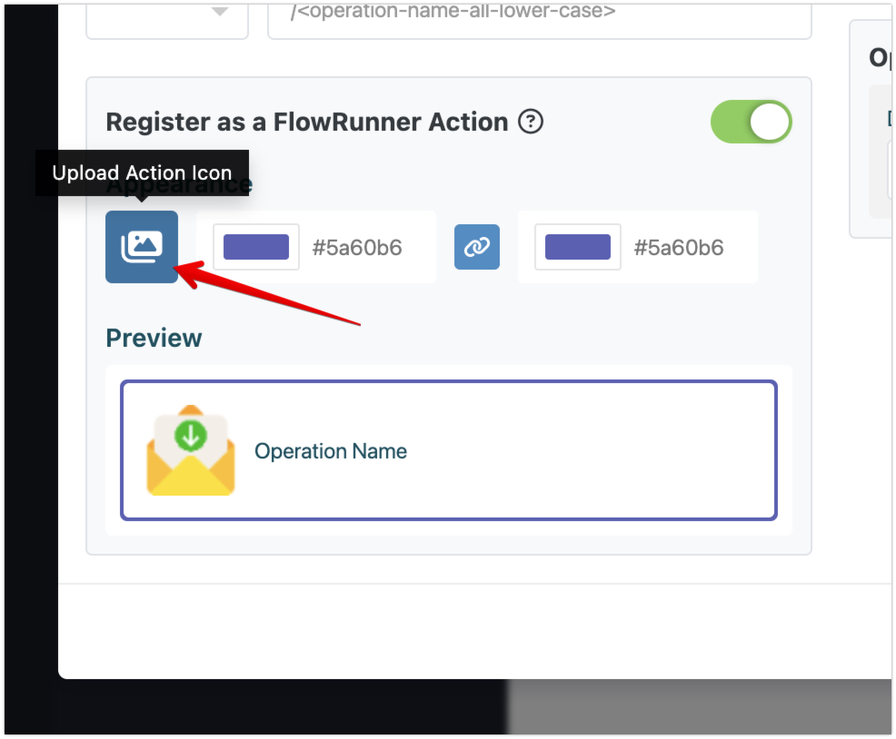
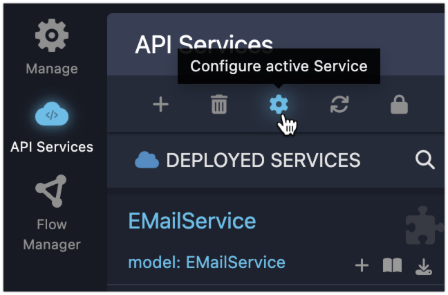
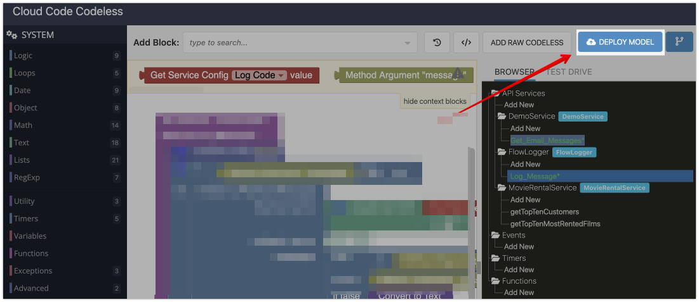

# The Lifecycle of Action Development

Developing a FlowRunner™ action follows a structured lifecycle: creating the API service, defining operations, adding the logic, and configuring the operation for FlowRunner™. This section provides an overview of each stage.

## 1. Create the API Service
The first step in developing a custom action is to create an API service within Backendless. This service acts as a container for one or more operations. Each operation can later be transformed into an action that is usable in FlowRunner™. To create a new API service, navigate to the `API Services` screen and click the :material-plus: icon:

!!! note "Where to find the API Services screen"
    If you do not see the "API Services" icon in the sidebar on the left, click the `QUICK ACCESS` button in the upper left corner of the management console and search for "API Services":

    

    Click the "API Services" item to access the screen. You can also click the :material-star: icon to create a shortcut in the sidebar.

A popup window opens and defaults to `CODELESS`. Assign a name for your service in the **Service Name:** field and click `SAVE`.

!!! note
    If you plan to develop an action for a service that requires OAuth2 authentication, make sure to select the **With OAuth2 Authorization** template. There are several additional requirements for implementing an action for an service with OAuth2 authorization. Make sure to read the details in the [OAuth2 Authorization](./oauth2-services.md) chapter of this guide. 

## 2. Define Operations
Once the API service is created, you can define specific **operations** within it. These operations represent the individual tasks or logic that will be turned into actions. An API service can have multiple operations, each serving a different purpose, such as interacting with a database, processing user input, or connecting to external services. When you create a new service, the system will automatically prompt you to create an operation by displaying the popup shown below, this is where you will be declaring an operation in your service. An operation must have a name and a description. Depending on what the operation does, you may also need to declare operation parameters.

To add an operation (also known as "method"), click the  :material-plus: icon for your service as shown below:

## 3. Operation Setup
Configuring an operation has a direct impact on the presentation of the corresponding action in FlowRunner™. The following configuration properties are of particular importance:

**Name**: Identifies the action in FlowRunner™. Assign a name (or a short phrase) that clearly describes what the action does, providing insights about input and output values and overall functionality. The description will appear as a tooltip for the action block in FlowRunner™'s [Blocks Toolbox](../flow-editing/floweditor.md#blocks-toolbox) and when hovering the mouse over the block in a flow.

**Description**: A description should clearly explain what the action/operation does and how to effectively use it in FlowRunner™ workflows.

**Action Icon**: Assign an icon that represents the action, making it easier to identify in the FlowRunner™ Flow Editor. The icon will appear in a block representing the action in Flow Editor.
   

**Block's Colors**: Apply a custom color to the block's border to help distinguish it from other actions. The border can consist of two colors which, if they are different, will gradient from one to the other. By default, the colors are "linked", which means if you change one color, the other will automatically change to the same color. You can click the :link: icon to unlink the colors, or simply pick another color with the color picker which will remove the linking:

## 4. Define Service Configuration Parameters
In some cases, the operations of your service (i.e., FlowRunner™ Actions) may require configuration information provided in advance. For example, consider a service designed to send and receive emails. To connect to an email server, the service needs details such as the server’s address, port, username, and password. This information can be collected through **service configuration parameters**.

Configuration parameters can be set up in the **Service Configuration** popup. To access this popup, select your service on the **API Services** screen and click the settings icon:

These parameters ensure that necessary configuration data is available for your operations without requiring it to be hard-coded or manually entered each time the action is used. For more information on setting up configuration parameters, see the [Service Config Parameters](./service-config.md) section of this guide.

## 5. Develop Action Logic
This is the stage where the actual **logic** of the action is implemented. If you’re using Codeless, you will visually create the logic by dragging and dropping blocks in the logic editor. Codeless allows you to build logic without writing any code, making it accessible even for developers with minimal programming experience. You can also incorporate custom JavaScript code into Codeless if your action requires more advanced functionality.

In this step, you define how the action will process data, interact with other services, or perform specific calculations. The logic implemented here determines the action's behavior when it is used within a flow.

## 6. Deploy and Test Iterations
Once the logic has been added, the action needs to be thoroughly **tested** to ensure it behaves as expected. Backendless provides a testing environment where you can verify the action’s functionality. This stage is crucial to catch any errors or unexpected behavior before the action is used in FlowRunner™ or published to the Marketplace. The deployment process differs between services created with Codeless and Nodejs. For Codeless services, you should use the **DEPLOY MODEL** button located in the Codeless Logic Editor interface:

For more information about FlowRunner™ Custom Action testing, see the [Action Testing](./action-testing.md) section of this guide.