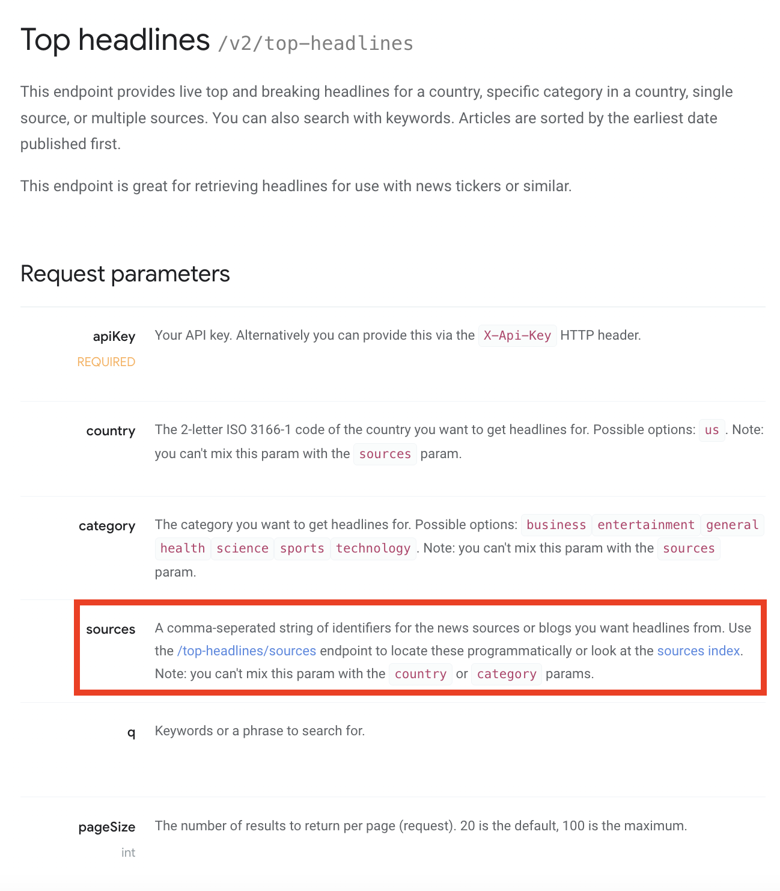

# Developing an Action with Dictionary Arguments

In this guide, you will enhance the action you created in the [Build Basic Action Guide](./basic-action-js.md) and expanded in the [Build Action with Arguments Guide](./action-with-args-js.md). You will implement a **dictionary argument**, which allows your FlowRunner™ action to fetch external data and present it to the user as a dynamic list of selectable options.

For example, let’s say your **Search News Headlines** action should allow users to choose a specific news source. Instead of asking users to type the source manually, you will implement a dictionary function that dynamically fetches available sources from an external API and presents them as a selectable dropdown in FlowRunner™:


This approach is ideal when your action needs to present up-to-date choices - such as API resources, dynamic datasets, or filtered lists. It also applies when available options depend on prior selections, like choosing a specific sheet from a selected Google Sheets document.

### Scenario Example: NewsAPI.org

In this guide, you will enhance the **Search News Headlines** action you created in the [previous chapter](./action-with-args-js.md) by adding a dictionary parameter. Specifically, you will integrate it with NewsAPI.org to allow users to select a news source from a dynamically populated list. The **[Top Headlines](https://newsapi.org/docs/endpoints/top-headlines)** endpoint accepts a `sources` parameter, but obtaining valid source values requires calling a separate API:  


Below is the documentation for the corresponding **Sources endpoint**, which you will use to dynamically populate the dictionary list:  


## Implementation Overview

Enabling dictionary functionality requires two main tasks:

1. [**Build a dictionary function**](#build-dictionary-function) - A function that retrieves and formats dynamic options.
2. [**Link the dictionary to a parameter**](#link-dictionary-to-parameter) - Connects the input field to your dictionary logic for dynamic selection.

## Build Dictionary Function

A **dictionary function** fetches external data and prepares it for FlowRunner’s dropdown UI. It powers an input that supports search, pagination, and clearing selections:  


### What This Function Does

Here is a full implementation of a dictionary function that retrieves available news sources from NewsAPI.org. 

- Fetches source options from NewsAPI.org.
- Filters items based on user search input.
- Returns results in the required **FlowRunner™ dictionary format**.

```js linenums="1"
//------------ DICTIONARIES -------------------

/**
 * @typedef {Object} DictionaryPayload
 * @property {String} [search]
 * @property {String} [cursor]
 * @property {Object} [criteria]
 */

/**
 * @typedef {Object} DictionaryItem
 * @property {String} label
 * @property {any} value
 * @property {String} note
 */

/**
 * @typedef {Object} DictionaryResponse
 * @property {Array<DictionaryItem>} items
 * @property {String} cursor
 * @property {Object} criteria
 */

/**
 * @registerAs DICTIONARY
 * @route POST /getSourcesDictionary
 * @param {DictionaryPayload} payload
 * @returns {DictionaryResponse}
 */

async getSourcesDictionary({ search, cursor, criteria }) {
  const sourcesResponse = await Backendless.Request.get('https://newsapi.org/v2/top-headlines/sources')
    .set({
      'User-Agent': 'FlowRunner™'
    })
    .query({
      apiKey: this.apiKey
    })

  let filteredItems = sourcesResponse.sources

  if (search) {
    search = search.toLowerCase()

    filteredItems = sourcesResponse.sources.filter((i) => {
      return i.name?.toLowerCase().includes(search) || i.id?.toLowerCase() === search
    })
  }

  return {
    cursor: cursor,
    items: filteredItems.map((item) => {
      return {
        label: item.name,
        value: item.id,
        note: `${item.category}, ${item.language}`,
      }
    })
  }
}
```

### About the Dictionary Typedefs

The first three `@typedef` blocks define shared types and should only be declared once per service file:

```js linenums="34"
/**
 * @typedef {Object} DictionaryPayload
 * @property {String} [search]
 * @property {String} [cursor]
 * @property {Object} [criteria]
 */

/**
 * @typedef {Object} DictionaryItem
 * @property {String} label
 * @property {any} value
 * @property {String} note
 */

/**
 * @typedef {Object} DictionaryResponse
 * @property {Array<DictionaryItem>} items
 * @property {String} cursor
 * @property {Object} criteria
 */
```

The dictionary function is registered using the `@registerAs DICTIONARY` tag and a matching `@route` declaration:

```js linenums="24"
/**
 * @registerAs DICTIONARY
 * @route POST /getSourcesDictionary
 * @param {DictionaryPayload} payload
 * @returns {DictionaryResponse}
 */

async getSourcesDictionary({ search, cursor, criteria }) {
```

### Return Format

A valid dictionary response must include:
- **items**: An array of selectable options.
- **cursor**: Used for pagination (optional depending on your use case).
- **label, value, note**: Fields used by FlowRunner’s UI.

```js linenums="50" hl_lines="5-7"
  return {
    cursor: cursor,
    items: filteredItems.map((item) => {
      return {
        label: item.name,
        value: item.id,
        note: `${item.category}, ${item.language}`,
      }
    })
  }
```

---

## Link Dictionary to Parameter

With the dictionary function ready, you can now link it to a parameter inside your action using the `dictionary` property in the `@paramDef`.

Below is an updated version of your `getNewsWithCategoryOrQuery` action, now with an additional **source** parameter tied to your dictionary function:

```js
/**
 * @description Retrieves top news headlines for a category and/or a search query
 *
 * @route GET /getNewsWithCategoryOrQuery
 * @operationName Search News Headlines
 * @appearanceColor #FE1212 #191970
 * @executionTimeoutInSeconds 120
 * @paramDef {"type":"String","label":"News Category","name":"category","required":false, "uiComponent": {"type":"DROPDOWN", "options":{ "values":["business", "entertainment", "general", "health", "science", "sports", "technology"] }}, "description":"The category you want to get headlines for."}
 * @paramDef {"type":"String","label":"Search Query","name":"query","required":false,"description":"Keywords or a phrase to search for."}
 * @paramDef {"type":"String","label":"Source","name":"source","required":false,"dictionary":"getSourcesDictionary", "description":"News source to get headlines from."}
 * @returns {Object} Returns news headlines from the specified category and/or a search query.
 */
async getNewsWithCategoryOrQuery(category, query, source) {
```

The `"dictionary": "getSourcesDictionary"` property binds the **Source** input to the dictionary logic, enabling dynamic dropdown values in FlowRunner™.
```js hl_lines="6"
* @paramDef {
  "type":"String",
  "label":"Source",
  "name":"source",
  "required":false,
  "dictionary":"getSourcesDictionary",
  "description":"News source to get headlines from."
}
```

## Best Practices

To ensure a smooth user experience and efficient integration, follow these best practices:

**Optimize API Requests**
- Limit returned records (e.g., up to 100 items) to improve UI performance.
- Use external API pagination if supported.

**Implement Effective Search**
- Filter results based on the `search` input passed by FlowRunner™.
- Support partial and case-insensitive matches.

**Handle Errors Gracefully**
- Log and catch API errors inside dictionary functions.
- Return empty lists or helpful notes if data retrieval fails.

**Minimize Unnecessary Calls**
- Cache static data or slow-changing datasets (e.g., static category lists) to avoid redundant API requests.

**Standardize the Output**
- Always provide **label**, **value**, and **note** fields for consistency.
- Keep dropdown labels short and clear.

```json
{
  "label": "The Verge",
  "value": "the-verge",
  "note": "technology, en"
}
```

By following this approach, you will provide FlowRunner™ users with responsive and user-friendly dictionary inputs connected to real-time external data.
