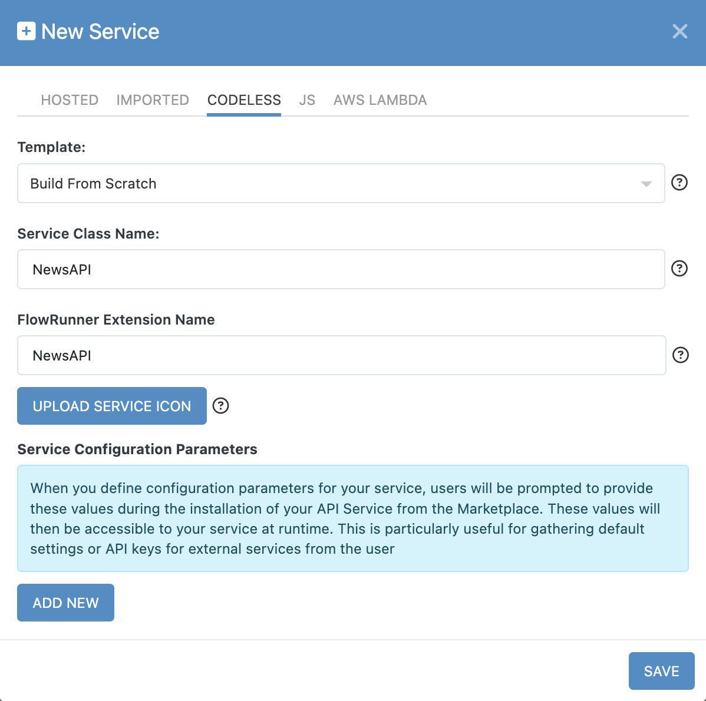
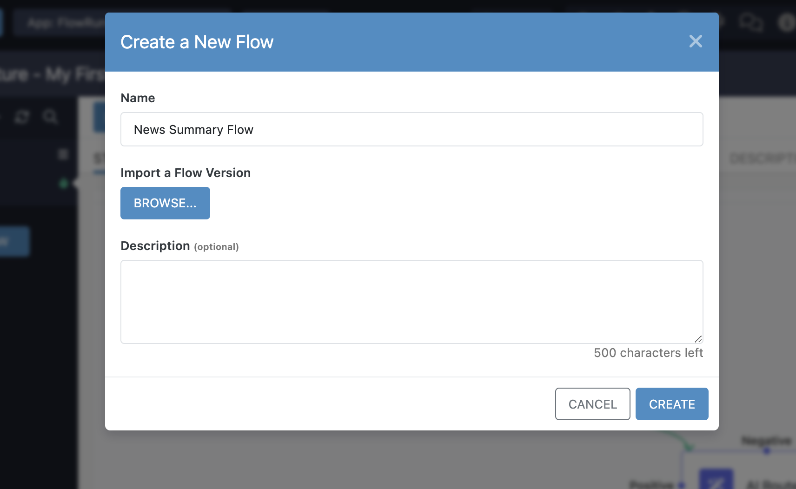

# Custom Action Development Guide  

Learn how to build a **Codeless FlowRunner™ action** that integrates with [NewsAPI](https://newsapi.org). If you previously worked on [creating your first flow](../quickstart.md#create-your-first-flow), you may recognize this service.  

!!! example "Action Development Guides"
    The action development guide is divided into three parts to keep instructions organized and easy to follow:  

    - **Build Basic Action Guide** (the current chapter) – Covers the fundamentals of developing an action. This chapter walks you through creating an action without arguments, using only one configuration item: an API Key.  

    - **[Build Action with Arguments Guide](./actions-with-args.md)** – Builds on the basic action by introducing arguments. This guide explains how to declare action parameters, use them in implementation logic, and configure them in FlowRunner™.  

    - **[Build Dictionary Operation](../dictionary-arguments.md)** – Explores a special type of argument called a **dictionary**. This argument allows your action to dynamically generate a list of possible parameter values. For example, you can use it to let users choose from a list of Slack channels, Airtable bases, or other external data sources.  

    Once you have implemented and tested your first action, we recommend progressing through the guides in order to expand your understanding and capabilities.  

By the end of these guides, you will have a fully functional Codeless action with a configurable API key and action parameters for retrieving related news articles. Once completed, you’ll be able to use this action in a variety of automations, such as:

- Retrieving news articles based on a search query and analyzing them with AI for content generation.
- Storing fetched news data in Airtable or Google Sheets for tracking and further processing.
- Summarizing articles with AI and automatically sending reports via email.

These are just a few possibilities - your custom action can be adapted to fit many different automation scenarios.    

## Create a New Service  

To get started, navigate to the **API Services** section of the Backendless Console. If you do not have the **API Services** section bookmarked, click the **QUICK ACCESS** button:
  

Search for *API Services* and click the :material-star: icon to bookmark the screen. 
  

Now you have a shortcut for the API Services screen in the vertical icon bar on the left. Click the **API Services** icon to naviate to the screen. Click the :material-plus: icon to create a new API Service. 

The **Build From Scratch** template is selected by default. Unless your extension requires **OAuth2 authentication**, keep this selection. If OAuth2 is needed, select **"With OAuth2 Authorization"** instead. For more details, refer to the [OAuth2 Authorization](./oauth2-services.md) chapter.  

In the **Service Class Name** field, enter `NewsAPI`. You will notice that the value automatically appears in the **FlowRunner™ Extension Name** field as well. While the first field is mainly technical, the FlowRunner™ Extension Name is critical - this is how your extension will appear in the FlowRunner™ Marketplace and the list of custom FlowRunner™ extensions.  

The service icon is optional but required if you plan to submit your extension to the Marketplace. 

The screenshot below is what the New Service popup should look like (do not click the **SAVE** button yet):
 

## Set Up Configuration Parameters  

Next, while you are still in the **New Service** popup, configure the **Service Configuration Parameters**. Before proceeding, it’s important to understand their purpose:  

!!! info "What Are Service Configuration Parameters?"  
    FlowRunner™ actions can have **action-specific parameters** that apply only to individual instances of the action. These can be static or dynamic values defined within a flow. However, some extensions require a **global configuration parameter** that applies to all operations in the service. A common example is an API key required by the service APIs.  

    When you define **Service Configuration Parameters**, FlowRunner™ users will see a **Configure** button when they install your extension. Clicking it opens a form where they can enter values required for the service to function. Backendless/FlowRunner™ makes the configuration item values entered by the users available to your service implementation (as you will see shortly). 

Since **NewsAPI** requires an API key, let’s add a configuration parameter for it:  

1. Click the **ADD NEW** button.  
2. Enter the details as shown below:  
   
3. Click **SAVE** to finalize the service creation.  

Once saved, a **Create Operation** popup will appear. Since an API service is meaningless without operations, FlowRunner™ encourages you to define an operation immediately.  

## Add an Operation  

Each **Codeless API Service Operation** becomes a **FlowRunner™ action**. If you are not familiar with "API operations", see the information box below:

!!! info "API Service Operation Elements"
    When adding an operation, you will define:  

    1. **Name** - The action name displayed in FlowRunner™. Choose something concise and meaningful.  
    2. **Description** - A tooltip description that appears when users hover over the action in FlowRunner™.  
    3. **HTTP Endpoint** - The HTTP method the operation will use:  
        - **GET** - Fetch data without modifying the system.  
        - **POST** - Create new data in the external system.  
        - **PUT**/**PATCH** - Update existing data.  
        - **DELETE** - Remove data.  
    4. **Operation Parameters** - Define input parameters users will configure when adding this action to a flow.  
    5. **Operation Response** - (Optional) Define the expected response format.  

    Additionally, you’ll see the **"Register in FlowRunner™ as..."** section. This is where you specify:  

    - Whether the operation functions as an **Action, Trigger, or Dictionary**.  
    - The action’s icon and block colors in the FlowRunner™ editor.  

For this guide, you will implement the **[Get Top Headlines](https://newsapi.org/docs/endpoints/top-headlines)** operation. As you progress, you will learn how to add more complex operations.  

Follow the steps below:  

1. Configure the operation as shown in the screenshot:  
   

2. Click **SAVE**.  

## Add an Implementation

Once the operation is created, a **Codeless placeholder** appears. Click **EDIT** to enter the Codeless editor and begin building the logic.  

If you're familiar with Codeless, use the screenshot below as a reference for your implementation:  

If you are not familiar with Codeless, the interactive guide below provides step-by-step implementation instructions:
<!--ARCADE EMBED START-->
<iframe src="https://demo.arcade.software/SG7dr3ATE4ELAdaBVSTd?embed&embed_mobile=tab&embed_desktop=inline&show_copy_link=true" title="Developing Custom Codeless FlowRunner™ Action" frameborder="0" loading="lazy" webkitallowfullscreen mozallowfullscreen allowfullscreen allow="clipboard-write" style="position: absolute; top: 0; left: 0; width: 100%; height: 100%; color-scheme: light;" ></iframe>
<!--ARCADE EMBED END-->

## Using the Action in FlowRunner™  

!!! note  
    This guide assumes you have a basic understanding of FlowRunner™, including how to create a flow, use automation blocks, and manage flow data. If you are new to FlowRunner™, we recommend starting with [Creating Your First Flow](../quickstart.md#five-create-your-first-flow).  

Now that your custom action is ready, it’s time to test it in FlowRunner™.  

1. Navigate to **FlowRunner™** and create a new flow. Name it **News Summary Flow**.  
    
2. Open the Flow Editor and scroll down to the **Custom Actions** section in the block toolbox. You will see your **Get Top Headlines** action.  
   
3. Drag the action into the flow.  
4. Enable **Test Mode** and click the :material-play-circle: icon to run the action.  
5. Once executed, FlowRunner™ will display the action result in the **Block Result Inspector** panel.  
      

For a complete demo of using the action in a real flow, follow the interactive walkthrough:  
<!--ARCADE EMBED START-->
<iframe src="https://demo.arcade.software/rItjKq3ZK0KXxJKj21eU?embed&embed_mobile=tab&embed_desktop=inline&show_copy_link=true" title="Developing a FlowRunner™ flow with a custom action" frameborder="0" loading="lazy" webkitallowfullscreen mozallowfullscreen allowfullscreen allow="clipboard-write" style="position: absolute; top: 0; left: 0; width: 100%; height: 100%; color-scheme: light;" ></iframe>
<!--ARCADE EMBED END-->

## Final Thoughts  

You’ve successfully built and tested your first **Codeless FlowRunner™ extension**. This guide covered:  

- Creating a FlowRunner™ extension from scratch.  
- Defining **Service Configuration Parameters**.  
- Adding **operations** that become **FlowRunner™ actions**.  
- Implementing a Codeless logic for API integration.  
- Using the action in a FlowRunner™ automation.  

With this knowledge, you can create more powerful **custom actions** that integrate FlowRunner™ with external services, expanding its capabilities.  