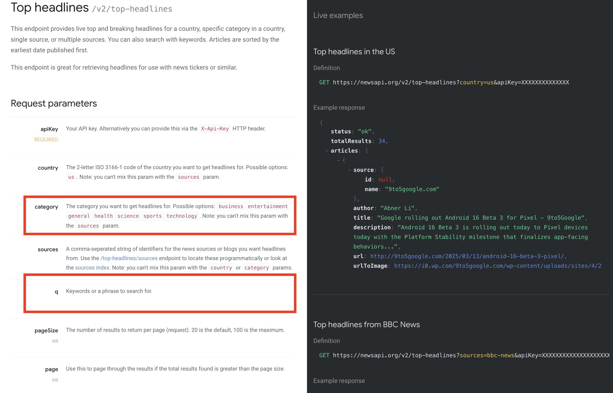
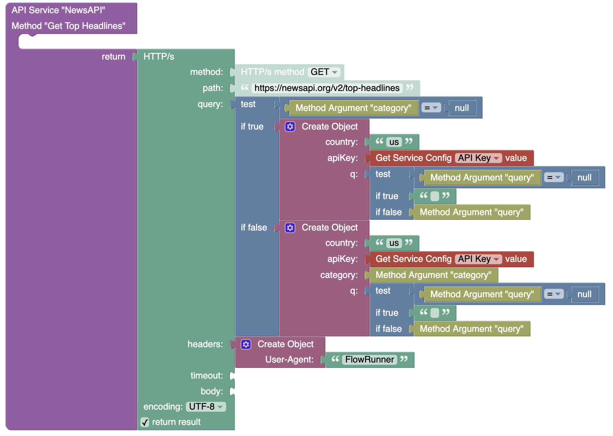

# Developing an Action with Arguments  

This guide continues from the [Basic Action Guide](./actions-quick-start.md), enhancing the **Get Top Headlines** operation by adding parameters. You will learn how to define and use action arguments, making your FlowRunner™ extensions more flexible and configurable.

### Understanding Action Arguments  

Action arguments let you pass input data into an operation. When an action has arguments, flow designers can provide input from various sources, including static values, results from other actions, transformation operations, trigger events, or variables.  

When defining arguments for an operation, you control how they appear in FlowRunner™, including their type, default values, and UI visualization (such as dropdowns, checkboxes, or text fields). This guide will walk you through defining arguments, updating your operation's logic, and testing the action in FlowRunner™.

### Opening the Operation for Editing  

Navigate to the **API Services** section and locate the **Get Top Headlines** operation. Click the :gear: icon next to its name:

You used this popup in the [Basic Action Guide](./actions-quick-start.md) when you initially defined the operation. Now, let’s check the [NewsAPI.org documentation](https://newsapi.org/docs/endpoints/top-headlines) to see what additional parameters we can include.  
 

The **`category`** and **`q`** arguments are particularly useful. The **`category`** argument will be a dropdown list with predefined values, while the **`q`** argument will be a free-form text input. The free-form field can also accept values through the [Expression Editor](../flow-editing/expressioneditor.md).  

!!! note
    In reality all arguments can accept values through the Expression Editor. One of the FlowRunner™ goals is to make data flow from one block to another as simple and as seamless as possible.

### Declaring Arguments  

Below is the parameter setup in the **Edit Operation** popup. Notice that argument names can differ from the API parameter names. For example, instead of "category," we use **News Category**, and instead of "q," we use **Search Query**.  

In the **Edit Operation** popup, you'll see two fields:  

- **Parameter Name** – The internal parameter name used in Codeless logic.  
- **Parameter Label** – The name displayed in FlowRunner™ for user input.  

For the **category** argument, set **Visualize As** to **List of Values** (dropdown). This option, when rendered in FlowRunner™, creates a combobox where users can choose from a predefined set of values. Click the :gear: icon next to the dropdown to configure the available values. In the popup, enter "Labels" and "Values" as shown below. Labels define what users see in the combobox, while Values represent the actual data sent to your Codeless implementation.  

Ensure the **Values** match the expected literals from NewsAPI.org (e.g., `business`, `entertainment`). Click **SAVE** to apply the changes.

### Updating the Codeless Logic  

Now that the arguments are declared, update the logic to use them.  

While **Get Top Headlines** is selected, switch to the **LOGIC** tab and click **EDIT** to open the Codeless editor. You'll see a block for each parameter you declared.  
  

Modify the logic to include the argument values in the API request. The logic must check whether the user provided values for **category** and **q**, as they are optional.  

Alternatively, if you are comfortable using Codeless [variables](https://backendless.com/docs/codeless/codeless_variables.html) you can implement a more compact version:

Click **DEPLOY MODEL** to save and apply your changes.  

### Testing the Action in FlowRunner™  

After deployment, switch to FlowRunner™ and test the action. Open the flow you created in the [previous guide](./actions-quick-start.md#using-the-action-in-flowrunner), select **Get Top Headlines**, and notice that the action now includes the new parameters.  

Enter a value for the **Search Query**, choose a **News Category**, and run the action in **Test Mode**.  

By following these steps, you have successfully added arguments to an action, updated its logic, and tested it in FlowRunner™. Now, users can dynamically filter headlines using your custom parameters.