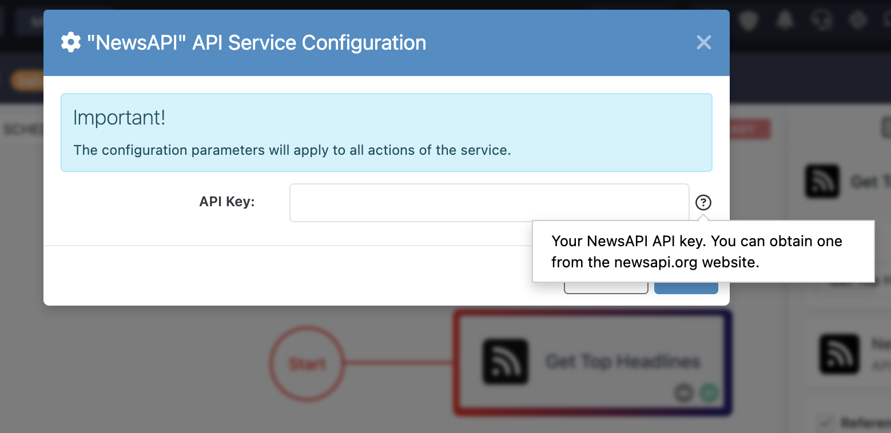

# Custom Action Development Guide  

In this guide, you will learn how to build a Node.js **FlowRunner™ action** that integrates with [NewsAPI](https://newsapi.org). If you previously worked on [creating your first flow](../quickstart.md#create-your-first-flow), you may recognize this service.

!!! example "Action Development Guides"
    The action development guide is divided into three parts to keep instructions organized and easy to follow:

    - **Build Basic Action Guide** (the current chapter) – Introduces the fundamentals of developing an action. You will create an action without arguments, using only one configuration item: an API Key.

    - **[Build Action with Arguments Guide](./action-with-args-js.md)** – Extends the basic action by introducing arguments. This guide explains how to declare action parameters, use them in your implementation logic, and configure them in FlowRunner™.

    - **[Build Dictionary Operation](./action-with-dictionary-js.md)** – Introduces a special type of argument called a **dictionary**. This allows your action to dynamically generate a list of selectable parameter values. For example, you can use it to let users choose from a list of Slack channels, Airtable bases, or other external data sources.

    Once you have implemented and tested your first action, we recommend following the guides in sequence to expand your understanding and capabilities.

By the end of these guides, you will have a fully functional FlowRunner™ action with a configurable API key and action parameters to retrieve related news articles. Once completed, you will be able to use this action in various automation scenarios, such as:

- Retrieving news articles based on a search query and analyzing them with AI for content generation.
- Storing fetched news data in Airtable or Google Sheets for tracking and further processing.
- Summarizing articles with AI and automatically sending reports via email.

These are just a few examples – your custom action can be adapted for many automation workflows.

You will now implement an action that retrieves top news headlines. See the [NewsAPI documentation](https://newsapi.org/docs/endpoints/top-headlines) for reference.

Below is the complete source code. A detailed walkthrough is provided later in this chapter:

```js linenums="1"
'use strict';

// Hardcoding your API key is not a good idea, however, it comes in very handy for debugging
const API_KEY = "YOUR NEWSAPI API KEY GOES HERE" 

// We will use logging so you can see how it works.
const logger = Backendless.Logging.getLogger('NewsAPI Extension')
 
/**
 * 
 *  @integrationName NewsAPI 
 * 
 **/
class NewsAPI {
  // The constructor is a great place to capture any values which come from the service
  // configuration parameters. In the case of this service, there is one configuration
  // item, which is the API key.
  constructor(config) {
    this.apiKey = config.apiKey || API_KEY
  }

  /**
   * @description Retrieves top news headlines
   * @route GET /getTopHeadlines
   * @operationName Get Top Headlines
   * @appearanceColor #FE1212 #191970
   * @executionTimeoutInSeconds 120
   * @sampleResult {"status":"ok","totalResults":1,"articles":[{"source":{"id":"the-hill","name":"The Hill"},"author":"Tara Suter","title":"West Virginia governor says he’ll take legal action against NCAA over tournament snub - The Hill","description":"West Virginia Gov. Patrick Morrisey (R) on Monday said he will take legal action against the NCAA over West Virginia University’s (WVU) snub from the March Madness tournament. “I’ve asked Attorney General [JB McCuskey] to launch an investigation into the NCAA…","url":"https://thehill.com/homenews/state-watch/5199135-west-virginia-governor-says-hell-take-legal-action-against-ncaa-over-tournament-snub/","urlToImage":"https://thehill.com/wp-content/uploads/sites/2/2024/11/AP24131791907837-e1730586407708.jpg?w=1280","publishedAt":"2025-03-17T19:51:12Z","content":"Skip to content\r\nWest Virginia Gov. Patrick Morrisey (R) on Monday said he will take legal action against the NCAA over West Virginia University’s (WVU) snub from the March Madness tournament.\r\n“I’ve asked Attorney General [JB McCuskey] to launch an investigation into the NCAA and whether they violated antitrust or consumer protection laws by excluding WVU from March Madness.”\r\nWVU’s men’s basketball team was not selected for the March Madness tournament after finishing with a 9-23 record this season. The school fired men’s basketball head coach Bob Huggins in June after he resigned following a DUI arrest, per ESPN.\r\n“The NCAA’s actions in denying WVU an opportunity to play in March Madness not only hurt our state, but also the students and fans who passionately support West Virginia athletics,” Morrisey said in a statement. “I will take legal action against the NCAA if necessary to protect the rights and interests of our student-athletes and the people of West Virginia.”\r\nThe NCAA did not immediately respond to a request for comment from The Hill."}]}
   */
  async getTopHeadlines() {
    try {
      return await Backendless.Request['get']('https://newsapi.org/v2/top-headlines')
        .set( {
          'User-Agent':'FlowRunner™'
        })
        .query({
          country:'us',
          apiKey:this.apiKey
        })
    } catch (error) {
      logger.error(`NewsAPI - error: ${error.message}`)
      throw error
    }
  }
}

Backendless.ServerCode.addService(NewsAPI, [
   {
     order: 0,
     displayName: 'API Key',
     type: Backendless.ServerCode.ConfigItems.TYPES.STRING,
     required: true,
     name: 'apiKey',
     hint: 'Your NewsAPI API key. You can obtain one from the newsapi.org website.',
   }
]);
```

## Register as Extension

For an API Service to be recognized as a FlowRunner™ extension, the service class must include the `#!js @integrationName` JSDoc tag:

```js linenums="9" hl_lines="3"
/**
 * 
 *  @integrationName NewsAPI 
 * 
 **/
class NewsAPI {
```

## Service Icon

You can define an icon for your extension using a class-level annotation. This icon will appear next to the extension name in FlowRunner’s [Blocks Toolbox](../flow-editing/floweditor.md#blocks-toolbox). The same icon is used for all actions and triggers unless overridden at the individual action or trigger level. The icon must be specified in `data:image/type:base64` format, where `type` can be `png`, `svg+xml`, and so on. For example:

```js hl_lines="3"
/**
 *  @integrationName NewsAPI 
 *  @integrationIcon data:image/svg+xml;base64,PHN2ZyB4bWxucz0iaHR0cDovL3d3dy53My5vcmcvMjAwMC9zdmciIHZpZXdCb3g9IjAgMCA0NDggNTEyIj48IS0t...
 **/
class NewsAPI {
```

## Service Constructor

If your service uses configuration items (explained further in the [section below](#configuration-items)), declare a constructor that initializes instance properties. In the example above, notice the fallback logic for debugging purposes—when configuration items are not yet provided, a hardcoded `API_KEY` is used. Keep in mind, hardcoding sensitive values is a temporary solution and should be avoided in production:

```js linenums="14" hl_lines="5-7"
class NewsAPI {
  // The constructor is a great place to capture any values which come from the service
  // configuration parameters. In the case of this service, there is one configuration
  // item, which is the API key.
  constructor(config) {
    this.apiKey = config.apiKey || API_KEY
  }
```

## Configuration Items

The NewsAPI endpoints require an API key. Typically, you will want users of your FlowRunner™ extension to provide this key. This approach also applies to other shared values used across multiple flows. In such cases, your service can declare **Configuration Items**, which prompt the user to supply these values.

Configuration items are defined at the bottom of the service code:

```js linenums="47" hl_lines="2-9"
 Backendless.ServerCode.addService(NewsAPI, [
   {
     order: 0,
     displayName: 'API Key',
     type: Backendless.ServerCode.ConfigItems.TYPES.STRING,
     required: true,
     name: 'apiKey',
     hint: 'Your NewsAPI API key. You can obtain one from the newsapi.org website.',
   }
]);
```

This declaration results in a **Configure** button appearing when the **NewsAPI** action is used in FlowRunner™:  


Clicking the button opens a form dynamically generated from your configuration item definition. In this example:

- A single string input field is registered (`Backendless.ServerCode.ConfigItems.TYPES.STRING`).
- The internal name `apiKey` is referenced in the service’s constructor (`config.apiKey`).
- The field is marked as required.
- The tooltip is defined using the `hint` property.

The resulting configuration form appears as follows:  


For more information, see the [Configuration Items](./config-items.md) section of this guide.

## Action Function

A FlowRunner™ action is a Node.js function with special JSDoc-style annotations. Below is the `getTopHeadlines` action, which FlowRunner™ displays as **Get Top Headlines** because of the `@operationName` tag:

```js linenums="22" hl_lines="4 9"
  /**
   * @description Retrieves top news headlines
   * @route GET /getTopHeadlines
   * @operationName Get Top Headlines
   * @appearanceColor #FE1212 #191970
   * @executionTimeoutInSeconds 120
   * @sampleResult { ... }
   */
  async getTopHeadlines() {
```

### Explanation of Tags
- `@description` – Provides a tooltip for the action block in FlowRunner™.
- `@route` – Optional. Defines how the operation is exposed within Backendless infrastructure.
- `@appearanceColor` – Sets two border colors for the action block using hexadecimal RGB values.
- `@executionTimeoutInSeconds` – Sets the recommended maximum execution time for the action.
- `@sampleResult` – Provides a sample result. This is critical as FlowRunner™ users will reference this structure when working with the action output in the [Expression Editor](../flow-editing/expressioneditor.md).

### Additional Notes
- The action function should always be declared as `async`.
- The example above uses the [Backendless.Request](https://github.com/Backendless/Request) package, but you may use any method for external API communication.
- Always catch and log errors. If necessary, rethrow them so they are visible to the Flow logic.
- If you would like the action to have its own icon different from the service icon, use the `@appearanceIcon` tag. The tag has the same format as the `@integrationIcon` tag described above.

## Service/Extension Registration
To register the service and all the actions it implements, use the `Backendless.ServerCode.addService` API. Notice the first argument is a reference to the service class, the second argument is a collection of [Configuration Items](./config-items.md):
```js linenums="47" hl_lines="1"
Backendless.ServerCode.addService(NewsAPI, [
    {},{}
]
```
