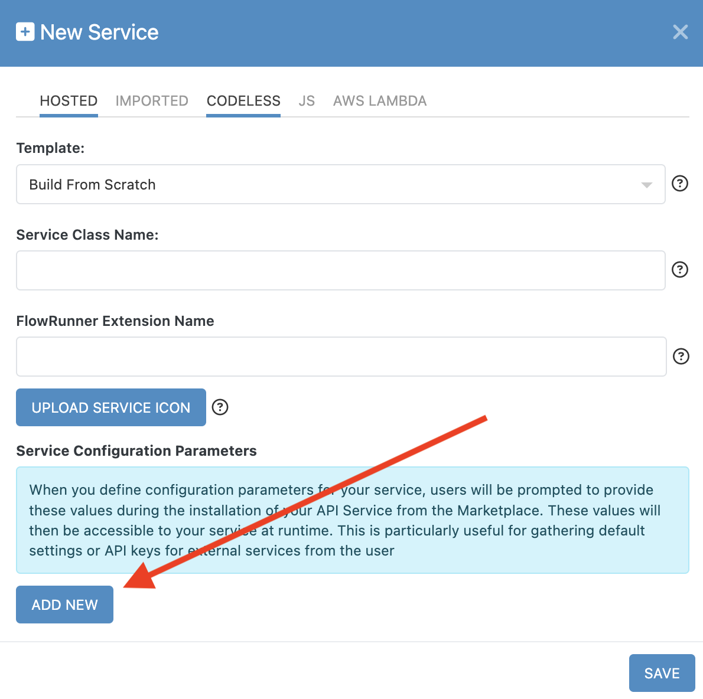

# Service Configuration Items

A **configuration item** is a reusable value that a user provides when setting up a FlowRunner™ extension. These values are typically used to pass required settings, such as API keys, booleans, or dates, into your extension’s logic. Once defined, configuration items are available across **all actions, triggers, and dictionary functions** in your extension.

A common use case is an API key required by the third-party service your extension communicates with. Instead of prompting the user for this key in every action, you define it once as a configuration item.

When configuration items are present, FlowRunner™ displays a **Configure** button in the action or trigger’s configuration panel:  


Clicking the button opens a form where the user can provide values for all configuration items. This configuration is done once per extension and applies globally to all blocks from that extension.

## Set Up Config Items in Code

To define configuration items in code, provide them as the **second argument** to the `Backendless.ServerCode.addService()` method. This argument should be an array of objects, where each object defines one configuration item.

### Example

The following example registers several configuration items using different data types. These fields appear in the configuration form for the extension and can be accessed in your logic through the `config` object.

```js
Backendless.ServerCode.addService(MyService, [
  {
    order: 0,
    displayName: 'API Key',
    type: Backendless.ServerCode.ConfigItems.TYPES.STRING,
    required: true,
    name: 'apiKey',
    hint: 'Your API key from the third-party service.'
  },
  {
    order: 1,
    displayName: 'Environment',
    type: Backendless.ServerCode.ConfigItems.TYPES.CHOICE,
    required: true,
    name: 'environment',
    options: ['sandbox', 'production'],
    hint: 'Choose the target environment for API requests.'
  },
  {
    order: 2,
    displayName: 'Enable Logging',
    type: Backendless.ServerCode.ConfigItems.TYPES.BOOL,
    required: false,
    name: 'enableLogging',
    hint: 'Check to enable debug logging.'
  },
  {
    order: 3,
    displayName: 'Request Timeout',
    type: Backendless.ServerCode.ConfigItems.TYPES.STRING,
    required: false,
    name: 'timeout',
    hint: 'Timeout in milliseconds for external API requests.'
  }
])
```

**Breakdown:**

- **`apiKey`** uses the `STRING` type for entering a text-based API key.
- **`environment`** uses `CHOICE` to create a dropdown with predefined options (`sandbox` or `production`).
- **`enableLogging`** uses `BOOL` to show a checkbox input.
- **`timeout`** is another `STRING` input, but it could just as easily be a `NUMBER` if supported in your internal logic.

### Accessing Config Values

Once the user has configured values, they are passed into your extension’s constructor via a `config` object. Each configuration item appears as a property on that object using the name you defined. The configuration items declared in the example above can be accessed in your service like this:

```js
class MyService {
  constructor(config) {
    this.apiKey = config.apiKey
    this.environment = config.environment
    this.enableLogging = config.enableLogging
    this.timeout = config.timeout
  }
}
```

### Configuration Item Properties

| Field | Description |
|-------|-------------|
| `order` | Determines the display order in the configuration form. Lower values appear first. |
| `displayName` | The label shown in the configuration UI. |
| `type` | The data type for the input. See supported types below. |
| `options` | Required only for `CHOICE` type. An array of string values for the dropdown list. |
| `required` | Whether this field must be filled out by the user. |
| `name` | The internal name used to access the value in your logic. |
| `hint` | Tooltip text displayed in the UI. Use it to describe the purpose of the item. |

### Supported Data Types

Use the constants in `Backendless.ServerCode.ConfigItems.TYPES` to define the input type for your configuration fields.

| Type | Description |
|------|-------------|
| `STRING` | Single-line text input. Use for standard string values. |
| `TEXT` | Multi-line text input. Suitable for longer input like JSON or descriptions. |
| `BOOL` | Checkbox for true/false input. |
| `DATE` | Date/time picker. Use when a specific date or deadline is required. |
| `CHOICE` | Dropdown menu. Must include an `options` array of strings. |


## Set Up Config Items in the UI

You can define configuration items directly when creating a new API service in the Backendless Console. The **New Service** popup includes a **Service Configuration Parameters** section.

To add a configuration item, click the **ADD NEW** button:


Each configuration item requires the following information:

- **Label** - The display name shown in the configuration form.
- **Hint/Tooltip** - A short explanation shown next to the field, usually explaining what the value is for and how to obtain it.
- **Data Type** - The type of input to collect (string, boolean, date, etc.).
- **Default Value** - A default value that pre-fills the field.
- **Required** - Whether the item must be filled out before the configuration is considered valid.

You can delete an item using the :material-trash-can: icon. To reorder items, drag them using the :material-menu: icon:


### Accessing Config Values in Codeless

If you're building your logic using Codeless, you can access configuration item values using the **Get Service Config** block. This block is available under the **Context Blocks** section in the Codeless logic editor:


The block returns a value for the specified configuration item. 

By defining configuration items properly, you can make your FlowRunner™ extension easier to configure, safer to use, and more reusable across different flows. Whether you’re building in Node.js or Codeless, configuration items give you a clean way to externalize user-provided settings.