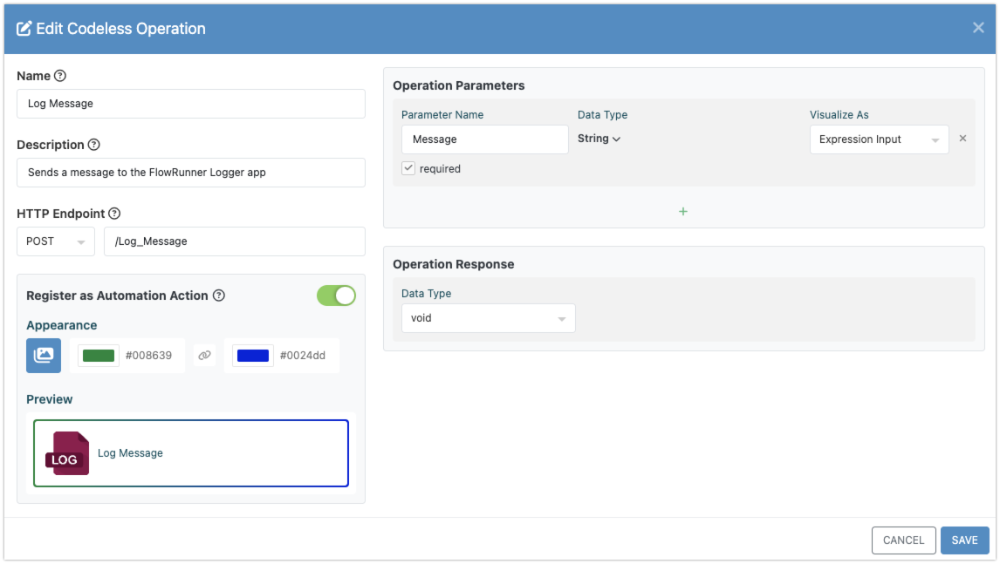
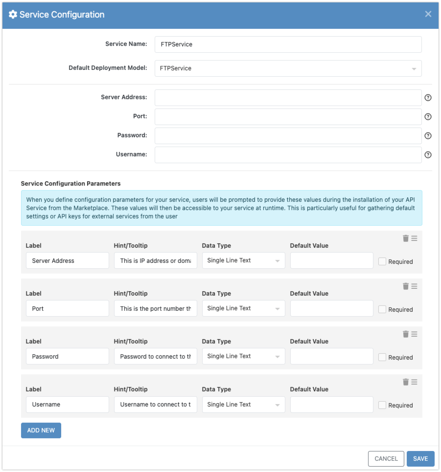
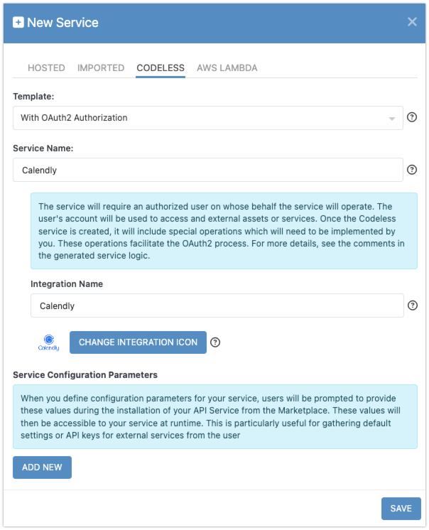

In FlowRunner, an action represents a custom piece of logic that developers can use within a flow. From a technical standpoint, an action is an API service operation that is specifically configured to be recognized by FlowRunner as a usable block. This enables you to design, develop, and deploy functionality that can be easily integrated into flows, just like the built-in actions already provided by the platform.

## What is an Action?

An **action** is essentially an **operation** within an API service. Every action is defined as part of a service, meaning the first step in creating an action is to create an API service itself. Once the service is in place, you can define multiple **operations** within it. These operations can perform various tasks, such as processing data, connecting to third-party services, or executing custom business logic.

For the operation to be recognized as a FlowRunner action, it must be specifically marked as a FlowRunner Action. This allows it to appear as a draggable block in the FlowRunner toolbox, where it can be easily used and connected to other blocks within a flow. Once set up, these custom actions behave exactly like the built-in actions, enabling smooth integration into any workflow.

You can develop custom actions using either **Codeless** or **JavaScript (Node.js)**. Both approaches - Codeless and JavaScript - offer the same technical capabilities, but the Codeless approach provides more user-friendly features in the **Backendless Console**, making it easier to create, configure, and manage custom actions.

## Codeless vs. JavaScript (Node.js)

With the **Codeless** approach, you have the flexibility to create hybrid solutions that combine both graphical logic programming and code, or even rely entirely on code if that's your preference. This method offers significant ease-of-use through the Backendless Console's user interface, which streamlines the process of creating custom actions, configuring parameters, and integrating third-party services.

On the other hand, the **JavaScript (Node.js)** approach provides the same level of power and flexibility but requires more manual coding. While both approaches offer equivalent technical functionality, **Codeless** comes with enhanced tools in the Backendless Console, making it ideal for developers who prefer a visual environment or need to work with complex configurations, such as OAuth 2.0 authentication.

## Codeless Advantages

The **Codeless** approach not only simplifies the development of custom actions but also provides additional interface features that make the process smoother and more efficient. These include:

- **Visual Interface for Action Creation**: The Codeless environment offers a drag-and-drop interface for building logic, making it easier to visualize the flow and structure of your custom actions.
    

- **User Interface for Service Configuration**: The **Backendless Console** offers dedicated user interfaces for configuring service parameters, allowing you to provide an additional layer of behavior customization to the end users of your actions.
    
  
- **OAuth 2.0 Integration**: For services that require **OAuth 2.0 authentication** (such as Google, Slack, Facebook, or Mailchimp), the Codeless interface makes it easier to integrate user authentication with these services into your custom actions.
    

## Action Development Features

When developing custom actions in the Backendless Console, you have access to a wide range of features designed to simplify the process and enhance your development workflow:

- **Creation of New Actions**: Easily create and configure new actions that can be integrated into FlowRunner workflows.
  
- **Visual Action Customization**: Customize the appearance of your action block by assigning an icon, adjusting the color border, and adding a descriptive tooltip that will appear when users hover over the action.

- **Service Configuration Parameters**: Define and manage parameters for your custom actions, ensuring smooth interaction with external services or internal data.

- **Integration with OAuth 2.0 Services**: Simplify the integration of third-party services requiring OAuth 2.0 authentication, such as Google, Slack, Facebook, and Mailchimp.

- **Built-In Logic Editor**: Use the Codeless logic editor to visually construct complex operations or integrate custom JavaScript logic, depending on your chosen approach.

- **Deployment and Testing Environment**: Test and deploy your custom actions directly from the Backendless Console, making it easy to iterate on development and ensure your actions function as expected in live workflows.

## Getting Started

To become familiar with the process of developing a custom action for FlowRunner, we recommend following the [**Quick Start Guide**](./actions-quick-start.md), which will walk you through creating, configuring, and deploying a custom action using both the Codeless and JavaScript approaches. 

For a complete walkthrough of all the features and capabilities available to developers of custom actions, follow the chapters in this section of the guide.