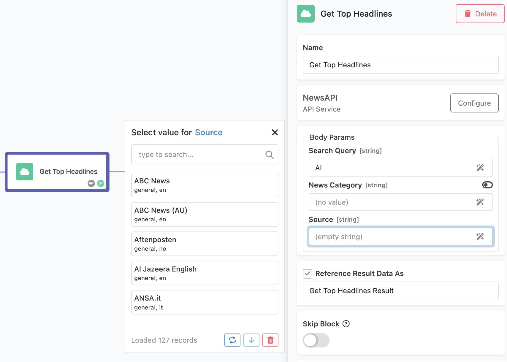

# Developing an Action with Dictionary Arguments  
In this guide, you will continue building on the action you developed in the [Basic Action Guide](./actions-quick-start.md) and enhanced in the [Action with Arguments Guide](./actions-with-args.md). This chapter introduces a special type of action parameter called a **dictionary**, which allows dynamic population of selectable values in FlowRunner™.  

Imagine that your **Get Top Headlines** action in FlowRunner™ allows users to select a news source. Ideally, a FlowRunner™ user should be able to click the **Source** input parameter and see a dynamically generated list of available sources as shown below:

 Dictionary arguments make this possible by fetching and displaying selectable options from an external source.

To illustrate this, let’s revisit the external service you have already integrated - **NewsAPI.org**. One of the parameters supported by its **[Top Headlines](https://newsapi.org/docs/endpoints/top-headlines)** endpoint is `sources`:  

As shown in the NewsAPI.org documentation referenced above, retrieving a list of available sources requires calling a separate endpoint. The documentation for that endpoint is shown below:  
 

## Implementation Steps  

Implementing the behavior described above requires two main steps:  

1. [**Create a dictionary operation**](#implementing-a-dictionary-operation) - This operation retrieves and formats a list of selectable values.  
2. [**Reference the dictionary operation in an argument**](#step-2-linking-the-dictionary-operation-to-an-argument) - This links the action parameter to the dictionary operation, enabling dynamic selection.  

## Implementing a Dictionary Operation  

To create a dictionary operation, follow these steps:  

1. Open the **API Services** screen and select the **Get Top Headlines** service.  
2. Click the **NEW OPERATION** button.  
  

3. In the **New Codeless Operation** popup:  
    - Enter **`getSources`** as the **Name**.  
    - Select **Dictionary** from the **Register in FlowRunner™ as** dropdown located in a panel in the lower-right corner of the interface.  
    - Keep all the default operation parameters.  

    Your popup should look like this when configured correctly:  
    

4. Click **SAVE** to create the operation.  

To complete the final step, implement the Codeless logic for this dictionary operation:  

Every dictionary operation, including the one shown above, must return an object containing an **`items`** property. This property holds a collection of selectable items, each with the following fields:  

- **`value`** – The actual value passed to the main service operation when selected.  
- **`label`** – The user-friendly name displayed in FlowRunner™.  
- **`node`** – Additional information that enhances the selection, such as metadata or descriptions.  

## Linking an Argument with Dictionary  

Now, let’s integrate the dictionary operation into the **Get Top Headlines** action:  

1. Open the **API Services** screen and locate the **Get Top Headlines** operation.  
2. Click the :material-cog: icon next to its name to open the **Edit Operation** popup.  
3. Add a new parameter named **Source** and configure it as follows:  
    Set the **Options Provider Method** to **`getSources`** (this links the parameter to the dictionary operation).  

    The configuration should look like this:  
    

4. Click **SAVE** to apply the changes.  

## Updating the Codeless Logic  

Next, update the **Get Top Headlines** logic to include the new **Source** argument:  

1. Open the **LOGIC** tab and click **EDIT** to enter the Codeless editor.  
2. Modify the logic to handle the new **Source** parameter:  
      

3. Click **DEPLOY MODEL** to save and apply the changes.  

## Testing the Action in FlowRunner™  

With everything set up, navigate to FlowRunner™ and test your action:  

1. Open the flow that includes your **Get Top Headlines** action.  
2. Select the action, and you’ll see a new **Source** parameter.  
3. Click the **Source** input field. FlowRunner™ will send a request to your dictionary operation and display a list of available sources.  
    

Now, your action dynamically fetches and displays selectable values, enhancing the user experience in FlowRunner™.