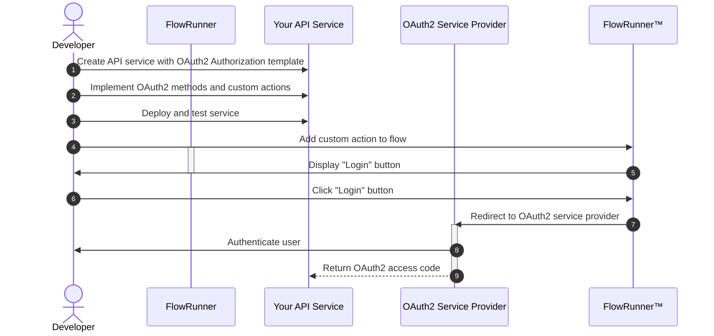
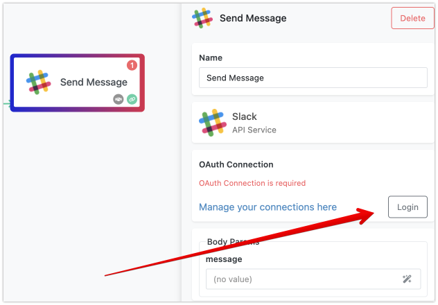
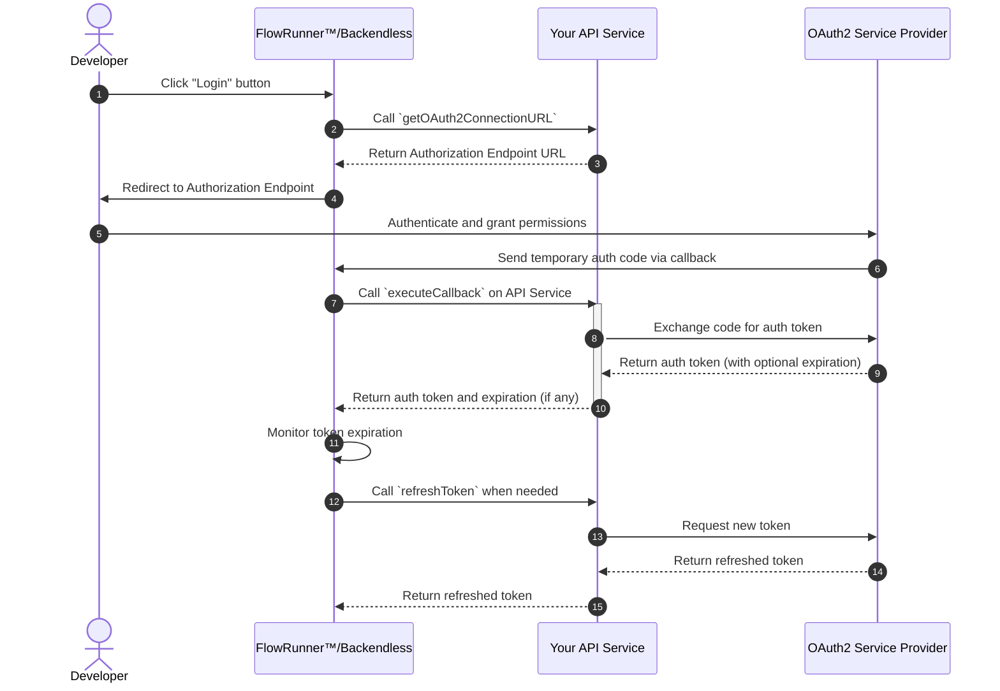
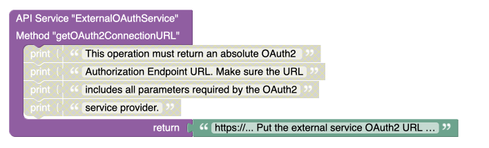
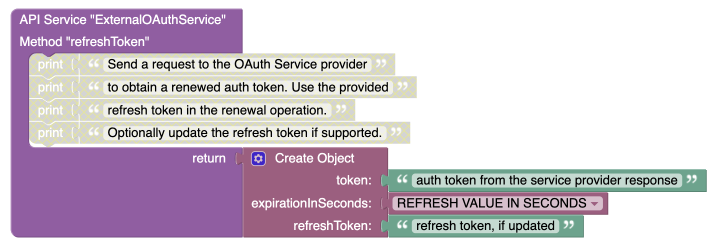

# Services with OAuth2 Authorization

FlowRunner™'s custom actions can integrate with any network-based resource. Many of these resources rely on the OAuth2 authorization protocol. Implementing OAuth2 can sometimes be complex, so FlowRunner™ and Backendless provide a built-in mechanism that makes it easier for developers to create services that use the OAuth2 authorization workflow.

Here’s an improved version of your draft with better flow and readability. I’ve kept the technical depth while making it more intuitive and easier to understand.

---

## How Does It Work?

Integrating OAuth2 into FlowRunner™ involves several key steps, making it easy for developers to add OAuth2 authorization to their custom services. Below is an overview of the process:



### Step-by-Step Explanation

OAuth2 integrations may seem complex due to their many components, but we’ll break down each step to make the process easier. Every step outlined above has a corresponding section below, where we dive deeper into the details.

1. **Create a New Service Using the OAuth2 Template**

    New API services can be created from the **API Services** screen in the Backendless Console. Click the :plus: icon and use the **New Service** popup. To enable OAuth2 authorization in your service, select the **With OAuth2 Authorization** option from the **Template** dropdown list.  

    

    When creating a service with OAuth2, you’ll need to provide additional information:

    - **Integration Name**: This name identifies the service in your implementation. It's best to use the name of the OAuth provider (e.g., Google, Facebook).
    - **Integration Icon**: This visual icon helps recognize the OAuth provider in the UI, usually the provider's logo.

    These details are also used in the **Connections Manager**, where you can view and manage active OAuth2 authorizations (called *connections*).

    Once the service is created, Backendless will include three key methods responsible for managing the OAuth2 workflow. You can learn more about these methods in the [OAuth2 Service Operations](#oauth2-service-operations) section.

2. **Implement OAuth2 Methods**

    When the service is created, Backendless generates the necessary OAuth2 methods to facilitate authorization. These methods enable the service to seamlessly integrate with OAuth2 workflows.

    You can implement these methods using Codeless (drag-and-drop logic) or in a hybrid approach combining Node.js code with Codeless. The [OAuth2 Service Operations](#oauth2-service-operations) section of this guide covers the specifics of these methods.

    

3. **Deploy and Test the Service**

    Once the methods and actions are implemented, the service is deployed and tested. The deployment process depends on whether you’re using Codeless or JavaScript. If you are developing the service locally, deployment steps will vary. For detailed guidance, refer to the [Action Testing](./action-testing.md) section of the documentation.

4. **Add Custom Actions to a Flow**

    After deploying the service, any operation marked as a **FlowRunner™ Action** will appear in FlowRunner’s **Custom Actions** section. Each custom action is identified by its operation name, service name, and the icon you specified during setup. To use the action in a flow, simply drag it into the **Flow Editor**.

    

    !!! note
        For a custom action to appear in Flow Editor, your service must have an operation marked as a *FlowRunner™ Action*.

5. **Displaying the OAuth2 Login Button**

    If the custom action’s service was created using the **OAuth2 Authorization template**, you will see a **Login** button in the action’s properties panel. This button signals that the service requires OAuth2 authentication.

    

6. **Starting the Authorization Process**

    Clicking the **Login** button starts the OAuth2 authorization sequence. FlowRunner™ will redirect the user to the OAuth2 provider’s login page. The provider typically hosts a login form where users enter their credentials.

7. **Redirect to OAuth2 Login**

    FlowRunner™ retrieves the OAuth2 endpoint URL from the service when the **Login** button is clicked. A new window opens with the provider’s login form, where the user authenticates and grants access to the requested permissions (known as *scopes*). Scopes might include reading emails, accessing files, or viewing user information.

    

8. **User Authentication and Permission Granting**

    Once authenticated, the user grants permission for the service to access specific scopes (such as email or profile information). This is a crucial part of the OAuth2 authorization workflow.

9. **Access Token Delivered**

    After user authentication, the OAuth2 provider returns an access token to Backendless. The token grants your service authorized access to the provider’s API. This process is managed by Backendless, which coordinates the exchange of an authorization code for an access token.

    You can manage all OAuth2 connections through the **Connections Manager** interface in Backendless. This screen lets you view and manage active OAuth2 authorizations for various services.

## OAuth2 Service Operations

To integrate an API Service with the OAuth2 workflow in FlowRunner™, the service must implement the following key operations:

- **`getOAuth2ConnectionURL`**: Responsible for returning the complete Authorization Endpoint URL provided by the OAuth2 service provider. This URL is where users will be redirected to authenticate.
- **`executeCallback`**: Handles the exchange of the temporary authorization code received from the OAuth2 provider for a more permanent authorization token.
- **`refreshToken`**: Since the authorization token received may expire after a certain period, this operation is responsible for refreshing the token when needed.

When you create an OAuth2-enabled API service, Backendless automatically generates placeholders for these methods. However, it is up to you to implement them. While the specific details may vary depending on the OAuth2 provider, the general process is standardized across all compliant providers. The sequence diagram below illustrates how these operations work within the OAuth2 workflow.

## OAuth2 Workflow

!!! note
    The diagram below zooms in on steps 7-9 from the earlier breakdown of the OAuth2 flow.



### Step-by-Step Explanation

1. **Developer/User clicks the Login button**  
   The OAuth2 authorization process starts when the user clicks the **Login** button in FlowRunner™.

2. **FlowRunner™ calls the `getOAuth2ConnectionURL` operation**  
   FlowRunner™, acting in conjunction with Backendless, calls the `getOAuth2ConnectionURL` method on your API Service to get the OAuth2 provider's Authorization Endpoint URL.

3. **API Service returns the Authorization Endpoint URL**  
   The API Service provides the URL where the user will be redirected to authenticate.

4. **Developer/User is redirected to the Authorization Endpoint**  
   The developer/user is redirected to the OAuth2 provider's login page.

5. **Developer/User authenticates and grants permissions**  
   The developer/user logs in at the OAuth2 provider’s login page and grants the requested permissions (scopes). These might include access to resources like email, profile data, or other user information.

6. **OAuth2 provider sends a temporary authorization code via callback**  
   After successful login and permission grant, the OAuth2 provider sends a temporary authorization code to Backendless through a callback URL.

7. **Backendless calls the `executeCallback` operation on the API Service**  
   Upon receiving the authorization code, Backendless calls the `executeCallback` method in the API Service, instructing it to handle the next step of the OAuth2 process: exchanging the authorization code for an access token.

8. **API Service exchanges the code for an access token**  
   The API Service, specifically the `executeCallback` operation communicates with the OAuth2 provider, sending the temporary authorization code and requesting an access token.

9. **OAuth2 provider returns the access token**  
   The OAuth2 provider sends back the access token along with additional information such as the token's expiration time (if any).

10. **API Service returns the token and expiration details to Backendless**  
    The API Service passes the access token and any associated expiration time to Baxckendless, enabling the service to use the token for authenticated requests.

11. **Backendless monitors the token’s expiration**  
    Backendless keeps track of the token’s expiration time. If the token is set to expire, Backendless will take action to ensure that the service remains authenticated.

12. **Backendless calls the `refreshToken` operation when needed**  
    When Backendless detects that the token is about to expire, it calls the `refreshToken` operation on the API Service to request a new token.

13. **API Service requests a new token from the OAuth2 provider**  
    The API Service, specifically the `refreshToken` operation contacts the OAuth2 provider, sending a request to refresh the token before it expires.

14. **OAuth2 provider returns a refreshed token**  
    The OAuth2 provider responds by sending a new, refreshed access token.

15. **API Service returns the refreshed token to Backendless**  
    Finally, the API Service passes the new token back to Backendless, ensuring continued access to the OAuth2-protected resources.

This detailed explanation shows how each operation in the OAuth2 process is handled within FlowRunner™/Backendless. The API Service plays a critical role in managing interactions with the OAuth2 provider, while FlowRunner™ ensures that the OAuth2 workflow, including token expiration and refreshing, is handled smoothly. By implementing the `getOAuth2ConnectionURL`, `executeCallback`, and `refreshToken` methods, you enable secure and dynamic OAuth2 authentication for your services.

## OAuth2 Connection Manager

// TODO

## OAuth2 Operation Details

### getOAuth2ConnectionURL

This operation is responsible for generating and returning the full Authorization Endpoint URL for the OAuth2 provider. The URL must include all the necessary query parameters required by the OAuth2 service provider, ensuring a smooth authorization process. 

The query parameters typically include, but are not limited to:

- **`client_id`**: The client identification issued by the OAuth2 provider.
- **`redirect_uri`**: The URL to which the OAuth2 provider should redirect after the user authorizes the application.
- **`response_type`**: Typically set to `code`, indicating that the app is requesting an authorization code.
- **`scope`**: A list of permissions or access levels that the application is requesting from the user (e.g., access to profile data, email, etc.).
- **`state`**: An optional parameter that can be used to maintain the state between the request and callback, often used to prevent CSRF attacks.

- The returned URL must be a fully formed absolute URL, ready for the user to be redirected to. 
- You may need to customize the URL based on the specific OAuth2 provider, as different providers might require additional or differently named parameters.
- Ensure that the **callback URL** (also known as the redirect URI) matches the one registered with the OAuth2 provider, as mismatches can cause errors during the authorization process.

An example of what the Authorization Endpoint URL might look like after this operation completes:
```
https://oauth2provider.com/auth?client_id=YOUR_CLIENT_ID&redirect_uri=https://yourapp.com/callback&response_type=code&scope=email+profile&state=xyz123
```

This URL will redirect the user to the OAuth2 provider’s authorization page, where they can log in and grant the requested permissions.

=== "CODELESS"
    
    


=== "JS"

    ``` js
    /**
     * @operationName getOAuth2ConnectionURL
     * @route GET /getOAuth2ConnectionURL
     */
    async getOAuth2ConnectionURL() {
      return 'https://... Put the external service OAuth2 URL here'
    }
    ```

### executeCallback

This operation is responsible for exchanging a temporary authorization code for a more permanent authorization token, which may still have an expiration. The token received from this exchange must be used in the APIs provided by the OAuth2 service provider. Below is a general guideline for implementing this operation.

The process typically involves sending an outbound HTTP request to the OAuth2 service provider. Ensure the request conforms to the specific requirements of the provider. In most implementations, the process includes the following steps:

- **POST Request**: Send a `POST` request to the URL designated by the OAuth2 provider for token exchange.
- **Content-Type**: Set the `Content-Type` header to `application/x-www-form-urlencoded`. This means the required parameters, such as the authorization code and client credentials, are sent in the request body as `key=value` pairs separated by `&`.

The return value of this operation must be an object containing the following properties:

- **`token`**: The authorization token obtained from the OAuth2 provider as a result of the code-to-token exchange.
- **`expirationInSeconds`**: If the token has an expiration time, this property should indicate the number of seconds until the token expires.
- **`refreshToken`**: If the token is refreshable, include the refresh token provided by the OAuth2 provider. This token will be used later to renew the authorization token when it expires.
- **`connectionIdentityName`**: A unique identifier for the connection with the OAuth2 provider. This could be the logged-in user's identity, such as their email address, or a static string value that represents the connection. The returned value will be used to identify the connection in the [OAuth Connection Manager](#oauth2-connection-manager).

Make sure the implementation of this method adheres to the OAuth2 provider's specific token exchange requirements, such as sending client credentials, the authorization code, and any other necessary data. The returned object allows Backendless to manage the token lifecycle and ensure the connection with the OAuth2 provider remains active.

=== "CODELESS"

    


=== "JS"

    ``` js
    /**
     * @typedef {Object} executeCallback_ResultObject
     *
     * @property {String} token
     * @property {String} refreshToken
     * @property {Number} expirationInSeconds
     * @property {Object} userData
     * @property {String} connectionIdentityName
     * 
     * @operationName executeCallback
     * @route POST /executeCallback
     * @param {Object} [callbackObject]
     * @returns {executeCallback_ResultObject}
     */
    async executeCallback(callbackObject) {

      // PERFORM CODE TO TOKEN EXCHANGE HERE 

        return ({ 
          token: 'TOKEN FROM OAUTH2 SERVICE PROVIDER',
          expirationInSeconds: EXPIRATION IF ANY,
          refreshToken: 'REFRESH TOKEN IF ANY',
          connectionIdentityName: 'NAME OF THE CONNECTION' 
        })
    }
    ```

### refreshToken

This operation is responsible for renewing the authorization token when the existing one obtained in the `executeCallback` operation expires. When the system detects that the current token has expired, it automatically calls this operation. 

The operation receives the **refresh token** as a parameter, which is provided by the OAuth2 service during the initial token exchange. The refresh token is used to request a new authorization token from the OAuth2 provider.

The response from this operation must be an object containing the following properties:

- **`token`**: The new (renewed) authorization token obtained from the OAuth2 provider.
- **`expirationInSeconds`**: The number of seconds until the renewed token expires. If the token has no expiration, this value can be omitted or set to `null`.
- **`refreshToken`**: Some OAuth service providers require the refresh token itself to be periodically refreshed. If the refresh token changes, use the `refreshToken` property in the response to return the updated refresh token. Otherwise, this property can be removed from the response.

When implementing this operation logic, it is important to keep in mind the following:

- Ensure the request to the OAuth2 provider adheres to the provider’s requirements for token refreshing. Typically, this involves sending a `POST` request to the token endpoint with the refresh token and other necessary credentials.
- The refreshed token should be returned promptly to avoid interruptions in service.
- Not all tokens can be refreshed indefinitely. Be mindful of potential limitations or expiration policies imposed by the OAuth2 provider.

This method ensures that your API service continues to operate without needing to manually re-authenticate once the original token expires.

=== "CODELESS"

    


=== "JS"

    ``` js
    /**
     * @typedef {Object} refreshToken_ResultObject
     *
     * @property {String} token
     * @property {Number} expirationInSeconds
     *
     * @operationName refreshToken
     * @route PUT /refreshToken
     * @param {String} refreshToken
     * @returns {refreshToken_ResultObject}
     */
    async refreshToken(refreshToken) {
      /**
       * Send a request to the OAuth Service provider
       * to obtain a renewed auth token. Use the provided
       * refresh token in the renewal operation.
       */ 
      return ({ 
        token: 'RENEWED AUTH TOKEN FROM THE PROVIDER',
        expirationInSeconds: TOKEN-EXPIRATION-IN-SECONDS 
      })
    }
    ```