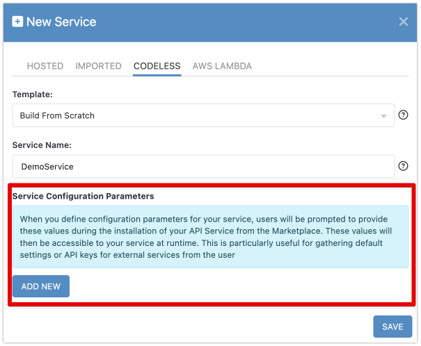
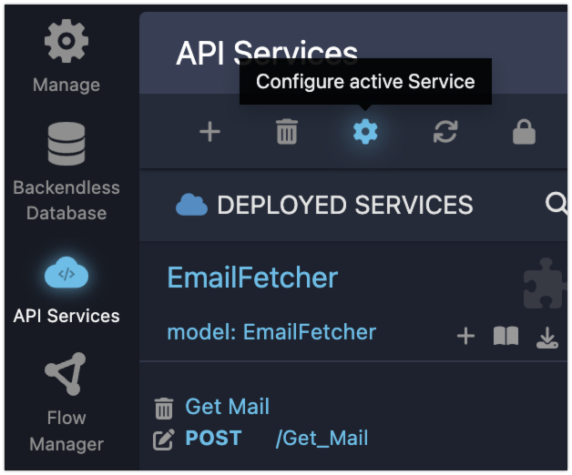
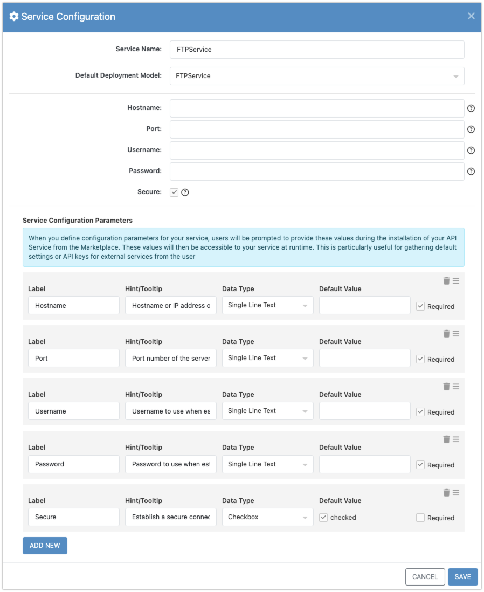
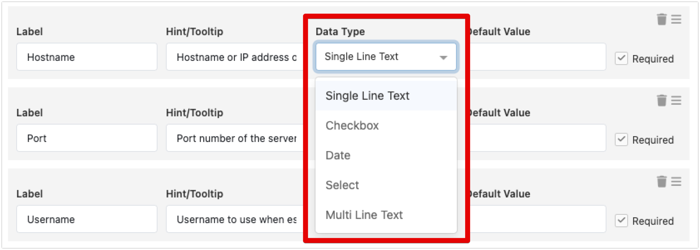
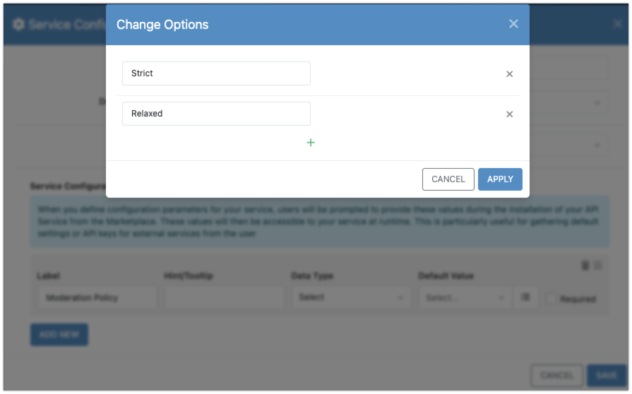

# Service Configuration Parameters

When building an API service, it's important to make it flexible so it can work in different scenarios. For example, imagine you're creating a service that integrates with an FTP server. This service could allow file uploads and downloads, changing directories, and retrieving directory listings. To perform these tasks, the service needs to connect to the FTP server. But instead of hardcoding the server details into the service itself, you can make the service more reusable by allowing configuration of the FTP server information.

This is where **Service Configuration Parameters** come into play. These parameters let you, or anyone using your service, enter specific details like the server's address, login credentials, or other settings. This flexibility allows the service to be used with any FTP server, not just a predefined one. Whether you're building the service for yourself or sharing it through the Backendless Marketplace, configuration parameters ensure that the service can adapt to different environments.

## Declaring Config Parameters

You can declare configuration parameters when you first create a Codeless service in the Backendless Console. 

However, if you didn’t set them up during creation, you can always add or modify them later by accessing the **Service Configuration** popup.

To declare a new configuration parameter, click **ADD NEW**. When you add parameters after the service is created, the system will automatically generate a form where the required values can be entered. This form is dynamically built, reflecting the attributes of the parameters you define.

Each configuration parameter includes a few key attributes:

- **Label**: This is the name that will be displayed next to the input field, letting users know what data to enter.
- **Hint/Tooltip**: You can provide additional context by adding a tooltip. This will display a help icon next to the field, offering more information when users hover over it.
- **Data Type**: This determines how the input field will appear. For example, it could be a text box, a checkbox, or a date picker, depending on what kind of data the parameter requires.
- **Default Value**: You can specify a default value, which will automatically fill the field unless another value is provided.

If certain parameters are crucial to the service, you can mark them as required. This ensures that users must provide a value for these fields before they can proceed. You can also reorder the parameters by dragging them with the **burger icon**, making it easier to customize how the form looks and functions.

## Choosing the Right Data Type

The **data type** for each parameter is important because it defines the kind of input the user will provide. Backendless offers several options, allowing you to choose the best match for the data being requested:

- **Single Line Text**: Displays a single input field. This is ideal for strings, numbers, or alphanumeric entries.
- **Checkbox**: Offers a simple true or false option.
- **Date**: Presents a date and time picker, which is perfect for scheduling or time-based data.
- **Select**: Creates a dropdown list where the user can select from predefined options.
- **Multi Line Text**: Gives a larger input area for longer text entries.

For the **Select** data type, you will see an additional component where you can define all possible options for the drop-down:

When you click the **change options** button, you will see a popup where you can define the options for the config parameter:

The data type you choose should match the kind of information your service needs, ensuring that the input is both practical and user-friendly.

## Config Parameters in FlowRunner

If any of your service operations are marked as **FlowRunner™ Actions**, users will be able to configure the service directly within FlowRunner™. When they add a service action to a flow, they’ll see a **Configure** button, which opens up the form with the configuration parameter fields. This makes it easy to set or update the service's configuration right in the flow, ensuring that the correct settings are applied without needing to leave the FlowRunner™ environment.

!!! note
     It’s important to note that provided configuration values apply across the entire service, meaning all operations within the service will use the same set of configuration values.

## Accessing Config Data in Logic

Once you've declared configuration parameters, they can easily be accessed in your Codeless logic. The Codeless editor includes special blocks that let you retrieve the value of any configuration parameter. To use it, simply drag the block into your logic and choose the specific parameter from a dropdown list. This makes it straightforward to integrate the provided configuration data into your service's operations, allowing the service to work dynamically with user-defined values.

## Configuration and the Marketplace

If you're planning to share your service through the Backendless Marketplace, configuration parameters are an essential part of making your service user-friendly. When someone installs your service, they’ll be prompted to complete the configuration form during the installation process. This ensures that the service is properly set up from the beginning, allowing it to run smoothly without additional setup.

Once installed, users can always revisit the configuration settings. They can do this by opening the **Service Configuration** popup from the API Services section or by using the **Configure** button in FlowRunner™. This ongoing flexibility allows users to adjust the service to their needs at any time, making your service adaptable and easy to use in various environments.