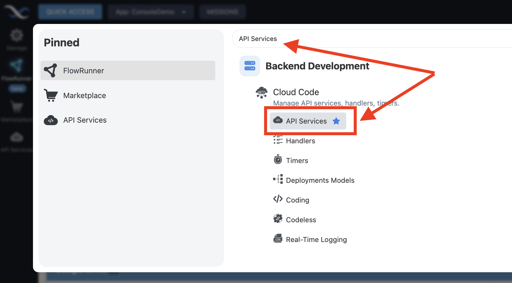
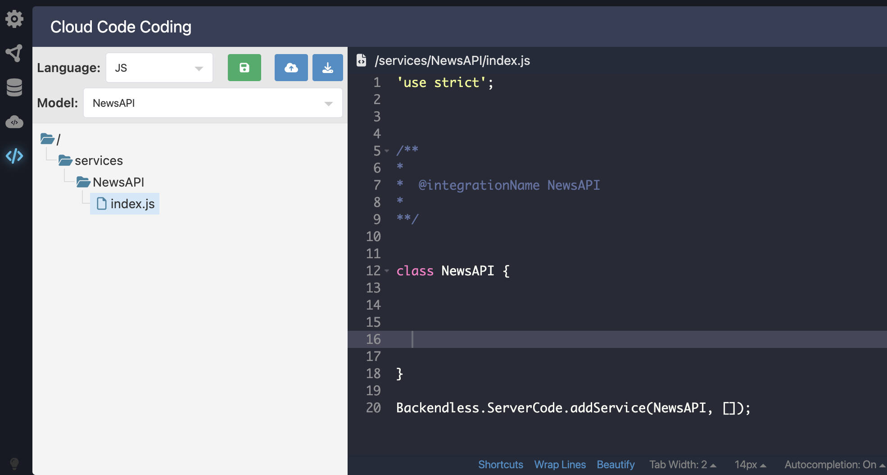
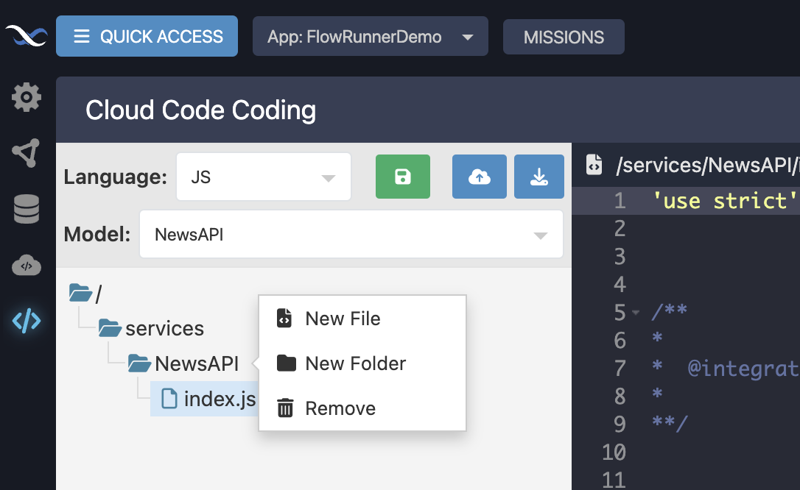

# Development Environment Setup

You can develop custom FlowRunner™ extensions using Node.js either locally on your workstation or directly within Backendless Console. We recommend setting up a **local development environment** for maximum flexibility and control. A local setup allows you to debug your FlowRunner™ extensions before deploying them, manage dependencies (such as additional Node.js npm modules), and streamline your workflow.  

However, in some situations, it may be helpful to use the fully cloud-hosted environment within Backendless Console to make quick adjustments. This guide explains how to set up both approaches, starting with the recommended local setup.

## Local Environment Setup

To begin, navigate to the **API Services** screen in Backendless.

!!! note "Finding the API Services screen"
    If you do not see the **API Services** icon in the sidebar, click the **QUICK ACCESS** button in the upper-left corner of the console and search for "API Services." Click **API Services** to open the screen. You can also click the :material-star: icon to pin it to the sidebar.
      

### Creating a New Service
On the **API Services** screen, click the :material-plus: icon to create a new API Service.  


When the **New API Service** popup appears, it defaults to **CODELESS**. Switch to the **JS** tab. The default selection is **Build From Scratch**. Keep this option unless your extension requires OAuth2 authentication. In that case, select **With OAuth2 Authorization** and refer to the [OAuth2 Authorization](./oauth2-services.md) guide for more details.

In the **Service Class Name** field, enter **`NewsAPI`**. This naming will align with later tutorials. The name will also auto-fill the **FlowRunner™ Extension Name** field, which will be used to identify your extension in FlowRunner™ Marketplace and within the list of custom FlowRunner™ extensions.

The service icon is optional for development but required if you plan to submit your extension to the Marketplace. The icon can also be configured at the source code level of your implementation.


Click **SAVE** to create the service.

### Accessing the Service Code

At this point, the service has been created, but it does not yet include any operations. Next, you will access the service's source code. Navigate to the **Coding** screen by clicking **QUICK ACCESS**, searching for *coding*, and selecting **Coding** located under **Cloud Code**:  


### Download Project Archive

In **Cloud Code Coding**, make sure the following selections are made:

- Choose **JS** in the **Language** dropdown.
- Select **NewsAPI** in the **Model** dropdown.

!!! note
    Each API Service you create automatically generates a corresponding "model" with the same name as the service class. For now, you can treat this as an internal detail.

Expand the **NewsAPI** folder to reveal **index.js**, then click the file to open it. The file contains a basic service scaffold:  


Although **Cloud Code Coding** includes a built-in editor and deployment options, you will now focus on setting up your local environment. To do this, click **Download Project**:  


### Project Contents

The downloaded ZIP archive contains:

- Project configuration files
- Necessary dependencies, including **CodeRunner**, a command-line tool for testing and deploying services
- The service’s source code

Extract the archive into a directory on your workstation. For consistency, this documentation refers to this directory as **`[BASE_DIR]`**.

### Installing Prerequisites

Before continuing, ensure Node.js and NPM are installed on your system with the following minimum versions:

- Node.js version 18.20.6 or higher
- NPM version 10.8.2 or higher

### Installing Project Dependencies

Open a terminal or command prompt and navigate to **[BASE_DIR]**. Run the following command to install all required components:

```
npm i
```

Your local development environment is now ready for building and testing FlowRunner™ extensions.

## Remote Environment Setup

You briefly visited the **Coding** section earlier to download the project archive. The **Coding** screen also provides a full browser-based environment where you can manage your project files and edit code directly.  


### Working with the File Tree

The **Coding** screen includes a folder and file tree where you can create, move, and delete project files and folders. To open the context menu, right-click within the file tree:  


You can also use drag-and-drop to move files and folders within the tree.

### Using the Toolbar

A toolbar at the top of the screen gives you quick access to essential project operations:  


:material-content-save: - Save the project to the server without deploying it. This stores your code but does not make it live.

:material-cloud-upload: - Save and deploy the project. Deployment activates the latest code changes.

:material-download: - Download the project archive to your local machine.