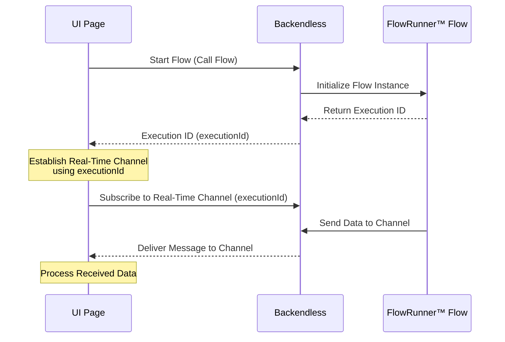
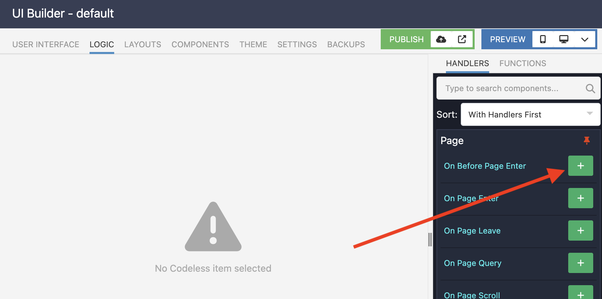
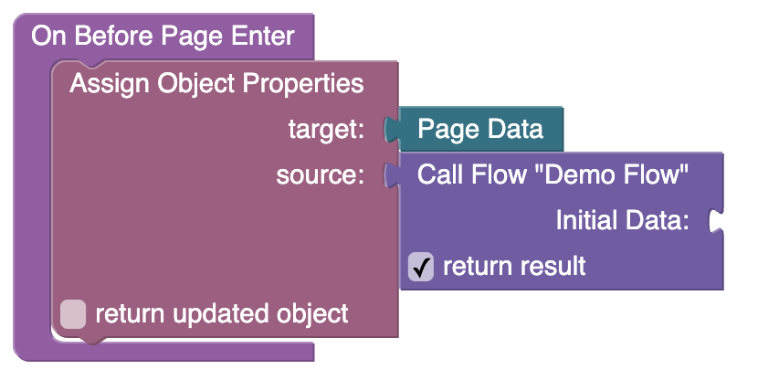
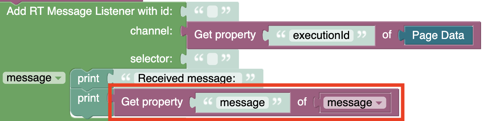
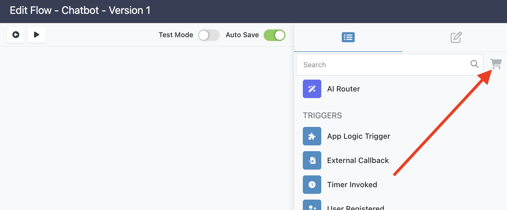
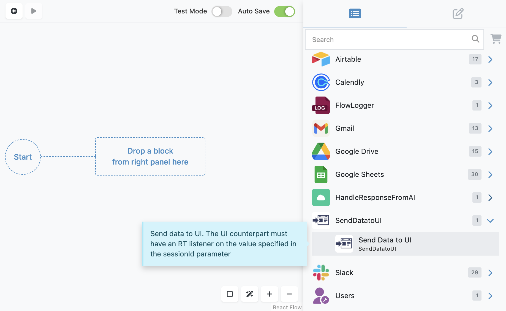
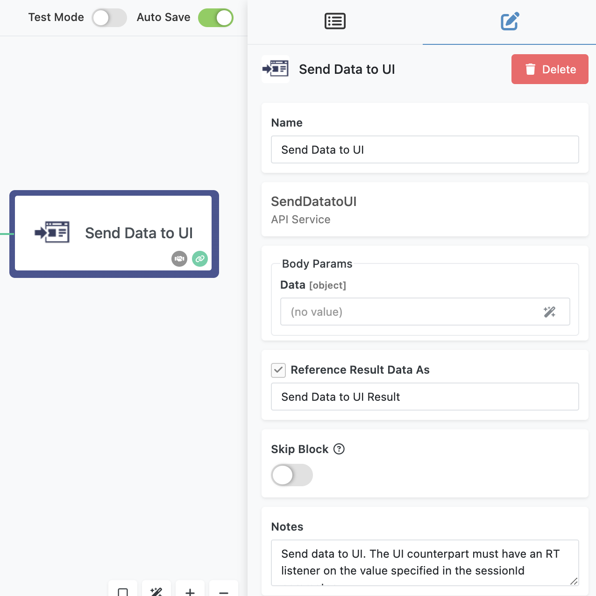

# Bidirectional Communication with UI  

Bidirectional communication between a UI and a FlowRunner™ flow allows real-time interaction by leveraging Backendless' real-time messaging feature. This technique enables flows to send data back to a UI page during execution, creating dynamic, responsive experiences. While not a built-in feature, it is achievable using FlowRunner™ and Backendless UI Builder.  

In this chapter, we’ll explore how to establish this connection and implement real-time updates from a flow to a UI.  

## Technique Overview  

The communication setup is based on **real-time messaging channels**:  

- When a UI page loads, it starts a new flow instance and establishes a **real-time channel** tied to the flow’s unique execution ID.  
- The flow sends data back to the channel using the **Send Data to UI** extension from the Marketplace.  
- The UI listens for messages on the same channel, processing data as it arrives.  

This interaction allows a seamless exchange of data, ideal for building dynamic applications such as chat interfaces, live dashboards, or progress monitors.  

## Implementation Steps  

### Start the Flow from UI  

When the UI page loads, the first step is to start the flow and use the flow identifier to create a real-time communication channel.  

Navigate to the **On Before Page Enter** event for your UI page. This event ensures the logic runs as soon as the page starts loading:  

  

Use a **Call Flow** Codeless block to initiate the flow. This block is specific to the flow you want to start and can be found in the flow’s dedicated menu in the Codeless toolbox:  

Once the flow is started, its **executionId** (unique flow instance ID) is a part of the returned object. Merge this ID into the page’s `PageData` for later use:  

### Create a Real-Time Listener  

With the flow running, the next step is to establish a real-time listener on the UI to receive messages from the flow. The Codeless blocks enabling real-time messaging are available under the **Real Time API** category. The block used in this solution is called **Add RT Message Listener with id**:

In your page’s logic, which can be anywhere/anytime after the `Call Flow` block , create a **Real-Time Message Listener** that listens on the channel named after the flow’s `executionId`.  

### Process Incoming Data  
When a message is received, it will be available in the `message` variable. The flow’s data will be accessible in the `message` property, ready for use in your page.  

### Send Data from Flow  

On the flow side, use the **Send Data to UI** extension to send data to the established real-time channel. Open the **Marketplace** in FlowRunner™: 

Install the **Send Data to UI** extension: 

Drag the **Send Data to UI** action into your flow. 

Configure its **Data** parameter with any value available in the flow—this can include action results, variables, or transformed data.  

When the flow executes this block, it sends the data to the real-time channel tied to the flow’s `executionId`.  

## Sample Flow  

For a hands-on demonstration of the technique described in this chapter, explore the [AI Chatbot](../training/ai-chatbot.md) sample flow. This flow, along with its corresponding sample page, offers an out-of-the-box example of bidirectional communication between FlowRunner™ and a UI.  

The sample flow showcases how real-time updates from a flow to a UI can be implemented effectively, providing a clear starting point for applying this technique to your own projects.  

  

---

Bidirectional communication with FlowRunner™ and Backendless UI opens up exciting possibilities for real-time, interactive applications. By combining flows, real-time messaging, and dynamic UI updates, you can build powerful systems that respond instantly to user and backend activities. Let me know if further examples or refinements are needed!  