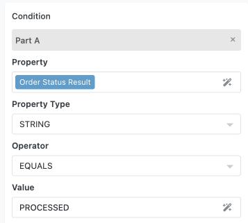
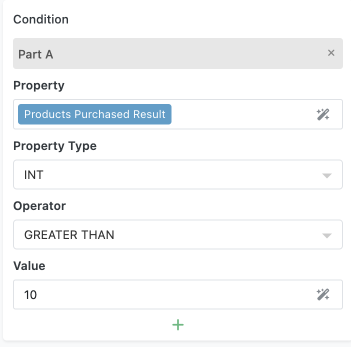
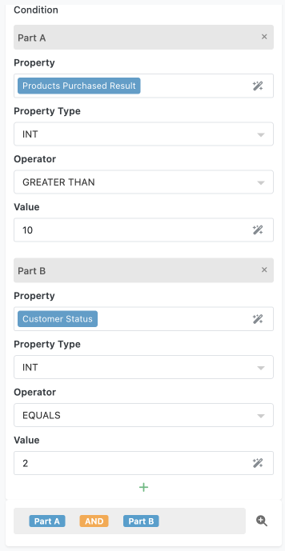
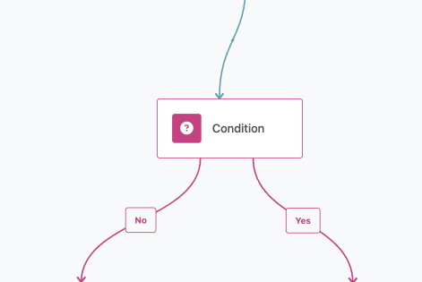
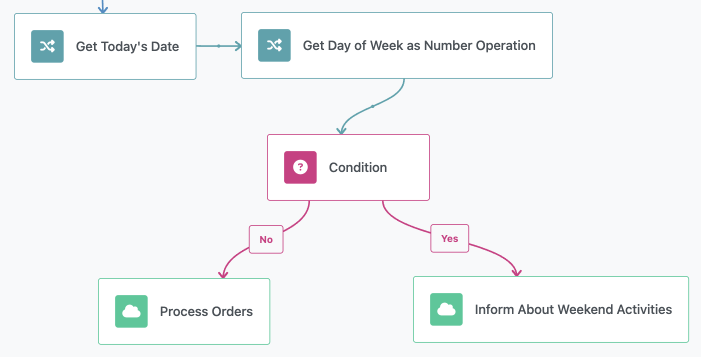
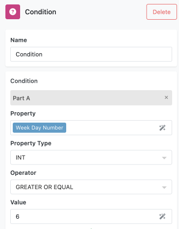

# Conditional Logic

Conditional logic in FlowRunner™ allows you to create decision points within your automation, directing the flow based on specific conditions. Think of it as a fork in the road where the flow will follow one path if the condition is met (yes) and a different path if it is not (no). For instance, your flow might take different actions depending on whether it is a weekend or a weekday.

At the heart of every condition is a question that results in a "yes" or "no" answer. Here are some examples:

- Does the order have priority shipping?
- Is this a returning customer?
- Is the current time within business hours?

## Building Condition Logic

Conditions can be integrated into various areas of your flow, including triggers and the dedicated `Condition` block. Configuring a condition involves building a logical expression that must evaluate to either `true` or `false`. 

### Single Condition Check

A single condition check performs one evaluation against a specific value. For example:

- Is variable `X` greater than 5?
- Does a string in a result element contain the word `"urgent"`?

When you configure a single condition check, you need to specify the following parameters:

1. **Value to Check**: This is the value that will be evaluated. You use the [Expression Editor](./expressioneditor.md) to select this value. It can be any value obtained through the Expression Editor.
2. **Value Data Type**: This indicates the data type of the value selected in the `Value to Check` field. The operations available depend on the data type. For instance, if the data type is `STRING`, operations like `STARTS WITH`, `CONTAINS`, and `ENDS WITH` will be available. If the data type is `INT`, the operations will include `GREATER THAN`, `LESS THAN`, etc.
3. **Operation**: This is the function to be performed against the value specified in the **Value to Check** parameter. Most operations require an additional value.
4. **Additional Fields**: These appear dynamically based on the selected operation. For example, comparison operations include a Value field that supports the Expression Editor for dynamic values.

Consider the examples below:

1. Check if the `Order Status Result` element's value equals the word `PROCESSED`:

    

2. Check if the `Products Purchased Result` element's value is greater than 10:

    

### Multiple Condition Checks

When you add more than one condition check, FlowRunner™ labels them as "Part A," "Part B," and so on. These parts are connected using `AND` and `OR` operators to create complex logical expressions.

Consider the example below. At the bottom of the screenshot, you will see how the parts are connected to create the final logical expression for the condition:



Clicking the `AND` operator changes it to `OR` and vice versa. FlowRunner™ uses conventional boolean logic with these operators. Each part is evaluated and results in either `TRUE` or `FALSE`. The following rules apply:

```
TRUE AND TRUE = TRUE
TRUE AND FALSE = FALSE
TRUE OR TRUE = TRUE
TRUE OR FALSE = TRUE
FALSE AND FALSE = FALSE
FALSE OR FALSE = FALSE
```

For expressions with three or more parts, you can assign precedence in the expression evaluation using parentheses. Anything in parentheses is evaluated first. Consider the following example with three parts:


The parts in the condition are organized in the following expression:


It may be ambiguous how the expression will be evaluated if any part is `FALSE`. To clarify, you can group parts using parentheses.

!!! note "Adding Parentheses"
    To add a parenthesis, simply click in the space between the parts and the `AND`/`OR` operators.

Once parentheses are present, it is easier to understand how the expression will be evaluated. The following two examples produce different results depending on how individual parts are evaluated:


or


## Available Operations by Data Type

The following tables show all available operations for each Value Data Type and their additional configuration requirements:

### STRING Operations

| Operation | Description | Additional Fields |
|-----------|-------------|-------------------|
| `EQUALS` | Compare exact string values | Value (Expression Editor) |
| `DOES NOT EQUAL` | Compare exact string values | Value (Expression Editor) |
| `CONTAINS` | Check if string contains substring | Value (Expression Editor) |
| `DOES NOT CONTAIN` | Check if string contains substring | Value (Expression Editor) |
| `STARTS WITH` | Check string prefix | Value (Expression Editor) |
| `DOES NOT START WITH` | Check string prefix | Value (Expression Editor) |
| `ENDS WITH` | Check string suffix | Value (Expression Editor) |
| `DOES NOT END WITH` | Check string suffix | Value (Expression Editor) |
| `IS EMPTY` | Check if string has no content | None |
| `IS NOT EMPTY` | Check if string has content | None |
| `IS NULL` | Check if value doesn't exist | None |
| `IS NOT NULL` | Check if value exists | None |

### INT and DOUBLE Operations

| Operation | Description | Additional Fields |
|-----------|-------------|-------------------|
| `EQUALS` | Compare numeric values | Value (Expression Editor) |
| `DOES NOT EQUAL` | Compare numeric values | Value (Expression Editor) |
| `GREATER THAN` | Compare magnitude | Value (Expression Editor) |
| `LESS THAN` | Compare magnitude | Value (Expression Editor) |
| `GREATER OR EQUAL` | Compare with equality | Value (Expression Editor) |
| `LESS OR EQUAL` | Compare with equality | Value (Expression Editor) |

### BOOLEAN Operations

| Operation | Description | Additional Fields |
|-----------|-------------|-------------------|
| `IS NULL` | Check if value doesn't exist | None |
| `IS NOT NULL` | Check if value exists | None |
| `IS TRUE` | Check true state | None |
| `IS NOT TRUE` | Check true state | None |
| `IS FALSE` | Check false state | None |
| `IS NOT FALSE` | Check false state | None |

### DATETIME Operations

| Operation | Description | Additional Fields |
|-----------|-------------|-------------------|
| `IS` | Compare with specific dates | Date Type dropdown[^1] |
| `IS NOT` | Compare with specific dates | Date Type dropdown[^1] |
| `BEFORE` | Compare chronological order | Date Type dropdown[^1] |
| `AFTER` | Compare chronological order | Date Type dropdown[^1] |
| `AT OR BEFORE` | Include equality in comparison | Date Type dropdown[^1] |
| `AT OR AFTER` | Include equality in comparison | Date Type dropdown[^1] |
| `WITHIN` | Check if date falls within time period | Time Period dropdown[^2] |
| `NOT WITHIN` | Check if date falls within time period | Time Period dropdown[^2] |

[^1]: **Date Type Options**: SPECIFIC DATE, SPECIFIC DATE/TIME, SPECIFIC YEAR/MONTH, SPECIFIC YEAR, TODAY, TOMORROW, YESTERDAY

[^2]: **Time Period Options**: THE PAST WEEK, THE PAST MONTH, THE PAST YEAR, THE NEXT WEEK, THE NEXT MONTH, THE NEXT YEAR, THE NEXT DAYS (with day count field), THE PAST DAYS (with day count field)

### IMAGE Operations

| Operation | Description | Additional Fields |
|-----------|-------------|-------------------|
| All STRING operations | Same as STRING data type | Same as STRING |
| `AI QUESTION` | Ask AI a yes/no question about image | Yes/No Question (Expression Editor) |

!!! note "AI Image Analysis"
    The AI QUESTION operation sends the image URL and your question to AI, which automatically responds with a boolean answer to control the condition outcome.

### JSON OBJECT Operations

| Operation | Description | Additional Fields |
|-----------|-------------|-------------------|
| `IS EMPTY` | Check if object has no properties | None |
| `HAS KEY` | Check if specific key exists | Key (Expression Editor) |
| `HAS KEY WITH VALUE` | Check key exists with specific value | Key, Value (both Expression Editor) |
| `HAS SPECIFIC TYPE` | Check if key contains specific data type | Key (Expression Editor), Type dropdown[^3] |

[^3]: **Type Options**: String, Int, Double, Boolean, Datetime, Image, JSON Object, JSON Array

### JSON ARRAY Operations

| Operation | Description | Additional Fields |
|-----------|-------------|-------------------|
| `IS EMPTY` | Check if array has no elements | None |
| `CONTAINS VALUE` | Check if array contains specific value | Value (Expression Editor) |
| `LENGTH GREATER THAN` | Compare array size | Value (Expression Editor) |
| `LENGTH LESS THAN` | Compare array size | Value (Expression Editor) |
| `LENGTH GREATER THAN OR EQUALS` | Compare with equality | Value (Expression Editor) |
| `LENGTH LESS THAN OR EQUALS` | Compare with equality | Value (Expression Editor) |
| `LENGTH EQUALS` | Check exact array size | Value (Expression Editor) |
| `ALL ELEMENTS OF TYPE` | Verify all elements match data type | Type dropdown[^3] |
| `ELEMENT AT INDEX EQUALS` | Check specific array position value | Index, Value (both Expression Editor) |
| `ALL ELEMENTS NOT NULL` | Verify no null elements | None |
| `ALL ELEMENTS MEET CONDITION` | Check all elements against condition | Nested condition configuration[^4] |
| `SOME ELEMENTS MEET CONDITION` | Check if any elements meet condition | Nested condition configuration[^4] |

[^4]: **Nested Condition**: Includes Value Data Type dropdown and Operation selection with additional fields based on selected type and operation

## Error Handling

Conditions can encounter various error scenarios that you should be prepared to handle:

**Invalid Property References**: When a property reference is invalid or missing, FlowRunner™ generates an error. For error handling purposes, the Condition block can be connected to a Handle Error block to manage these scenarios gracefully.

**Data Type Mismatches**: If the actual data type doesn't match the selected Value Data Type, FlowRunner™ attempts to auto-guess the type and perform data conversion. This automatic conversion helps maintain flow continuity but may not always produce expected results.

**Network Errors**: Network errors are possible only with the AI operation when processing IMAGE data types. In such cases, FlowRunner™ generates an error that can be handled through standard error handling mechanisms.

**Best Practices for Error Prevention**:
- Validate property paths before using them in conditions
- Use appropriate null checks when working with optional data
- Test conditions with various data scenarios during development
- Implement error handling paths for critical decision points

## Best Practices

### Performance Optimization
- Keep complex conditions as simple as possible while maintaining accuracy
- Use specific data types rather than relying on auto-conversion
- Consider breaking very complex conditions into multiple simpler Condition blocks
- Place more likely conditions first in OR expressions to short-circuit evaluation

### Condition Design Strategy
- Use descriptive property names and clear comparison values
- Group related logical parts using parentheses for clarity
- Document complex condition logic with descriptive block names
- Test edge cases and boundary conditions thoroughly

### Debugging Complex Conditions
- Test individual condition checks before combining them into parts
- Use simple test data to verify condition logic
- Add temporary logging or outputs to track condition evaluation
- Break complex conditions into smaller, testable components

## Condition Block

The `Condition` block allows you to set up a logical expression and then branches the flow into two paths: `Yes` and `No`. If the expression evaluates to `true`, the flow follows the `Yes` branch. Otherwise, it follows the `No` branch. 



### Example Flow

Consider a scenario where you want the flow to behave differently based on whether it is a weekend or a weekday. You can set up a condition that checks the current day of the week:



The `Condition` block in this example uses the following logic:



This logic checks if the `Week Day Number` value is either Saturday (value `6`) or Sunday (value `7`). Based on this check, the flow can take different actions.

- **On Weekends - when `Week Day Number` is greater or equal `6`**: You might want the flow to send an alert to the team informing them of weekend activity, or perhaps delay certain non-urgent processes until Monday.
- **On Weekdays - for all other values stored in `Week Day Number`**: The flow could continue with regular processing, such as sending orders to the shipping department or performing routine updates.

The `Condition` block is highly versatile, enabling you to create complex logical expressions. These expressions can include multiple parts combined using `AND` and `OR` operators. Additionally, the `Condition` block can handle various data types, making it a powerful tool for building sophisticated decision-making processes within your flows. 

For a detailed overview of the `Condition` block's capabilities, refer to the [Condition Block](../reference/condition.md) chapter in the Block Reference section of this guide.

## Conditions with Triggers

All built-in FlowRunner™ triggers can be enhanced with a condition that acts as a "filter". These conditions follow the same rules described above for configuring logical expressions. When a trigger has an associated condition, it will only be activated if the condition evaluates to `TRUE`. This ensures that your flows only proceed under the specific circumstances you define, adding an extra layer of precision and control to your automation processes.

By organizing your conditions effectively, you can create complex and precise logical flows that ensure your automation behaves exactly as intended.