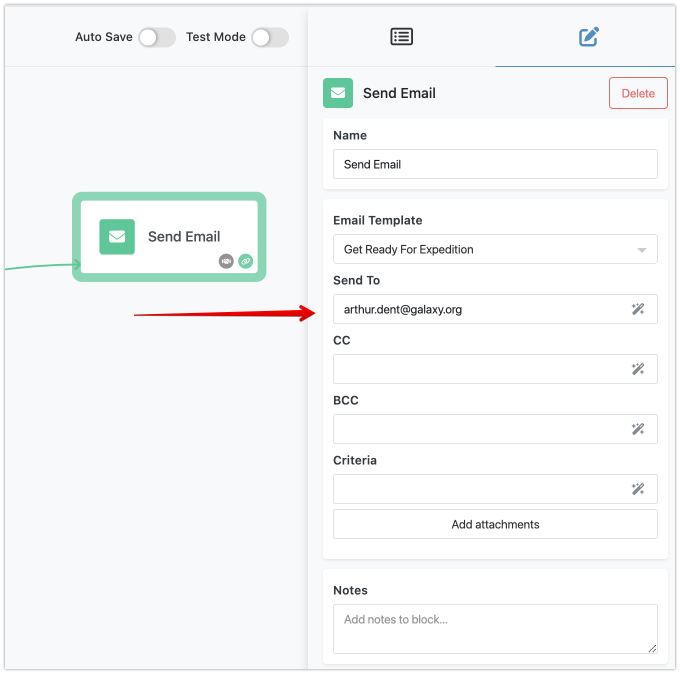
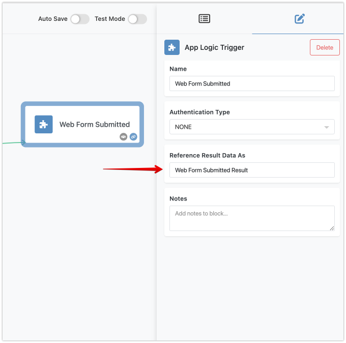
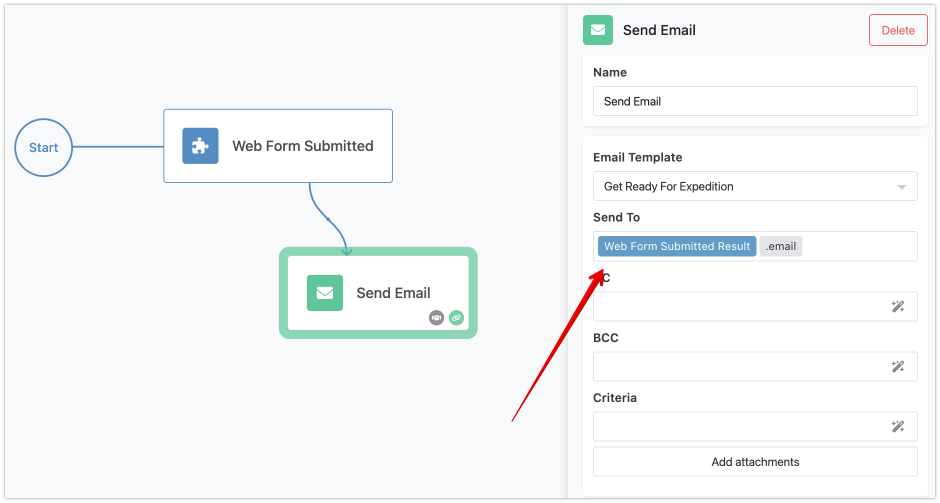

Creating workflows in Backendless Automations involves a dynamic data interaction across various components. Each element within your flow, whether an action, trigger, condition, utility, or transformer, handles data uniquely. These elements take specific input parameters and generate outcomes that advance your workflow. For example, a simple action like the `Send Email` block requires an email address to function, demonstrating how inputs directly influence the operations within a flow.

**The Journey of Data Through a Flow**

As your flow executes, each block completes its tasks and produces a "result". This result can range from a straightforward data point to a complex set of information. Consider a scenario where a trigger activates upon submitting a web form. This trigger captures detailed information a customer provides, storing it as a "result" that can be further utilized within the flow. You can assign a user-friendly name to each result element. The system uses this name to represent the result in various sections of the Flow Editor, enhancing the readability and manageability of data within your workflows.

**Transforming Data for Seamless Integration**

Often, the output generated by one block must be modified before subsequent blocks can use it in the flow. For instance, if a customer fills out a web form and you wish to send them an email, you may need to extract their email address from the form's submission data. This is where Transformers and Expressions play a crucial role. They allow you to adapt the incoming data to meet the requirements of downstream tasks in your flow.

By utilizing Transformers, you can ensure that data passing from one block to another is formatted and structured correctly, bridging gaps between different data handling requirements and facilitating a fluid data flow.

**Mastering Data Movement for Effective Automations**

Understanding and manipulating data movement within your flows is essential to crafting effective automations. It's not merely about connecting blocks but orchestrating a coherent and efficient flow of information that enhances your business operations. This chapter aims to equip you with the knowledge to navigate and optimize these data interactions, ensuring that each workflow component is purposeful and impactful.
