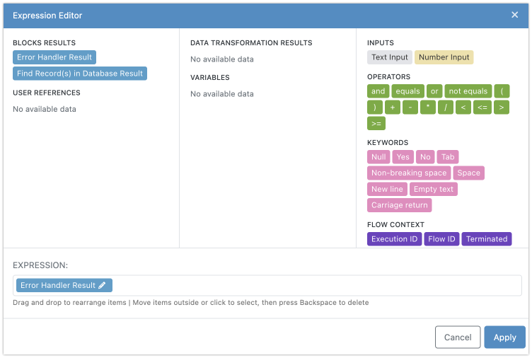
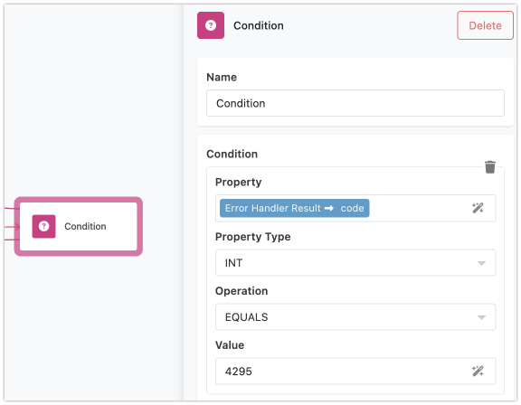

Errors are an inevitable part of automating workflows. To maintain a stable and reliable system, it's crucial to anticipate and manage these errors effectively. FlowRunner provides a robust mechanism for handling errors, allowing you to create automations that can gracefully recover from unexpected issues.

Errors can occur from various sources during the execution of your flow. Some common scenarios include:

* Failures in requests to external services, such as when a service is down or returns an error.
* Database query failures due to a malformed query or insufficient user permissions.
* Actions failing because of invalid input data or missing information.
* File upload issues caused by network problems or file size limitations.

## The Error Handler Block
The Error Handler block is special. It is neither an action nor a trigger. Think of it as a special route that your flow follows when an error occurs. The "navigation" is established by connecting a block that may result in an error to the Error Handler block. The actual handling of the error happens in the successors of the Error Handler block. This can range from basic logging to more elaborate error processing, such as calling another flow. 

Consider the sample flow below. The flow design indicates that an error may occur in the `Retrieve Orders` block. This block is connected to the `Error Handler` block, which subsequently passes control to the `Log Error` block. If everything goes well and the order retrieval succeeds, the flow continues its execution to the `Process Orders` block:

## Error Types
All errors fall into one of two categories: handled and unhandled.

* **Handled Errors**: These are errors you have prepared to process. From FlowRunner's perspective, handling an error means connecting the block where the error might occur to an `Error Handler` block. This connection ensures the flow knows how to react when an error happens.

* **Unhandled Errors**: These are errors the flow is not prepared to handle. There is no connection between the block where the error occurs and an `Error Handler` block. Unhandled errors can disrupt the flow and cause it to stop unexpectedly.

## Error Structure in FlowRunner

When an error occurs in FlowRunner, it is represented internally as a key/value structure containing two main properties: `code` and `message`. Understanding this structure is crucial for implementing effective error handling in your flows.

#### The `code` Property

The `code` property is a numeric value that uniquely identifies the specific error condition that caused the error. Each error type in FlowRunner has a distinct code, allowing you to easily recognize and categorize errors.

#### The `message` Property

The `message` property is a text description that provides details about the error. This description is designed to help you understand what went wrong, making it easier to diagnose and address the issue.

## Handling Errors with the "Error Handler" Block

If an error is handled - that is, if the block that resulted in the error is connected to the `Error Handler` block - then the successors of the `Error Handler` block can access the error information. This information is available through the "Error Handler Result" element in the [Expression Editor](./expressioneditor.md).

The flow can then apply custom logic to handle the error based on either the `code`, the `message`, or both. For example, you might create different handling paths depending on the error code, or you might log specific error messages to help with troubleshooting.

## Best Practices for Error Handling

1. **Identify Potential Error Sources**: Determine which blocks in your flow might encounter errors, such as those interacting with external services, databases, or user inputs.
  
2. **Connect to Error Handler**: Link these blocks to an `Error Handler` block to prepare your flow for handling potential errors. Your flow may have multiple different `Error Handler` blocks or utilize one where all error handling is centralized.

3. **Define Error Handling Strategies**: Specify how you want to manage the errors in the successors of the `Error Handler` block. Strategies can include:
    - Logging the error for future analysis.
    - Notifying an administrator about the issue.
    - Retrying the failed action after a short delay (consider using the [Wait Block](./waitblock.md) for this purpose).
    - Implementing fallback procedures, like switching to an alternative service.
    - Triggering another flow designed to handle specific errors (see the [Call Flow Action](../reference/call-flow-action.md) for details on how to call another flow).

By following these best practices and effectively utilizing the `Error Handler` block, you can enhance the reliability and stability of your automations, ensuring they can withstand and recover from unexpected issues.