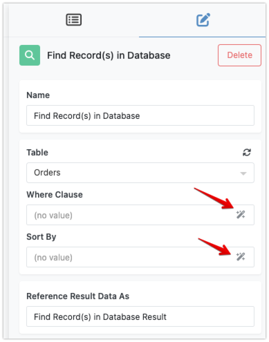
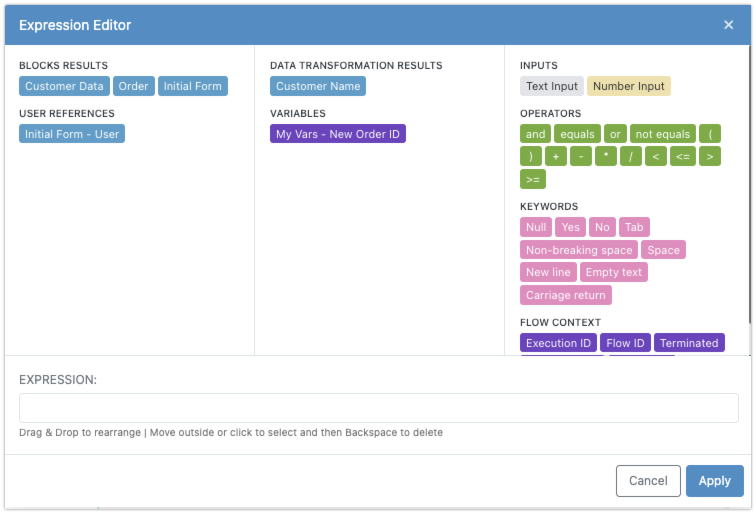

In your flow, individual blocks generate data that can be utilized throughout the workflow. Triggers receive and pass on information, actions and transformers create new data, and data buckets store various data elements under logical names. As discussed in the [Data Movement in Flows](dataflow.md) section, a block's inputs can reference the results from other blocks, enabling dynamic and interconnected workflows. This result-to-input data referencing is made possible through the Expression Editor.

## Accessing the Expression Editor
You can open the Expression Editor from any block's input parameter that displays the specific icon:

## Accessing Flow Data
When you launch the Expression Editor, it presents a list of all data elements available to the block in the flow. The system composes the list based on the block's predecessors. Consider the screenshot below

The screenshot shows the following sections and elements:

* **Block Results** - `Customer Data`, `Order`, `Initial Form` - these are "result" blocks from the predecessor actions and triggers.
* **User References** - `Initial Form - User` - a reference to a Backendless user (if one is present) when the `Initial Form` trigger was activated.
* **Data Transformation Results** - `Customer Name` - a reference to a result from a Transformer predecessor block.
* **Variables** - `My Vars - New Order ID` - a reference to the `New Order ID` variable in the `My Vars` data bucket. 

## Working with Key/Value Structures
For the key/value structures, the Expression Editor implements a special "shortcut" for accessing values by key name. To access value for a key, drag an element into the `EXPRESSION` field. Click it and you will see an input field for the key/property name. Type in a key name and press `Enter`. The element is reconfigured to access value by key name.

<iframe src="https://demo.arcade.software/VSAq33g0H41UQ8oi3rGA?embed&show_copy_link=true" title="Accessing values in key/value data structures" frameborder="0" loading="lazy" webkitallowfullscreen mozallowfullscreen allowfullscreen allow="clipboard-write" style="position: absolute; top: 0; left: 0; width: 100%; height: 100%;color-scheme: light;"></iframe>

## Scalar Data
In addition to referencing flow data (actions/triggers/transformers results and variables), your expressions can include scalar numeric and text (string) data. This is possible with the `Text Input` and `Number Input` elements. These elements can be combined with other scalar or dynamic elements to create more complex expressions.

## Operators and Keywords
The Expression Editor is not just a gateway to access accumulated data but also a powerful tool for manipulating it. It supports basic arithmetic operations, logical comparisons, and string concatenation, allowing you to construct expressions that yield boolean, numeric, or string results. You can find all supported logical and arithmetic operators in the `OPERATORS` section.

Here are some examples of what you can achieve with the Expression Editor:

- **Arithmetic Operations**: You can perform calculations such as adding, subtracting, multiplying, or dividing numbers. For instance, if you have two numeric data elements representing quantities, you can create an expression to find their sum.

- **Logical Comparisons**: The Expression Editor enables you to create conditions using logical operators like `AND`, `OR`, `EQUALS`, `NOT EQUALS` and `GREATER`/`LESS THEN`. For example, you can compare two values and produce a boolean result that triggers subsequent actions based on the comparison.

- **String Concatenation**: Combine multiple string elements into a single string. This is useful for constructing messages, URLs, or any other text-based data that needs to include dynamic elements from your flow. String concatenation can be implicit by positioning two string elements adjacent to each other, or explicit by using the `+` operator.

## Composing an Expression
To create an expression, you need to arrange one or more elements in the `EXPRESSION` field. There are several rules for working with the elements in the `EXPRESSION` field:

* To add an element to the field, either drag or double-click it. 
* Elements added to the expression can be rearranged by dragging them into the new position.
* To remove an element from the field either drag it outside of the field or click to select it and then use the Backspace keyboard button.
* Use the parenthesis operators { .skip-lightbox .midalign } and { .skip-lightbox .midalign} to change the precedence of other operators in the expression evaluation. 

By mastering the Expression Editor, you can enhance the functionality of your flows, ensuring that the data moves seamlessly and transforms as needed to meet your automation requirements. This chapter aims to provide you with the knowledge to effectively use the Expression Editor, empowering you to create more sophisticated and responsive workflows.