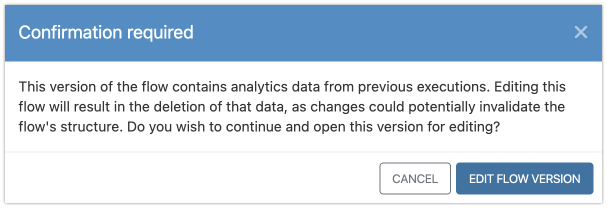
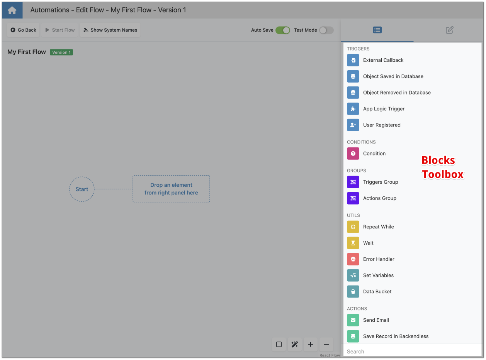

# Introduction to the Flow Editor

In the heart of FlowRunner™ lies the Flow Editor, a dynamic and interactive graphical environment where the art of workflow creation comes to life. This powerful editor is designed to be intuitively accessible, yet rich in features, making it the perfect tool for both newcomers to the world of automations and seasoned professionals seeking to streamline their processes. In this chapter, we'll introduce you to the main elements of the Flow Editor interface, guiding you through its layout and functionalities to help you start creating your own workflows with confidence.

To navigate to the Flow Editor, click the `Edit Flow Version` icon for the flow you would like to edit in the main Flow Manager interface:

!!! warning "Editing a Version with Analytics Data"

    When you attempt to edit a flow version that was previously running (`LIVE` state), a popup message will appear. 

    

    This message informs you that editing this version will lead to the deletion of all collected analytics data associated with it. The need to delete analytics data arises because any version modifications in the Flow Editor alter the internal model of the flow, rendering the existing analytics data irrelevant. Consequently, FlowRunner™ requires your confirmation before proceeding with the changes to ensure you are aware of the implications of editing a live flow version.

## Editor Canvas

The Editor Canvas is your creative playground within the Flow Editor. It's a free-form canvas where you can visually compose your workflows by placing automation blocks. These blocks represent the core components of your workflow, including Triggers, Actions, Conditions, Transformers, and Groups. By connecting these blocks together, you create a graphical representation of your workflow, making complex processes easily understandable at a glance. The canvas is designed to support the natural flow of your thought process, allowing for intuitive arrangement and reconfiguration of your workflow components.

## Blocks Toolbox

Situated alongside the Editor Canvas, the Blocks Toolbox serves as your comprehensive tool chest, housing all the essential building blocks necessary to construct your workflows. These blocks are meticulously organized into categories such as Triggers, Actions, Groups, and Utilities, facilitating an easy search for the specific functionality you need to implement in your workflow. Each category is represented with intuitive icons and labels, ensuring you can swiftly identify and select the appropriate block to add to your canvas.

Enhancing its user-friendly design, the Blocks Toolbox features a Search bar located at its bottom. This powerful addition allows you to quickly find a block by name or functionality, significantly streamlining your workflow development process. Moreover, as you explore the various blocks available, hovering your mouse pointer over any block reveals a detailed description of its function. This feature provides a deeper understanding of what each block does, aiding in the selection of the perfect tool for every step of your automation journey.

## Control Bar

The Control Bar is the command center of the Flow Editor, equipped with various editing functions to enhance your workflow creation experience. Key features include:

- **Go Back**: This button effortlessly takes you back to the Flow Manager's main interface, allowing for swift transitions between editing your flow and overseeing all your project's flows.
- **Start Flow**: With a single click, this function launches the currently edited flow version, moving it to the LIVE state, ready for action and interaction within your application.
- **Show System Names**: Serving as a toggle, this option alternates the display of block names on the canvas between the system-defined names and the custom names you've assigned. This flexibility aids in navigating your flow with clarity, whether you're familiarizing yourself with the blocks' standard functions or customizing your workspace. For more details see [Switching Between Names](blocknaming.md#switching-between-names)
- **Auto Save Toggle**: This function ensures your work is automatically saved as you make changes, providing peace of mind and safeguarding against data loss.
- **Test Mode Toggle**: Activating Test Mode allows you to validate the logic and execution of your workflow in a controlled environment, ensuring everything operates as intended before going live.

These controls are designed to streamline your workflow development process, offering quick access to essential functionalities that improve productivity and efficiency.

## Getting Started with the Flow Editor

Diving into the Flow Editor for the first time can be an exhilarating experience as you begin to explore the vast possibilities of FlowRunner™. Here are a few tips to get you started:

1. **Familiarize Yourself with the Blocks**: Spend some time exploring the Blocks Toolbar, getting to know the different types of blocks available and what they do. This knowledge will be invaluable as you start to build your workflows.
2. **Experiment with Drag and Drop**: The Editor Canvas is highly interactive. Experiment with dragging blocks from the toolbar onto the canvas and connecting them to see how they interact.
3. **Utilize Test Mode**: Don't hesitate to use Test Mode frequently. It's a powerful feature that helps you ensure your workflows function exactly as you intend, without affecting your live environment.
4. **Play with the Auto Save Feature**: Trust in the Auto Save feature to keep your work secure as you edit. It's there to make your life easier, allowing you to focus on creativity rather than saving documents.

The Flow Editor in FlowRunner™ is more than just a tool; it's a gateway to transforming your ideas into reality. By understanding its main components—the Editor Canvas, Blocks Toolbar, and Control Bar—you're well-equipped to start creating effective, efficient, and elegant workflows tailored to your unique needs. Welcome to the world of endless possibilities with FlowRunner™.