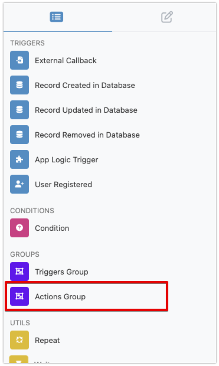
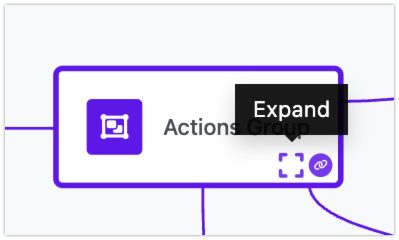
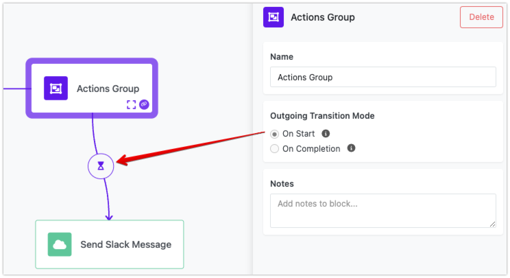
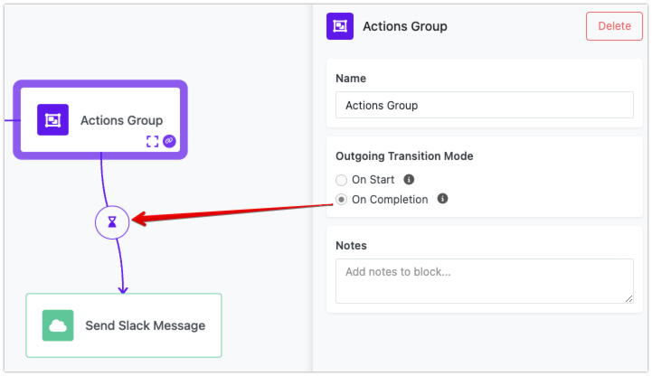

Imagine you're managing a marketing campaign that needs to kick off across multiple channels simultaneously. You need to post updates on social media, send out an email newsletter, and publish a blog post on your website—all at the same time. With Backendless Automations, you can group these actions into a single step and execute them in parallel, significantly speeding up the process and ensuring everything launches together.

This powerful feature allows you to run multiple actions at once, enhancing the efficiency and flexibility of your workflows. Instead of waiting for each task to finish before starting the next one, all actions within a grouped step start simultaneously. This is perfect for tasks that don’t depend on a specific sequence and can benefit from concurrent execution.

## Creating an Actions Group

To create an Actions Group, use the `Actions Group` block located in the `GROUPS` section of the Blocks Toolbox.

Drag the `Actions Group` block into the Flow Editor Canvas. To edit the contents of the group, click the `expand` icon:

The Flow Editor canvas will open to show the contents of your group, which is empty by default. You can add multiple actions to the group in the same way blocks are added to a flow. The difference is that actions in a group are not sequenced; when the execution reaches the group, all actions run at once.

To return to your flow, click the `Go Back` button in the top toolbar.

## Transition Modes

You have the option to choose how the workflow transitions to successor blocks. This is configured in the group's properties:

The first mode, `On Start`, allows the workflow to move on as soon as all actions in the current step have begun. This is particularly useful when the next tasks in the workflow can start as soon as they know the previous actions are underway, without waiting for their completion. Backendless visualizes this transition mode with a top-filled hourglass indicator on all transition lines. 

The second mode, `On Completion`, ensures that the workflow only proceeds once all actions in the current step are finished. This mode is ideal when the subsequent steps rely on the completion of all parallel tasks, making sure nothing is left incomplete before moving forward. This transition mode is visualized with a bottom-filled hourglass indicator on all outgoing transition lines:

Consider a scenario where you're collecting data from various sources. You need to fetch sales data from a database, customer data from an API, and product data from a spreadsheet. With this feature, you can start all these data collection tasks simultaneously. Depending on your workflow requirements, you can either start processing the collected data as soon as all tasks have started (using the `On Start` transition mode) or wait until all data is gathered before proceeding (using the `On Completion` mode).

## Returned Values

The `Actions Group` block does not have its own return value. However, the "Result" elements from the individual actions placed into the group are available.

???+ note
     If the outgoing transition is set to `On Start`, data in an individual "result" element may not be available until the action completes its execution. Make sure to check for data availability before you use it in a successor block.

## Benefits of Grouping Actions

Grouping actions for parallel execution offers significant benefits. By enabling parallel execution, you can reduce the overall execution time, making your workflows more efficient. The flexibility to choose the appropriate transition mode based on your needs ensures that your processes are both robust and streamlined. Additionally, this capability allows you to handle complex workflows with multiple parallel actions easily, scaling your automation to meet growing demands.

In essence, Backendless Automation's ability to group actions into parallel execution steps, with flexible transition modes, enhances both efficiency and flexibility. Whether you're launching a marketing campaign, collecting data from various sources, or performing IT maintenance tasks, this feature ensures your workflows are effective, timely, and capable of managing complex tasks with precision.