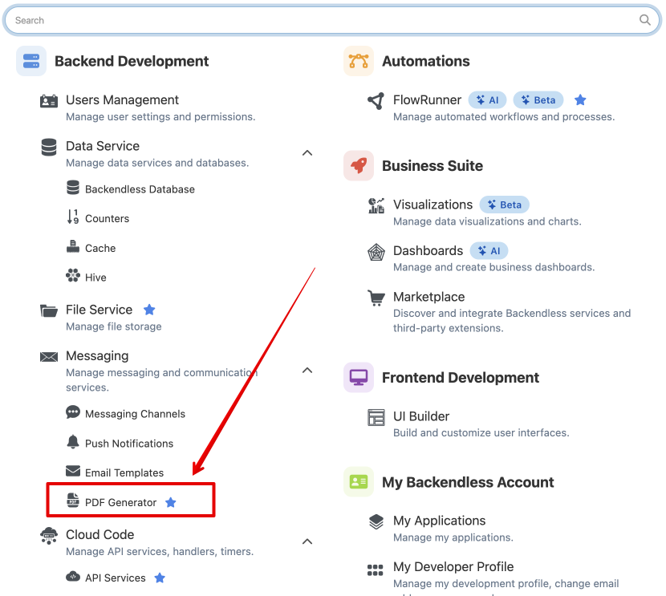
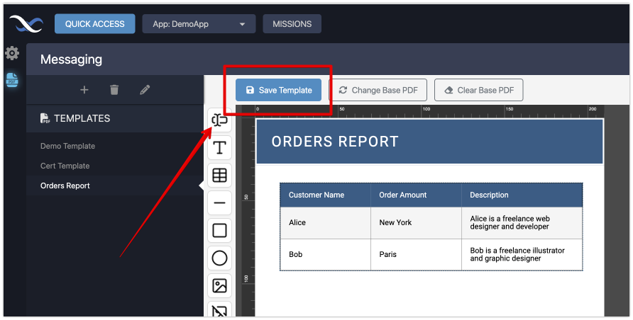
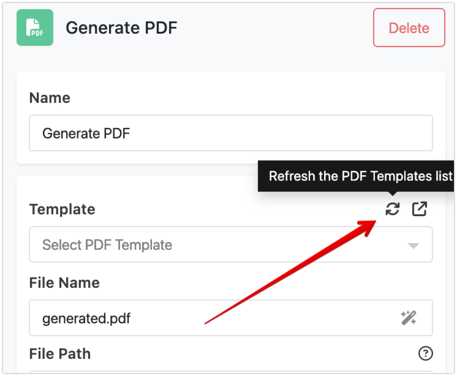
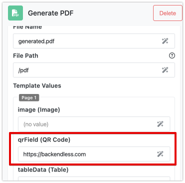
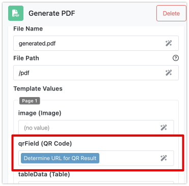
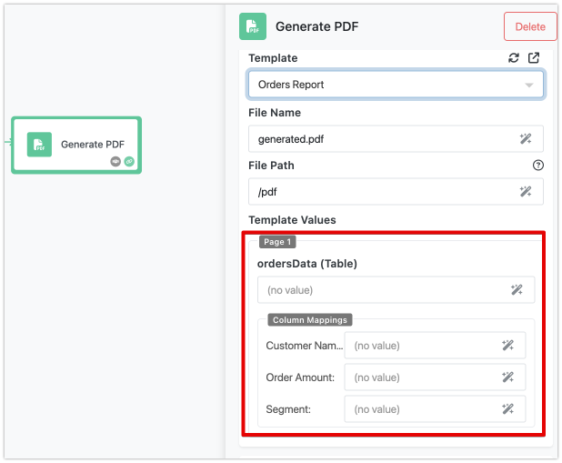
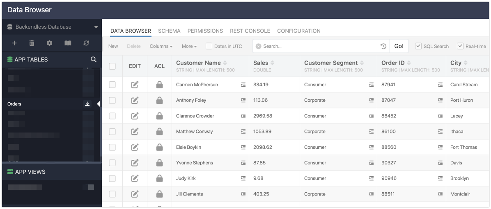
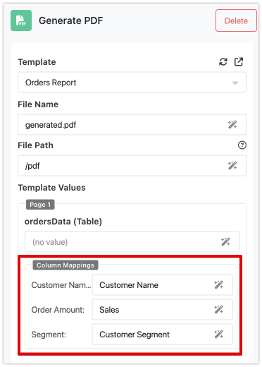
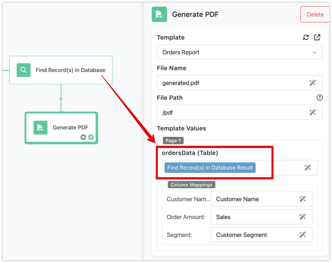
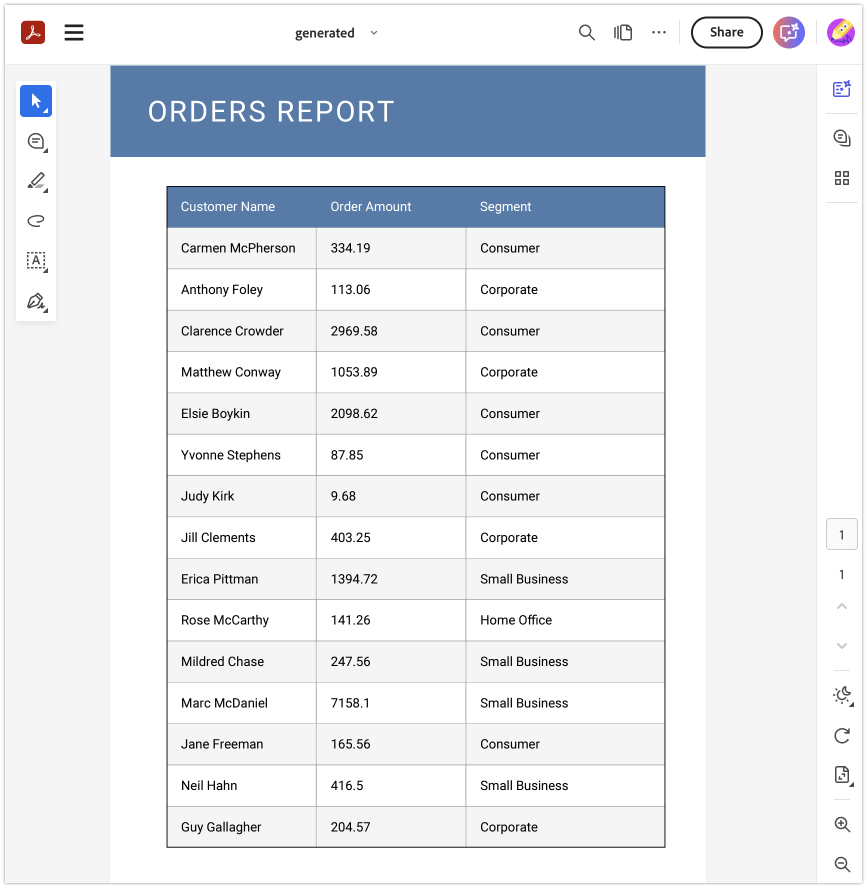

In FlowRunner™, the PDF generation process allows you to create customized PDF documents by dynamically incorporating data from your flow into predefined templates. Here's how it works in broad terms:

As a flow developer, you first create a **PDF template**. This template defines specific dynamic areas, called **fields**, which will hold content like data tables, images, QR codes, and text. These fields act as placeholders that will later be populated with actual data during the flow execution.

Once your template is set up, you add the **PDF Generator action** to your flow. This action links the flow to the template you’ve created. At this stage, FlowRunner™ will show you a list of the available fields in the template. You can then map each template field to specific data from your flow, establishing the relationship between your flow's data and how it will appear in the PDF.

When the flow runs, the PDF Generator action processes the template with your data, creating the final document. The outcome is a **URL** to the generated PDF. You can use this URL later in your flow for various purposes, such as sending it by email or storing it for future use.

## PDF Generator Components

There are three essential components involved in generating a PDF within FlowRunner™:

- **PDF Template**: This defines the layout and structure of your PDF document. It includes placeholders (fields) for dynamic data such as images, text, or tables.
- **PDF Generator Action**: This action initiates the PDF creation process. It manages the mapping between template fields and the data from your flow.
- **PDF Generator Result**: Once the PDF is generated, the result is a URL that links to the created document. This PDF reflects the structure of the template combined with the data mappings you've assigned.

## PDF Template Editor

The **PDF Template Editor** is a separate tool within the Backendless Console that helps you create PDF templates for dynamic content. To get started, follow these steps:

1. **Open the Quick Access menu**: Click the "Quick Access" button located in the upper left corner of the console.

    

2. **Find the PDF Generator**: Navigate to the "Messaging" section or simply type "PDF" in the search bar to quickly locate the tool.
    
    

3. **Add to Favorites**: If you use the PDF Generator often, you can click the :octicons-star-16: icon next to its name to add it to the Favorites bar for easier access.

The interface for the PDF Generator is designed to give you full control over your template creation and customization. Below are the key elements you’ll work with:

### Templates List
This is where you manage your PDF templates. You can:

- Add new templates.
- Delete templates you no longer need.
- Edit template properties, such as paper size, page dimensions, and document padding.

### Document Editor
The **Document Editor** allows you to design your PDF. It renders one or more pages that make up the template. A key feature of the editor is the ability to upload a **base PDF**. This base PDF could contain static elements like a corporate letterhead or any other design element that will stay the same across all generated documents. Use the **Change Base PDF** button to update base PDF. You can then overlay dynamic fields on top of this base PDF to create personalized documents.

!!! note
    When you set a **base PDF** for your template, it limits which template properties you can edit in the **Templates List**. If you click the "pencil" icon to open the "Edit Template" popup, you will only be able to change the template's name. 

    All other properties - like **page format**, **size**, and **paddings** - are inherited from the base PDF. This means you cannot adjust these layout settings manually, as they are controlled by the structure of the base document itself.

    This is useful to keep in mind when working with static elements like corporate letterheads or certificates, as the base PDF sets the foundational design.

### Toolbar
The toolbar provides a variety of **components** you can add to your template. Components include dynamic elements such as Table, Image, Text Input and QR Code. These components will later serve as fields where dynamic data is inserted when the flow runs. In addition, the toolbar includes decorative components, such as Geometric shapes and Read-only text. These are static elements used for visual purposes, and they do not change during the flow execution.

!!! note
    In the toolbar of the PDF Generator, hovering your mouse pointer over any icon will display a tooltip with the name of the component. This is a helpful way to quickly identify each component before adding it to your template, ensuring you choose the right tool for the job without needing to click through each option.

    

### Field Properties
When you select a field in the template, the **Field Properties** panel opens. Here, you can customize the visual appearance of the field, such as adjusting its size, position, or other styling options to match the document's needs.

!!! note
    When working in the **Field Properties** panel, it’s recommended to update the default value in the **Name** field. This field holds the name assigned to the component or field, which is important for later stages.

    The name you assign will be used in **FlowRunner™** for **data mapping** purposes. To avoid confusion, it’s best to choose a meaningful name that clearly and uniquely identifies the component. This makes it easier to manage and map your fields accurately when building flows, especially when you have multiple dynamic elements in your template.
 
### Field List
Once you add components to your template, they appear in the **Field List**. Each component added to the template becomes a field, which can be either static or dynamic. If a field has a :octicons-lock-16: icon next to it, that means its value cannot be dynamically populated during the flow, meaning it's static.

!!! note
    To view the **Field List** in the PDF Generator, you have two options:

    - **Click on any blank area** of your template.
    - Use the **"burger" icon** located on the **Field Properties** panel.

    These actions will bring up the list of all fields (or components) that have been added to your template, making it easy to manage and review your dynamic and static elements.

### Remember to Save Your Template!

A crucial step when working with the PDF Generator is to **save your template**. After making any changes, always click the "Save Template" button to ensure that your updates are not lost. If you forget this step, your work will not be preserved.

## PDF Generator in FlowRunner

To begin using the PDF Generator in your flow, the first step is to add the **PDF Generator action block** to your flow in FlowRunner™. If there are any predecessor blocks in the flow, ensure they are connected to the PDF Generator action for seamless execution.

Once the action is placed, you will need to configure it. The first task is to select a **PDF Template**. In the properties panel of the action, you’ll find the **Template** property, which displays a list of templates already configured in your application. 

If you have multiple browser windows open (for instance, one where you're editing the template and another where you’re creating the flow), you can click the **refresh** icon in the FlowRunner™ window to update the list of available templates.

### Fields Mapping

Once you select a PDF Template, the properties panel will automatically update, showing the template fields you can map flow data to. Each field will appear with the **name you assigned** (or the default name if you didn’t assign a specific one) and will also reference the component it represents. Consider the following sample PDF template, notice there are four "editable" fields: `image`, `qrField`, `tableData` and `textField`:

 

When selecting that template in FlowRunner™, it will render the following form for field mappings:

To map the flow data to these fields, you’ll use FlowRunner’s **Expression Editor interface**. Most mappings are quite straightforward. For instance, when mapping data to a **text field** or a **QR Code**, you simply need to specify the value that will be rendered in the PDF.

 

Or alternatively, you can use a result of a previous block:

### Tables in PDF

Mapping data to a **Table field** in the PDF Template is a bit more complex. You need to map the data that will populate the table, and also assign data properties to the specific table columns. Fortunately, FlowRunner’s interface simplifies this process.

Let’s look at an example:

Suppose your PDF Template includes a table field with columns for **Customer Name**, **Order Amount**, and **Segment**. In the PDF Template editor, the field name is set to **ordersData**. 

!!! note
    To edit the **table column names**, click directly on the header cell and modify the name using the inline content editing feature. Once you have made your changes, remember to click the **Save Template** button to ensure your updates are saved.

When this template is used in FlowRunner™, the properties panel for the PDF Generator action will look something like this:

As shown, FlowRunner™ automatically recognizes the **ordersData** field and creates a mapping interface for both the data to populate the table and the data properties that correspond to the table columns.

Now, let’s assume the flow retrieves table data from the **Backendless database**, and the data looks like this:

You want to render the **Customer Name**, **Sales**, and **Customer Segment** in the PDF. To do so, you’ll create a mapping between the data columns and the table columns, as shown below:

Make sure to set the **ordersData** field mapping to the result of your database query (from the **"Find Record(s) in Database" action**).

### Testing PDF Generation

Before running the flow, it’s recommended to use **Test Mode** to ensure everything is working as expected. When you test it, the PDF Generator action should produce the following result:

After the flow executes successfully, the final **PDF Document** will be generated and look like this:

