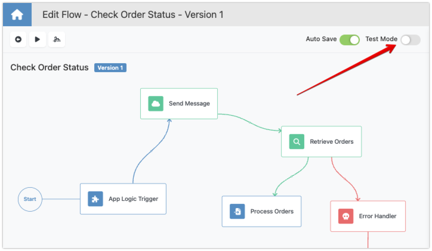
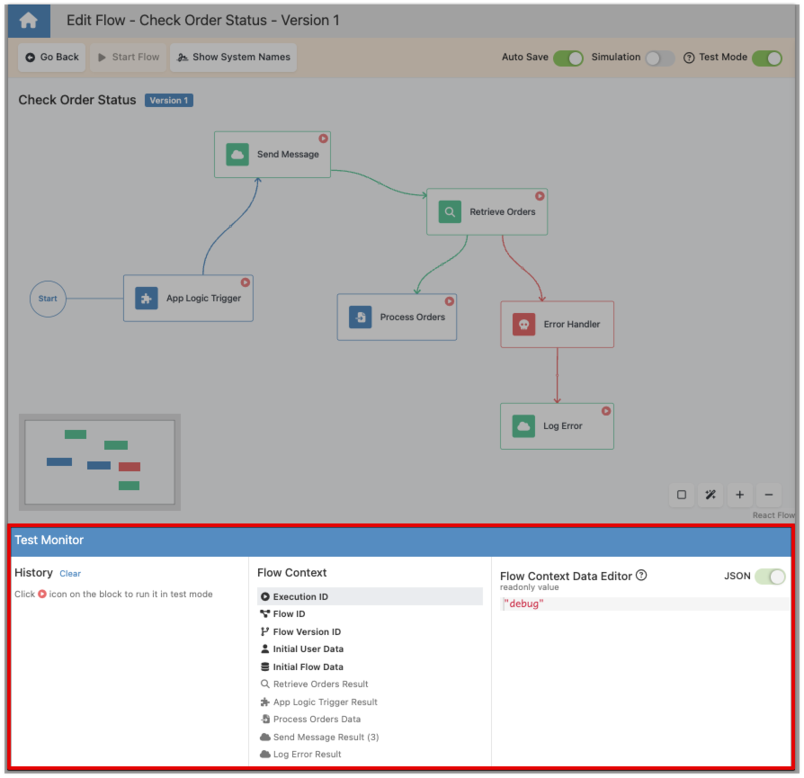
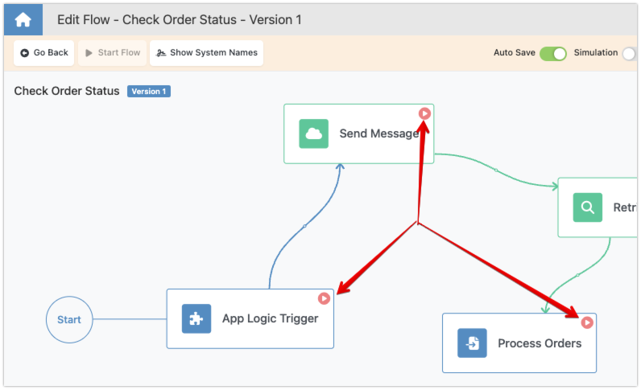
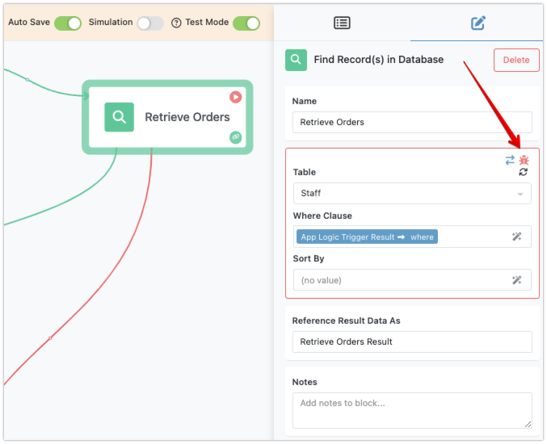
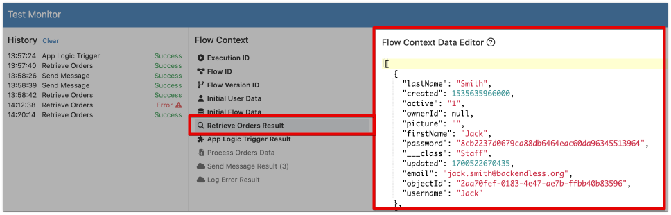
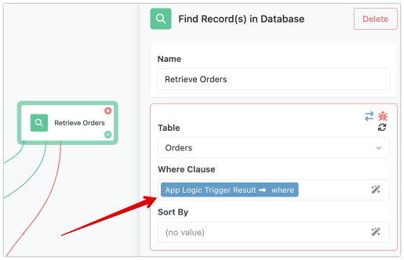
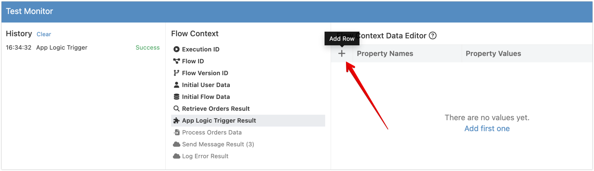
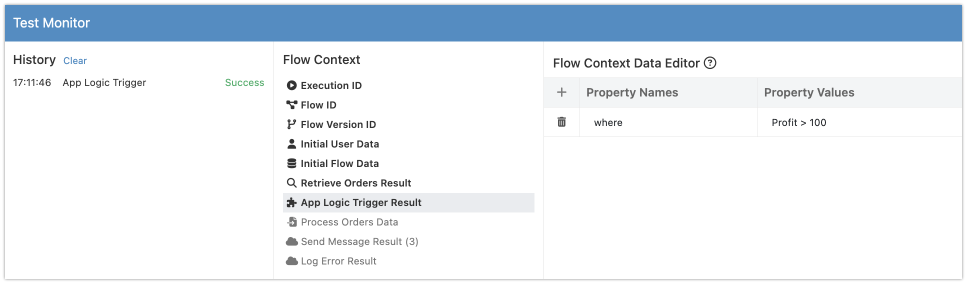
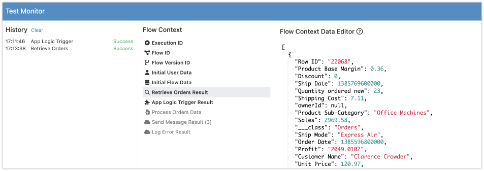

FlowRunner's Test Mode is designed to help you efficiently test and debug your flows. This mode allows you to simulate the flow execution, monitor its behavior, and ensure everything works as expected before launching the flow. Testing is crucial because many parts of the flows run "silently" and execute business rules and logic behind the scenes. By testing, you gain visibility into how this execution works, identify potential issues, and verify that your automation behaves as intended. This process helps you catch and resolve errors early, leading to more reliable and robust workflows.

You can activate Test Mode directly within the Flow Editor by toggling the "Test Mode" switch. 

Once enabled, the interface adapts to support testing and debugging activities. You will observe the following changes in the interface:

1. The "Test Monitor" panel, the crucial element of the test mode is shown at the bottom of the Flow Editor interface.
    

2. Blocks in your flow get the "play" icon that let's you perform a test run of the block.
   

3. When you select a block, the configuration properties that impact block's execution (usually these are the properties that define the input parameter) are displayed with the special "debug" annotation. 
   

## Test Monitor Panel

The core component of Test Mode is the Test Monitor panel. This tool helps you track the execution of your flow and diagnose issues. Here’s what you’ll find in the Test Monitor:

- **Run History**: Every time a block is executed in Test Mode, an entry is added to the History section. This entry includes the time of the call, the block's name, and the call status (Success or Error). 

If an error occurs, you can hover over the entry to see detailed error information.

Use the "clear" link to clear the history section.

- **Flow Context**: This section provides visibility into the data being processed by the flow. It shows the data accumulated during the flow's execution in Test Mode. The list will contain "result" elements from the execution of the individual blocks, including triggers, actions and transformers. This is crucial for understanding how your data is being received, processed, and transformed. Any item that contains data appears in bold font:

When you click an item in the Flow Context list, the contents of the selected item appear in the column to the right - the **Flow Context Data Editor**:

## Test Parameters

In Test Mode, every block in your flow gets a special "play" icon. Clicking this icon will execute the block with the test input parameters. These parameters are initially copied from the "production" mode (the normal design mode of your flow), but you can modify them as needed for testing purposes. The test input parameters always have a red border and a red "bug" icon in the upper right corner. Clicking the "bug" icon will show the non-test (production) data. Use the double arrows icon button to transfer test data to the production properties and vice versa: 

???+ warning
      When you turn on Test Mode for the first time in a browser session, the input parameters for your blocks are replicated. You will have two separate (but initially identical) sets of input parameters. While in Test Mode, if you modify a test input parameter, its value does not immediately propagate to the non-test values. To update the non-test values, make sure to click the "double arrow" icon.

## Editing Test Data
The **Flow Context Data Editor** lets you override or enter new data for any item in the **Flow Context** list. The data you enter will be used in the Test Mode session when you run the blocks. Consider the following example - the `Retrieve Orders` block is a `Find Record(s) in Database` action. It uses the `where` property from `App Logic Trigger Result` for the **Where Clause** parameter:

When you test run the `App Logic Trigger` block, the execution status is shown in the **History** panel and the **Flow Context** displays the result element from the trigger. Notice the trigger's result (as shown in the **Flow Context Data Editor**) is empty after your test run:
 
To prepare the `Retrieve Orders` block for a test run, you need to make sure its input parameter has data. This means, the `App Logic Trigger Result` element should get the `where` property. To add the property, select `App Logic Trigger Result` in **Flow Context** and click the "+" (**Add Row**) button in the **Flow Context Data Editor**:

Type in `where` in the **Property Names** column and a valid where clause for your time, for example `Profit > 100`:

Run a test execution of the `Retrieve Orders` block, it will use the specifed value of the `where` property. You can see the result in the `Retrieve Orders Result` element in **Flow Context**:

## Step-by-Step Testing

Test Mode allows you to execute blocks step-by-step, giving you a granular view of how data flows through your automation. By examining the **History** and **Flow Context** sections, you can understand how each block processes data and identify any issues or errors. This detailed inspection helps ensure that your flow operates correctly and efficiently in production.

FlowRunner’s Test Mode is a powerful tool for testing and debugging your flows. By enabling Test Mode, utilizing the Test Monitor, and executing blocks step-by-step, you can thoroughly validate your flows, ensuring they are ready for production. This proactive approach to testing helps you catch and resolve issues early, leading to more reliable and robust automations.